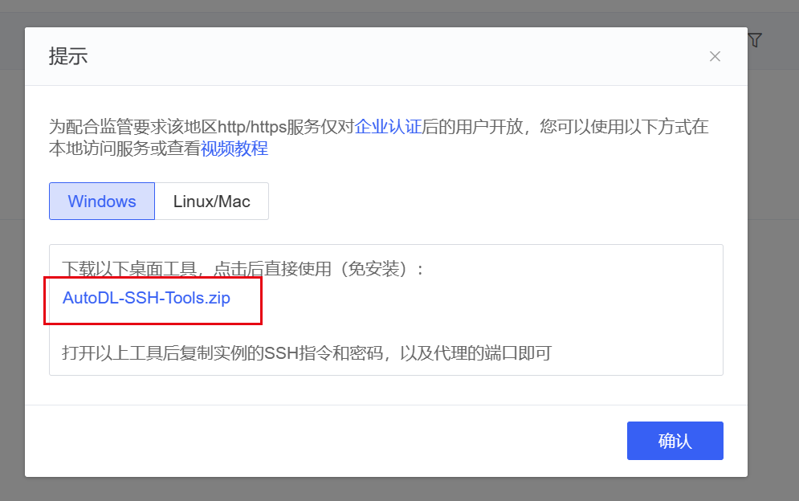
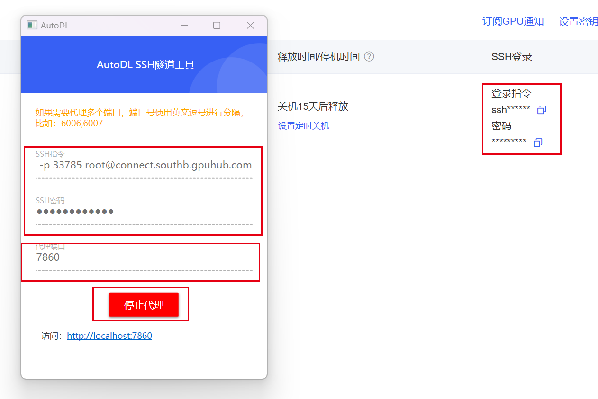
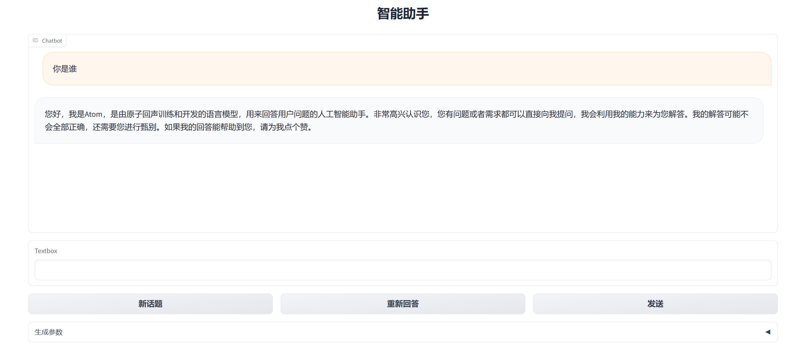

# Atom-7B-chat

## 环境准备

在[autodl](https://www.autodl.com/)平台中租一个3090等24G显存的显卡机器，如下图所示镜像选择`PyTorch`-->`2.0.0`-->`3.8(ubuntu20.04)`-->`11.8`


接下来打开刚刚租用服务器的`JupyterLab`，并且打开其中的终端开始环境配置、模型下载和运行`demo`。

pip换源和安装依赖包

```shell
# 升级pip
python -m pip install --upgrade pip
# 更换 pypi 源加速库的安装
pip config set global.index-url https://pypi.tuna.tsinghua.edu.cn/simple
#安装项目相关依赖包
pip install modelscope transformers gradio SentencePiece accelerate bitsandbytes
```

## 模型下载

使用 `modelscope` 中的`snapshot_download`函数下载模型，第一个参数为模型名称，参数`cache_dir`为模型的下载路径。

在 `/root/autodl-tmp` 路径下新建 `download.py` 文件并在其中输入以下内容，粘贴代码后记得保存文件，如下图所示。并运行 `python /root/autodl-tmp/download.py`执行下载，模型大小为 13 GB，下载模型大概需要 10~20 分钟

```python
import torch
from modelscope import snapshot_download, AutoModel, AutoTokenizer
import os
model_dir = snapshot_download('FlagAlpha/Atom-7B-Chat', cache_dir='/root/autodl-tmp', revision='master')
```
## 代码准备

首先`clone`代码，打开autodl平台自带的学术镜像加速。学术镜像加速详细使用请看：https://www.autodl.com/docs/network_turbo/

```shell
source /etc/network_turbo
```

然后切换路径, clone代码.

```shell
cd /root/autodl-tmp
git clone https://github.com/FlagAlpha/Llama2-Chinese.git
```
最后取消镜像加速，因为该加速可能对正常网络造成一定影响，避免对后续下载其他模型造成困扰。

```shell
unset http_proxy && unset https_proxy
```
## demo运行
进入代码目录,运行demo启动脚本，在--model_name_or_path 参数后填写下载的模型目录
```shell
cd /root/autodl-tmp/Llama2-Chinese/
python examples/chat_gradio.py --model_name_or_path /root/autodl-tmp/FlagAlpha/Atom-7B-Chat/
```
启动成功后终端显示如下：

## 设置代理访问
在Autodl容器实例页面找到自定义服务，下载对应的代理工具


启动代理工具，拷贝对应的ssh指令及密码，设置代理端口为7860，点击开始代理

代理成功后点击下方链接即可访问web-demo
