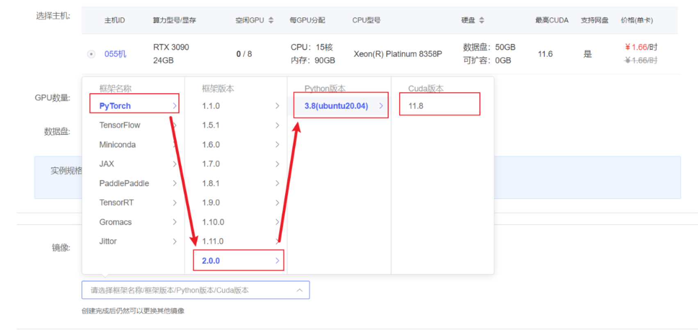
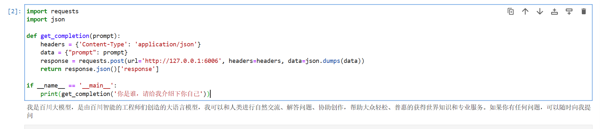

# Baichuan2-7B-chat FastApi 部署调用

## Baichuan2 介绍

Baichuan 2 是百川智能推出的新一代开源大语言模型，采用 2.6 万亿 Tokens 的高质量语料训练。在多个权威的中文、英文和多语言的通用、领域 benchmark 上取得同尺寸最佳的效果。

## 环境准备

在autodl平台中租一个3090等24G显存的显卡机器，如下图所示镜像选择PyTorch-->2.0.0-->3.8(ubuntu20.04)-->11.8（11.3版本以上的都可以） 接下来打开刚刚租用服务器的JupyterLab， 图像 并且打开其中的终端开始环境配置、模型下载和运行演示。




pip换源和安装依赖包

```Python
# 升级pip
python -m pip install --upgrade pip
# 更换 pypi 源加速库的安装
pip config set global.index-url https://pypi.tuna.tsinghua.edu.cn/simple

pip install fastapi==0.104.1
pip install uvicorn==0.24.0.post1
pip install requests==2.25.1
pip install modelscope==1.9.5
pip install transformers==4.35.2
pip install streamlit==1.24.0
pip install sentencepiece==0.1.99
pip install accelerate==0.24.1
pip install transformers_stream_generator==0.0.4
pip install xformers==0.0.23 
```

## 模型下载:

使用 modelscope 中的snapshot_download函数下载模型，第一个参数为模型名称，参数cache_dir为模型的下载路径。

在 /root/autodl-tmp 路径下新建 download.py 文件并在其中输入以下内容，粘贴代码后记得保存文件，如下图所示。并运行 python /root/autodl-tmp/download.py 执行下载，模型大小为15 GB，下载模型大概需要10~20分钟

```Python
import torch
from modelscope import snapshot_download, AutoModel, AutoTokenizer
import os
model_dir = snapshot_download('baichuan-inc/Baichuan2-7B-Chat',cache_dir='/root/autodl-tmp', revision='v1.0.4')
```

## 代码准备:

在/root/autodl-tmp路径下新建api.py文件并在其中输入以下内容，粘贴代码后记得保存文件。下面的代码有很详细的注释，大家如有不理解的地方，欢迎提出issue。

```Python
from fastapi import FastAPI, Request
from transformers import AutoTokenizer, AutoModelForCausalLM
from transformers.generation.utils import GenerationConfig
import uvicorn
import json
import datetime
import torch

# 设置设备参数
DEVICE = "cuda"  # 使用CUDA
DEVICE_ID = "0"  # CUDA设备ID，如果未设置则为空
CUDA_DEVICE = f"{DEVICE}:{DEVICE_ID}" if DEVICE_ID else DEVICE  # 组合CUDA设备信息

# 清理GPU内存函数
def torch_gc():
    if torch.cuda.is_available():  # 检查是否可用CUDA
        with torch.cuda.device(CUDA_DEVICE):  # 指定CUDA设备
            torch.cuda.empty_cache()  # 清空CUDA缓存
            torch.cuda.ipc_collect()  # 收集CUDA内存碎片

# 创建FastAPI应用
app = FastAPI()

# 处理POST请求的端点
@app.post("/")
async def create_item(request: Request):
    global model, tokenizer  # 声明全局变量以便在函数内部使用模型和分词器
    json_post_raw = await request.json()  # 获取POST请求的JSON数据
    json_post = json.dumps(json_post_raw)  # 将JSON数据转换为字符串
    json_post_list = json.loads(json_post)  # 将字符串转换为Python对象
    prompt = json_post_list.get('prompt')  # 获取请求中的提示
    
    # 构建 messages      
    messages = [
        {"role": "user", "content": prompt}
    ]
    result= model.chat(tokenizer, messages)
    
    now = datetime.datetime.now()  # 获取当前时间
    time = now.strftime("%Y-%m-%d %H:%M:%S")  # 格式化时间为字符串
    # 构建响应JSON
    answer = {
        "response": result,
        "status": 200,
        "time": time
    }
    # 构建日志信息
    log = "[" + time + "] " + '", prompt:"' + prompt + '", response:"' + repr(result) + '"'
    print(log)  # 打印日志
    torch_gc()  # 执行GPU内存清理
    return answer  # 返回响应

# 主函数入口
if __name__ == '__main__':
    # 加载预训练的分词器和模型
    tokenizer = AutoTokenizer.from_pretrained("/root/autodl-tmp/baichuan-inc/Baichuan2-7B-Chat", trust_remote_code=True)
    model = AutoModelForCausalLM.from_pretrained("/root/autodl-tmp/baichuan-inc/Baichuan2-7B-Chat", trust_remote_code=True).to(torch.bfloat16).cuda()
    g_config = GenerationConfig.from_pretrained("/root/autodl-tmp/baichuan-inc/Baichuan2-7B-Chat")
    
    g_config.temperature = 0.3 # 可改参数：温度参数控制生成文本的随机性。较低的值使输出更加确定性和一致。
    g_config.top_p = 0.85 # 可改参数：top-p（或nucleus sampling）截断，只考虑累积概率达到此值的最高概率的词汇。
    g_config.top_k = 5 # 可改参数：top-k截断，只考虑概率最高的k个词汇。
    g_config.max_new_tokens = 2048 # 可改参数：设置生成文本的最大长度（以token为单位）。
    model.generation_config = g_config

    model.eval()  # 设置模型为评估模式
    # 启动FastAPI应用
    # 用6006端口可以将autodl的端口映射到本地，从而在本地使用api
    uvicorn.run(app, host='0.0.0.0', port=6006, workers=1)  # 在指定端口和主机上启动应用
```

## Api 部署:

在终端输入以下命令启动api服务

```Python
cd /root/autodl-tmp
python api.py
```

加载完毕后出现如下信息说明成功。


默认部署在 6006 端口，通过 POST 方法进行调用，可以使用curl调用，如下所示：

```Python
curl -X POST "http://127.0.0.1:6006" 
-H 'Content-Type: application/json' 
-d '{"prompt": "你是谁"}'
```

得到的返回值如下所示：

```Python
{
    'response': '我是百川大模型，是由百川智能的工程师们创造的大语言模型', 
    'status': 200, 
    'time': '2023-12-01 17:06:10'
}
```

运行显示：


也可以使用python中的requests库进行调用，如下所示：

```Python
import requests
import json

def get_completion(prompt):
    headers = {'Content-Type': 'application/json'}
    data = {"prompt": prompt}
    response = requests.post(url='http://127.0.0.1:6006', headers=headers, data=json.dumps(data))
    return response.json()['response']

if __name__ == '__main__':
    print(get_completion('你是谁，请给我介绍下自己'))
```

运行显示：




