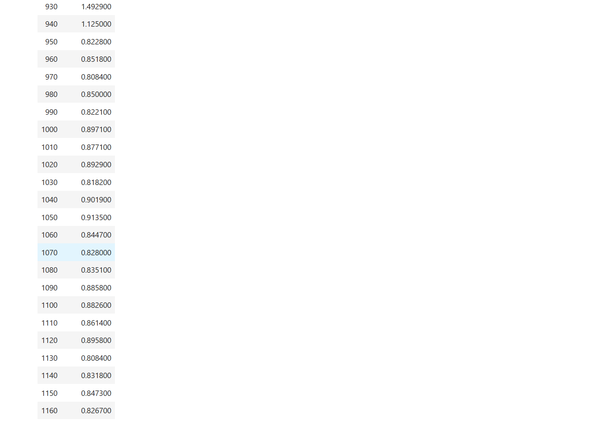
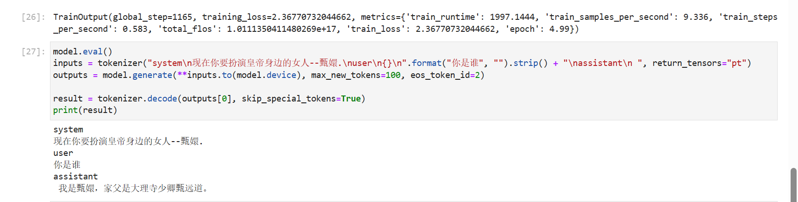
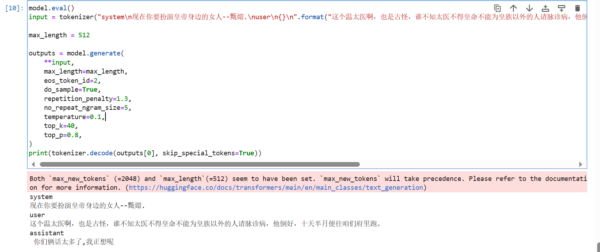

# Baichuan2-7B-chat lora 微调

## 概述：

本节我们简要介绍如何基于 transformers、peft 等框架，对 Baichuan2-7B-chat模型进行 Lora 微调。Lora 是一种高效微调方法，深入了解其原理可参见博客：[知乎|深入浅出Lora](https://zhuanlan.zhihu.com/p/650197598)。

这个教程会在同目录下给大家提供一个 [nodebook](https://github.com/datawhalechina/self-llm/blob/master/DeepSeek/04-DeepSeek-7B-chat%20Lora%20%E5%BE%AE%E8%B0%83.ipynb) 文件，来让大家更好的学习。

## 安装依赖

```Python
# 升级pip
python -m pip install --upgrade pip
# 更换 pypi 源加速库的安装
pip config set global.index-url https://pypi.tuna.tsinghua.edu.cn/simple

pip install modelscope==1.9.5
pip install streamlit==1.24.0
pip install sentencepiece==0.1.99
pip install accelerate==0.24.1
pip install transformers_stream_generator==0.0.4
pip install transformers==4.33.1
pip install peft==0.4.0
pip install datasets==2.10.1
pip install accelerate==0.20.3
pip install tiktoken
pip install transformers_stream_generator
```

## 模型下载:

使用 modelscope 中的snapshot_download函数下载模型，第一个参数为模型名称，参数cache_dir为模型的下载路径。

在 /root/autodl-tmp 路径下新建 download.py 文件并在其中输入以下内容，粘贴代码后记得保存文件，如下图所示。并运行 python /root/autodl-tmp/download.py 执行下载，模型大小为15 GB，下载模型大概需要10~20分钟

```Python
import torch
from modelscope import snapshot_download, AutoModel, AutoTokenizer
import os
model_dir = snapshot_download('baichuan-inc/Baichuan2-7B-Chat',cache_dir='/root/autodl-tmp', revision='v1.0.4')
```

## 指令集构建：

LLM 的微调一般指指令微调过程。所谓指令微调，是说我们使用的微调数据形如：

```Python
{
    "instrution":"回答以下用户问题，仅输出答案。",
    "input":"1+1等于几?",
    "output":"2"
}
```

其中，`instruction` 是用户指令，告知模型其需要完成的任务；`input` 是用户输入，是完成用户指令所必须的输入内容；`output` 是模型应该给出的输出。

即我们的核心训练目标是让模型具有理解并遵循用户指令的能力。因此，在指令集构建时，我们应针对我们的目标任务，针对性构建任务指令集。例如，在本节我们使用由笔者合作开源的 [Chat-甄嬛](https://github.com/KMnO4-zx/huanhuan-chat) 项目作为示例，我们的目标是构建一个能够模拟甄嬛对话风格的个性化 LLM，因此我们构造的指令形如：

```Python
{
    "instruction": "现在你要扮演皇帝身边的女人--甄嬛",
    "input":"你是谁？",
    "output":"家父是大理寺少卿甄远道。"
}
```

我们所构造的全部指令数据集在根目录下。

## 数据格式化：

`Lora` 训练的数据是需要经过格式化、编码之后再输入给模型进行训练的，如果是熟悉 `Pytorch` 模型训练流程的同学会知道，我们一般需要将输入文本编码为 input_ids，将输出文本编码为 `labels`，编码之后的结果都是多维的向量。我们首先定义一个预处理函数，这个函数用于对每一个样本，编码其输入、输出文本并返回一个编码后的字典：

```Python
def process_func(example):
    MAX_LENGTH = 256    # Llama分词器会将一个中文字切分为多个token，因此需要放开一些最大长度，保证数据的完整性
    input_ids, attention_mask, labels = [], [], []
    instruction = tokenizer("\n".join(["<|im_start|>system", "现在你要扮演皇帝身边的女人--甄嬛.<|im_end|>" + "\n<|im_start|>user\n" + example["instruction"] + example["input"] + "<|im_end|>\n"]).strip()+"\n\nAssistant: ",add_special_tokens=False)  # add_special_tokens 不在开头加 special_tokens
    response = tokenizer(example["output"]+tokenizer.eos_token, add_special_tokens=False)
    input_ids = instruction["input_ids"] + response["input_ids"]
    attention_mask = instruction["attention_mask"] + response["attention_mask"] # 因为eos token咱们也是要关注的所以 补充为1
    labels = [-100] * len(instruction["input_ids"]) + response["input_ids"]   # Qwen的特殊构造就是这样的
    if len(input_ids) > MAX_LENGTH:  # 做一个截断
        input_ids = input_ids[:MAX_LENGTH]
        attention_mask = attention_mask[:MAX_LENGTH]
        labels = labels[:MAX_LENGTH]
    return {
        "input_ids": input_ids,
        "attention_mask": attention_mask,
        "labels": labels
    }
```

## 加载tokenizer和半精度模型：

```Python
import torch

model = AutoModelForCausalLM.from_pretrained('baichuan-inc/Baichuan2-7B-Chat', trust_remote_code=True, torch_dtype=torch.half, device_map="auto")
model.generation_config = GenerationConfig.from_pretrained('baichuan-inc/Baichuan2-7B-Chat/')
model
```

## 定义LoraConfig：

`LoraConfig`这个类中可以设置很多参数，但主要的参数没多少，简单讲一讲，感兴趣的同学可以直接看源码。

- `task_type`：模型类型

- `target_modules`：需要训练的模型层的名字，主要就是`attention`部分的层，不同的模型对应的层的名字不同，可以传入数组，也可以字符串，也可以正则表达式。

- `r`：`lora`的秩，具体可以看`Lora`原理

- `lora_alpha`：`Lora alaph`，具体作用参见 `Lora` 原理

```Python
from peft import LoraConfig, TaskType, get_peft_model

config = LoraConfig(
    task_type=TaskType.CAUSAL_LM, 
    target_modules=["W_pack", "o_proj", "gate_proj", "up_proj", "down_proj"],
    inference_mode=False, # 训练模式
    r=8, # Lora 秩
    lora_alpha=32, # Lora alaph，具体作用参见 Lora 原理
    lora_dropout=0.1# Dropout 比例
)
config
```

## 自定义 TrainingArguments 参数：

`TrainingArguments`这个类的源码也介绍了每个参数的具体作用，当然大家可以来自行探索，这里就简单说几个常用的。

- `output_dir`：模型的输出路径

- `per_device_train_batch_size`：顾名思义 `batch_size`

- `gradient_accumulation_steps`: 梯度累加，如果你的显存比较小，那可以把 `batch_size` 设置小一点，梯度累加增大一些。

- `logging_steps`：多少步，输出一次`log`

- `num_train_epochs`：顾名思义 `epoch`

- `gradient_checkpointing`：梯度检查，这个一旦开启，模型就必须执行`model.enable_input_require_grads()`，这个原理大家可以自行探索，这里就不细说了。

```Python
args = TrainingArguments(
    output_dir="./output/Baichuan2",
    per_device_train_batch_size=8,
    gradient_accumulation_steps=2,
    logging_steps=10,
    num_train_epochs=3,
    save_steps=100,
    learning_rate=5e-5,
    save_on_each_node=True,
    gradient_checkpointing=True
)
```

## 使用 Trainer 训练

```Python
trainer = Trainer(
    model=model,
    args=args,
    train_dataset=tokenized_id,
    data_collator=DataCollatorForSeq2Seq(tokenizer=tokenizer, padding=True),
)
```




## 模型推理

可以用这种比较经典的方式推理：

```Python
model.eval()
inputs = tokenizer("system\n现在你要扮演皇帝身边的女人--甄嬛.\nuser\n{}\n".format("你是谁", "").strip() + "\nassistant\n ", return_tensors="pt")
outputs = model.generate(**inputs.to(model.device), max_new_tokens=100, eos_token_id=2)

result = tokenizer.decode(outputs[0], skip_special_tokens=True)
print(result)
```




或者重新加载模型：

```Python
from transformers import AutoModelForSeq2SeqLM
from peft import PeftModel, PeftConfig

peft_model_id = "output/Baichuan3/checkpoint-600"  # 这里我训练出效果最好的一版是 checkpoint-600，所以调用了这个，大家可以根据自己情况选择
config = PeftConfig.from_pretrained(peft_model_id)
model = AutoModelForCausalLM.from_pretrained("baichuan-inc/Baichuan2-7B-Chat", use_fast=False, trust_remote_code=True)
model = PeftModel.from_pretrained(model, peft_model_id)

model.eval()
input = tokenizer("system\n现在你要扮演皇帝身边的女人--甄嬛.\nuser\n{}\n".format("你是谁", "").strip() + "\nassistant\n ", return_tensors="pt").to(model.device)

max_length = 512

outputs = model.generate(
    **input,
    max_length=max_length,
    eos_token_id=2,
    do_sample=True,
    repetition_penalty=1.3,
    no_repeat_ngram_size=5,
    temperature=0.1,
    top_k=40,
    top_p=0.8,
)
print(tokenizer.decode(outputs[0], skip_special_tokens=True))
```




