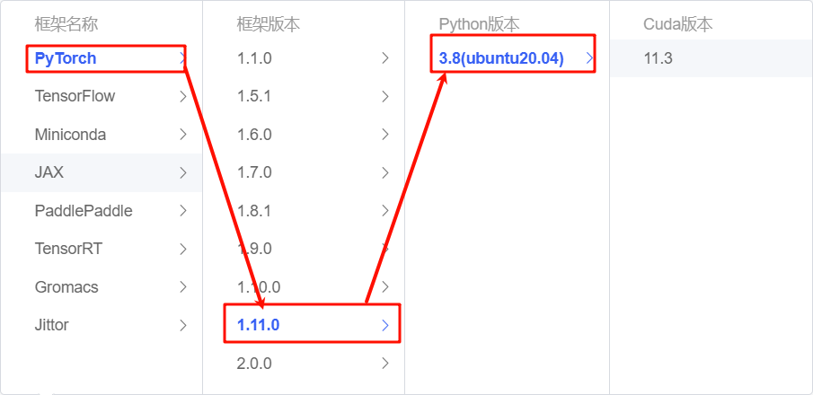

# BlueLM-7B-Chat langchain 接入

## 模型介绍

BlueLM-7B 是由 vivo AI 全球研究院自主研发的大规模预训练语言模型，参数规模为 70 亿。BlueLM-7B 在 [C-Eval](https://cevalbenchmark.com/index.html) 和 [CMMLU](https://github.com/haonan-li/CMMLU) 上均取得领先结果，对比同尺寸开源模型中具有较强的竞争力(截止11月1号)。本次发布共包含 7B 模型的 Base 和 Chat 两个版本。

模型下载链接见：

|                           基座模型                           |                           对齐模型                           |
| :----------------------------------------------------------: | :----------------------------------------------------------: |
| 🤗 [BlueLM-7B-Base](https://huggingface.co/vivo-ai/BlueLM-7B-Base) | 🤗 [BlueLM-7B-Chat](https://huggingface.co/vivo-ai/BlueLM-7B-Chat) |
| 🤗 [BlueLM-7B-Base-32K](https://huggingface.co/vivo-ai/BlueLM-7B-Base-32K) | 🤗 [BlueLM-7B-Chat-32K](https://huggingface.co/vivo-ai/BlueLM-7B-Chat-32K) |
|                                                              |                  🤗 [BlueLM-7B-Chat-4bits](https://huggingface.co/vivo-ai/BlueLM-7B-Chat-4bits)                   |

## 环境准备

在 autodl 平台中租赁一个 3090 等 24G 显存的显卡机器，如下图所示镜像选择 PyTorch-->1.11.0-->3.8(ubuntu20.04)-->11.3，Cuda版本在11.3以上都可以。



接下来打开刚刚租用服务器的 JupyterLab(也可以使用vscode ssh远程连接服务器)，并且打开其中的终端开始环境配置、模型下载和运行 demo。

pip 换源加速下载并安装依赖包

```bash
# 升级pip
python -m pip install --upgrade pip
# 设置pip镜像源
pip config set global.index-url https://pypi.tuna.tsinghua.edu.cn/simple
# 安装软件依赖
pip install langchain==0.1.12
pip install modelscope==1.11.0
pip install transformers==4.37.0
pip install sentencepiece==0.1.99
pip install accelerate==0.24.1
pip install transformers_stream_generator==0.0.4
```

## 模型下载

使用`Modelscope API` 下载`BlueLM-7B-Chat`模型，模型路径为`/root/autodl-tmp`。在 /root/autodl-tmp 下创建model_download.py文件内容如下: 

```python
from modelscope import snapshot_download
model_dir = snapshot_download("vivo-ai/BlueLM-7B-Chat", cache_dir='/root/autodl-tmp', revision="master")
```

## 代码准备

为便捷构建 LLM 应用，我们需要基于本地部署的 BlueLM，自定义一个 LLM 类，将 BlueLM 接入到 LangChain 框架中。完成自定义 LLM 类之后，可以以完全一致的方式调用 LangChain 的接口，而无需考虑底层模型调用的不一致。

基于本地部署的 BlueLM 自定义 LLM 类并不复杂，我们只需从 `LangChain.llms.base.LLM` 类继承一个子类，并重写构造函数与 `_call` 函数即可，创建一个LLM.py文件内容如下：

```bash
from langchain.llms.base import LLM
from typing import Any, List, Optional
from langchain.callbacks.manager import CallbackManagerForLLMRun
from transformers import AutoTokenizer, AutoModelForCausalLM, GenerationConfig, LlamaTokenizerFast
import torch

class BlueLM(LLM):
    # 基于本地 BlueLM 自定义 LLM 类
    tokenizer: AutoTokenizer = None
    model: AutoModelForCausalLM = None
        
    def __init__(self, mode_name_or_path :str):

        super().__init__()
        print("正在从本地加载模型...")
        self.tokenizer = AutoTokenizer.from_pretrained(mode_name_or_path, trust_remote_code=True)
        self.model = AutoModelForCausalLM.from_pretrained(mode_name_or_path, torch_dtype=torch.float16, trust_remote_code=True).cuda()
        self.model = self.model.eval()
        print("完成本地模型的加载")
        
    def _call(self, prompt : str, stop: Optional[List[str]] = None,
                run_manager: Optional[CallbackManagerForLLMRun] = None,
                **kwargs: Any):

        # 重写调用函数
        messages = f"[|Human|]:{prompt}[|AI|]:"
        # 构建输入
        inputs_tensor = self.tokenizer(messages, return_tensors="pt")
        inputs_tensor = inputs_tensor.to("cuda:0")
        # 通过模型获得输出
        outputs = self.model.generate(**inputs_tensor, max_new_tokens=100)
        response = self.tokenizer.decode(outputs.cpu()[0], skip_special_tokens=True)
    
        return response
    @property
    def _llm_type(self) -> str:
        return "BlueLM"

```

## 调用

然后就可以像使用任何其他的langchain大模型功能一样使用了。

```python
from LLM import BlueLM
llm = BlueLM('/root/autodl-tmp/vivo-ai/BlueLM-7B-Chat')

llm('你好')
```

如下图所示：


