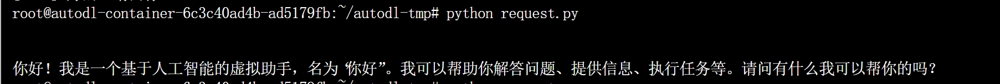

# 06-DeepSeek-MoE-16b-chat FastApi 部署调用

## DeepSeek-MoE-16b-chat 介绍

DeepSeek MoE目前推出的版本参数量为160亿，实际激活参数量大约是28亿。与自家的7B密集模型相比，二者在19个数据集上的表现各有胜负，但整体比较接近。而与同为密集模型的Llama 2-7B相比，DeepSeek MoE在数学、代码等方面还体现出来明显的优势。但两种密集模型的计算量都超过了180TFLOPs每4k token，DeepSeek MoE却只有74.4TFLOPs，只有两者的40%。

## 环境准备
在autodl平台中租一个**双卡3090等24G（共计48G）**显存的显卡机器，如下图所示镜像选择PyTorch-->2.1.0-->3.10(ubuntu22.04)-->12.1
接下来打开刚刚租用服务器的JupyterLab， 图像 并且打开其中的终端开始环境配置、模型下载和运行演示。 

pip换源和安装依赖包
```shell
# 因为涉及到访问github因此最好打开autodl的学术镜像加速
source /etc/network_turbo
# 升级pip
python -m pip install --upgrade pip
# 更换 pypi 源加速库的安装
pip config set global.index-url https://pypi.tuna.tsinghua.edu.cn/simple
pip install modelscope transformers sentencepiece accelerate fastapi uvicorn requests streamlit transformers_stream_generator
# pip install -r requirements.txt
pip install https://github.com/Dao-AILab/flash-attention/releases/download/v2.4.2/flash_attn-2.4.2+cu122torch2.1cxx11abiFALSE-cp310-cp310-linux_x86_64.whl
```
## 模型下载
使用 `modelscope` 中的`snapshot_download`函数下载模型，第一个参数为模型名称，参数`cache_dir`为模型的下载路径。

在 `/root/autodl-tmp` 路径下新建 `download.py` 文件并在其中输入以下内容，粘贴代码后记得保存文件，如下图所示。并运行 `python /root/autodl-tmp/download.py`执行下载，模型大小为 30 GB，下载模型大概需要 10~20 分钟

```python
import torch
from modelscope import snapshot_download, AutoModel, AutoTokenizer
import os
model_dir = snapshot_download('deepseek-ai/deepseek-moe-16b-chat', cache_dir='/root/autodl-tmp', revision='master')
```

## 代码准备 

在/root/autodl-tmp路径下新建api.py文件并在其中输入以下内容，粘贴代码后记得保存文件。下面的代码有很详细的注释，大家如有不理解的地方，欢迎提出issue。
```python
from fastapi import FastAPI, Request
from transformers import AutoTokenizer, AutoModelForCausalLM, GenerationConfig
import uvicorn
import json
import datetime
import torch

# 设置设备参数
DEVICE = "cuda"  # 使用CUDA
DEVICE_ID = "0"  # CUDA设备ID，如果未设置则为空
CUDA_DEVICE = f"{DEVICE}:{DEVICE_ID}" if DEVICE_ID else DEVICE  # 组合CUDA设备信息

# 清理GPU内存函数
def torch_gc():
    if torch.cuda.is_available():  # 检查是否可用CUDA
        with torch.cuda.device(CUDA_DEVICE):  # 指定CUDA设备
            torch.cuda.empty_cache()  # 清空CUDA缓存
            torch.cuda.ipc_collect()  # 收集CUDA内存碎片

# 创建FastAPI应用
app = FastAPI()

# 处理POST请求的端点
@app.post("/")
async def create_item(request: Request):
    global model, tokenizer  # 声明全局变量以便在函数内部使用模型和分词器
    json_post_raw = await request.json()  # 获取POST请求的JSON数据
    json_post = json.dumps(json_post_raw)  # 将JSON数据转换为字符串
    json_post_list = json.loads(json_post)  # 将字符串转换为Python对象
    prompt = json_post_list.get('prompt')  # 获取请求中的提示
    max_length = json_post_list.get('max_length')  # 获取请求中的最大长度
    
    # 构建 messages      
    messages = [
        {"role": "user", "content": prompt}
    ]
    # 构建输入     
    input_tensor = tokenizer.apply_chat_template(messages, add_generation_prompt=True, return_tensors="pt")
    # 通过模型获得输出
    outputs = model.generate(input_tensor.to(model.device), max_new_tokens=max_length)
    result = tokenizer.decode(outputs[input_tensor.shape[1]:], skip_special_tokens=True)
    now = datetime.datetime.now()  # 获取当前时间
    time = now.strftime("%Y-%m-%d %H:%M:%S")  # 格式化时间为字符串
    # 构建响应JSON
    answer = {
        "response": result,
        "status": 200,
        "time": time
    }
    # 构建日志信息
    log = "[" + time + "] " + '", prompt:"' + prompt + '", response:"' + repr(result) + '"'
    print(log)  # 打印日志
    torch_gc()  # 执行GPU内存清理
    return answer  # 返回响应

# 主函数入口
if __name__ == '__main__':
    mode_name_or_path = '/root/autodl-tmp/deepseek-ai/deepseek-moe-16b-chat'
    # 加载分词器，trust_remote_code=True允许加载远程代码
    tokenizer = AutoTokenizer.from_pretrained(mode_name_or_path, trust_remote_code=True)
    # 加载语言模型，设置数据类型为bfloat16以优化性能（以免爆显存），并自动选择GPU进行推理
    model = AutoModelForCausalLM.from_pretrained(mode_name_or_path, trust_remote_code=True,torch_dtype=torch.bfloat16,  device_map="auto")
    # 加载并设置生成配置，使用与模型相同的设置
    model.generation_config = GenerationConfig.from_pretrained(mode_name_or_path)
    # 将填充令牌ID设置为与结束令牌ID相同，用于生成文本的结束标记
    model.generation_config.pad_token_id = model.generation_config.eos_token_id
    model.eval()  # 设置模型为评估模式
    # 启动FastAPI应用
    # 用6006端口可以将autodl的端口映射到本地，从而在本地使用api
    uvicorn.run(app, host='0.0.0.0', port=6006, workers=1)  # 在指定端口和主机上启动应用
```

## Api 部署

在终端输入以下命令启动api服务
```
cd /root/autodl-tmp
python api.py
```
加载完毕后出现如下信息说明成功。


默认部署在 6006 端口，通过 POST 方法进行调用，可以使用curl调用，建议max_length为100，多了容易爆显存，少了容易回答输出不全，如下所示：
```shell
curl -X POST "http://127.0.0.1:6006" \
     -H 'Content-Type: application/json' \
     -d '{"prompt": "你好,你是谁？","max_length":100}'
```
也可以使用python中的requests库进行调用，如下所示：
```python
import requests
import json

def get_completion(prompt,max_length):
    headers = {'Content-Type': 'application/json'}
    data = {"prompt": prompt,"max_length":max_length}
    response = requests.post(url='http://127.0.0.1:6006', headers=headers, data=json.dumps(data))
    return response.json()['response']

if __name__ == '__main__':
    print(get_completion("你好,你是谁？",100))
```
得到的返回值如下所示：
