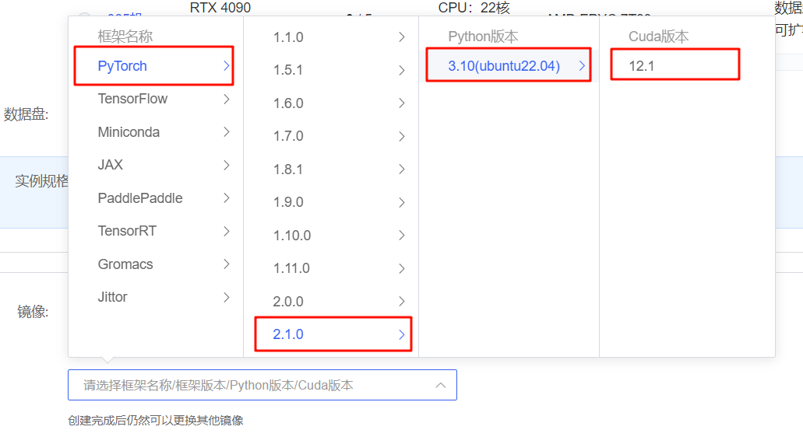
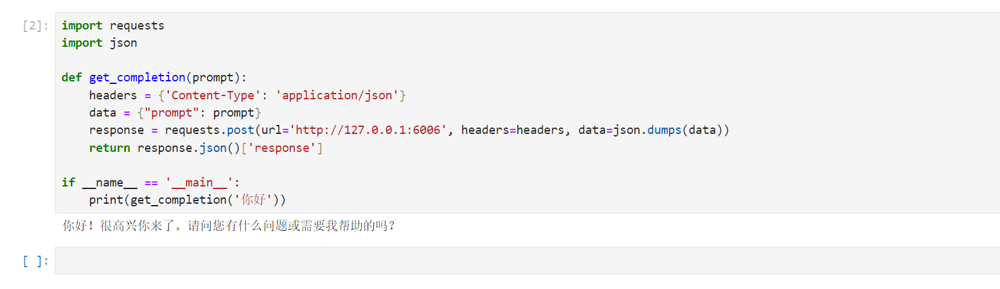

# 01-Gemma-2B-Instruct FastApi 部署调用

## 环境准备

在 平台中租赁一个 3090 等 24G 显存的显卡机器，如下图所示镜像选择 `PyTorch-->2.1.0-->3.10(ubuntu22.04)-->12.1`。
接下来打开刚刚租用服务器的 JupyterLab，并且打开其中的终端开始环境配置、模型下载和运行演示。



pip 换源加速下载并安装依赖包

```shell
# 升级pip
python -m pip install --upgrade pip
# 更换 pypi 源加速库的安装
pip config set global.index-url https://pypi.tuna.tsinghua.edu.cn/simple

pip install fastapi==0.110.2
pip install uvicorn==0.29.0
pip install requests==2.31.0
pip install modelscope==1.11.0
pip install transformers==4.40.0
pip install accelerate==0.29.3
```


## 模型下载

使用 modelscope 中的 snapshot_download 函数下载模型，第一个参数为模型名称，参数 cache_dir 为模型的下载路径。

在 /root/autodl-tmp 路径下新建 model_download.py 文件并在其中输入以下内容，粘贴代码后请及时保存文件，如下图所示。并运行 `python /root/autodl-tmp/model_download.py` 执行下载，模型大小为 15GB，下载模型大概需要 2 分钟。

```python
import torch
from modelscope import snapshot_download, AutoModel, AutoTokenizer
import os
model_dir = snapshot_download('Lucachen/gemma2b', cache_dir='/root/autodl-tmp', revision='master')
```

## 代码准备

在 /root/autodl-tmp 路径下新建 api.py 文件并在其中输入以下内容，粘贴代码后请及时保存文件。下面的代码有很详细的注释，大家如有不理解的地方，欢迎提出 issue。

```python
from fastapi import FastAPI, Request
from transformers import AutoTokenizer, AutoModelForCausalLM, pipeline
import uvicorn
import json
import datetime
import torch

# 设置设备参数
DEVICE = "cuda"  # 使用CUDA
DEVICE_ID = "0"  # CUDA设备ID，如果未设置则为空
CUDA_DEVICE = f"{DEVICE}:{DEVICE_ID}" if DEVICE_ID else DEVICE  # 组合CUDA设备信息

# 清理GPU内存函数
def torch_gc():
    if torch.cuda.is_available():  # 检查是否可用CUDA
        with torch.cuda.device(CUDA_DEVICE):  # 指定CUDA设备
            torch.cuda.empty_cache()  # 清空CUDA缓存
            torch.cuda.ipc_collect()  # 收集CUDA内存碎片


# 创建FastAPI应用
app = FastAPI()

# 处理POST请求的端点
@app.post("/")
async def create_item(request: Request):
    global model, tokenizer, pipeline # 声明全局变量以便在函数内部使用模型和分词器
    json_post_raw = await request.json()  # 获取POST请求的JSON数据
    json_post = json.dumps(json_post_raw)  # 将JSON数据转换为字符串
    json_post_list = json.loads(json_post)  # 将字符串转换为Python对象
    prompt = json_post_list.get('prompt')  # 获取请求中的提示
    history = json_post_list.get('history', [])  # 获取请求中的历史记录

    messages = [
            # {"role": "system", "content": "You are a helpful assistant."},
            {"role": "user", "content": prompt}
    ]

    # 调用模型进行对话生成
    prompt = pipeline.tokenizer.apply_chat_template(messages, tokenize=False, add_generation_prompt=True)
    outputs = pipeline(
    prompt,
    max_new_tokens=1024,
    add_special_tokens=True,
    do_sample=True,
    temperature=0.7,
    top_k=50,
    top_p=0.95
    )
    response = outputs[0]["generated_text"][len(prompt):]

    now = datetime.datetime.now()  # 获取当前时间
    time = now.strftime("%Y-%m-%d %H:%M:%S")  # 格式化时间为字符串
    # 构建响应JSON
    answer = {
        "response": response,
        "status": 200,
        "time": time
    }
    # 构建日志信息
    log = "[" + time + "] " + '", prompt:"' + prompt + '", response:"' + repr(response) + '"'
    print(log)  # 打印日志
    torch_gc()  # 执行GPU内存清理
    return answer  # 返回响应

# 主函数入口
if __name__ == '__main__':
    # 加载预训练的分词器和模型
    model_name_or_path = '/root/autodl-tmp/Lucachen/gemma2b'
    tokenizer = AutoTokenizer.from_pretrained(model_name_or_path)
    model = AutoModelForCausalLM.from_pretrained(model_name_or_path, device_map="auto", torch_dtype=torch.bfloat16).cuda()
    pipeline = pipeline("text-generation",model=model_name_or_path,model_kwargs={"torch_dtype": torch.bfloat16},device="cuda")

    # 启动FastAPI应用
    # 用6006端口可以将autodl的端口映射到本地，从而在本地使用api
    uvicorn.run(app, host='0.0.0.0', port=6006, workers=1)  # 在指定端口和主机上启动应用
```
更多chat模板参考这里：https://github.com/InternLM/xtuner/blob/main/xtuner/utils/templates.py#L8

## Api 部署

在终端输入以下命令启动 api 服务：

```shell
cd /root/autodl-tmp
python api.py
```

加载完毕后出现如下信息说明成功。


默认部署在 6006 端口，通过 POST 方法进行调用，可以使用 curl 调用，如下所示：

```shell
curl -X POST "http://127.0.0.1:6006" \
     -H 'Content-Type: application/json' \
     -d '{"prompt": "你好"}'
```

得到的返回值如下所示：

```json
{
  "response": "你好！我也很高兴见到你！有什么问题或话题想聊天吗？你好！很高兴你来了。请问您有什么问题或需要我帮助的吗？",
  "status": 200,
  "time": "2024-04-20 23:11:00"
}
```

也可以使用 python 中的 requests 库进行调用，如下所示：

```python
import requests
import json

def get_completion(prompt):
    headers = {'Content-Type': 'application/json'}
    data = {"prompt": prompt}
    response = requests.post(url='http://127.0.0.1:6006', headers=headers, data=json.dumps(data))
    return response.json()['response']

if __name__ == '__main__':
    print(get_completion('你好'))
```


