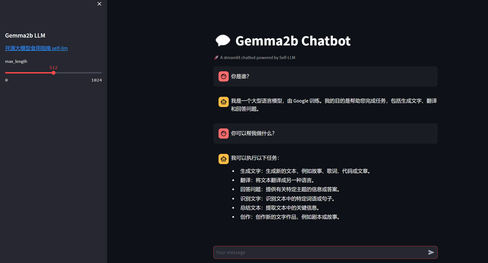

# 03-Gemma-2B-Chat WebDemo 部署


## 环境准备

在 平台中租赁一个 3090 等 24G 显存的显卡机器，如下图所示镜像选择 `PyTorch-->2.1.0-->3.10(ubuntu22.04)-->12.1`。
接下来打开刚刚租用服务器的 JupyterLab，并且打开其中的终端开始环境配置、模型下载和运行演示。


pip换源和安装依赖包

```shell
# 升级pip
python -m pip install --upgrade pip
# 更换 pypi 源加速库的安装
pip config set global.index-url https://pypi.tuna.tsinghua.edu.cn/simple

pip install modelscope==1.9.5
pip install transformers==4.35.2
pip install streamlit==1.24.0
pip install sentencepiece==0.1.99
pip install accelerate==0.24.1
pip install transformers_stream_generator==0.0.4
```

## 模型下载:

使用 modelscope 中的snapshot_download函数下载模型，第一个参数为模型名称，参数cache_dir为模型的下载路径。

在 /root/autodl-tmp 路径下新建 download.py 文件并在其中输入以下内容，粘贴代码后记得保存文件，如下图所示。并运行 python /root/autodl-tmp/download.py 执行下载，模型大小为15 GB，下载模型大概需要10~20分钟

```Python
import torch
from modelscope import snapshot_download, AutoModel, AutoTokenizer
import os
model_dir = snapshot_download('Lucachen/gemma2b',cache_dir='/root/autodl-tmp', revision='v1.0.4')
```

## 代码准备

在`/root/autodl-tmp`路径下新建 `chatBot.py` 文件并在其中输入以下内容，粘贴代码后记得保存文件。下面的代码有很详细的注释，大家如有不理解的地方，欢迎提出issue。

```Python
# 导入所需的库
from transformers import AutoTokenizer, pipeline
import torch
import streamlit as st

# 在侧边栏中创建一个标题和一个链接
with st.sidebar:
    st.markdown("## Gemma2b LLM")
    "[开源大模型食用指南 self-llm](https://github.com/datawhalechina/self-llm.git)"
    # 创建一个滑块，用于选择最大长度，范围在0到1024之间，默认值为512
    max_length = st.slider("max_length", 0, 1024, 512, step=1)

# 创建一个标题和一个副标题
st.title("💬 Gemma2b Chatbot")
st.caption("🚀 A streamlit chatbot powered by Self-LLM")

# 定义模型路径
mode_name_or_path = '/root/autodl-tmp/Lucachen/gemma2b'

# 定义一个函数，用于获取模型和tokenizer
@st.cache_resource
def get_model():
    # 从预训练的模型中获取tokenizer
    tokenizer = AutoTokenizer.from_pretrained(mode_name_or_path, trust_remote_code=True)
    # 从预训练的模型中获取生成配置
    get_text = pipeline("text-generation",model=mode_name_or_path,model_kwargs={"torch_dtype": torch.bfloat16},device="cuda")
    # 设置模型为评估模式
    return tokenizer, get_text

# 加载Baichuan-7B-chat的model和tokenizer
tokenizer, get_text = get_model()

# 如果session_state中没有"messages"，则创建一个包含默认消息的列表
if "messages" not in st.session_state:
    st.session_state["messages"] = []

# 遍历session_state中的所有消息，并显示在聊天界面上
for msg in st.session_state.messages:
    st.chat_message(msg["role"]).write(msg["content"])

# 如果用户在聊天输入框中输入了内容，则执行以下操作
if prompt := st.chat_input():
    # 将用户的输入添加到session_state中的messages列表中
    st.session_state.messages.append({"role": "user", "content": prompt})
    # # 在聊天界面上显示用户的输入
    st.chat_message("user").write(prompt)
    print(st.session_state.messages)
    messages = [
            {"role": "user", "content": prompt}
    ]
    prompt = get_text.tokenizer.apply_chat_template(st.session_state.messages, tokenize=False, add_generation_prompt=True)
    outputs = get_text(
    prompt,
    max_new_tokens=1024,
    add_special_tokens=True,
    do_sample=True,
    temperature=0.7,
    top_k=50,
    top_p=0.95
    )
    response = outputs[0]["generated_text"][len(prompt):]
    # 将模型的输出添加到session_state中的messages列表中
    st.session_state.messages.append({"role": "assistant", "content": response})
    # 在聊天界面上显示模型的输出
    st.chat_message("assistant").write(response)
```

## 运行 demo

在终端中运行以下命令，启动streamlit服务，并按照 `autodl` 的指示将端口映射到本地，然后在浏览器中打开链接 [http://localhost:6006/](http://localhost:6006/) ，即可看到聊天界面。

```Python
streamlit run /root/autodl-tmp/chatBot.py --server.address 127.0.0.1 --server.port 6006
```
如下所示：

