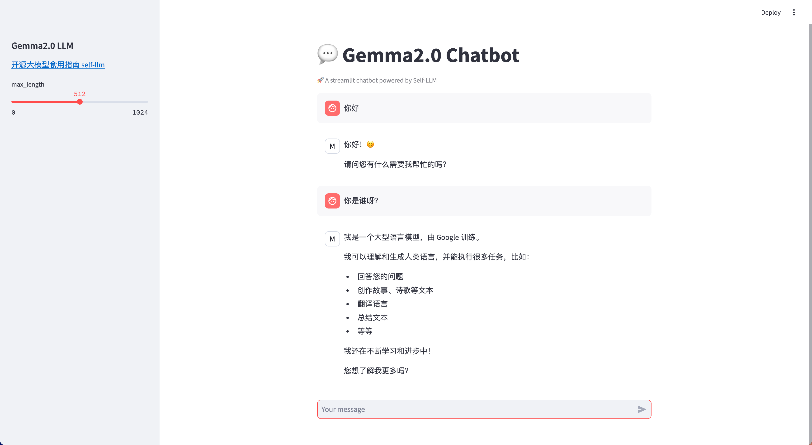

# Yuan2.0-2B WebDemo部署

## 环境准备

在 Autodl 平台中租赁一个 RTX 3090/24G 显存的显卡机器。如下图所示，镜像选择 PyTorch-->2.1.0-->3.10(ubuntu22.04)-->12.1。


然后打开其中的终端，开始环境配置、模型下载和运行演示。  

## 环境配置

pip 换源加速下载并安装依赖包

```shell
# 升级pip
python -m pip install --upgrade pip

# 更换 pypi 源加速库的安装
pip config set global.index-url https://pypi.tuna.tsinghua.edu.cn/simple

# 安装 einops modelscope streamlit
pip install einops modelscope streamlit==1.24.0
```  

> 考虑到部分同学配置环境可能会遇到一些问题，我们在AutoDL平台准备了Gemma2 的环境镜像，该镜像适用于该仓库的 Gemma2 教程所有部署环境。点击下方链接并直接创建Autodl示例即可。
> ***https://www.codewithgpu.com/i/datawhalechina/self-llm/self-llm-gemma2***


## 模型下载  

使用 modelscope 中的 snapshot_download 函数下载模型，第一个参数为模型名称，参数 cache_dir 为模型的下载路径。

然后运行下面代码，执行模型下载。模型大小为 18GB左右，下载大概需要 5 分钟。

```python
# 导入所需的库
from transformers import AutoTokenizer, AutoModelForCausalLM
import torch
import streamlit as st

# 在侧边栏中创建一个标题和一个链接
with st.sidebar:
    st.markdown("## Gemma2.0 LLM")
    "[开源大模型食用指南 self-llm](https://github.com/datawhalechina/self-llm.git)"
    # 创建一个滑块，用于选择最大长度，范围在0到1024之间，默认值为512
    max_length = st.slider("max_length", 0, 1024, 512, step=1)

# 创建一个标题和一个副标题
st.title("💬 Gemma2.0 Chatbot")
st.caption("🚀 A streamlit chatbot powered by Self-LLM")

# 定义模型路径
path = '/root/autodl-tmp/LLM-Research/gemma-2-9b-it'

# 定义一个函数，用于获取模型和tokenizer
@st.cache_resource
def get_model():
    print("Creat tokenizer...")
    tokenizer = AutoTokenizer.from_pretrained(path)
    print("Creat model...")
    model = AutoModelForCausalLM.from_pretrained(path, device_map="cuda", torch_dtype=torch.bfloat16,)
  
    return tokenizer, model

# 加载emma-2-9b-it的model和tokenizer
tokenizer, model = get_model()

# 如果session_state中没有"messages"，则创建一个包含默认消息的列表
if "messages" not in st.session_state:
    st.session_state["messages"] = []

# 遍历session_state中的所有消息，并显示在聊天界面上
for msg in st.session_state.messages:
    st.chat_message(msg["role"]).write(msg["content"])

# 如果用户在聊天输入框中输入了内容，则执行以下操作
if prompt := st.chat_input():
    # 将用户的输入添加到session_state中的messages列表中
    st.session_state.messages.append({"role": "user", "content": prompt})

    # 在聊天界面上显示用户的输入
    st.chat_message("user").write(prompt)

    # 调用模型
    inputs = tokenizer.apply_chat_template(st.session_state.messages, tokenize=False, add_generation_prompt=True)
    inputs = tokenizer.encode(inputs, add_special_tokens=False, return_tensors="pt")
    outputs = model.generate(input_ids=inputs.to(model.device), max_new_tokens=150)
    outputs = tokenizer.decode(outputs[0])
    response = outputs.split('model')[-1].replace('<end_of_turn>\n<eos>', '')

    # 将模型的输出添加到session_state中的messages列表中
    st.session_state.messages.append({"role": "model", "content": response})

    # 在聊天界面上显示模型的输出
    st.chat_message("model").write(response)

    # print(st.session_state)
```

# 配置vscode ssh

复制机器ssh登录指令


粘贴到本地电脑的.ssh/config，并修改成如下格式


然后连接到此ssh，选择linx


复制密码并输入，按下回车即可登录到机器

## 运行demo

在终端中运行以下命令，启动streamlit服务

```shell
streamlit run chatBot.py --server.address 127.0.0.1 --server.port 6006
```

点击在浏览器中打开，即可看到聊天界面。

运行效果如下：



