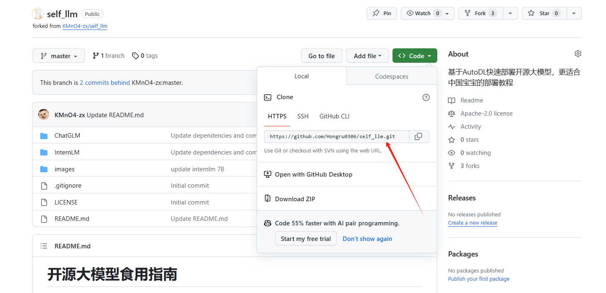

# 1.Github提交PR与修改pr
参考```我本人```写过的blog---[Github提交PR与修改pr](https://blog.csdn.net/python_innocent/article/details/130560871)

## 1.1 从零开始提issue与pr：
- 一般情况下，第一次提pr都是先提一个issue来描述你的问题或者提议，以确保你的工作符合要求。但这不是必须的，完全可以直接fork仓库并提交pr。提issue很简单,操作如下：  


- fork仓库后，在自己fork的仓库里面进行修改，然后点击自己fork仓库上面的pull request，将你的更改合并到原始仓库中，详情见下：

## 1.2 pr修改与改正  
在fork里面进行修改操作操作：此时你fork完repo,并且在你本地已经将想PR的文件进行了更改后:  

### 1.2.1 新建文件夹与增删减改---**图形界面版本**

  

写好文件夹名，然后按'/'这个键，自动就生成了一个文件夹，然后在里面创建一个readme即可，(后面也能删了)
  


在文件夹里面上传本地写好的东西直接点这个```upload```即可


想删除里面的某个文件夹或者里面的某个文件直接点这三个点，然后相应delete即可：


### 1.2.2 新建文件夹与增删减改---**Git版本**  
- 使用git对fork的仓库进行更新

```'your/folk_repo_utl'```查看方法：  




```
git clone 'your/folk_repo_utl'  # 克隆到本地
cd /path/to/your/local/folder  # 进入你的本地文件夹
```

- 此处你可以在fork好的本地仓库进行增删减改操作
- 增删减改之后:

在此处要使用```git bash```：


```
git init  # 初始化为 Git 仓库  

git add .  # 添加文件夹中的所有文件到暂存区  
git commit -m "Added new folder"  # 替换为你的提交信息  

git remote add origin 'your/folk_repo_utl'  # 将本地仓库关联到已有的远程仓库  
git push -u origin master  # 推送到远程仓库的 master 分支  
```

此时已经将本地修改好的仓库更新推送到fork仓库中。

## 1.3 pr提交
- 从自己的fork仓库里面提pr  

提pr的话，从自己fork里面，选择上面的```new pull requests```开始提，注意看好base和head对应的仓库名，base是接受的原库，head是自己更改好的fork，然后提交即可


  

  


## 1.4 补充

如果之前的repo已经有更新，但是你fork的时候没有拉取最新的更新：

```
git remote add upstream https://github.com/original-owner/original-repository.git  
# 将原作者的仓库添加为远程仓库
git fetch upstream  # 将原仓库拉取更新
git checkout master  # 切换到master分支
git merge upstream/master  # 合并原作者的仓库的更新
git push origin master  # 将合并后的代码推送到自己的仓库

```
## 1.5 注意
有时候在```push```的时候连接犯病,我们可以用ssh
```
git remote add origin git@github.com:username/repo.git
```
然后再```push```就可以了。


