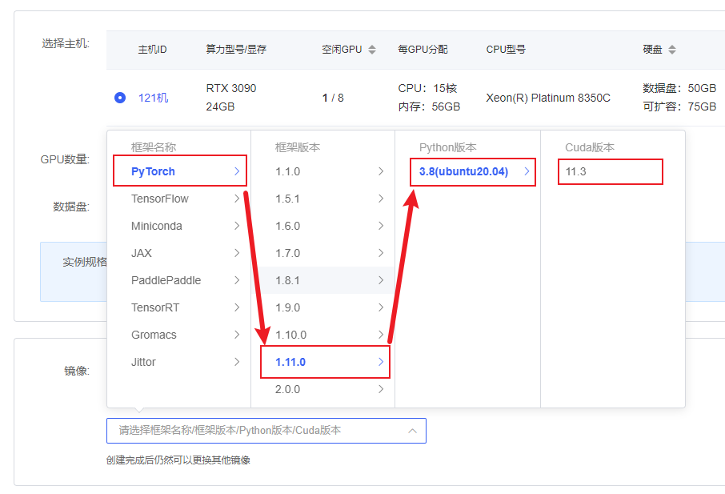
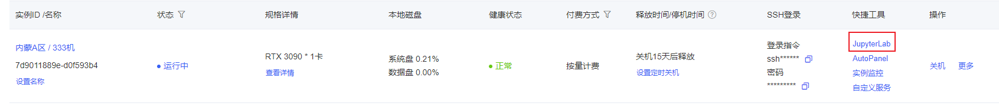
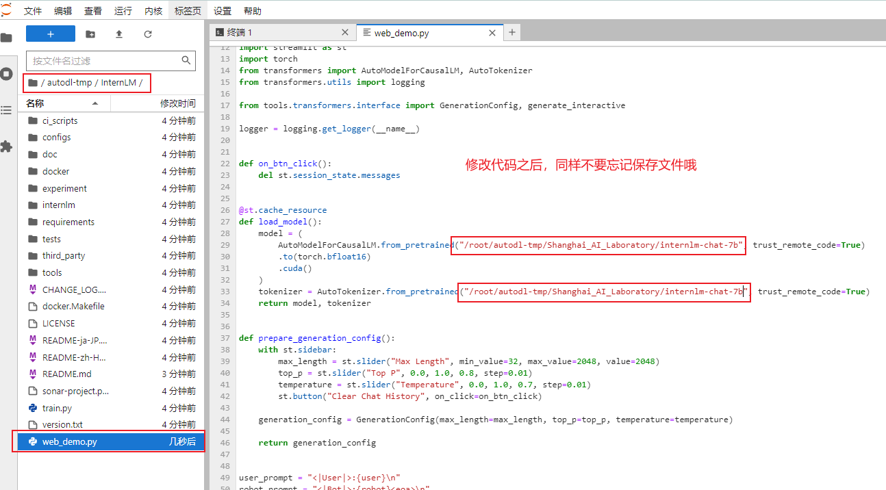
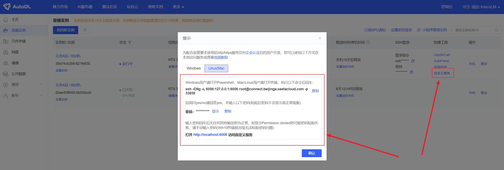
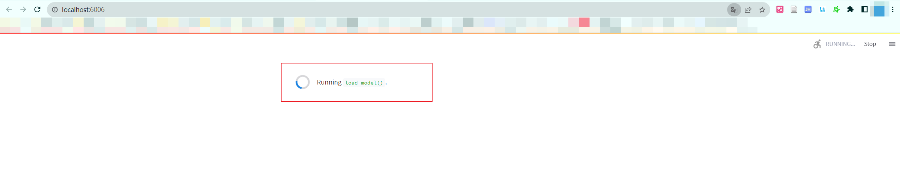

# InternLM-Chat-7B 对话 Web

## 环境准备

在[autodl](https://www.autodl.com/)平台中租一个3090等24G显存的显卡机器，如下图所示镜像选择`PyTorch`-->`1.11.0`-->`3.8(ubuntu20.04)`-->`11.3`



接下来打开刚刚租用服务器的`JupyterLab`，并且打开其中的终端开始环境配置、模型下载和运行`demo`。



pip换源和安装依赖包

```shell
# 更换 pypi 源加速库的安装
pip config set global.index-url https://pypi.tuna.tsinghua.edu.cn/simple

pip install modelscope
pip install transformers
pip install streamlit==1.24.0
pip install sentencepiece
pip install accelerate
```
## 模型下载

使用 `modelscope` 中的`snapshot_download`函数下载模型，第一个参数为模型名称，参数`cache_dir`为模型的下载路径。

在 `/root/autodl-tmp` 路径下新建 `download.py` 文件并在其中输入以下内容，粘贴代码后记得保存文件，如下图所示。并运行 `python /root/autodl-tmp/download.py`执行下载，模型大小为 14 GB，下载模型大概需要 10~20 分钟

```python
import torch
from modelscope import snapshot_download, AutoModel, AutoTokenizer
import os
model_dir = snapshot_download('Shanghai_AI_Laboratory/internlm-chat-7b', cache_dir='/root/autodl-tmp', revision='master')
```


## 代码准备

首先`clone`代码，打开autodl平台自带的学术镜像加速。学术镜像加速详细使用请看：https://www.autodl.com/docs/network_turbo/

```shell
source /etc/network_turbo
```

然后切换路径, clone代码.

```shell
cd /root/autodl-tmp
git clone https://github.com/InternLM/InternLM.git
```

切换commit版本，与教程commit版本保持一致，可以让大家更好的复现。

```shell
cd InternLM
git checkout 3028f07cb79e5b1d7342f4ad8d11efad3fd13d17
```

最后取消镜像加速，因为该加速可能对正常网络造成一定影响，避免对后续下载其他模型造成困扰。
```shell
unset http_proxy && unset https_proxy
```

将 `/root/autodl-tmp/InternLM/web_demo.py`中 29 行和 33 行的模型更换为本地的`/root/autodl-tmp/Shanghai_AI_Laboratory/internlm-chat-7b`。



## web demo运行

运行以下命令即可启动推理服务

```shell
cd /root/autodl-tmp/InternLM
streamlit run web_demo.py --server.address 127.0.0.1 --server.port 6006
```

将 `autodl `的端口映射到本地的 [http://localhost:6006](http://localhost:6006/) 仅在此处展示一次，以下两个 Demo 都是同样的方法把 `autodl `中的 `6006 `端口映射到本机的 `http://localhost:6006`的方法都是相同的，方法如图所示。



注意：要在浏览器打开`http://localhost:6006`页面后，模型才会加载，如下图所示：



在加载完模型之后，就可以既可与InternLM-Chat-7B进行对话了，如下图所示：

