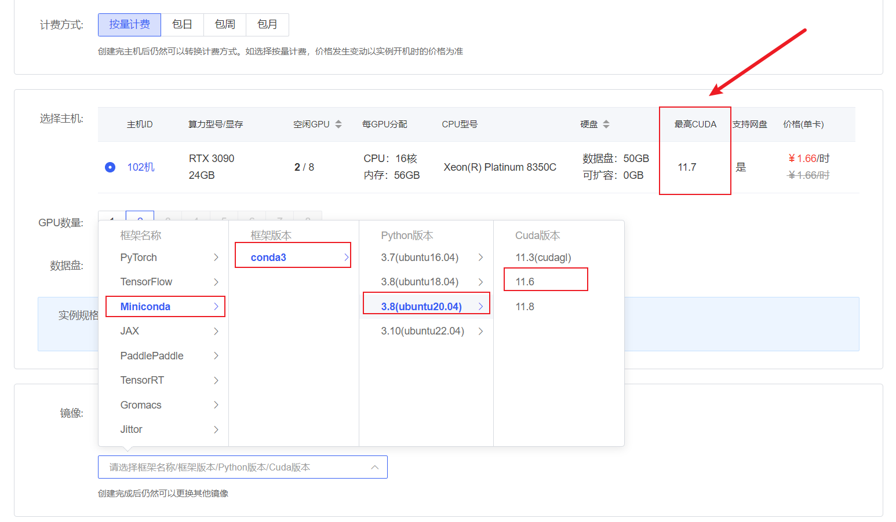
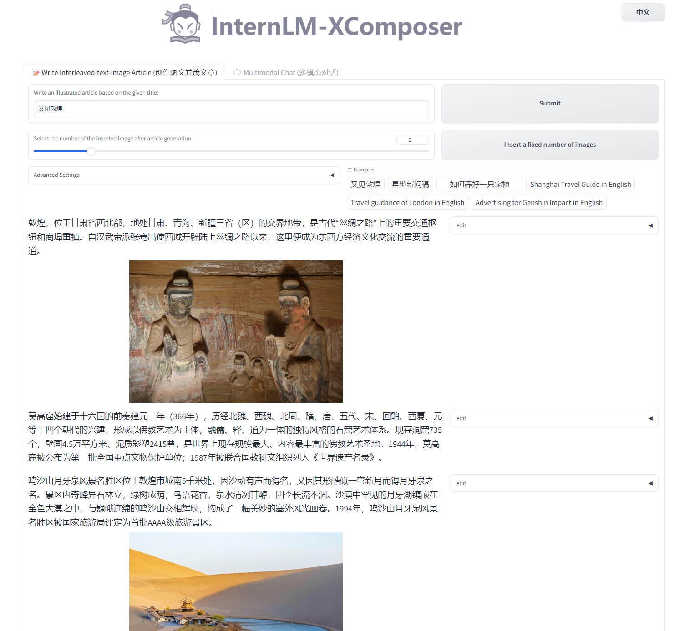

# 浦语灵笔图文理解&创作

## 环境准备

首先在 `AutoDL` 上租一台显卡驱动支持 `11.7` 以上的双卡 `3090` 机器.
在选择镜像是选择 `Miniconda` --> `conda3` --> `3.8(ubuntu20.04)`--> `11.6`



打开 `jupyter lab` 中的终端，首先运行以下命令安装 `PyTorch 2.0.1`

```shell
# 升级pip
python -m pip install --upgrade pip
pip install torch==2.0.1+cu117 torchvision==0.15.2+cu117 torchaudio==2.0.2 --index-url https://download.pytorch.org/whl/cu117
```

接下来运行以下命令，安装 `transformers`、`gradio` 等依赖包。请严格安装以下版本安装！

```shell
pip install transformers==4.33.1 timm==0.4.12 sentencepiece==0.1.99 gradio==3.44.4 markdown2==2.4.10 xlsxwriter==3.1.2 einops accelerate
```
## 模型下载

安装`modelscope`，下载模型的老朋友了

```shell
pip install modelscope==1.9.5
```

在 `/root/autodl-tmp` 路径下新建 `download.py` 文件并在其中输入以下内容，并运行 `python /root/autodl-tmp/download.py`执行下载

```python
import torch
from modelscope import snapshot_download, AutoModel, AutoTokenizer
import os
model_dir = snapshot_download('Shanghai_AI_Laboratory/internlm-xcomposer-7b', cache_dir='/root/autodl-tmp', revision='master')
```

## 代码准备

在 `/root/autodl-tmp` `git clone InternLM-XComposer` 仓库的代码

```shell
source /etc/network_turbo
cd /root/autodl-tmp
git clone https://github.com/InternLM/InternLM-XComposer.git
git checkout 3e8c79051a1356b9c388a6447867355c0634932d  # 最好保证和教程的commit版本一致
unset http_proxy && unset https_proxy
```

## Demo 运行

在终端运行以下代码：

```shell
cd /root/autodl-tmp/InternLM-XComposer
python examples/web_demo.py  \
    --folder /root/autodl-tmp/Shanghai_AI_Laboratory/internlm-xcomposer-7b \
    --num_gpus 2 \
    --port 6006
```

将autodl的端口映射到本地之后，用浏览器代开`http://localhost:6006/`，我们以`又见敦煌`为提示词，体验图文创作的功能，如下图所示：



接下来，我们可以体验以下图片理解的能力，如下所示~

