# MiniCPM-2-V微调和WebDemo部署

## 环境准备

在 Autodl 平台中租赁一个3卡 RTX 3090/24G 显存的显卡机器。如下图所示，镜像先选pytorch2.3.0->python3.12(ubuntu22.04)->cuda12.1，我们后期直接通过mamba包管理工具创建即可。

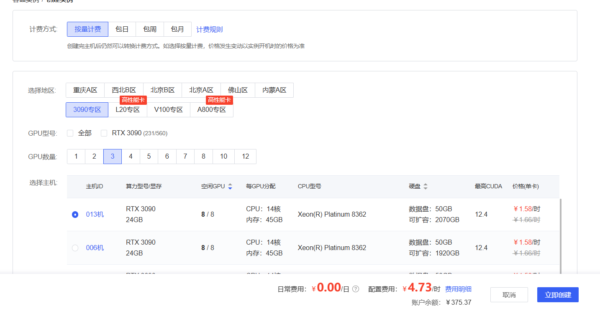

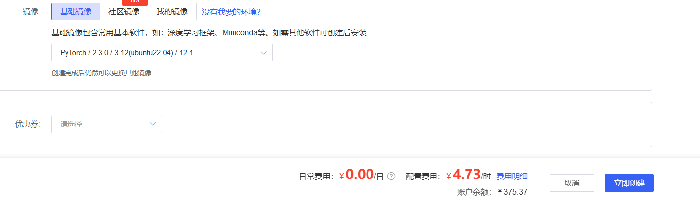接下来，我们打开刚刚租用服务器的 JupyterLab，如下图所示，然后打开其中的终端，开始环境配置、模型下载和运行演示。我们直接使用代码仓库中的minicpm-2-v.yaml

```python
cd /
curl -Ls https://micro.mamba.pm/api/micromamba/linux-64/latest | tar -xvj bin/micromamba
./bin/micromamba shell init -s bash -p /micromamba

vi ~/.bashrc
加上
alias mamba=micromamba

mamba env create -f minicpm-2-v.yaml -y
mamba activate minicpm-2-v
pip install ipykernel
python -m ipykernel install --name=minicpm-2-v --display-name minicpm-2-v # 不添加--user属性，可供所有用户使用
```

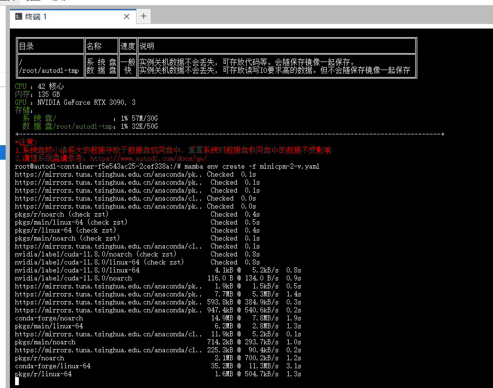

刷新一下，就能看到我们的环境了

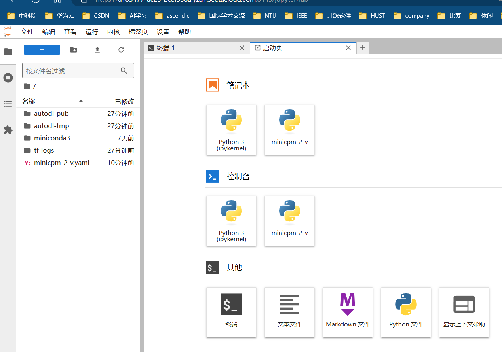

## 模型下载

使用 modelscope 中的snapshot_download函数下载模型，第一个参数为模型名称，参数cache_dir为模型的下载路径。

在 /root/autodl-tmp 路径下新建 download.py 文件并在其中输入以下内容，粘贴代码后记得保存文件。

download.py代码如下

```python
import torch
from modelscope import snapshot_download, AutoModel, AutoTokenizer
from modelscope import GenerationConfig
model_dir = snapshot_download('openbmb/MiniCPM-V-2', cache_dir='/root/autodl-tmp', revision='master')
```

保存好后在终端运行 python /root/autodl-tmp/download.py 执行下载，下载模型需要一些时间。

```bash
pip config set global.index-url https://pypi.tuna.tsinghua.edu.cn/simple
pip install  modelscope transformers
python /root/autodl-tmp/download.py 
```

## 微调环境准备-相关包编译

```bash
sudo apt-get update
sudo apt-get install cmake build-essential pkg-config libgoogle-perftools-dev
mamba activate minicpm-2-v
git clone https://github.com/google/sentencepiece.git 
cd sentencepiece
mkdir build
cd build
cmake ..
make -j $(nproc)
sudo make install
sudo ldconfig -v
pip install SentencePiece
pip install tensorboardX
```

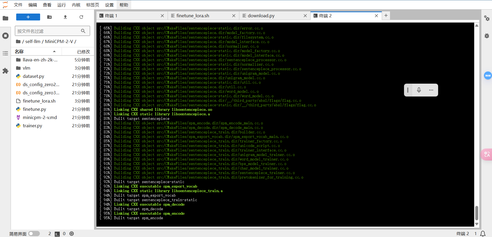

然后就来到了较为麻烦的deepspeed源码编译了

参考：

[deepspeed使用zero3 + offload报错:AttributeError: ‘DeepSpeedCPUAdam‘ object has no attribute ‘ds_opt_adam](https://blog.csdn.net/qq_44193969/article/details/137051032)

[Installation Details - DeepSpeed](https://www.deepspeed.ai/tutorials/advanced-install/#pre-install-deepspeed-ops)

```bash
pip uninstall deepspeed
# DS_BUILD_CPU_ADAM=1 pip install deepspeed 这个方法可能有兼容性问题，推荐源码编译

git clone https://github.com/microsoft/DeepSpeed
cd DeepSpeed/

DS_BUILD_CPU_ADAM=1 python setup.py build_ext -j8 bdist_wheel
pip install dist/deepspeed-0.14.3+b6e24adb-cp312-cp312-linux_x86_64.whl

pip install timm
```

## 开启微调

```bash
git clone https://github.com/Ethan-Chen-plus/self-llm.git
cd self-llm/MiniCPM-2-V/
git clone https://github.com/Ethan-Chen-plus/llava-en-zh-2k-mini.git
mv llava-en-zh-2k-mini data
cp -r ./data/img ./img
```

然后在finetune_lora里面设置

```text
MODEL="/root/autodl-tmp/openbmb/MiniCPM-V-2" # or openbmb/MiniCPM-V-2
DATA="./data/sample_50_train.json" # json file
EVAL_DATA="./data/sample_10_test.json" # json file
LLM_TYPE="minicpm" # if use openbmb/MiniCPM-V-2, please set LLM_TYPE=minicpm
```

```bash
sh finetune_lora.sh
```

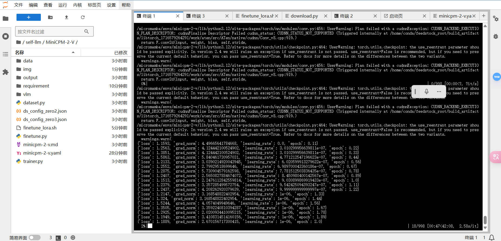

## 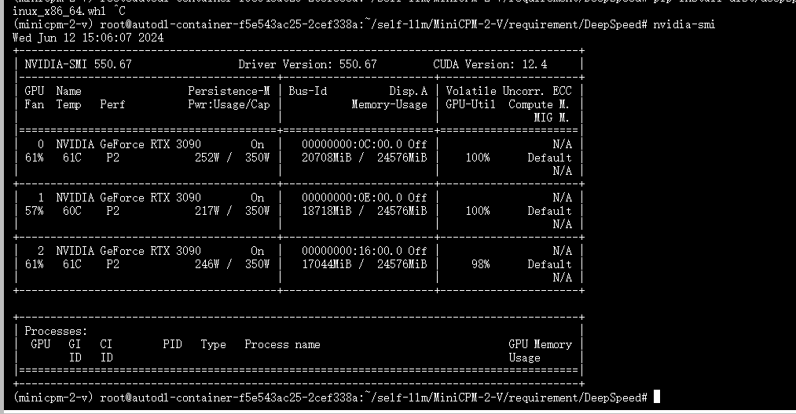

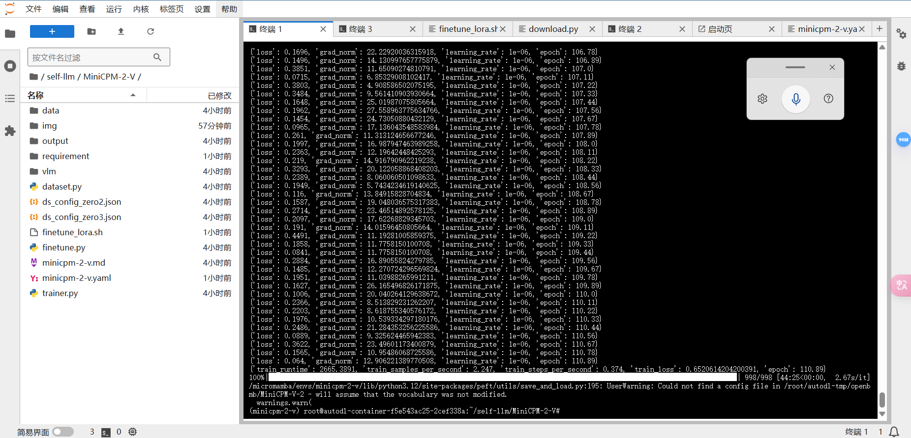

## 部署代码准备

在`/root/autodl-tmp`路径下新建 `chatBot.py` 文件并在其中输入以下内容，粘贴代码后记得保存文件。下面的代码有很详细的注释，大家如有不理解的地方，欢迎提出issue。

chatBot.py代码如下

```python
import streamlit as st  # 导入 Streamlit 库，用于构建网页应用
from PIL import Image  # 导入 PIL 库中的 Image 模块，用于处理图像
import torch  # 导入 PyTorch 库，用于深度学习模型
from transformers import AutoModel, AutoTokenizer  # 导入 transformers 库中的 AutoModel 和 AutoTokenizer，用于加载预训练模型和分词器
from dataclasses import dataclass, field
from typing import Dict, List, Optional, Union, Literal, Tuple
from peft import LoraConfig, get_peft_model, TaskType

# 模型路径
model_path = "/root/autodl-tmp/openbmb/MiniCPM-V-2"
path_to_adapter = "/root/self-llm/MiniCPM-2-V/output/output_minicpmv2_lora"
# 用户和助手的名称
U_NAME = "User"
A_NAME = "Assistant"

# 设置页面配置
st.set_page_config(
    page_title="💬MiniCPM-V-2 Streamlit",  # 页面标题
    page_icon=":robot:",  # 页面图标
    layout="wide"  # 页面布局为宽屏
)

@dataclass
class LoraArguments:
    lora_r: int = 64
    lora_alpha: int = 64
    lora_dropout: float = 0.05
    lora_target_modules: str = r"llm\..*layers\.\d+\.self_attn\.(q_proj|k_proj|v_proj)"
    lora_weight_path: str = ""
    lora_bias: str = "none"
    q_lora: bool = False
    lora_modules_to_save: str = ""
    lora_layer_replication: Optional[List[Tuple[int, int]]] = None
    lora_layers_to_transform: Optional[List[int]] = None
    lora_layers_pattern: Optional[str] = None

from peft import LoraConfig, get_peft_model, TaskType

def load_lora_config(model):
    config = LoraConfig(
        task_type=TaskType.CAUSAL_LM,
        inference_mode=False,
        r=64,
        lora_alpha=64,
        lora_dropout=0.05,
        target_modules=r"llm\..*layers\.\d+\.self_attn\.(q_proj|k_proj|v_proj)"
    )
    return get_peft_model(model, config)

# 加载模型和分词器的函数，并缓存结果以提高性能
@st.cache_resource
def load_model_and_tokenizer():
    print(f"load_model_and_tokenizer from {model_path}")
    # 从预训练模型路径加载模型和分词器，并将模型加载到 CUDA 设备上（如果可用）
    model = AutoModel.from_pretrained(model_path, trust_remote_code=True).to(device="cuda")
    tokenizer = AutoTokenizer.from_pretrained(model_path, trust_remote_code=True)
    model = load_lora_config(model)
    vpm_resampler_embedtokens_weight = torch.load(f"{path_to_adapter}/vpm_resampler_embedtokens.pt")
    msg = model.load_state_dict(vpm_resampler_embedtokens_weight, strict=False)
    return model, tokenizer

# 初始化会话状态
if 'model' not in st.session_state:
    st.session_state.model, st.session_state.tokenizer = load_model_and_tokenizer()
    st.session_state.model.eval()  # 将模型设置为评估模式
    print("model and tokenizer had loaded completed!")

# 初始化聊天记录的会话状态
if 'chat_history' not in st.session_state:
    st.session_state.chat_history = []

# 侧边栏设置
sidebar_name = st.sidebar.title("💬MiniCPM-V-2 Streamlit-powered by self-llm")
# 在侧边栏创建滑块，用于设置生成文本的最大长度、重复惩罚、top_p、top_k 和温度
max_length = st.sidebar.slider("max_length", 0, 4096, 2048, step=2)
repetition_penalty = st.sidebar.slider("repetition_penalty", 0.0, 2.0, 1.05, step=0.01)
top_p = st.sidebar.slider("top_p", 0.0, 1.0, 0.8, step=0.01)
top_k = st.sidebar.slider("top_k", 0, 100, 100, step=1)
temperature = st.sidebar.slider("temperature", 0.0, 1.0, 0.7, step=0.01)
# 在侧边栏中创建一个标题和一个链接
with st.sidebar:
    st.markdown("## MiniCPM LLM")
    "[开源大模型食用指南 self-llm](https://github.com/datawhalechina/self-llm.git)"
    "[开源大模型架构教程 llms-from-scratch](https://github.com/datawhalechina/llms-from-scratch-cn.git)"

# 清除聊天记录的按钮
buttonClean = st.sidebar.button("Clear chat history", key="clean")
if buttonClean:
    st.session_state.chat_history = []  # 清空聊天记录
    st.session_state.response = ""
    if torch.cuda.is_available():
        torch.cuda.empty_cache()  # 清空 CUDA 缓存
    st.rerun()  # 重新运行页面

# 显示聊天记录
for i, message in enumerate(st.session_state.chat_history):
    if message["role"] == "user":
        # 如果消息是用户的，显示用户的消息
        with st.chat_message(name="user", avatar="user"):
            if message["image"] is not None:
                st.image(message["image"], caption='User uploaded image', width=448, use_column_width=False)
                continue
            elif message["content"] is not None:
                st.markdown(message["content"])
    else:
        # 如果消息是助手的，显示助手的消息
        with st.chat_message(name="model", avatar="assistant"):
            st.markdown(message["content"])

# 选择模式
selected_mode = st.sidebar.selectbox("Select mode", ["Text", "Image"])
if selected_mode == "Image":
    # 图片模式
    uploaded_image = st.sidebar.file_uploader("Upload image", key=1, type=["jpg", "jpeg", "png"], accept_multiple_files=False)
    if uploaded_image is not None:
        st.image(uploaded_image, caption='User uploaded image', width=468, use_column_width=False)
        # 将上传的图片添加到聊天记录中
        st.session_state.chat_history.append({"role": "user", "content": None, "image": uploaded_image})

# 用户输入框
user_text = st.chat_input("Enter your question")
if user_text:
    with st.chat_message(U_NAME, avatar="user"):
        # 将用户输入的文本添加到聊天记录中
        st.session_state.chat_history.append({"role": "user", "content": user_text, "image": None})
        st.markdown(f"{U_NAME}: {user_text}")

    # 使用模型生成回复
    model = st.session_state.model
    tokenizer = st.session_state.tokenizer

    with st.chat_message(A_NAME, avatar="assistant"):
        # 如果前一条消息包含图片，将图片传递给模型
        if len(st.session_state.chat_history) > 1 and st.session_state.chat_history[-2]["image"] is not None:
            uploaded_image = st.session_state.chat_history[-2]["image"]
            imagefile = Image.open(uploaded_image).convert('RGB')

        msgs = [{"role": "user", "content": user_text}]
        # 使用模型生成回复文本
        res = model.chat(image=imagefile, msgs=msgs, context=None, tokenizer=tokenizer,
                         sampling=True, top_p=top_p, top_k=top_k, repetition_penalty=repetition_penalty,
                         temperature=temperature, stream=True)

        # 收集生成的文本字符串
        generated_text = st.write_stream(res)

        st.session_state.chat_history.append({"role": "model", "content": generated_text, "image": None})

    st.divider()  # 添加分割线
```

## 运行demo

在终端中运行以下命令，启动streamlit服务

```
streamlit run /root/autodl-tmp/chatBot.py --server.address 127.0.0.1 --server.port 6006
```

点击自定义服务

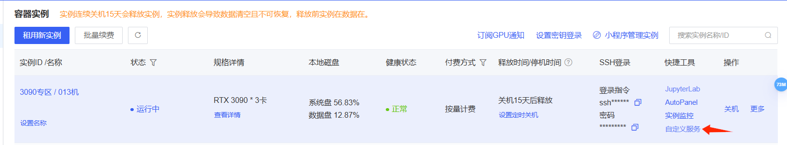

点开linux

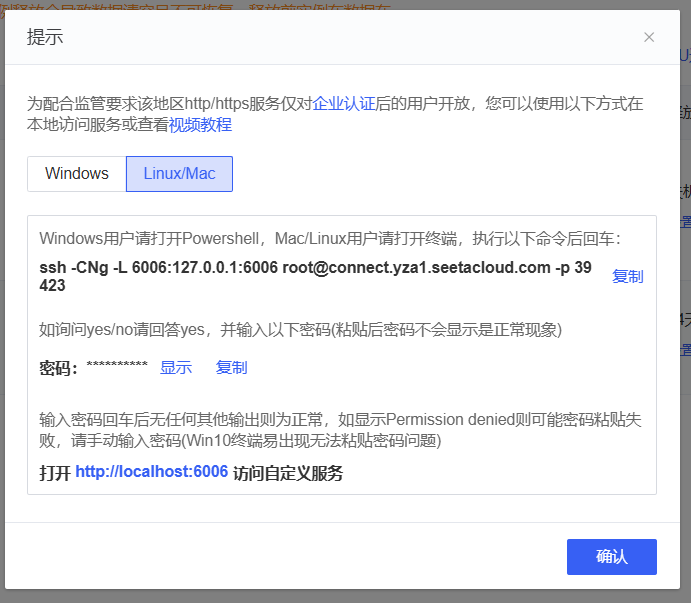

然后win+R打开powershell

```
ssh -CNg -L 6006:127.0.0.1:6006 root@connect.yza1.seetacloud.com -p 39423
```

输入ssh与密码，按下回车至这样即可，保持命令行界面为开启状态

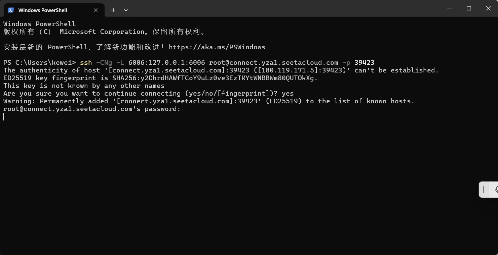

在浏览器中打开链接 http://localhost:6006/ ，即可看到聊天界面。运行效果如下：

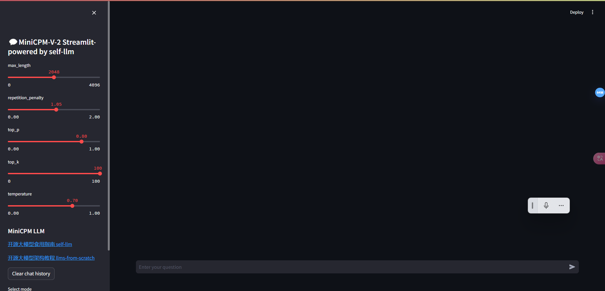

我上传的图片如下

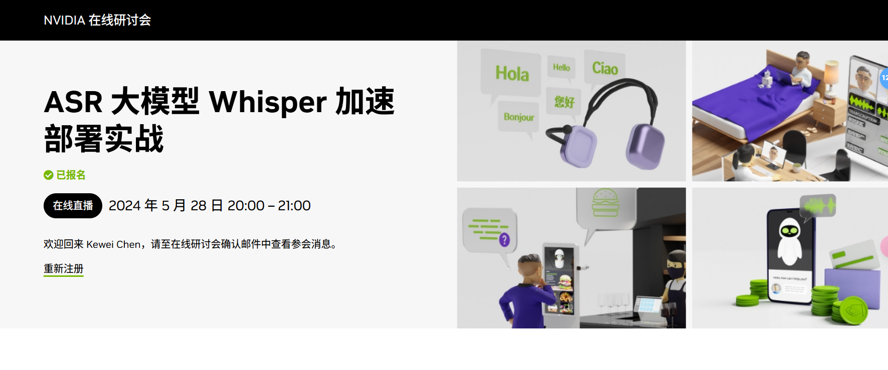

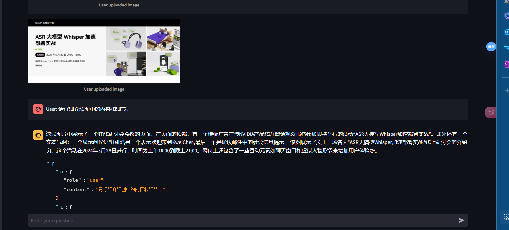

可以看到效果还是很不错的。那么我们这期内容就到这里了。如果想要深入了解模型的原理，可以访问我们的仓库：[datawhalechina/llms-from-scratch-cn](https://github.com/datawhalechina/llms-from-scratch-cn/)

<a href ="https://github.com/datawhalechina/llms-from-scratch-cn/">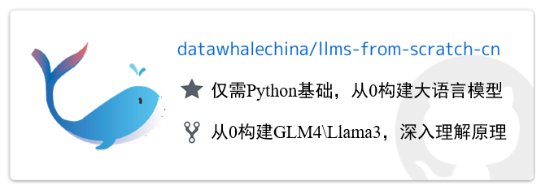</a>
