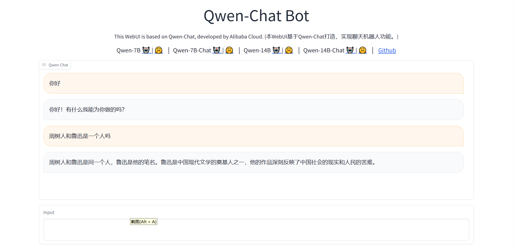

# Qwen-7B-Chat 接入langchain搭建知识库助手
## 环境准备
在autodl平台中租一个3090等24G显存的显卡机器，如下图所示镜像选择PyTorch-->2.0.0-->3.8(ubuntu20.04)-->11.8

接下来打开刚刚租用服务器的JupyterLab，并且打开其中的终端开始环境配置、模型下载和运行demo。

pip换源和安装依赖包
```
# 升级pip
python -m pip install --upgrade pip
# 更换 pypi 源加速库的安装
pip config set global.index-url https://pypi.tuna.tsinghua.edu.cn/simple>

pip install modelscope==1.9.5
pip install "transformers>=4.32.0" accelerate tiktoken einops scipy transformers_stream_generator==0.0.4 peft deepspeed
pip install -U huggingface_hub
```
## 模型下载
在已完成Qwen-7B-chat部署的基础上，我们还需要还需要安装以下依赖包，请在终端复制粘贴以下命令，并按回车运行：
```
pip install langchain==0.0.292
pip install gradio==4.4.0
pip install chromadb==0.4.15
pip install sentence-transformers==2.2.2
pip install unstructured==0.10.30
pip install markdown==3.3.7
```
同时，我们还需要使用到开源词向量模型 [Sentence Transformer](https://huggingface.co/sentence-transformers/paraphrase-multilingual-MiniLM-L12-v2)
这里使用huggingface镜像下载到本地 /root/autodl-tmp/embedding_model，你也可以选择其它的方式下载

在 /root/autodl-tmp 路径下新建 download.py 文件并在其中输入以下内容，粘贴代码后记得保存文件，如下图所示。并运行 python /root/autodl-tmp/download.py执行下载，模型大小为 15 GB，下载模型大概需要 10~20 分钟
```
import os
# 设置环境变量
os.environ['HF_ENDPOINT'] = 'https://hf-mirror.com'
# 下载模型
os.system('huggingface-cli download --resume-download sentence-transformers/paraphrase-multilingual-MiniLM-L12-v2 --local-dir /root/autodl-tmp/embedding_model')
```
## 知识库建设
我们选用以下两个开源仓库作为知识库来源
[通义千问-7B-Chat](https://www.modelscope.cn/models/qwen/Qwen-7B-Chat)
[]
```
# 进入到数据库盘
cd /root/autodl-tmp
# 打开学术资源加速
source /etc/network_turbo
# clone 上述开源仓库
git clone https://github.com/open-compass/opencompass.git
git clone https://github.com/InternLM/lmdeploy.git
git clone https://github.com/InternLM/xtuner.git
git clone https://github.com/InternLM/InternLM-XComposer.git
git clone https://github.com/InternLM/lagent.git
git clone https://github.com/InternLM/InternLM.git
# 关闭学术资源加速
unset http_proxy && unset https_proxy
```
## demo运行
执行下面的命令安装依赖包：
```
cd /root/autodl-tmp/Qwen
pip install -r requirements.txt
pip install -r requirements_web_demo.txt
```
运行以下命令即可启动推理服务
```
cd /root/autodl-tmp/Qwen
python web_demo.py --server-port 6006
```
将 autodl 的端口映射到本地的 http://localhost:6006 即可看到demo界面。

注意：要在浏览器打开http://localhost:6006页面后，模型才会加载，如下图所示：

