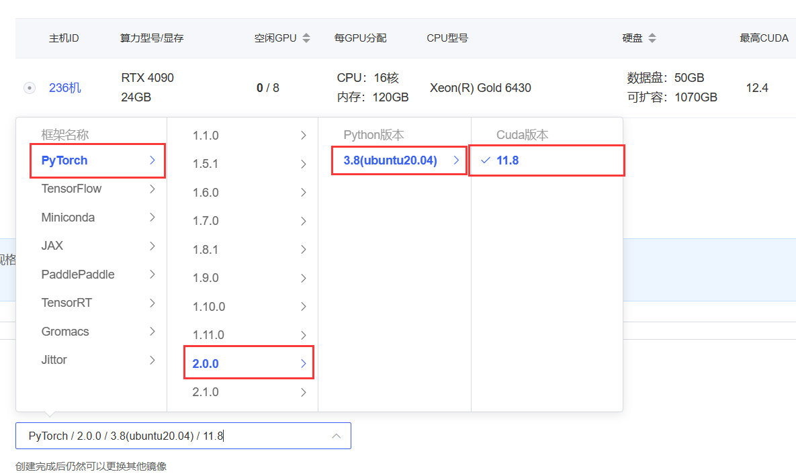
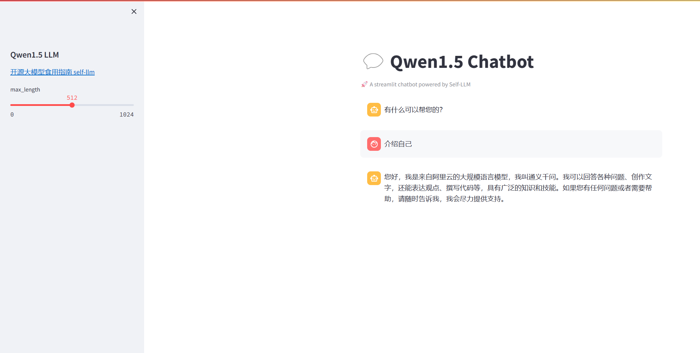

# Qwen1.5-7B-Chat-GPTQ-Int4 部署环境

## 说明

Qwen1.5-72b 版本有BF16、INT8、INT4三个版本，三个版本性能接近。由于BF16版本需要144GB的显存，让普通用户忘却止步，而INT4版本只需要48GB即可推理，给普通用户本地化部署创造了机会。

但由于Qwen1.5-72B-Chat-GPTQ-Int4其使用了GPTQ量化技术，对环境依赖要求严格，需要较为复杂的环境准备步骤。

在此提供环境准备教程。本教程以 *Qwen1.5-7B-Chat-GPTQ-Int4*为例，同样适用于其他大小的*GPTQ-Int4*版本。

## 环境准备

### 平台及cuda部分

在autodl平台中租一个4090等24G显存的显卡机器，如下图所示镜像选择PyTorch-->2.0.0-->3.8(ubuntu20.04)-->11.8（严格按照cuda11.8版本）
接下来打开刚刚租用服务器的JupyterLab，并且打开其中的终端开始环境配置。




说明：
- 确保显卡驱动支持cuda11.8
- 过程**需要严格满足nvcc-pytorch-GPTQ的版本对应关系**，否则GPTQ无法编译成功。

（原因见[Qwen库](https://github.com/QwenLM/Qwen?tab=readme-ov-file)Quantization部分，由于GPTQ工具需要严格的cuda+torch对应关系，且由于近期的升级可能带来的bug。我们保险起见选择cuda11.8，并且根据qwen库所要求的torch2.1，安装了其对应的torch，并在后面使用GPTQ源码构建以确保cuda的正确运行。）

确保nvcc可以正常工作：
```shell
nvcc -V
# 查看输出若为Cuda compilation tools, release 11.8 则跳过平台及cuda部分
```
---
如果后续由于Autodl的环境更新，无法选择cuda11.8，则可通过以下方式**自行搭建cuda11.8**环境。该方法已经通过测试。
```shell
# 下载驱动并安装
wget https://developer.download.nvidia.com/compute/cuda/11.8.0/local_installers/cuda_11.8.0_520.61.05_linux.run

# 勾选cudatoolkit并安装
sudo sh cuda_11.8.0_520.61.05_linux.run

# 添加nvcc环境变量
vim ~/.bashrc 

# 添加如下两行
export PATH=/usr/local/cuda-11.8/bin:$PATH
export LD_LIBRARY_PATH=/usr/local/cuda-11.8/lib64:$LD_LIBRARY_PATH

# 重新载入
source ~/.bashrc 
nvcc -V 
```
--- 

### 虚拟环境配置
由于base环境的torch不一定满足要求，创建虚拟环境。
```shell
# 创建虚拟环境
conda create -n qwen python==3.10

# 安装指定版本pytorch
pip install torch==2.1.1 torchvision==0.16.1 torchaudio==2.1.1 --index-url https://download.pytorch.org/whl/cu118

# 安装Qwen1.5所需依赖
pip install accelerate tiktoken einops transformers_stream_generator==0.0.4 scipy optimum peft transformers streamlit modelscope
```

从源码安装GPTQ（auto-gptq>=0.5.1），否则极易出现GPTQ无法使用cuda的情况
```shell
# 从源码安装量化所需GPTQ库
pip install "git+https://github.com/PanQiWei/AutoGPTQ.git@v0.7.1"

```
见[Qwen库](https://github.com/QwenLM/Qwen?tab=readme-ov-file)Quantization部分说明：

> Note: The pre-compiled `auto-gptq` packages strongly depend on the version of `torch` and its CUDA version. Moreover, due to recent update, 
> you may also encounter unsupported version errors from `transformers`, `optimum`, or `peft`.
> We recommend using the latest versions meeting the following requirements:
> - torch==2.1 auto-gptq>=0.5.1 transformers>=4.35.0 optimum>=1.14.0 peft>=0.6.1
> - torch>=2.0,<2.1 auto-gptq<0.5.0 transformers<4.35.0 optimum<1.14.0 peft>=0.5.0,<0.6.0

至此，环境部分准备完成。

## 模型下载
使用 modelscope 中的snapshot_download函数下载模型，第一个参数为模型名称，参数cache_dir为模型的下载路径。

在 /root/autodl-tmp 路径下新建 download.py 文件并在其中输入以下内容，粘贴代码后记得保存文件，如下图所示。并运行 python /root/autodl-tmp/download.py 执行下载，下载模型大概需要 2 分钟。

```
import torch
from modelscope import snapshot_download, AutoModel, AutoTokenizer
from modelscope import GenerationConfig
model_dir = snapshot_download('qwen/Qwen1.5-7B-Chat-GPTQ-Int4', cache_dir='/root/autodl-tmp', revision='master')
```
说明：下载后需要确认下载的Qwen1.5-7B-Chat-GPTQ-Int4文件名称，可能由于解码问题不正确导致后续bug。
## 代码准备

在`/root/autodl-tmp`路径下新建 `chatBot.py` 文件并在其中输入以下内容，粘贴代码后记得保存文件。下面的代码有很详细的注释，大家如有不理解的地方，欢迎提出issue。

```python
# 导入所需的库
from transformers import AutoTokenizer, AutoModelForCausalLM, GenerationConfig
import torch
import streamlit as st

# 在侧边栏中创建一个标题和一个链接
with st.sidebar:
    st.markdown("## Qwen1.5 LLM")
    "[开源大模型食用指南 self-llm](https://github.com/datawhalechina/self-llm.git)"
    # 创建一个滑块，用于选择最大长度，范围在0到1024之间，默认值为512
    max_length = st.slider("max_length", 0, 1024, 512, step=1)

# 创建一个标题和一个副标题
st.title("💬 Qwen1.5 Chatbot")
st.caption("🚀 A streamlit chatbot powered by Self-LLM")

# 定义模型路径
mode_name_or_path = '/root/autodl-tmp/qwen/Qwen1.5-7B-Chat-GPTQ-Int4'

# 定义一个函数，用于获取模型和tokenizer
@st.cache_resource
def get_model():
    # 从预训练的模型中获取tokenizer
    tokenizer = AutoTokenizer.from_pretrained(mode_name_or_path, use_fast=False)
    # 从预训练的模型中获取模型，并设置模型参数，特别注意torch_dtype为auto，否则送入device数据类型不一致
    model = AutoModelForCausalLM.from_pretrained(mode_name_or_path, torch_dtype="auto",  device_map="auto")
  
    return tokenizer, model

# 加载Qwen1.5-4B-Chat的model和tokenizer
tokenizer, model = get_model()

# 如果session_state中没有"messages"，则创建一个包含默认消息的列表
if "messages" not in st.session_state:
    st.session_state["messages"] = [{"role": "assistant", "content": "有什么可以帮您的？"}]

# 遍历session_state中的所有消息，并显示在聊天界面上
for msg in st.session_state.messages:
    st.chat_message(msg["role"]).write(msg["content"])

# 如果用户在聊天输入框中输入了内容，则执行以下操作
if prompt := st.chat_input():
    # 将用户的输入添加到session_state中的messages列表中
    st.session_state.messages.append({"role": "user", "content": prompt})
    # 在聊天界面上显示用户的输入
    st.chat_message("user").write(prompt)
    
    # 构建输入     
    input_ids = tokenizer.apply_chat_template(st.session_state.messages,tokenize=False,add_generation_prompt=True)
    model_inputs = tokenizer([input_ids], return_tensors="pt").to('cuda')
    generated_ids = model.generate(model_inputs.input_ids, max_new_tokens=512)
    generated_ids = [
        output_ids[len(input_ids):] for input_ids, output_ids in zip(model_inputs.input_ids, generated_ids)
    ]
    response = tokenizer.batch_decode(generated_ids, skip_special_tokens=True)[0]
    # 将模型的输出添加到session_state中的messages列表中
    st.session_state.messages.append({"role": "assistant", "content": response})
    # 在聊天界面上显示模型的输出
    st.chat_message("assistant").write(response)
    # print(st.session_state)
```


## 运行 demo

在终端中运行以下命令，启动streamlit服务，并按照 `autodl` 的指示将端口映射到本地，然后在浏览器中打开链接 http://localhost:6006/ ，即可看到聊天界面。

```bash
streamlit run /root/autodl-tmp/chatBot.py --server.address 127.0.0.1 --server.port 6006
```
最终效果：




