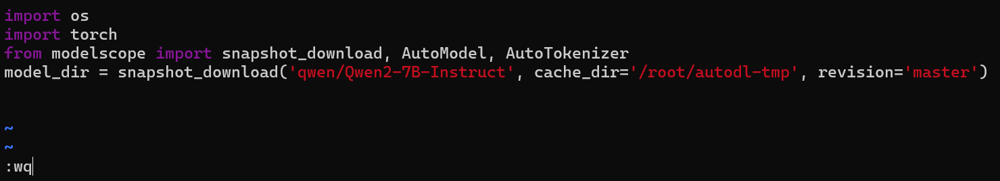
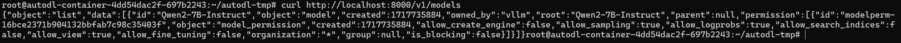
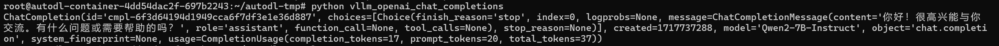
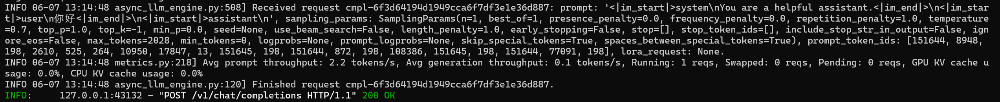
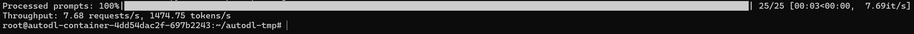
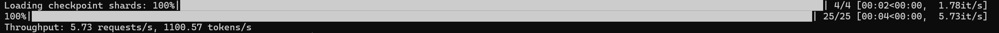

# 04-Qwen2-7B-Instruct vLLM 部署调用

## **vLLM 简介**

`vLLM` 框架是一个高效的大语言模型**推理和部署服务系统**，具备以下特性：

- **高效的内存管理**：通过 `PagedAttention` 算法，`vLLM` 实现了对 `KV` 缓存的高效管理，减少了内存浪费，优化了模型的运行效率。
- **高吞吐量**：`vLLM` 支持异步处理和连续批处理请求，显著提高了模型推理的吞吐量，加速了文本生成和处理速度。
- **易用性**：`vLLM` 与 `HuggingFace` 模型无缝集成，支持多种流行的大型语言模型，简化了模型部署和推理的过程。兼容 `OpenAI` 的 `API` 服务器。
- **分布式推理**：框架支持在多 `GPU` 环境中进行分布式推理，通过模型并行策略和高效的数据通信，提升了处理大型模型的能力。
- **开源共享**：`vLLM` 由于其开源的属性，拥有活跃的社区支持，这也便于开发者贡献和改进，共同推动技术发展。


## **环境准备**

在 `AutoDL` 平台中租赁一个 3090 等 24G 显存大小的容器实例，镜像选择如下 `PyTorch`→`2.1.0`→`3.10(ubuntu22.04)`→`12.1`


接下来打开本地设备终端使用 `ssh` 的方式访问，在终端中依次复制登录指令和密码完成登录


`ssh` 登录成功后的界面如图所示👇


或者也可以直接打开 `AutoDL` 网页端的快捷工具中选择 `JupyterLab` 并在其中点击终端打开（这种方式不需要验证🫠）



接下来开始环境配置、模型下载和运行演示 ~

`pip` 换源加速下载并安装依赖包

```bash
# 升级pip
python -m pip install --upgrade pip
# 更换 pypi 源加速库的安装
pip config set global.index-url https://pypi.tuna.tsinghua.edu.cn/simple

pip install modelscope==1.11.0
pip install openai==1.17.1
pip install torch==2.1.2+cu121
pip install tqdm==4.64.1
pip install transformers==4.39.3
# 下载flash-attn 请等待大约10分钟左右~
MAX_JOBS=8 pip install flash-attn --no-build-isolation
pip install vllm==0.4.0.post1
```

直接安装 `vLLM` 会安装 `CUDA 12.1` 版本。

```bash
pip install vllm
```

> 考虑到部分同学配置环境可能会遇到一些问题，我们在AutoDL平台准备了Qwen2的环境镜像，该镜像适用于该仓库除Qwen-GPTQ和vllm外的所有部署环境。点击下方链接并直接创建Autodl示例即可。
> ***https://www.codewithgpu.com/i/datawhalechina/self-llm/Qwen2***


## 模型下载  

使用 `modelscope` 中的 `snapshot_download` 函数下载模型，第一个参数为模型名称，参数 `cache_dir`为模型的下载路径。

先切换到 `autodl-tmp` 目录，`cd /root/autodl-tmp` 

然后新建名为 `model_download.py` 的 `python` 脚本，并在其中输入以下内容并保存

```python
# model_download.py
import os
import torch
from modelscope import snapshot_download, AutoModel, AutoTokenizer
model_dir = snapshot_download('qwen/Qwen2-7B-Instruct', cache_dir='/root/autodl-tmp', revision='master')
```

然后在终端中输入 `python model_download.py` 执行下载，这里需要耐心等待一段时间直到模型下载完成。


## **代码准备**

### **Python脚本**

在 `/root/autodl-tmp` 路径下新建 `vllm_model.py` 文件并在其中输入以下内容，粘贴代码后请及时保存文件。下面的代码有很详细的注释，如有不理解的地方，欢迎大家提 `issue`。

首先从 `vLLM` 库中导入 `LLM` 和 `SamplingParams` 类。`LLM` 类是使用 `vLLM` 引擎运行离线推理的主要类。`SamplingParams` 类指定采样过程的参数，用于控制和调整生成文本的随机性和多样性。

`vLLM` 提供了非常方便的封装，我们直接传入模型名称或模型路径即可，不必手动初始化模型和分词器。

我们可以通过这个代码示例熟悉下 ` vLLM` 引擎的使用方式。被注释的部分内容可以丰富模型的能力，但不是必要的，大家可以按需选择，自己多多动手尝试 ~

```python
# vllm_model.py
from vllm import LLM, SamplingParams
from transformers import AutoTokenizer
import os
import json

# 自动下载模型时，指定使用modelscope。不设置的话，会从 huggingface 下载
os.environ['VLLM_USE_MODELSCOPE']='True'

def get_completion(prompts, model, tokenizer=None, max_tokens=512, temperature=0.8, top_p=0.95, max_model_len=2048):
    stop_token_ids = [151329, 151336, 151338]
    # 创建采样参数。temperature 控制生成文本的多样性，top_p 控制核心采样的概率
    sampling_params = SamplingParams(temperature=temperature, top_p=top_p, max_tokens=max_tokens, stop_token_ids=stop_token_ids)
    # 初始化 vLLM 推理引擎
    llm = LLM(model=model, tokenizer=tokenizer, max_model_len=max_model_len,trust_remote_code=True)
    outputs = llm.generate(prompts, sampling_params)
    return outputs


if __name__ == "__main__":    
    # 初始化 vLLM 推理引擎
    model='/root/autodl-tmp/qwen/Qwen2-7B-Instruct' # 指定模型路径
    # model="qwen/Qwen2-7B-Instruct" # 指定模型名称，自动下载模型
    tokenizer = None
    # 加载分词器后传入vLLM 模型，但不是必要的。
    # tokenizer = AutoTokenizer.from_pretrained(model, use_fast=False) 
    
    text = ["你好，帮我介绍一下什么时大语言模型。",
            "可以给我将一个有趣的童话故事吗？"]
    # messages = [
    #     {"role": "system", "content": "你是一个有用的助手。"},
    #     {"role": "user", "content": prompt}
    # ]
    # 作为聊天模板的消息，不是必要的。
    # text = tokenizer.apply_chat_template(
    #     messages,
    #     tokenize=False,
    #     add_generation_prompt=True
    # )

    outputs = get_completion(text, model, tokenizer=tokenizer, max_tokens=512, temperature=1, top_p=1, max_model_len=2048)

    # 输出是一个包含 prompt、生成文本和其他信息的 RequestOutput 对象列表。
    # 打印输出。
    for output in outputs:
        prompt = output.prompt
        generated_text = output.outputs[0].text
        print(f"Prompt: {prompt!r}, Generated text: {generated_text!r}")
```
运行代码

```bash
cd /root/autodl-tmp && python vllm_model.py
```

结果如下：

```bash
Prompt: '你好，帮我介绍一下什么时大语言模型。', Generated text: ' 当然！大语言模型是人工智能中的一种模型，特别擅长生成高质量的文本。它们从大量的文本数据中学习，并可以生成类似真实 文本的文本片段。例如，让它们写故事、文章、诗歌，或者在对话中生成连贯的回答。这类模型也被用于许多其他自然语言处理任务，如文本摘要、翻译和代码生成。这是因为它们能够理解和生成复杂的 语法和语义结构，以及捕捉到上下文中的微小细节。大语言模型的核心是采用深度学习技术，尤其是基于Transformer架构的模型，这种架构很好地处理了大量的序列数据，并在最近几年取得了显著的进展，这得益于大规模的训练数据集和计算资源。如今，许多大型语言模型是开源的，并且应用于各种开发和研究环境中。'

Prompt: '可以给我将一个有趣的童话故事吗？', Generated text: ' 当然可以。这是一个关于勇敢的小猫头鹰的主题的童话故事：\n\n从前，在一片宁静的森林深处，住着一个聪明而勇敢的小猫头鹰。 它的名字叫迈克。每天，它都会在夜色中穿梭，寻找食物和学习更多的生存之道。它的家是一个它自己制作的巨大鸟巢，挂在一片松树的高枝上。\n\n一天夜里，森林受到了威胁，因为一只贪婪的老母狼 叛领了一队强盗在他的领地打劫。所有动物都陷入了恐慌，胆小的们躲在家里不敢出来，而胆大的动物们则是四处逃难。但是，没有一只动物敢于挑战母狼。\n\n作为勇敢和智慧的象征，小猫头鹰迈克决 定挺身而出。它认识到单靠野兽的力量是无法对抗母狼及其随从的，但是凭借智慧与策略，它或许可以找到一条解决方案。\n\n不日，迈克带着一个大胆的计划回到了森林。它宣布，所有的生物都将暂时 放下彼此之间的争斗，携手合作对抗这场危机。为了做到这一点，迈克将动物们聚集在一起，让迷人的动物学者白鹤教授教授所有生物如何彼此沟通、理解，并动员各具专业能力的动物，如挖掘专家老鼠 、电子设备专家松鼠制作无线电来秘密向森林里的其他动物发送求助信息。\n\n计划逐渐展开，动物们开始有了防范意识，并在夜晚骚动的女狼群不知道任何人计划的时候做出了各种有效的防御。动物中 个个都贡献了他们的力量。兔子与貘堵住了几个重要的入口，灵巧的松鼠们则收集了大量的浆果和营养物质，以供整个森林的动物们补充能量。\n\n最后，在一场夜里的明智逮捕行动之后，迈克的小猫头 鹰巧妙地通过其较好的夜视和听力，联合瞳熊和狮子成功的将贪婪的老母狼及其共犯赶出了森林。\n\n消息遍传，所有动物都对小猫头鹰的智慧，勇敢以及作为团队领袖的力量表示了敬意。他们现在紧紧 团结在了一起，建立了和谐而有尊严的社群。\n\n从此，森林中充满了欢声笑语，动物们和小猫头鹰迈克一起快乐地生活在和平与和谐中，展现出团结与智慧的伟大力量。这则故事教会我们，当我们团结 一致，敢于面对困难，发挥创造力和共同努力时，没有什么不可能克服的。'
```


### 创建兼容 OpenAI API 接口的服务器

`Qwen` 兼容 `OpenAI API` 协议，所以我们可以直接使用 `vLLM` 创建 `OpenAI API` 服务器。`vLLM` 部署实现 `OpenAI API` 协议的服务器非常方便。默认会在 http://localhost:8000 启动服务器。服务器当前一次托管一个模型，并实现列表模型、`completions` 和 `chat completions` 端口。

- `completions`：是基本的文本生成任务，模型会在给定的提示后生成一段文本。这种类型的任务通常用于生成文章、故事、邮件等。
- `chat completions`：是面向对话的任务，模型需要理解和生成对话。这种类型的任务通常用于构建聊天机器人或者对话系统。

在创建服务器时，我们可以指定模型名称、模型路径、聊天模板等参数。

- `--host` 和 `--port` 参数指定地址。
- `--model` 参数指定模型名称。
- `--chat-template` 参数指定聊天模板。
- `--served-model-name` 指定服务模型的名称。
- `--max-model-len` 指定模型的最大长度。

这里指定 `--max-model-len=2048` 是因为 `Qwen2-7B-Instruct` 模型的最大长度为 `128K`，防止 `vLLM` 初始化 `KV` 缓存时消耗资源过大。

```bash
python -m vllm.entrypoints.openai.api_server --model /root/autodl-tmp/qwen/Qwen2-7B-Instruct  --served-model-name Qwen2-7B-Instruct --max-model-len=2048
```

加载完毕后出现如下信息说明服务成功启动


- 通过 `curl` 命令查看当前的模型列表

```bash
curl http://localhost:8000/v1/models
```

得到的返回值如下所示

```json
{
  "object": "list",
  "data": [
    {
      "id": "Qwen2-7B-Instruct",
      "object": "model",
      "created": 1717735884,
      "owned_by": "vllm",
      "root": "Qwen2-7B-Instruct",
      "parent": null,
      "permission": [
        {
          "id": "modelperm-16bce2371b904132bbfab7c98c35403f",
          "object": "model_permission",
          "created": 1717735884,
          "allow_create_engine": false,
          "allow_sampling": true,
          "allow_logprobs": true,
          "allow_search_indices": false,
          "allow_view": true,
          "allow_fine_tuning": false,
          "organization": "*",
          "group": null,
          "is_blocking": false
        }
      ]
    }
  ]
}
```



- 使用 `curl` 命令测试 `OpenAI Completions API` 


```bash
curl http://localhost:8000/v1/completions \
    -H "Content-Type: application/json" \
    -d '{
        "model": "Qwen2-7B-Instruct",
        "prompt": "你好",
        "max_tokens": 50,
        "temperature": 0
    }'
```

得到的返回值如下所示

```json
{
  "id": "cmpl-ddce490833d4442abc26ef58fa3bcfa3",
  "object": "text_completion",
  "created": 1717736213,
  "model": "Qwen2-7B-Instruct",
  "choices": [
    {
      "index": 0,
      "text": "，我最近感觉很焦虑，有什么 方法可以缓解吗？\n你好！焦虑是一种常见的情绪反应，但可以通过一些方法来缓解。你可以尝试深呼吸、冥想、运动、听音乐、与朋友聊天等方式来放松自己。同时",
      "logprobs": null,
      "finish_reason": "length",
      "stop_reason": null
    }
  ],
  "usage": {
    "prompt_tokens": 1,
    "total_tokens": 51,
    "completion_tokens": 50
  }
}
```


- 用 `Python` 脚本请求 `OpenAI Completions API` 


```python
# vllm_openai_completions.py
from openai import OpenAI
client = OpenAI(
    base_url="http://localhost:8000/v1",
    api_key="sk-xxx", # 随便填写，只是为了通过接口参数校验
)

completion = client.chat.completions.create(
  model="Qwen2-7B-Instruct",
  messages=[
    {"role": "user", "content": "你好"}
  ]
)

print(completion.choices[0].message)
```

得到的返回值如下所示

```
ChatCompletionMessage(content='你好！很高兴为你提供帮助。有什么我可以为你做的吗？', role='assistant', function_call=None, tool_calls=None)
```


- 用 `curl` 命令测试 `OpenAI Chat Completions API` 


```bash
curl http://localhost:8000/v1/chat/completions \
    -H "Content-Type: application/json" \
    -d '{
        "model": "Qwen2-7B-Instruct",
        "messages": [
            {"role": "system", "content": "You are a helpful assistant."},
            {"role": "user", "content": "你好"}
        ]
    }'
```

得到的返回值如下所示

```json
{
  "id": "cmpl-14126e44b7ea4376b715bcc9954faf8a",
  "object": "chat.completion",
  "created": 1717736841,
  "model": "Qwen2-7B-Instruct",
  "choices": [
    {
      "index": 0,
      "message": {
        "role": "assistant",
        "content": "你好！很高兴能为你提供帮助。如果你有任何问题或需要信息，请随时告诉我。我会尽力回答你的问题或提供相关信息。"
      },
      "logprobs": null,
      "finish_reason": "stop",
      "stop_reason": null
    }
  ],
  "usage": {
    "prompt_tokens": 20,
    "total_tokens": 48,
    "completion_tokens": 28
  }
}
```


- 用 `Python` 脚本请求 `OpenAI Chat Completions API` 


```python
# vllm_openai_chat_completions.py
from openai import OpenAI
openai_api_key = "sk-xxx" # 随便填写，只是为了通过接口参数校验
openai_api_base = "http://localhost:8000/v1"

client = OpenAI(
    api_key=openai_api_key,
    base_url=openai_api_base,
)

chat_outputs = client.chat.completions.create(
    model="Qwen2-7B-Instruct",
    messages=[
        {"role": "system", "content": "You are a helpful assistant."},
        {"role": "user", "content": "你好"},
    ]
)
print(chat_outputs)
```

得到的返回值如下所示

```
ChatCompletion(id='cmpl-6f3d64194d1949cca6f7df3e1e36d887', choices=[Choice(finish_reason='stop', index=0, logprobs=None, message=ChatCompletionMessage(content='你好！很高兴能与你交流。有什么问题或需要帮助的吗？', role='assistant', function_call=None, tool_calls=None), stop_reason=None)], created=1717737288, model='Qwen2-7B-Instruct', object='chat.completion', system_fingerprint=None, usage=CompletionUsage(completion_tokens=17, prompt_tokens=20, total_tokens=37))
```



另外，在以上所有的在请求处理过程中， `API` 后端都会打印相对应的日志和统计信息😊



## 速度测试  

既然 `vLLM` 是一个高效的大型语言模型推理和部署服务系统，那么我们不妨就测试一下模型的回复生成速度。看看和原始的速度相比有多大的提升。这里直接使用 `vLLM` 自带的 `benchmark_throughput.py` 脚本进行测试。可以将当前文件夹 `benchmark_throughput.py` 脚本放在 `/root/autodl-tmp/` 目录下。或者也可以自行[下载脚本](https://github.com/vllm-project/vllm/blob/main/benchmarks/benchmark_throughput.py)。

下面是一些 `benchmark_throughput.py` 脚本的参数说明：

- `--model` 参数指定模型路径或名称。
- `--backend` 推理后端，可以是 `vllm`、`hf` 和 `mii`。分布对应 `vLLM`、`HuggingFace` 和 `Mii` 推理后端。
- `--input-len` 输入长度
- `--output-len` 输出长度
- `--num-prompts` 生成的 prompt 数量
- `--seed` 随机种子
- `--dtype` 数据类型
- `--max-model-len` 模型最大长度
- `--hf_max_batch_size` `transformers` 库的最大批处理大小（仅仅对于 `hf` 推理后端有效且为必填字段）
- `--dataset` 数据集路径。（未设置会自动生成数据）


测试 `vLLM` 推理速度的命令和参数设置

```bash
python benchmark_throughput.py \
	--model /root/autodl-tmp/qwen/Qwen2-7B-Instruct \
	--backend vllm \  # 
	--input-len 64 \
	--output-len 128 \
	--num-prompts 25 \
	--seed 2024 \
    --dtype float16 \
    --max-model-len 512
```

得到的结果如下所示

```
Throughput: 7.68 requests/s, 1474.75 tokens/s
```




测试原始方式（即使用 `HuggingFace` 的 `Transformers` 库）推理速度的命令和参数设置

```bash
python benchmark_throughput.py \
	--model /root/autodl-tmp/qwen/Qwen2-7B-Instruct \
	--backend hf \  # 
	--input-len 64 \
	--output-len 128 \
	--num-prompts 25 \
	--seed 2024 \
	--dtype float16 \
    --hf-max-batch-size 25
```

得到的结果如下所示

```
Throughput: 5.73 requests/s, 1100.57 tokens/s
```




对比两者的推理速度，在本次测试中 `vLLM` 的速度要比原始的速度快 **34%** 左右 🤗

> TIPS：本次测试并非严谨的测试，仅供本 `case` 参考，读者可以取多个测试用例并多次实验取平均以得到严谨的实验结论。

| 推理框架 | requests/s | tokens/s |
| :------: | :--------: | :------: |
|  `vllm`  |    7.68    | 1474.75  |
|   `hf`   |    5.73    | 1100.57  |
|  `diff`  |   34.03%   |  34.00%  |
