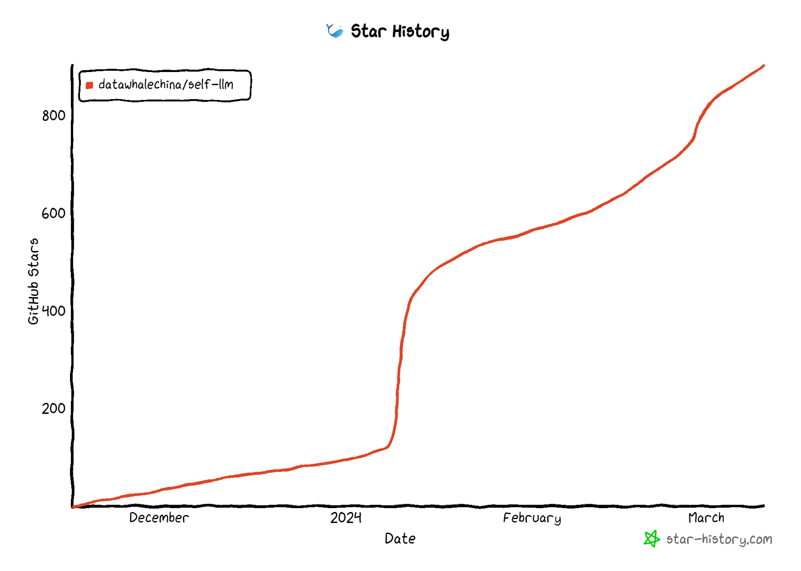

# 开源大模型食用指南

## 项目简介

&emsp;&emsp;本项目是一个围绕开源大模型、针对国内初学者、基于 AutoDL 平台的中国宝宝专属大模型教程，针对各类开源大模型提供包括环境配置、本地部署、高效微调等技能在内的全流程指导，简化开源大模型的部署、使用和应用流程，让更多的普通学生、研究者更好地使用开源大模型，帮助开源、自由的大模型更快融入到普通学习者的生活中。

&emsp;&emsp;本项目的主要内容包括：

  1. 基于 AutoDL 平台（可扩展，例如阿里云）的开源 LLM 环境配置指南，针对不同模型要求提供不同的详细环境配置步骤；
  2. 针对国内外主流开源 LLM 的部署使用教程，包括 LLaMA、ChatGLM、InternLM 等； 
  3. 开源 LLM 的部署应用指导，包括命令行调用、在线 Demo 部署、LangChain 框架集成等；
  4. 开源 LLM 的全量微调、高效微调方法，包括分布式全量微调、LoRA、ptuning 等。

&emsp;&emsp;**项目的主要内容就是教程，让更多的学生和未来的从业者了解和熟悉开源大模型的食用方法！任何人都可以提出issue或是提交PR，共同构建维护这个项目。**

&emsp;&emsp;想要深度参与的同学可以联系我们，我们会将你加入到项目的维护者中。

## 项目意义

&emsp;&emsp;什么是大模型？

>大模型（LLM）狭义上指基于深度学习算法进行训练的自然语言处理（NLP）模型，主要应用于自然语言理解和生成等领域，广义上还包括机器视觉（CV）大模型、多模态大模型和科学计算大模型等。

&emsp;&emsp;百模大战正值火热，开源 LLM 层出不穷。如今国内外已经涌现了众多优秀开源 LLM，国外如 LLaMA、Alpaca，国内如 ChatGLM、BaiChuan、InternLM（书生·浦语）等。开源 LLM 支持用户本地部署、私域微调，每一个人都可以在开源 LLM 的基础上打造专属于自己的独特大模型。

&emsp;&emsp;然而，当前普通学生和用户想要使用这些大模型，需要具备一定的技术能力，才能完成模型的部署和使用。对于层出不穷又各有特色的开源 LLM，想要快速掌握一个开源 LLM 的应用方法，是一项比较有挑战的任务。

&emsp;&emsp;本项目旨在首先基于核心贡献者的经验，实现国内外主流开源 LLM 的部署、使用与微调教程；在实现主流 LLM 的相关部分之后，我们希望充分聚集共创者，一起丰富这个开源 LLM 的世界，打造更多、更全面特色 LLM 的教程。星火点点，汇聚成海。

&emsp;&emsp;***我们希望成为 LLM 与普罗大众的阶梯，以自由、平等的开源精神，拥抱更恢弘而辽阔的 LLM 世界。***

## 项目受众

&emsp;&emsp;本项目适合以下学习者：

* 想要使用或体验 LLM，但无条件获得或使用相关 API；
* 希望长期、低成本、大量应用 LLM；
* 对开源 LLM 感兴趣，想要亲自上手开源 LLM；
* NLP 在学，希望进一步学习 LLM；
* 希望结合开源 LLM，打造领域特色的私域 LLM；
* 以及最广大、最普通的学生群体。

## 项目规划及进展

&emsp;&emsp; 本项目拟围绕开源 LLM 应用全流程组织，包括环境配置及使用、部署应用、微调等，每个部分覆盖主流及特点开源 LLM：

### 已支持模型

- [谷歌-Gemma](https://huggingface.co/google/gemma-7b-it)
  - [ ] gemma-7b-it FastApi 部署调用 @东东 ddl=3月底
  - [ ] gemma-7b-it langchain 接入 @东东 ddl=3月底
  - [ ] gemma-7b-it WebDemo 部署 @东东 ddl=3月底
  - [ ] gemma-7b-it Peft Lora 微调 @东东 ddl=3月底

- [DeepSeek 深度求索](https://github.com/deepseek-ai/DeepSeek-LLM)
  - [x] [DeepSeek-7B-chat FastApi 部署调用](./DeepSeek/01-DeepSeek-7B-chat%20FastApi.md) @ 不要葱姜蒜
  - [x] [DeepSeek-7B-chat langchain 接入](./DeepSeek/02-DeepSeek-7B-chat%20langchain.md) @ 不要葱姜蒜
  - [x] [DeepSeek-7B-chat WebDemo](./DeepSeek/03-DeepSeek-7B-chat%20WebDemo.md) @ 不要葱姜蒜
  - [x] [DeepSeek-7B-chat Lora 微调](./DeepSeek/04-DeepSeek-7B-chat%20Lora%20微调.md) @ 不要葱姜蒜
  - [x] [DeepSeek-7B-chat 4bits量化 Qlora 微调](./DeepSeek/05-DeepSeek-7B-chat%204bits量化%20Qlora%20微调.md) @ 不要葱姜蒜
  - [x] [DeepSeek-MoE-16b-chat Transformers 部署调用](./DeepSeek/06-DeepSeek-MoE-16b-chat%20Transformer部署调用.md) @Kailigithub
  - [x] [DeepSeek-MoE-16b-chat FastApi 部署调用](./DeepSeek/06-DeepSeek-MoE-16b-chat%20FastApi.md) @Kailigithub
  - [x] [DeepSeek-coder-6.7b finetune colab](./DeepSeek/07-deepseek_fine_tune.ipynb) @[Swiftie](https://github.com/cswangxiaowei)
  - [x] [Deepseek-coder-6.7b webdemo colab](./DeepSeek/08-deepseek_web_demo.ipynb) @[Swiftie](https://github.com/cswangxiaowei)

- [Qwen 1.5](https://github.com/QwenLM/Qwen1.5.git)
  - [x] [Qwen1.5-7B-chat FastApi 部署调用](./Qwen1.5/01-Qwen1.5-7B-Chat%20FastApi%20部署调用.md) @颜鑫
  - [x] [Qwen1.5-7B-chat langchain 接入](./Qwen1.5/02-Qwen1.5-7B-Chat%20接入langchain搭建知识库助手.md) @颜鑫
  - [x] [Qwen1.5-7B-chat WebDemo 部署](./Qwen1.5/03-Qwen1.5-7B-Chat%20WebDemo.md) @颜鑫
  - [x] [Qwen1.5-7B-chat Lora 微调](./Qwen1.5/04-Qwen1.5-7B-chat%20Lora%20微调.md) @不要葱姜蒜

- [MiniCPM](https://github.com/OpenBMB/MiniCPM.git)
  - [x] [MiniCPM-2B-chat transformers 部署调用](./MiniCPM/MiniCPM-2B-chat%20transformers%20部署调用.md) @Kailigithub 
  - [x] [MiniCPM-2B-chat FastApi 部署调用](./MiniCPM/MiniCPM-2B-chat%20FastApi%20部署调用.md) @Kailigithub 
  - [x] [MiniCPM-2B-chat langchain 接入](./MiniCPM/MiniCPM-2B-chat%20langchain接入.md) @不要葱姜蒜 
  - [x] [MiniCPM-2B-chat webdemo 部署](./MiniCPM/MiniCPM-2B-chat%20WebDemo部署.md) @Kailigithub 
  - [x] [MiniCPM-2B-chat Lora && Full 微调](./MiniCPM/MiniCPM-2B-chat%20Lora%20&&%20Full%20微调.md) @不要葱姜蒜 

- [ChatGLM3](https://github.com/THUDM/ChatGLM3.git)
  - [x] [ChatGLM3-6B Transformers 部署调用](./ChatGLM/01-ChatGLM3-6B%20Transformer部署调用.md) @丁悦 ddl=12.2
  - [x] [ChatGLM3-6B FastApi 部署调用](./ChatGLM/02-ChatGLM3-6B%20FastApi部署调用.md) @丁悦 ddl=12.2
  - [x] [ChatGLM3-6B chat WebDemo](ChatGLM/03-ChatGLM3-6B-chat.md) @不要葱姜蒜
  - [x] [ChatGLM3-6B Code Interpreter WebDemo](ChatGLM/04-ChatGLM3-6B-Code-Interpreter.md) @不要葱姜蒜
  - [x] [ChatGLM3-6B 接入 LangChain 框架](ChatGLM/05-ChatGLM3-6B接入LangChain搭建知识库助手.md) @ Logan Zou
  - [x] [ChatGLM3-6B Lora 微调](ChatGLM/06-ChatGLM3-6B-Lora微调.md) @ Hongru0306

- [Qwen-Audio](https://github.com/QwenLM/Qwen-Audio.git)
  - [x] [Qwen-Audio FastApi 部署调用](./Qwen-Audio/01-Qwen-Audio-chat%20FastApi.md) @ jjyaoao
  - [x] [Qwen-Audio WebDemo](./Qwen-Audio/02-Qwen-Audio-chat%20WebDemo.md) @ jjyaoao

- [Qwen](https://github.com/QwenLM/Qwen.git)
  - [x] [Qwen-7B-chat Transformers 部署调用](./Qwen/01-Qwen-7B-Chat%20Transformers部署调用.md) @娇娇 ddl=12.2
  - [x] [Qwen-7B-chat FastApi 部署调用](./Qwen/02-Qwen-7B-Chat%20FastApi%20部署调用.md) @娇娇 ddl=12.2
  - [x] [Qwen-7B-chat WebDemo](./Qwen/03-Qwen-7B-Chat%20WebDemo.md) @娇娇 ddl=12.2
  - [x] [Qwen-7B-chat Lora 微调](./Qwen/04-Qwen-7B-Chat%20Lora%20微调.md) @ 不要葱姜蒜
  - [x] [Qwen-7B-chat ptuning 微调](./Qwen/05-Qwen-7B-Chat%20Ptuning%20微调.md) @ Hongru0306
  - [x] [Qwen-7B-chat 全量微调](./Qwen/06-Qwen-7B-chat%20全量微调.md) @不要葱姜蒜
  - [x] [Qwen-7B-Chat 接入langchain搭建知识库助手](./Qwen/07-Qwen-7B-Chat%20接入langchain搭建知识库助手.md) @娇娇
  - [x] [Qwen-7B-chat 低精度训练](./Qwen/08-Qwen-7B-Chat%20Lora%20低精度微调.md) @ Hongru0306 ddl=12.11
  - [x] [Qwen-1_8B-chat CPU 部署](./Qwen/09-Qwen-1_8B-chat%20CPU%20部署%20.md) @ 散步

- [Yi 零一万物](https://github.com/01-ai/Yi.git)
  - [x] [Yi-6B-chat FastApi 部署调用](./Yi/01-Yi-6B-Chat%20FastApi%20部署调用.md) @ Joe ddl=12.15
  - [x] [Yi-6B-chat langchain接入](./Yi/02-Yi-6B-Chat%20接入langchain搭建知识库助手.md) @ Joe ddl=12.15
  - [x] [Yi-6B-chat WebDemo](./Yi/03-Yi-6B-chat%20WebDemo.md) @ Hongru0306 ddl=12.15
  - [x] [Yi-6B-chat Lora 微调](./Yi/04-Yi-6B-Chat%20Lora%20微调.md) @ 娇娇 ddl=12.15

- [Baichuan 百川智能](https://www.baichuan-ai.com/home)
  - [x] [Baichuan2-7B-chat FastApi 部署调用](./BaiChuan/01-Baichuan2-7B-chat%2BFastApi%2B%E9%83%A8%E7%BD%B2%E8%B0%83%E7%94%A8.md) @ 三山时春い ddl=12.15
  - [x] [Baichuan2-7B-chat WebDemo](./BaiChuan/02-Baichuan-7B-chat%2BWebDemo.md) @ 三山时春いddl=12.15
  - [x] [Baichuan2-7B-chat 接入 LangChain 框架](./BaiChuan/03-Baichuan2-7B-chat%E6%8E%A5%E5%85%A5LangChain%E6%A1%86%E6%9E%B6.md) @ 三山时春いddl=12.15
  - [x] [Baichuan2-7B-chat Lora 微调](./BaiChuan/04-Baichuan2-7B-chat%2Blora%2B%E5%BE%AE%E8%B0%83.md) @ 三山时春いddl=12.15

- [InternLM](https://github.com/InternLM/InternLM.git)
  - [x] [InternLM-Chat-7B Transformers 部署调用](./InternLM/01-InternLM-Chat-7B%20Transformers%20部署调用.md) @小罗 ddl=11.26
  - [x] [InternLM-Chat-7B FastApi 部署调用](InternLM/02-internLM-Chat-7B%20FastApi.md) @不要葱姜蒜
  - [x] [InternLM-Chat-7B WebDemo](InternLM/03-InternLM-Chat-7B.md) @不要葱姜蒜
  - [x] [Lagent+InternLM-Chat-7B-V1.1 WebDemo](InternLM/04-Lagent+InternLM-Chat-7B-V1.1.md) @不要葱姜蒜
  - [x] [浦语灵笔图文理解&创作 WebDemo](InternLM/05-浦语灵笔图文理解&创作.md) @不要葱姜蒜
  - [x] [InternLM-Chat-7B 接入 LangChain 框架](InternLM/06-InternLM接入LangChain搭建知识库助手.md) @ Logan Zou

- [Atom (llama2)](https://hf-mirror.com/FlagAlpha/Atom-7B-Chat)
  - [x] [Atom-7B-chat WebDemo](./Atom/01-Atom-7B-chat-WebDemo.md) @凯立 ddl=11.24
  - [x] [Atom-7B-chat Lora](./Atom/02-Atom-7B-Chat%20Lora%20微调.md) 微调 @ Logan Zou
  - [x] [Atom-7B-Chat 接入langchain搭建知识库助手](./Atom/03-Atom-7B-Chat%20接入langchain搭建知识库助手.md) @ jjyaoao
  - [x] [Atom-7B-chat 全量微调](./Atom/04-Atom-7B-chat%20全量微调.md) @ Logan Zou

### 通用环境配置

- [x] [pip、conda 换源](./General-Setting/01-pip、conda换源.md) @不要葱姜蒜
- [x] [AutoDL 开放端口](./General-Setting/02-AutoDL开放端口.md) @不要葱姜蒜

- 模型下载
  - [x] [hugging face](./General-Setting/03-模型下载.md) @不要葱姜蒜
  - [x] [hugging face](./General-Setting/03-模型下载.md) 镜像下载 @不要葱姜蒜
  - [x] [modelscope](./General-Setting/03-模型下载.md) @不要葱姜蒜
  - [x] [git-lfs](./General-Setting/03-模型下载.md) @不要葱姜蒜
  - [x] [Openxlab](./General-Setting/03-模型下载.md)
- Issue && PR
  - [x] [Issue 提交](./General-Setting/04-Issue&PR&update.md) @ Hongru0306
  - [x] [PR 提交](./General-Setting/04-Issue&PR&update.md) @ Hongru0306
  - [x] [fork更新](./General-Setting/04-Issue&PR&update.md) @ Hongru0306

## 致谢

### 核心贡献者

- [宋志学(不要葱姜蒜)-项目负责人](https://github.com/KMnO4-zx) （Datawhale成员-河南理工大学）
- [邹雨衡-项目负责人](https://github.com/logan-zou) （Datawhale成员-对外经济贸易大学）
- [肖鸿儒](https://github.com/Hongru0306) （Datawhale成员-同济大学）
- [李娇娇](https://github.com/Aphasia0515) （Datawhale成员）
- [小罗](https://github.com/lyj11111111) （Datawhale成员）
- [丁悦](https://github.com/dingyue772) （Datawhale-鲸英助教）
- [Kailigithub](https://github.com/Kailigithub) （Datawhale成员）
- [陈思州](https://github.com/jjyaoao) （Datawhale成员）
- [李柯辰](https://github.com/Joe-2002) （Datawhale成员）
- [散步](https://github.com/sanbuphy) （Datawhale成员）
- [惠佳豪](https://github.com/L4HeyXiao) （Datawhale-宣传大使）
- [颜鑫](https://github.com/thomas-yanxin) （Datawhale成员）
- [Swiftie](https://github.com/cswangxiaowei) （小米NLP算法工程师）
### 其他

- 特别感谢[@Sm1les](https://github.com/Sm1les)对本项目的帮助与支持
- 部分lora代码和讲解参考仓库：https://github.com/zyds/transformers-code.git
- 如果有任何想法可以联系我们 DataWhale 也欢迎大家多多提出 issue
- 特别感谢以下为教程做出贡献的同学！

  

### Star History

  

