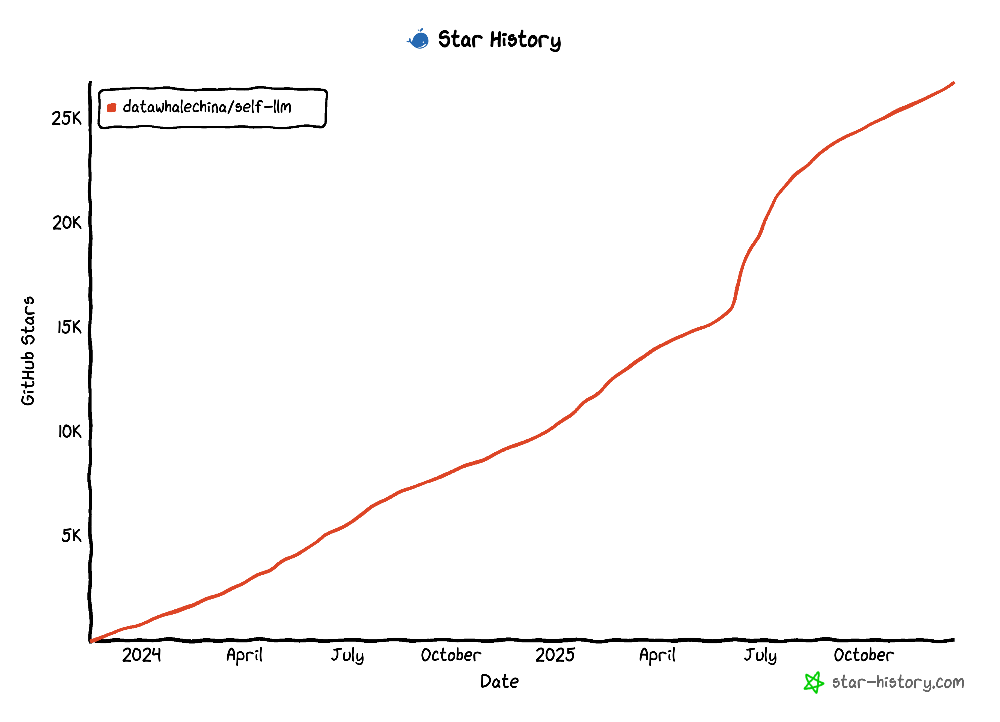

  
  <h1>Open Source Large Model Usage Guide</h1>

[中文](./README.md) | English

&emsp;&emsp;This project is a Chinese baby's exclusive large model tutorial based on the Linux platform, focusing on open source large models for domestic beginners. It provides full-process guidance including environment configuration, local deployment, and efficient fine-tuning for various open source large models. It simplifies the deployment, usage, and application processes of open source large models, enabling more ordinary students and researchers to better use open source large models, and helping open source and free large models to integrate into the lives of ordinary learners faster.

&emsp;&emsp;The main contents of this project include:

  1. Open source LLM environment configuration guide based on Linux platform, providing different detailed environment configuration steps according to different model requirements;
  2. Deployment and usage tutorials for mainstream open source LLMs at home and abroad, including LLaMA, ChatGLM, InternLM, etc.;
  3. Open source LLM deployment and application guidance, including command-line invocation, online Demo deployment, LangChain framework integration, etc.;
  4. Full fine-tuning and efficient fine-tuning methods for open source LLMs, including distributed full fine-tuning, LoRA, ptuning, etc.

&emsp;&emsp;**The main content of this project is tutorials, letting more students and future practitioners understand and become familiar with the usage methods of open source large models! Anyone can raise issues or submit PRs to jointly build and maintain this project.**

&emsp;&emsp;Students who want to participate deeply can contact us, and we will add you to the project maintainers.

> &emsp;&emsp;***Learning suggestions: The learning suggestion for this project is to first learn environment configuration, then learn model deployment and usage, and finally learn fine-tuning. Because environment configuration is the foundation, model deployment and usage are the basics, and fine-tuning is advanced. Beginners can choose models like Qwen1.5, InternLM2, MiniCPM, etc. for priority learning.***

> &emsp;&emsp;**Advanced Learning Recommendation**: After studying this project, if you wish to understand the core principles of large language models more deeply and desire to train your own large model from scratch, we highly recommend focusing on another open source project from Datawhale — [Happy-LLM: A Beginner's Guide to Large Language Model Principles and Practice from Scratch](https://github.com/datawhalechina/happy-llm). This project will take you deep into exploring the underlying mechanisms of large models and mastering the complete training process.

> Note: If some students want to understand the model composition of large models and write RAG, Agent, and Eval tasks from scratch, they can learn from another Datawhale project [Tiny-Universe](https://github.com/datawhalechina/tiny-universe). Large models are currently a hot topic in the deep learning field, but most existing large model tutorials only teach how to call APIs to complete large model applications. Few people can clearly explain model structures, RAG, Agent, and Eval from a principled perspective. Therefore, this repository will provide all handwritten content without using API calls to complete RAG, Agent, and Eval tasks for large models.

> Note: Considering that some students hope to learn the theoretical part of large models before studying this project, if they want to further learn the theoretical foundation of LLM and further understand and apply LLM based on theory, they can refer to Datawhale's [so-large-llm](https://github.com/datawhalechina/so-large-lm.git) course.

> Note: If students want to develop large model applications themselves after studying this course. Students can refer to Datawhale's [Hands-on Large Model Application Development](https://github.com/datawhalechina/llm-universe) course. This project is a large model application development tutorial for novice developers, aiming to present the complete large model application development process to students based on Alibaba Cloud servers combined with a personal knowledge base assistant project.

## Project Significance

&emsp;&emsp;What are large models?

>Large models (LLM) narrowly refer to natural language processing (NLP) models trained based on deep learning algorithms, mainly applied in fields such as natural language understanding and generation. Broadly, they also include computer vision (CV) large models, multimodal large models, and scientific computing large models.

&emsp;&emsp;The "Hundred Models Battle" is in full swing, and open source LLMs are emerging endlessly. Today, many excellent open source LLMs have emerged both domestically and internationally, such as LLaMA and Alpaca abroad, and ChatGLM, BaiChuan, InternLM (Shusheng·Puyu) domestically. Open source LLMs support local deployment and private fine-tuning, allowing everyone to create their own unique large model based on open source LLMs.

&emsp;&emsp;However, for ordinary students and users to use these large models, certain technical capabilities are required to complete model deployment and usage. For the numerous and distinctive open source LLMs, it is a challenging task to quickly master the application methods of an open source LLM.

&emsp;&emsp;This project aims to first implement deployment, usage, and fine-tuning tutorials for mainstream open source LLMs at home and abroad based on the experience of core contributors. After implementing relevant parts for mainstream LLMs, we hope to fully gather co-creators to enrich this open source LLM world and create more comprehensive tutorials for characteristic LLMs. Sparks gather to form a sea.

&emsp;&emsp;***We hope to become a ladder between LLMs and the general public, embracing a more magnificent and vast LLM world with a spirit of freedom and equality in open source.***

## Target Audience

&emsp;&emsp;This project is suitable for the following learners:

* Students who want to use or experience LLMs but have no conditions to obtain or use relevant APIs;
* Students who hope to apply LLMs long-term, low-cost, and in large quantities;
* Students interested in open source LLMs and want to personally work with open source LLMs;
* NLP students who hope to further study LLMs;
* Students who hope to combine open source LLMs to create domain-specific private LLMs;
* And the largest and most ordinary student population.

## Project Planning and Progress

&emsp;&emsp;This project is organized around the entire process of open source LLM application, including environment configuration and usage, deployment applications, fine-tuning, etc. Each part covers mainstream and characteristic open source LLMs:

### Example Series

- [Chat-Huanhuan](./examples/Chat-嬛嬛/readme.md): Chat-Zhenhuan is a chat language model that imitates Zhenhuan's tone, obtained by LoRA fine-tuning based on LLM using all lines and dialogues about Zhenhuan from the "Legend of Zhenhuan" script.

- [Tianji](./examples/Tianji-天机/readme.md): Tianji is a comprehensive large language model system application tutorial covering social scenarios based on interpersonal relationships, including prompt engineering, intelligent agent creation, data acquisition and model fine-tuning, RAG data cleaning and usage, etc.

- [AMChat](./examples/AMchat-高等数学/readme.md): AM (Advanced Mathematics) chat is a large language model that integrates mathematical knowledge and advanced mathematics exercises and their solutions. This model uses a dataset fused with mathematics and advanced mathematics exercises and their analysis, based on the InternLM2-Math-7B model, fine-tuned through xtuner, specifically designed to answer advanced mathematics problems.

- [Digital Life](./examples/数字生命/readme.md): This project will use me as a prototype, utilizing a specially crafted dataset to fine-tune a large language model, dedicated to creating an AI digital persona that can truly reflect my personality traits—including but not limited to my tone, expression patterns, and thinking modes. Therefore, whether it's daily chat or sharing emotions, it communicates in a familiar and comfortable way, as if I were right there with them. The entire process is transferable and replicable, with dataset creation as the highlight.

### Supported Models

  <strong>✨ 50+ Mainstream Large Language Models Supported ✨</strong> 
  <em>Each model provides complete deployment, fine-tuning, and usage tutorials</em> 
  📖 <strong><a href="./support_model.md">View complete model list and tutorials</a></strong> |
  🎯 <strong><a href="#通用环境配置">Quick Start</a></strong>

<table align="center">
  <tr>
    <td valign="top" width="25%">
      • <a href="./support_model.md#gemma3">Gemma3</a> 
      • <a href="./support_model.md#minimax-m2">MiniMax-M2</a> 
      • <a href="./support_model.md#qwen3">Qwen3</a> 
      • <a href="./support_model.md#qwen3-vl-4b-instruct">Qwen3-VL</a> 
      • <a href="./support_model.md#spatiallm">SpatialLM</a> 
      • <a href="./support_model.md#hunyuan3d-2">Hunyuan3D-2</a> 
      • <a href="./support_model.md#qwen2-vl">Qwen2-VL</a> 
      • <a href="./support_model.md#minicpm-o-2_6">MiniCPM-o</a> 
      • <a href="./support_model.md#qwen25-coder">Qwen2.5-Coder</a> 
      • <a href="./support_model.md#deepseek-coder-v2">DeepSeek-Coder-V2</a> 
      • <a href="./support_model.md#gpt-oss-20b">gpt-oss-20b</a> 
      • <a href="./support_model.md#glm-41-thinking">GLM-4.1-Thinking</a>
    </td>
    <td valign="top" width="25%">
      • <a href="./support_model.md#deepseek-r1-distill">DeepSeek-R1</a> 
      • <a href="./support_model.md#internlm3">InternLM3</a> 
      • <a href="./support_model.md#phi4">phi4</a> 
      • <a href="./support_model.md#glm-45-air">GLM-4.5-Air</a> 
      • <a href="./support_model.md#hunyuan-a13b-instruct">Hunyuan-A13B</a> 
      • <a href="./support_model.md#deepseek-深度求索">DeepSeek</a> 
      • <a href="./support_model.md#baichuan-百川智能">Baichuan</a> 
      • <a href="./support_model.md#internlm">InternLM</a> 
      • <a href="./support_model.md#kimi">Kimi</a> 
      • <a href="./support_model.md#ernie-45">ERNIE-4.5</a> 
      • <a href="./support_model.md#llama4">Llama4</a> 
      • <a href="./support_model.md#apple-openelm">Apple OpenELM</a>
    </td>
    <td valign="top" width="25%">
      • <a href="./support_model.md#llama31-8b-instruct">Llama3.1</a> 
      • <a href="./support_model.md#gemma-2-9b-it">Gemma-2</a> 
      • <a href="./support_model.md#qwen25">Qwen2.5</a> 
      • <a href="./support_model.md#qwen2">Qwen2</a> 
      • <a href="./support_model.md#glm-4">GLM-4</a> 
      • <a href="./support_model.md#qwen-15">Qwen 1.5</a> 
      • <a href="./support_model.md#phi-3">phi-3</a> 
      • <a href="./support_model.md#minicpm">MiniCPM</a> 
      • <a href="./support_model.md#yi-零一万物">Yi 零一万物</a> 
      • <a href="./support_model.md#yuan20">Yuan2.0</a> 
      • <a href="./support_model.md#yuan20-m32">Yuan2.0-M32</a> 
      • <a href="./support_model.md#哔哩哔哩-index-19b">Bilibili Index</a>
    </td>
    <td valign="top" width="25%">
      • <a href="./support_model.md#characterglm-6b">CharacterGLM</a> 
      • <a href="./support_model.md#bluelm-vivo-蓝心大模型">BlueLM</a> 
      • <a href="./support_model.md#qwen-audio">Qwen-Audio</a> 
      • <a href="./support_model.md#transnormerllm">TransNormerLLM</a> 
      • <a href="./support_model.md#atom-llama2">Atom</a> 
      • <a href="./support_model.md#chatglm3">ChatGLM3</a> 
      • <a href="./support_model.md#qwen2-57b-a14b-instruct">Qwen2-57B-A14B-Instruct</a> 
      • <a href="./support_model.md#qwen2-72b-instruct">Qwen2-72B-Instruct</a> 
      • <a href="./support_model.md#qwen2-7b-instruct">Qwen2-7B-Instruct</a> 
      • <a href="./support_model.md#internlm2-20b">InternLM2-20B</a> 
      • <a href="./support_model.md#tele-chat">Tele-Chat</a> 
      • <a href="./support_model.md#xverse2">XVERSE2</a>
    </td>
  </tr>
</table>

### AMD GPU Section

  <strong>🚀 AMD GPU Platform Supported Models</strong> 
  <em>Each model provides complete AMD environment configuration and deployment tutorials</em> 
  <em>Thanks to AMD University Program for supporting this project</em> 
  📖 <strong><a href="./support_model_amd.md">View complete AMD platform model list and tutorials</a></strong> 

<table align="center">
  <tr>
    <td valign="top" width="50%">
      • <a href="./support_model_amd.md#谷歌-gemma3">Google Gemma3</a> 
      • AMD Environment Preparation and Configuration 
      • NPU Inference Acceleration Support
    </td>
    <td valign="top" width="50%">
      • <a href="./support_model_amd.md#qwen3">Qwen3</a> 
      • lemonade-server SDK Deployment 
      • Ryzen AI 300 Series Optimization
    </td>
  </tr>
</table>

### Ascend NPU Section 
 
 
 
 
   <strong>🚀 Ascend NPU Platform Supported Models</strong>  
   <em>Each model provides complete Ascend NPU environment configuration and deployment tutorials</em>  
   📖 <strong><a href="./support_model_Ascend.md">View Complete Ascend NPU Platform Model List and Tutorials</a></strong>  
 
 
 
 
 <table align="center"> 
   <tr> 
     <td valign="top" width="50%"> 
       • <a href="./support_model_Ascend.md#qwen3">Qwen3</a>  
       • Ascend NPU Environment Configuration General Guidelines  
       • Ascend NPU LLM Inference Performance Optimization Suggestions 
     </td>
     <td valign="top" width="50%">
       • <a href="./support_model_Ascend.md#大模型服务化性能和精度测试">LLM Service Performance and Accuracy Testing</a> 
       • AISBench Testing Tool Environment Configuration 
       • Ascend LLM Service Performance and Accuracy Testing
     </td>
     </td>
   </tr> 
 </table>

### Apple M Section

  📖 <strong><a href="./models_mlx/README_en.md">Click to go to Apple M Section</a></strong> 

### Other Platforms ...

- 🚀 Coming soon: Support for more platforms (such as Apple M-series chips, etc.) environment configuration and model deployment tutorials, stay tuned!
- 🤝 We warmly welcome developers from all walks of life to contribute environment configuration and model deployment tutorials for different platforms, enabling large model technology to thrive on more hardware platforms!

## Acknowledgments

### Core Contributors

- [Song Zhixue (KMnO4-zx) - Project Leader](https://github.com/KMnO4-zx) (Datawhale Member)
- [Zou Yuheng - Project Leader](https://github.com/logan-zou) (Datawhale Member - University of International Business and Economics)
- [Jiang Shufan](https://github.com/Tsumugii24) (Content Creator - Datawhale Member)
- [Guo Xuanbo](https://github.com/Twosugar666) (Content Creator - Beihang University)
- [Lin Zeyi](https://github.com/Zeyi-Lin) (Content Creator - SwanLab Product Manager)
- [Lin Hengyu](https://github.com/LINHYYY) (Content Creator - Guangdong Neusoft Institute - Whale Elite Teaching Assistant)
- [Wang Zeyu](https://github.com/moyitech) (Content Creator - Taiyuan University of Technology - Whale Elite Teaching Assistant)
- [Guo Zhihang](https://github.com/acwwt) (Content Creator)
- [Chen Yu](https://github.com/LucaChen) (Content Creator - Google Developer Machine Learning Technical Expert)
- [Xiao Hongru](https://github.com/Hongru0306) (Datawhale Member - Tongji University)
- [Zhang Fan](https://github.com/zhangfanTJU) (Content Creator - Datawhale Member)
- [Li Jiaojiao](https://github.com/Aphasia0515) (Datawhale Member)
- [Gao Liye](https://github.com/0-yy-0) (Content Creator - DataWhale Member)
- [Kailigithub](https://github.com/Kailigithub) (Datawhale Member)
- [Ding Yue](https://github.com/dingyue772) (Datawhale - Whale Elite Teaching Assistant)
- [Hui Jiahao](https://github.com/L4HeyXiao) (Datawhale - Ambassador)
- [Wang Maolin](https://github.com/mlw67) (Content Creator - Datawhale Member)
- [Sun Jianzhuang](https://github.com/Caleb-Sun-jz) (Content Creator - University of International Business and Economics)
- [Zheng Haohua](https://github.com/BaiYu96) (Content Creator)
- [Qiaomai](https://github.com/yeyeyeyeeeee) (Content Creator - Datawhale Member)
- [Luo Xiutao](https://github.com/anine09) (Content Creator - Datawhale Member - Likelihood Lab)
- [Li Kechen](https://github.com/Joe-2002) (Datawhale Member)
- [Cheng Hong](https://github.com/chg0901) (Content Creator - Datawhale Prospective Member)
- [Xie Haoran](https://github.com/ilovexsir) (Content Creator - Whale Elite Teaching Assistant)
- [Li Xiuqi](https://github.com/li-xiu-qi) (Content Creator - DataWhale Prospective Member)
- [Chen Sizhou](https://github.com/jjyaoao) (Datawhale Member)
- [Yan Xin](https://github.com/thomas-yanxin) (Datawhale Member)
- [Du Sen](https://github.com/study520ai520) (Content Creator - Datawhale Member - Nanyang Institute of Technology)
- [Sanbu](https://github.com/sanbuphy) (Datawhale Member)
- [Swiftie](https://github.com/cswangxiaowei) (Xiaomi NLP Algorithm Engineer)
- [Zhang Youdong](https://github.com/AXYZdong) (Content Creator - Datawhale Member)
- [Zhang Jin](https://github.com/Jin-Zhang-Yaoguang) (Content Creator - Datawhale Member)
- [Lou Tian'ao](https://github.com/lta155) (Content Creator - University of Chinese Academy of Sciences - Whale Elite Teaching Assistant)
- [Xiao Luo](https://github.com/lyj11111111) (Content Creator - Datawhale Member)
- [Deng Kaijun](https://github.com/Kedreamix) (Content Creator - Datawhale Member)
- [Zhao Wenkai](https://github.com/XiLinky) (Content Creator - Taiyuan University of Technology - Whale Elite Teaching Assistant)
- [Wang Yiming](https://github.com/Bald0Wang) (Content Creator - Datawhale Member)
- [Huang Baite](https://github.com/KashiwaByte) (Content Creator - Xidian University)
- [Yu Yang](https://github.com/YangYu-NUAA) (Content Creator - Datawhale Member)
- [Zuo Chunsheng](https://github.com/LinChentang) (Content Creator - Datawhale Member)
- [Yang Zhuo](https://github.com/little1d) (Content Creator - Xidian University - Whale Elite Teaching Assistant)
- [Fu Zhiyuan](https://github.com/comfzy) (Content Creator - Hainan University)
- [Zheng Yuanjing](https://github.com/isaacahahah) (Content Creator - Whale Elite Teaching Assistant - Fuzhou University)
- [Tan Yike](https://github.com/LikeGiver) (Content Creator - University of International Business and Economics)
- [He Zhixuan](https://github.com/pod2c) (Content Creator - Whale Elite Teaching Assistant)
- [Kang Jingqi](https://github.com/jodie-kang) (Content Creator - Datawhale Member)
- [Sanshui](https://github.com/sssanssss) (Content Creator - Whale Elite Teaching Assistant)
- [Yang Chenxu](https://github.com/langlibai66) (Content Creator - Taiyuan University of Technology - Whale Elite Teaching Assistant)
- [Zhao Wei](https://github.com/2710932616) (Content Creator - Whale Elite Teaching Assistant)
- [Su Xiangbiao](https://github.com/gzhuuser) (Content Creator - Guangzhou University - Whale Elite Teaching Assistant)
- [Chen Rui](https://github.com/riannyway) (Content Creator - Xi'an Jiaotong-Liverpool University - Whale Elite Teaching Assistant)
- [Zhang Longfei](https://github.com/Feimike09) (Content Creator - Whale Elite Teaching Assistant)
- [Sun Chao](https://github.com/anarchysaiko) (Content Creator - Datawhale Member)
- [Fan Qi](https://github.com/fanqiNO1) (Content Creator - Shanghai Jiao Tong University)
- [Zhuo Tangyue](https://github.com/nusakom) (Content Creator - Whale Elite Teaching Assistant)
- [fancy](https://github.com/fancyboi999) (Content Creator - Whale Elite Teaching Assistant)

> Note: Ranking is based on contribution level

### Others

- Special thanks to [@Sm1les](https://github.com/Sm1les) for their help and support for this project
- Thanks to AMD University Program for supporting this project
- Some lora code and explanations reference repository: https://github.com/zyds/transformers-code.git
- If you have any ideas, you can contact DataWhale. We also welcome everyone to raise more issues
- Special thanks to the following students who contributed to the tutorials!

  

### Star History

  

