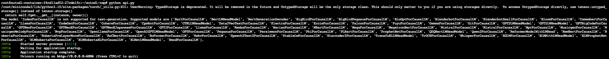

# Index-1.9B-chat FastApi 部署调用

## 环境准备

在 [AutoDL](https://www.autodl.com/) 平台中租一个 3090 等 24G 显存的显卡机器，如下图所示镜像选择 `PyTorch`-->`2.1.0`-->`3.10(ubuntu22.04)`-->`12.1`。


接下来打开刚刚租用服务器的 `JupyterLab`，并且打开其中的终端开始环境配置、模型下载和运行 `demo`。

pip 换源和安装依赖包。

```bash
# 升级pip
python -m pip install --upgrade pip
# 更换 pypi 源加速库的安装
pip config set global.index-url https://pypi.tuna.tsinghua.edu.cn/simple

pip install fastapi==0.104.1
pip install uvicorn==0.24.0.post1
pip install requests==2.32.3
pip install modelscope==1.9.5
pip install transformers==4.39.2
pip install streamlit==1.24.0
pip install sentencepiece==0.1.99
pip install accelerate==0.27.0
pip install tiktoken==0.7.0
pip install huggingface_hub==0.23.4
```


## 模型下载

由于`modelscope`暂无更新Index-1.9B模型，使用 `huggingface_hub` 中的 `snapshot_download` 函数下载模型，第一个参数为模型名称，参数 `cache_dir` 为模型的下载路径。

在 `/root/autodl-tmp` 路径下新建 `download.py` 文件并在其中输入以下内容，粘贴代码后记得保存文件。并运行 `python /root/autodl-tmp/download.py` 执行下载，模型大小为 8 GB，下载模型大概需要 10~20 分钟。

```python
# 使用镜像加快下载
import os
os.environ['HF_ENDPOINT'] = "https://hf-mirror.com"

import torch
from huggingface_hub import snapshot_download

model_dir = snapshot_download('IndexTeam/Index-1.9B-Chat', local_dir='/root/autodl-tmp/IndexTeam/Index-1.9B-Chat', resume_download=True)
```

> 由于huggingface下载较慢，可以使用autodl的学术资源加速，在运行`python /root/autodl-tmp/download.py` 下载前在终端输入`source /etc/network_turbo`，可参考[https://www.autodl.com/docs/network_turbo/](https://www.autodl.com/docs/network_turbo/)
>

## 代码准备

在 `/root/autodl-tmp` 路径下新建 `api.py` 文件并在其中输入以下内容，粘贴代码后记得保存文件。下面的代码有很详细的注释，大家如有不理解的地方，欢迎提出 issue。

```python
from fastapi import FastAPI, Request
from transformers import AutoTokenizer, AutoModelForCausalLM, pipeline
import uvicorn
import json
import datetime
import torch

# 设置设备参数
DEVICE = "cuda"  # 使用CUDA
DEVICE_ID = "0"  # CUDA设备ID，如果未设置则为空
CUDA_DEVICE = f"{DEVICE}:{DEVICE_ID}" if DEVICE_ID else DEVICE  # 组合CUDA设备信息

# 清理GPU内存函数
def torch_gc():
    if torch.cuda.is_available():  # 检查是否可用CUDA
        with torch.cuda.device(CUDA_DEVICE):  # 指定CUDA设备
            torch.cuda.empty_cache()  # 清空CUDA缓存
            torch.cuda.ipc_collect()  # 收集CUDA内存碎片

# 创建FastAPI应用
app = FastAPI()

# 处理POST请求的端点
@app.post("/")
async def create_item(request: Request):
    global model, tokenizer  # 声明全局变量以便在函数内部使用模型和分词器
    json_post_raw = await request.json()  # 获取POST请求的JSON数据
    json_post = json.dumps(json_post_raw)  # 将JSON数据转换为字符串
    json_post_list = json.loads(json_post)  # 将字符串转换为Python对象
    prompt = json_post_list.get('prompt')  # 获取请求中的提示
    history = json_post_list.get('history')  # 获取请求中的历史记录
    max_length = json_post_list.get('max_length')  # 获取请求中的最大长度
    top_p = json_post_list.get('top_p')  # 获取请求中的top_p参数
    top_k = json_post_list.get('top_k')  # 获取请求中的top_k参数
    temperature = json_post_list.get('temperature')  # 获取请求中的温度参数
    repetition_penalty = json_post_list.get('repetition_penalty')  # 获取请求中的重复惩罚参数
    
    model_input = []
    for q, a in history:
        model_input.append({"role": "user", "content": q})
        model_input.append({"role": "assistant", "content": a})
    model_input.append({"role": "user", "content": prompt})

    # 调用模型进行对话生成
    model_output = generator(
        model_input, 
        max_new_tokens=max_length if max_length else 1024,
        top_k=top_k if top_k else 5, # 如果未提供top_k参数，默认使用0.5
        top_p=top_p if top_p else 0.7,  # 如果未提供top_p参数，默认使用0.7
        temperature=temperature if temperature else 0.95,  # 如果未提供温度参数，默认使用0.95, 
        repetition_penalty=repetition_penalty if repetition_penalty else 1.1, # 如果未提供重复惩罚参数，默认使用1.1, 
        do_sample=True
    )
    response = model_output[0]['generated_text'][-1]['content']
    history.append([prompt, response])
    now = datetime.datetime.now()  # 获取当前时间
    time = now.strftime("%Y-%m-%d %H:%M:%S")  # 格式化时间为字符串
    # 构建响应JSON
    answer = {
        "response": response,
        "history": history,
        "status": 200,
        "time": time
    }
    # 构建日志信息
    log = "[" + time + "] " + '", prompt:"' + prompt + '", response:"' + repr(response) + '"'
    print(log)  # 打印日志
    torch_gc()  # 执行GPU内存清理
    return answer  # 返回响应

# 主函数入口
if __name__ == '__main__':
    # 加载预训练的分词器和模型
    tokenizer = AutoTokenizer.from_pretrained("/root/autodl-tmp/IndexTeam/Index-1.9B-Chat", trust_remote_code=True)
    generator = pipeline(
        "text-generation",
        model="/root/autodl-tmp/IndexTeam/Index-1.9B-Chat",
        tokenizer=tokenizer, 
        trust_remote_code=True, 
        device="cuda:0"
    )
    
    # 启动FastAPI应用
    # 用6006端口可以将autodl的端口映射到本地，从而在本地使用api
    uvicorn.run(app, host='0.0.0.0', port=6006, workers=1)  # 在指定端口和主机上启动应用
```

## Api 部署

在终端输入以下命令启动 `api` 服务。

```shell
cd /root/autodl-tmp
python api.py
```

终端出现以下结果表示启用 `api` 服务成功。



默认部署在 6006 端口，通过 POST 方法进行调用，可以重新开启一个终端使用 `curl` 调用，如下所示：

```shell
curl -X POST "http://127.0.0.1:6006" \
     -H 'Content-Type: application/json' \
     -d '{"prompt": "你好", "history": []}'
```

得到的返回值如下所示：

```json
{
  "response":"好！我是Index，一个由哔哩哔哩自主研发的大语言模型。我能够执行包括但不限于文本分类、实体标注、创意写作等多种自然语言处理任务，并能够广泛应用于多种场景，为文本处理需求提供强大的技术支持。如果您需要任何帮助，请随时告诉我。",
  "history":[["你好"," 您好！我是Index，一个由哔哩哔哩自主研发的大语言模型。我能够执行包括但不限于文本分类、实体标注、创意写作等多种自然语言处理任务，并能够广泛应用于多种场景，为文本处理需求提供强大的技术支持。如果您需要任何帮助，请随时告诉我。"]],
  "status":200,
  "time":"2024-06-15 22:02:28"
}
```

调用示例结果如下图所示：


也可以使用 python 中的 requests 库进行调用，如下所示：

```python
import requests
import json

def get_completion(prompt):
    headers = {'Content-Type': 'application/json'}
    data = {"prompt": prompt, "history": []}
    response = requests.post(url='http://127.0.0.1:6006', headers=headers, data=json.dumps(data))
    return response.json()['response']

if __name__ == '__main__':
    print(get_completion('你好，讲个幽默小故事'))
```

调用结果如下图所示：

