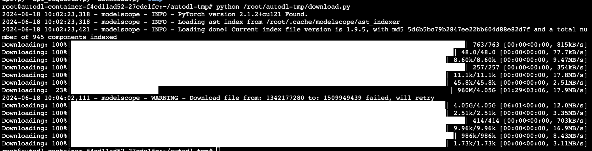

# Index-1.9B-Chat 接入 LangChain

## 环境准备  

在 [AutoDL](https://www.autodl.com/) 平台中租一个 3090 等 24G 显存的显卡机器，如下图所示镜像选择 `PyTorch`-->`2.1.0`-->`3.10(ubuntu22.04)`-->`12.1`。


接下来打开刚刚租用服务器的 `JupyterLab`，并且打开其中的终端开始环境配置、模型下载和运行 `demo`。

pip 换源和安装依赖包。

```shell
# 升级pip
python -m pip install --upgrade pip
# 更换 pypi 源加速库的安装
pip config set global.index-url https://pypi.tuna.tsinghua.edu.cn/simple

pip install modelscope==1.9.5
pip install langchain==0.2.3
pip install transformers==4.39.2 accelerate==0.27.0 tiktoken==0.7.0 einops scipy transformers_stream_generator==0.0.4 peft==0.10.0 deepspeed==0.14.3
pip install huggingface_hub==0.23.4
pip install sentencepiece==0.1.99
```


## 模型下载

使用 `modelscope` 中的 `snapshot_download` 函数下载模型，第一个参数为模型名称，参数 `cache_dir` 为模型的下载路径，参数`revision`为模型的版本，master代表主分支，为最新版本。

在 `/root/autodl-tmp` 路径下新建 `download.py` 文件并在其中输入以下内容，粘贴代码后记得保存文件，如下图所示。并运行 `python /root/autodl-tmp/download.py` 执行下载，模型大小为 8 GB，下载模型大概需要 5 钟。

```python
import torch
from modelscope import snapshot_download, AutoModel, AutoTokenizer
import os

model_dir = snapshot_download('IndexTeam/Index-1.9B-Chat', cache_dir='/root/autodl-tmp', revision='master')
```

终端出现下图结果表示下载成功。




## 代码准备

为便捷构建 LLM 应用，我们需要基于本地部署的 Index-LM，自定义一个 LLM 类，将 Index 接入到 LangChain 框架中。完成自定义 LLM 类之后，可以以完全一致的方式调用 LangChain 的接口，而无需考虑底层模型调用的不一致。

基于本地部署的 Index 自定义 LLM 类并不复杂，我们只需从 LangChain.llms.base.LLM 类继承一个子类，并重写构造函数与 _call 函数即可：

```python
from langchain.llms.base import LLM
from typing import Any, List, Optional
from langchain.callbacks.manager import CallbackManagerForLLMRun
from transformers import AutoTokenizer, AutoModelForCausalLM, GenerationConfig, LlamaTokenizerFast
import torch

class Index_LLM(LLM):  # 定义一个继承自LLM的Index_LLM类
    # 类变量，初始化为None，将在初始化方法中被赋值
    tokenizer: AutoTokenizer = None
    model: AutoModelForCausalLM = None
        
    def __init__(self, mode_name_or_path: str):  # 初始化方法，接受模型路径或名称作为参数

        super().__init__()  # 调用父类的初始化方法
        print("正在从本地加载模型...")  # 打印加载模型的提示信息
        # 使用AutoTokenizer从预训练模型加载分词器
        self.tokenizer = AutoTokenizer.from_pretrained(mode_name_or_path, use_fast=False, trust_remote_code=True)
        # 使用AutoModelForCausalLM从预训练模型加载语言模型
        self.model = AutoModelForCausalLM.from_pretrained(
            mode_name_or_path,
            torch_dtype=torch.bfloat16,  # 设置PyTorch数据类型为bfloat16
            device_map="auto",  # 让模型自动选择设备
            trust_remote_code=True  # 信任远程代码
        )
        # 从预训练模型加载生成配置
        self.model.generation_config = GenerationConfig.from_pretrained(mode_name_or_path)
        print("完成本地模型的加载")  # 打印模型加载完成的提示信息
        
    def _call(self, prompt: str, stop: Optional[List[str]] = None,
               run_manager: Optional[CallbackManagerForLLMRun] = None,
               **kwargs: Any):  # 定义_call方法，用于生成文本

        messages = [{"role": "user", "content": prompt }]  # 定义消息列表，包含用户的角色和内容
        # 应用聊天模板，生成输入ID
        input_ids = self.tokenizer.apply_chat_template(messages, tokenize=False, add_generation_prompt=True)
        # 将输入ID转换为模型需要的输入格式，并转换为PyTorch张量
        model_inputs = self.tokenizer([input_ids], return_tensors="pt").to('cuda')
        # 使用模型生成文本，设置生成参数
        generated_ids = self.model.generate(
            model_inputs.input_ids,
            max_new_tokens=512,  # 最大新生成的token数
            top_k=5,  # 每次采样的token数
            top_p=0.8,  # 按概率分布采样
            temperature=0.3,  # 温度参数，影响生成文本的随机性
            repetition_penalty=1.1,  # 重复惩罚，避免重复生成相同的文本
            do_sample=True  # 是否使用采样
        )
        # 从生成的ID中提取实际生成的文本ID
        generated_ids = [
            output_ids[len(input_ids):] for input_ids, output_ids in zip(model_inputs.input_ids, generated_ids)
        ]
        # 将生成的ID解码为文本，并跳过特殊token
        response = self.tokenizer.batch_decode(generated_ids, skip_special_tokens=True)[0]
        return response  # 返回生成的文本

    @property
    def _llm_type(self) -> str:  # 定义一个属性，返回模型的类型
        return "Index_LLM"
```

在上述类定义中，我们分别重写了构造函数和 _call 函数：

- 对于构造函数，我们在对象实例化的一开始加载本地部署的 ChatGLM4 模型，从而避免每一次调用都需要重新加载模型带来的时间浪费；

- `_call` 函数是 LLM 类的核心函数，Langchain 会调用改函数来调用LLM，在改函数中，我们调用已实例化模型的 generate 方法，从而实现对模型的调用并返回调用结果。

此外，在实现自定义 LLM 类时，按照 langchain 框架的要求，我们需要定义 `_identifying_params` 属性。这个属性的作用是返回一个字典，该字典包含了能够唯一标识这个 LLM 实例的参数。这个功能对于缓存和追踪非常重要，因为它能够帮助系统识别不同的模型配置，从而进行有效的缓存管理和日志追踪。

在整体项目中，我们将上诉代码封装为 LLM.py，后续将直接从该文件中引入自定义的 ChatGLM4_LLM 类。


## 调用

然后就可以像使用任何其他的langchain大模型功能一样使用了。

```python
from LLM import Index_LLM
llm = Index_LLM(mode_name_or_path = "/root/autodl-tmp/Index-1.9B-Chat")
print(llm("你是谁？"))
```


