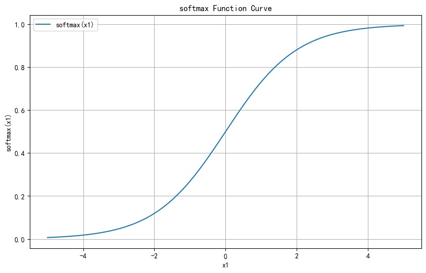
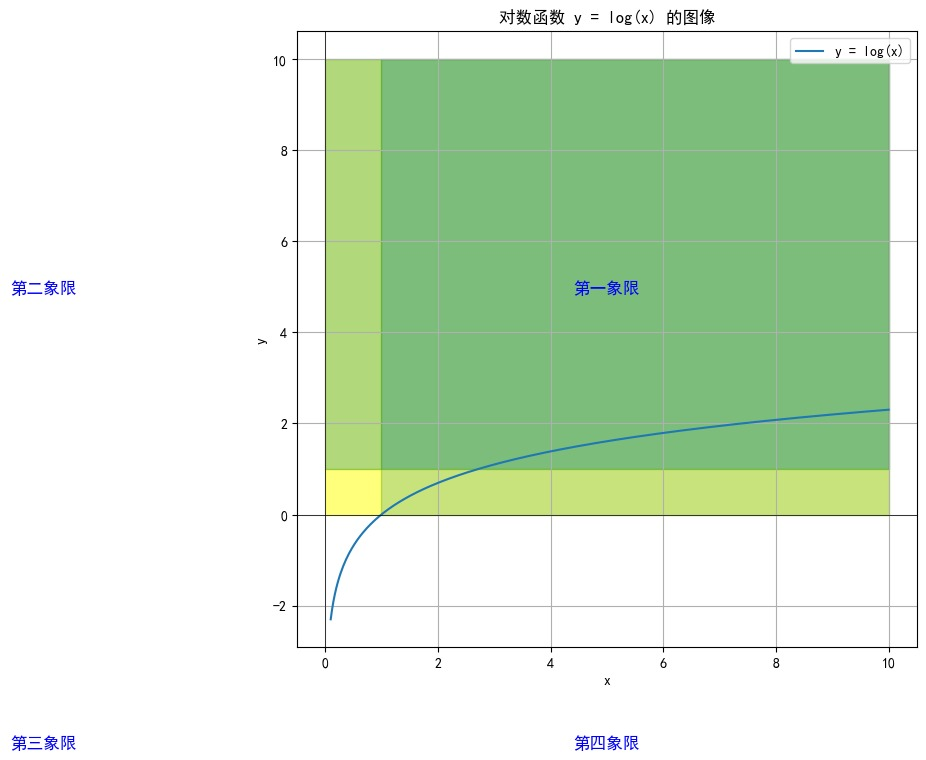
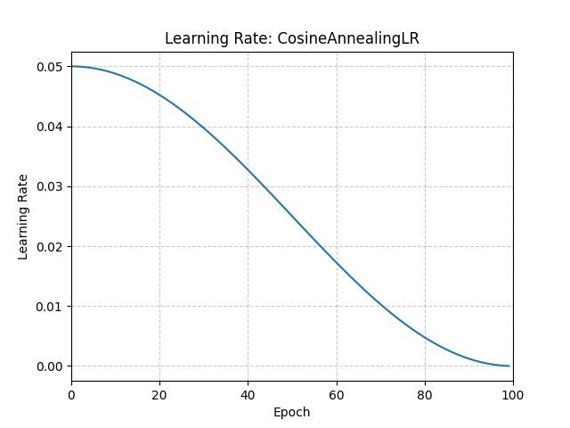
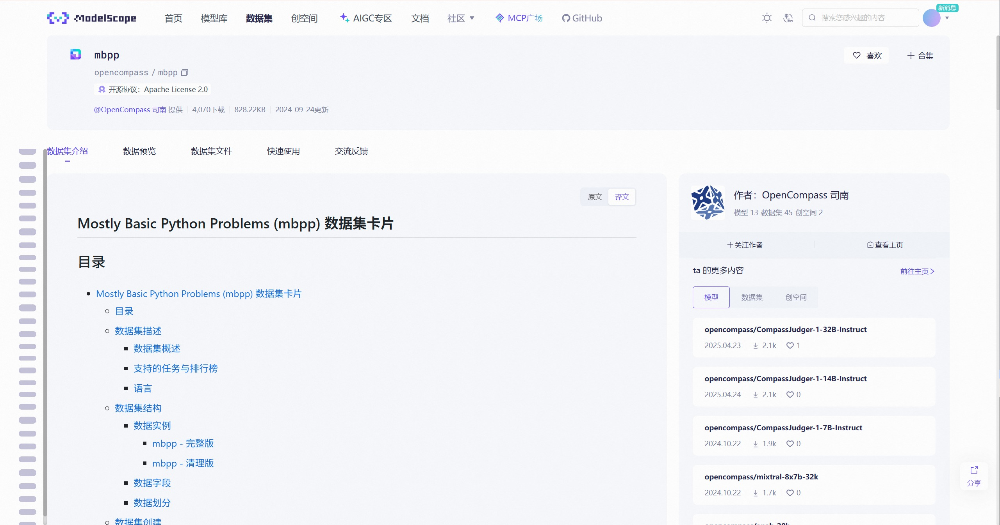
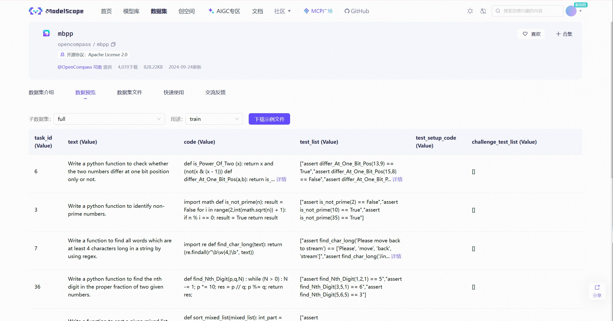
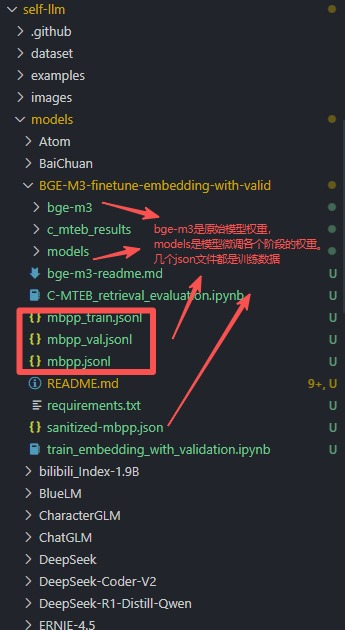
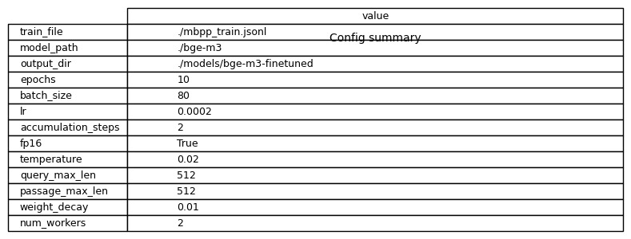
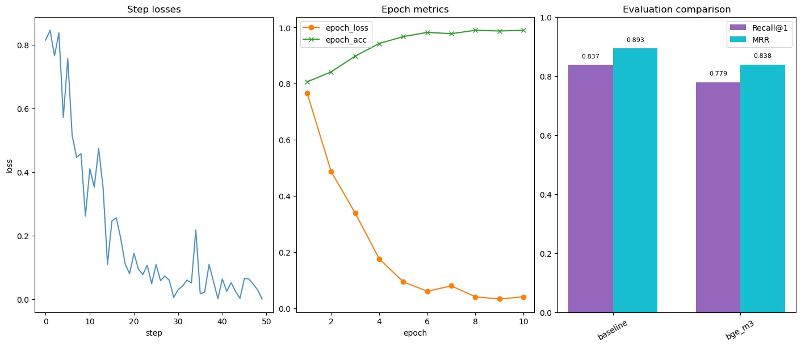
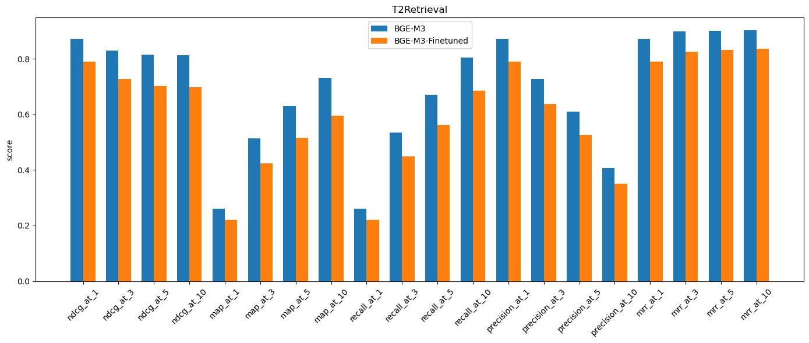

# 代码检索场景微调实战，基于pytorch微调BGE-M3 embedding模型

## 概要

本次文章，我们将会从embedding模型的训练代码原理讲解，embedding模型训练实践讲解分别展开。包括模型微调数据准备，模型微调，以及模型评测，评测会分别在训练数据上分出来的20%数据和C-MTEB榜单上的T2Retrieval数据集上进行评测。

## embedding模型的训练原理讲解

### 1. 基本概念

Embedding模型的核心目标是将文本，或者图片，音频内容映射到高维向量空间，比如我们本次使用的就是查询和文档embedding，通过embedding后的向量，使得文本具有语义相似性，相似的文本在向量空间中的距离更近，我们可以通过cos，或者点积进行计算。

在本次训练中，我们采用了对比学习（Contrastive Learning）的方法来微调BGE-M3模型，你可以理解成把每个 query 和它对应的正样本当作一对，在同一个 batch 内，其余的 query–doc 对都当作负样本；模型学习把正样本对的相似度拉高、把负样本对的相似度压低。

### 2. 训练方法：In-batch Negatives

本次训练使用了**In-batch Negatives**策略，这是对比学习中的其中一种比较流行的策略，用的会比较多，所以在开始之前我们需要介绍下批次负样本。首先是介绍他的核心思想：

- 在一个batch中，每个查询（query）与其对应的正样本（positive document）构成正样本对
- 同一个batch中的其他查询-文档对作为负样本
- 这样可以在不增加额外计算成本的情况下，为每个查询提供batch_size-1个负样本

从核心思想上面，大家可以看出，如果我们的批次开得越大，是不是意味着每个 query 能获得的负样本数量（batch_size - 1）越多，训练中的对比信号越强，模型更容易把正样本拉近、把负样本推远，从而学到更细粒度的语义表示。

我在本次实验的进行中，分别使用过8,16,80的批次大小对模型进行训练，实际的训练效果也很明显，批次越大的时候loss越平滑，而批次越小的时候loss的波动会比较明显，虽然和。

不过C-Pack (BGE) 论文论文的 3.4 节 Training Recipe 中我看到在介绍“通用微调 (General purpose fine-tuning)”阶段时，他们指出纯粹依赖批次内负样本 (in-batch negative samples)，并采用了一个高达 19,200 的大批次来提升嵌入的区分度。

在 4.2 节 Detailed Analysis 中，论文通过实验对比了不同批次大小（256、2,048 和 19,200）带来的影响，并观察到随着批次大小的扩大，嵌入质量有一致性的提升，其中对检索性能的提升最为显著。

M3-Embedding 论文的附录 B.1 节 Experimental Hyperparameters 和 表 9 中也有部分关于批次大小设计的描述。

他们是有分成两个阶段，一个是无监督数据预训练阶段，在这个阶段，批次大小是动态变化的，具体取决于训练数据的序列长度。对于较短的序列（0-500 tokens），总批次大小可以达到 67,200；而对于非常长的序列（7000-8192 tokens），批次大小则为 9,984。我猜测是由于显存不够大的缘故，虽然他们没有说，但是我知道序列越长，需要的显存也是越大的，即使我们自己使用bge-m3进行embedding的时候，如果doc的长度接近8k，不仅仅是推理的时间延长了，显存的占用也会增加不少，感兴趣的小伙伴可以自己试试，然后来告诉我。

另外一个阶段是微调阶段，在这个阶段，批次大小同样随序列长度变化，但总体上比上一阶段小。对于短序列，批次大小为 1,152，对于长序列则为 192。原因我不太清楚，可能是他们的机器被分给其他团队了，或者微调不需要那么多的机器，emm……

表格内容如下：

<table><tr><td rowspan="2">Length Range</td><td colspan="2">Batch Size</td></tr><tr><td>Unsupervised</td><td>Fine-tuning</td></tr><tr><td>0-500</td><td>67,200</td><td>1,152</td></tr><tr><td>500-1000</td><td>54,720</td><td>768</td></tr><tr><td>1000-2000</td><td>37,248</td><td>480</td></tr><tr><td>2000-3000</td><td>27,648</td><td>432</td></tr><tr><td>3000-4000</td><td>21,504</td><td>336</td></tr><tr><td>4000-5000</td><td>17,280</td><td>336</td></tr><tr><td>5000-6000</td><td>15,072</td><td>288</td></tr><tr><td>6000-7000</td><td>12,288</td><td>240</td></tr><tr><td>7000-8192</td><td>9,984</td><td>192</td></tr></table>
Table 9: Detailed total batch size used in training for data with different sequence length ranges.

感兴趣的小伙伴可以去看《C-Pack: Packed Resources For General Chinese Embeddings》这篇论文，里面提到了很多关于bge的模型是如何训练的技巧。
bge-m3的论文在：《M3-Embedding: Multi-Linguality, Multi-Functionality, Multi-Granularity Text Embeddings Through Self-Knowledge Distillation》

我们的核心部分公式主要就是下面的两个，对于batch中的查询向量 $\mathbf{Q}$ 和文档向量 $\mathbf{P}$：

相似度矩阵： $\mathbf{S} = \frac{\mathbf{Q} \mathbf{P}^T}{\tau}$

损失函数： $\mathcal{L} = \text{CrossEntropy}(\mathbf{S}, \mathbf{y})$

其中有两个符号需要注意：

- $\tau$ 是温度参数
- $\mathbf{y} = [0, 1, 2, ..., N-1]$ 是标签向量， $N$ 为 batch 大小


### 3. 关键技术组件

#### 3.1 向量归一化

```python
q_emb = F.normalize(q_emb, p=2, dim=-1)
p_emb = F.normalize(p_emb, p=2, dim=-1)
```

使用 L2 归一化确保所有向量都在单位球面上：

$$
\|\mathbf{q}\|_2 = 1, \quad \|\mathbf{p}\|_2 = 1
$$

其中 p=2：指定使用 L-p 范数，这里 p=2 即 L2（欧几里得）范数。也可以用 p=1（L1），也叫曼哈顿范数，不过这里的归一化不用 L1。

#### 3.2 温度参数（Temperature）

```python
temperature = 0.02
sim = q_emb @ p_emb.t() / self.temperature
```

温度参数 $\tau$ 控制相似度分布的尖锐程度。较小的温度值使模型更容易区分相似和不相似的样本。从公式来看，温度值就是

#### 3.3 损失函数

使用交叉熵损失函数来训练模型：

```python
labels = torch.arange(sim.size(0), device=sim.device, dtype=torch.long)
loss = F.cross_entropy(sim, labels)
```

交叉熵损失将 embedding 学习转换为分类问题的核心在于：

在一个 batch 内，我们将每个查询与他对应的正确文档匹配看作分类任务。

其中相似度矩阵的每一行代表查询对所有候选文档的分类分数，对角线元素应该是正确类别的最高分。

通过创建标签 [0, 1, 2, ..., batch_size-1]，让模型学习将第 i 个查询分类到第 i 个文档。

这样优化分类损失的同时，模型就间接学会了让语义相似的文本在 embedding 空间中更接近，实现了从向量相似度优化到分类问题的巧妙转换。

对于第 $i$ 个查询，损失函数为：

$$
\mathcal{L}_i = -\log \frac{\exp(s_{i,i}/\tau)}{\sum_{j=1}^{N}\exp(s_{i,j}/\tau)}
$$

其中 $s_{i,j}$ 是第 $i$ 个查询与第 $j$ 个文档的相似度分数。

##### 损失函数公式介绍

**1. 相似度矩阵计算**

**公式**： $\mathbf{S} = \frac{\mathbf{Q} \mathbf{P}^T}{\tau}$

**含义**：

- $\mathbf{Q}$：查询向量矩阵，形状为 $N \times D$，其中 $N$ 是batch大小，$D$ 是向量维度
- $\mathbf{P}$：文档向量矩阵，形状为 $N \times D$
- $\mathbf{P}^T$：文档向量矩阵的转置，形状为 $D \times N$
- $\mathbf{Q} \mathbf{P}^T$：矩阵乘法，结果为 $N \times N$ 的相似度矩阵
- $\tau$：温度参数（0.02），用于调节相似度分布

**作用**：计算每个查询与所有文档的余弦相似度。

**2. 单个查询的损失函数**

**公式**：$\mathcal{L}_i = -\log \frac{\exp(s_{i,i}/\tau)}{\sum_{j=1}^{N}\exp(s_{i,j}/\tau)}$

**含义**：

- $s_{i,i}$：第 $i$ 个查询与其对应正样本的相似度（对角线元素）
- $s_{i,j}$：第 $i$ 个查询与第 $j$ 个文档的相似度
- $\exp(s_{i,j}/\tau)$：对相似度进行指数缩放
- 分子：正样本对的相似度
- 分母：所有文档相似度的总和（softmax的分母）

**作用**：最大化正样本对的概率，最小化负样本对的概率。

**Softmax函数**

> 具体可以参考，pytorch的文档：<https://docs.pytorch.org/docs/stable/generated/torch.nn.Softmax.html>
> pytorch上的说法:将 Softmax 函数应用于 n 维输入张量。将它们重新缩放到 n 维输出张量的元素位于[0,1]范围内并求和为 1。

损失函数中的分数部分实际上是 **softmax 函数**（在做 log 前）的应用：

$$
\text{softmax}(x_i) = \frac{\exp(x_i)}{\sum_{j=1}^{n}\exp(x_j)}
$$



从上图可以看出，softmax函数的一个重要特性是：**任何数值经过softmax函数之后都会变成0-1之间的数**。这是因为：

1. **指数运算**：分子和分母都使用exp()函数，确保所有值都是正数
2. **归一化**：每个值除以所有值的总和，确保最终结果在0-1之间
3. **概率分布**：所有输出值的和等于1，形成标准的概率分布

在我们的案例中：

- $x_i = s_{i,i}/\tau$（正样本对的相似度）
- $x_j = s_{i,j}/\tau$（所有文档的相似度）
- $\frac{\exp(s_{i,i}/\tau)}{\sum_{j=1}^{N}\exp(s_{i,j}/\tau)}$ 就是softmax函数的具体应用

**具体示例**：

假设有三个相似度值： $[8.5, 2.1, 1.8]$，温度参数 $\tau = 0.02$

1. **温度缩放**： $[8.5/0.02, 2.1/0.02, 1.8/0.02] = [425, 105, 90]$
2. **指数运算**： $[\exp(425), \exp(105), \exp(90)]$
3. **softmax计算**：

$$
\left[
\frac{\exp(425)}{\exp(425)+\exp(105)+\exp(90)},
\frac{\exp(105)}{\exp(425)+\exp(105)+\exp(90)},
\frac{\exp(90)}{\exp(425)+\exp(105)+\exp(90)}
\right]
$$

4. **结果**：接近$[1, 0, 0]$的概率分布

**为什么使用softmax？**

使用 Softmax 函数的主要优势在于它能够将模型的输出分数（Logits）转换成一个概率分布。从它的计算结果就能看出来，所有值都会被映射到 (0, 1) 范围内，并且它们的总和为 1。这很方便后续的对数（log）操作，从而计算交叉熵损失。

**为什么使用对数函数？**

在损失函数中，我们使用了 $-\log$ 来计算损失。这有以下几个重要原因：



从对数函数图像上可以看出：

- 当数值越接近1的时候，$\log(x)$ 就越接近0，损失就越小
- 当数值越接近0的时候，$\log(x)$ 就越接近一个非常大的负数，$-\log(x)$ 就接近非常大的正数

从数学意义的角度考虑，概率 $p$ 越接近1，损失 $-\log(p)$ 越接近0，概率 $p$ 越接近0，损失 $-\log(p)$ 越接近无穷大， 这种特性使得模型对错误预测的惩罚更加严重。

我们在求log之前也刚好进过了softmax对数值进行
从而可以达到，当模型预测正确时（概率接近1），损失很小， 当模型预测错误时（概率接近0），损失很大，这促使模型努力学习正确的特征

**3. 整体损失函数**

**公式**： $\mathcal{L} = \text{CrossEntropy}(\mathbf{S}, \mathbf{y})$

**含义**：

- $\mathbf{S}$：相似度矩阵
- $\mathbf{y} = [0, 1, 2, ..., N-1]$：标签向量，表示每个查询的正确匹配位置
- 交叉熵损失将相似度矩阵转换为概率分布，与真实标签计算差异

**4. 相似度矩阵 S 的具体形式**

假设 batch size = 3，那么相似度矩阵 $S$ 的形状是 $3 \times 3$：

$$
S = \begin{bmatrix}
s_{0,0} & s_{0,1} & s_{0,2} \\
s_{1,0} & s_{1,1} & s_{1,2} \\
s_{2,0} & s_{2,1} & s_{2,2}
\end{bmatrix}
$$

**具体数值示例**：

假设经过温度缩放后的相似度矩阵可能是：

$$
S = \begin{bmatrix}
8.5 & 2.1 & 1.8 \\
1.2 & 9.3 & 0.9 \\
0.5 & 1.7 & 8.1
\end{bmatrix}
$$

**矩阵元素的含义**：

- **对角线元素**（正样本对）：
  - $s_{0,0} = 8.5$：查询0与文档0的相似度（应该是正样本）
  - $s_{1,1} = 9.3$：查询1与文档1的相似度（应该是正样本）
  - $s_{2,2} = 8.1$：查询2与文档2的相似度（应该是正样本）

- **非对角线元素**（负样本对）：
  - $s_{0,1} = 2.1$：查询0与文档1的相似度（负样本）
  - $s_{0,2} = 1.8$：查询0与文档2的相似度（负样本）
  - $s_{1,0} = 1.2$：查询1与文档0的相似度（负样本）
  - 等等...

**损失函数计算示例**：

对于查询0：

- 分子：$\exp(s_{0,0}/\tau) = \exp(8.5/0.02) = \exp(425)$
- 分母：$\exp(425) + \exp(105) + \exp(90)$
- 损失：$-\log\frac{\exp(425)}{\exp(425) + \exp(105) + \exp(90)}$

**训练目标**：

通过梯度下降更新模型参数，模型会：

1. **增大对角线元素**（让正样本对的相似度更高）
2. **减小非对角线元素**（让负样本对的相似度更低）
3. 最终使得对角线元素远大于非对角线元素

这就是为什么在训练好的模型中，相似度矩阵的对角线数值会明显大于其他位置。

**4. 实际代码实现**

```python
# 计算相似度矩阵
sim = q_emb @ p_emb.t() / self.temperature

# 生成标签（对角线索引）
labels = torch.arange(sim.size(0), device=sim.device, dtype=torch.long)

# 计算交叉熵损失
loss = F.cross_entropy(sim, labels)
```

**PyTorch交叉熵损失函数的完整定义：**

```python
def cross_entropy(
    input: Tensor,
    target: Tensor,
    weight: Optional[Tensor] = None,
    size_average: Optional[bool] = None,
    ignore_index: int = -100,
    reduce: Optional[bool] = None,
    reduction: str = "mean",
    label_smoothing: float = 0.0,
) -> Tensor:
    """Compute the cross entropy loss between input logits and target.
    
    Args:
        input (Tensor): Predicted unnormalized logits; shape (N, C) or (C)
        target (Tensor): Ground truth class indices or class probabilities
        weight (Tensor, optional): Manual rescaling weight for each class
        size_average (bool, optional): Deprecated (see reduction)
        ignore_index (int, optional): Target value to ignore (default: -100)
        reduce (bool, optional): Deprecated (see reduction)  
        reduction (str, optional): 'none' | 'mean' | 'sum' (default: 'mean')
        label_smoothing (float, optional): Smoothing factor in [0.0, 1.0] (default: 0.0)
    """
    
    参数说明：
        input (Tensor): 预测的未归一化logits，形状为 (N, C) 或 (C)
        target (Tensor): 真实类别索引或类别概率
        weight (Tensor, optional): 每个类别的手动重新缩放权重
        size_average (bool, optional): 已弃用（参见reduction）
        ignore_index (int, optional): 指定要忽略的目标值（默认：-100）
        reduce (bool, optional): 已弃用（参见reduction）
        reduction (str, optional): 'none' | 'mean' | 'sum'（默认：'mean'）
        label_smoothing (float, optional): [0.0, 1.0]范围内的平滑因子（默认：0.0）
    """
```

**在我们的项目中，实际使用的参数简化为：**

- `input=sim`: 相似度矩阵，形状为 (batch_size, batch_size)
- `target=labels`: 对角线索引 [0, 1, 2, ..., batch_size-1]
- 其他参数使用默认值，其中比较重要的reduction使用的是默认值： `reduction='mean'` 对batch内的损失求平均。
**CrossEntropyLoss**
CrossEntropyLoss可以通过使用下面的导入方式导入：

```python
from torch.nn import CrossEntropyLoss 
```

通过查看他的源码，你可以发现：

```python
class CrossEntropyLoss(_WeightedLoss):
    r"""This criterion computes the cross entropy loss between input logits
    and target.

    It is useful when training a classification problem with `C` classes.
    If provided, the optional argument :attr:`weight` should be a 1D `Tensor`
    assigning weight to each of the classes.
    This is particularly useful when you have an unbalanced training set.

    The `input` is expected to contain the unnormalized logits for each class (which do `not` need
    to be positive or sum to 1, in general).
    `input` has to be a Tensor of size :math:`(C)` for unbatched input,
    :math:`(minibatch, C)` or :math:`(minibatch, C, d_1, d_2, ..., d_K)` with :math:`K \geq 1` for the
    `K`-dimensional case. The last being useful for higher dimension inputs, such
    as computing cross entropy loss per-pixel for 2D images.

    The `target` that this criterion expects should contain either:

    - Class indices in the range :math:`[0, C)` where :math:`C` is the number of classes; if
      `ignore_index` is specified, this loss also accepts this class index (this index
      may not necessarily be in the class range). The unreduced (i.e. with :attr:`reduction`
      set to ``'none'``) loss for this case can be described as:

      .. math::
          \ell(x, y) = L = \{l_1,\dots,l_N\}^\top, \quad
          l_n = - w_{y_n} \log \frac{\exp(x_{n,y_n})}{\sum_{c=1}^C \exp(x_{n,c})}
          \cdot \mathbb{1}\{y_n \not= \text{ignore\_index}\}

      where :math:`x` is the input, :math:`y` is the target, :math:`w` is the weight,
      :math:`C` is the number of classes, and :math:`N` spans the minibatch dimension as well as
      :math:`d_1, ..., d_k` for the `K`-dimensional case. If
      :attr:`reduction` is not ``'none'`` (default ``'mean'``), then

      .. math::
          \ell(x, y) = \begin{cases}
              \sum_{n=1}^N \frac{1}{\sum_{n=1}^N w_{y_n} \cdot \mathbb{1}\{y_n \not= \text{ignore\_index}\}} l_n, &
               \text{if reduction} = \text{`mean';}\\
                \sum_{n=1}^N l_n,  &
                \text{if reduction} = \text{`sum'.}
            \end{cases}

      Note that this case is equivalent to applying :class:`~torch.nn.LogSoftmax`
      on an input, followed by :class:`~torch.nn.NLLLoss`.

    - Probabilities for each class; useful when labels beyond a single class per minibatch item
      are required, such as for blended labels, label smoothing, etc. The unreduced (i.e. with
      :attr:`reduction` set to ``'none'``) loss for this case can be described as:

      .. math::
          \ell(x, y) = L = \{l_1,\dots,l_N\}^\top, \quad
          l_n = - \sum_{c=1}^C w_c \log \frac{\exp(x_{n,c})}{\sum_{i=1}^C \exp(x_{n,i})} y_{n,c}

      where :math:`x` is the input, :math:`y` is the target, :math:`w` is the weight,
      :math:`C` is the number of classes, and :math:`N` spans the minibatch dimension as well as
      :math:`d_1, ..., d_k` for the `K`-dimensional case. If
      :attr:`reduction` is not ``'none'`` (default ``'mean'``), then

      .. math::
          \ell(x, y) = \begin{cases}
              \frac{\sum_{n=1}^N l_n}{N}, &
               \text{if reduction} = \text{`mean';}\\
                \sum_{n=1}^N l_n,  &
                \text{if reduction} = \text{`sum'.}
            \end{cases}

    .. note::
        The performance of this criterion is generally better when `target` contains class
        indices, as this allows for optimized computation. Consider providing `target` as
        class probabilities only when a single class label per minibatch item is too restrictive.

    Args:
        weight (Tensor, optional): a manual rescaling weight given to each class.
            If given, has to be a Tensor of size `C`.
        size_average (bool, optional): Deprecated (see :attr:`reduction`). By default,
            the losses are averaged over each loss element in the batch. Note that for
            some losses, there are multiple elements per sample. If the field :attr:`size_average`
            is set to ``False``, the losses are instead summed for each minibatch. Ignored
            when :attr:`reduce` is ``False``. Default: ``True``
        ignore_index (int, optional): Specifies a target value that is ignored
            and does not contribute to the input gradient. When :attr:`size_average` is
            ``True``, the loss is averaged over non-ignored targets. Note that
            :attr:`ignore_index` is only applicable when the target contains class indices.
        reduce (bool, optional): Deprecated (see :attr:`reduction`). By default, the
            losses are averaged or summed over observations for each minibatch depending
            on :attr:`size_average`. When :attr:`reduce` is ``False``, returns a loss per
            batch element instead and ignores :attr:`size_average`. Default: ``True``
        reduction (str, optional): Specifies the reduction to apply to the output:
            ``'none'`` | ``'mean'`` | ``'sum'``. ``'none'``: no reduction will
            be applied, ``'mean'``: the weighted mean of the output is taken,
            ``'sum'``: the output will be summed. Note: :attr:`size_average`
            and :attr:`reduce` are in the process of being deprecated, and in
            the meantime, specifying either of those two args will override
            :attr:`reduction`. Default: ``'mean'``
        label_smoothing (float, optional): A float in [0.0, 1.0]. Specifies the amount
            of smoothing when computing the loss, where 0.0 means no smoothing. The targets
            become a mixture of the original ground truth and a uniform distribution as described in
            `Rethinking the Inception Architecture for Computer Vision <https://arxiv.org/abs/1512.00567>`__. Default: :math:`0.0`.

    Shape:
        - Input: Shape :math:`(C)`, :math:`(N, C)` or :math:`(N, C, d_1, d_2, ..., d_K)` with :math:`K \geq 1`
          in the case of `K`-dimensional loss.
        - Target: If containing class indices, shape :math:`()`, :math:`(N)` or :math:`(N, d_1, d_2, ..., d_K)` with
          :math:`K \geq 1` in the case of K-dimensional loss where each value should be between :math:`[0, C)`. The
          target data type is required to be long when using class indices. If containing class probabilities, the
          target must be the same shape input, and each value should be between :math:`[0, 1]`. This means the target
          data type is required to be float when using class probabilities.
        - Output: If reduction is 'none', shape :math:`()`, :math:`(N)` or :math:`(N, d_1, d_2, ..., d_K)` with :math:`K \geq 1`
          in the case of K-dimensional loss, depending on the shape of the input. Otherwise, scalar.


        where:

        .. math::
            \begin{aligned}
                C ={} & \text{number of classes} \\
                N ={} & \text{batch size} \\
            \end{aligned}

    Examples:

        >>> # Example of target with class indices
        >>> loss = nn.CrossEntropyLoss()
        >>> input = torch.randn(3, 5, requires_grad=True)
        >>> target = torch.empty(3, dtype=torch.long).random_(5)
        >>> output = loss(input, target)
        >>> output.backward()
        >>>
        >>> # Example of target with class probabilities
        >>> input = torch.randn(3, 5, requires_grad=True)
        >>> target = torch.randn(3, 5).softmax(dim=1)
        >>> output = loss(input, target)
        >>> output.backward()
    """
```

**CrossEntropyLoss中文版本：**

```python
class CrossEntropyLoss(_WeightedLoss):
    r"""此标准计算输入logits和目标之间的交叉熵损失。

    在训练具有C个类别的分类问题时非常有用。如果提供了可选参数:attr:`weight`，应该是一个1D的`Tensor`，
    为每个类别分配权重。当你的训练集不平衡时，这特别有用。

    输入应包含每个类别的未归一化logits（通常不需要为正数或总和为1）。
    对于非批次输入，输入必须是大小为:math:`(C)`的张量，
    对于K维情况，输入必须是:math:`(minibatch, C)`或:math:`(minibatch, C, d_1, d_2, ..., d_K)`，其中:math:`K \geq 1`。
    后者对于高维输入很有用，例如计算2D图像的每个像素的交叉熵损失。

    此标准期望的目标应包含以下任一内容：

    - 在范围:math:`[0, C)`内的类别索引，其中:math:`C`是类别数量；如果
      指定了`ignore_index`，此损失也接受此类别索引（此索引
      不一定在类别范围内）。对于这种情况，未减少的（即设置:attr:`reduction`
      为``'none'``）损失可以描述为：

      .. math::
          \ell(x, y) = L = \{l_1,\dots,l_N\}^\top, \quad
          l_n = - w_{y_n} \log \frac{\exp(x_{n,y_n})}{\sum_{c=1}^C \exp(x_{n,c})}
          \cdot \mathbb{1}\{y_n \not= \text{ignore\_index}\}

      其中:math:`x`是输入，:math:`y`是目标，:math:`w`是权重，
      :math:`C`是类别数量，:math:`N`跨越minibatch维度以及
      K维情况的:math:`d_1, ..., d_k`。如果
      :attr:`reduction`不是``'none'``（默认``'mean'``），则

      .. math::
          \ell(x, y) = \begin{cases}
              \sum_{n=1}^N \frac{1}{\sum_{n=1}^N w_{y_n} \cdot \mathbb{1}\{y_n \not= \text{ignore\_index}\}} l_n, &
               \text{if reduction} = \text{`mean';}\\
                \sum_{n=1}^N l_n,  &
                \text{if reduction} = \text{`sum'.}
            \end{cases}

      注意，这种情况等同于在输入上应用:class:`~torch.nn.LogSoftmax`，
      然后应用:class:`~torch.nn.NLLLoss`。

    - 每个类别的概率；当每个minibatch项目需要超出单个类别的标签时很有用，
      例如混合标签、标签平滑等。对于这种情况，未减少的（即设置:attr:`reduction`
      为``'none'``）损失可以描述为：

      .. math::
          \ell(x, y) = L = \{l_1,\dots,l_N\}^\top, \quad
          l_n = - \sum_{c=1}^C w_c \log \frac{\exp(x_{n,c})}{\sum_{i=1}^C \exp(x_{n,i})} y_{n,c}

      其中:math:`x`是输入，:math:`y`是目标，:math:`w`是权重，
      :math:`C`是类别数量，:math:`N`跨越minibatch维度以及
      K维情况的:math:`d_1, ..., d_k`。如果
      :attr:`reduction`不是``'none'``（默认``'mean'``），则

      .. math::
          \ell(x, y) = \begin{cases}
              \frac{\sum_{n=1}^N l_n}{N}, &
               \text{if reduction} = \text{`mean';}\\
                \sum_{n=1}^N l_n,  &
                \text{if reduction} = \text{`sum'.}
            \end{cases}

    .. note::
        当`target`包含类别索引时，此标准的性能通常更好，
        因为这允许优化计算。只有当每个minibatch项目的单个类别标签过于限制时，
        才考虑将`target`作为类别概率提供。

    参数:
        weight (Tensor, optional): 给每个类别的手动重新缩放权重。
            如果提供，必须是大小为`C`的张量。
        size_average (bool, optional): 已弃用（参见:attr:`reduction`）。默认情况下，
            损失在批次中每个损失元素上平均。注意对于
            某些损失，每个样本有多个元素。如果字段:attr:`size_average`
            设置为``False``，则损失改为对每个minibatch求和。当:attr:`reduce`
            为``False``时忽略。默认：``True``
        ignore_index (int, optional): 指定一个被忽略的目标值，
            并且不贡献给输入梯度。当:attr:`size_average`为
            ``True``时，损失在非忽略目标上平均。注意
            :attr:`ignore_index`仅适用于目标包含类别索引的情况。
        reduce (bool, optional): 已弃用（参见:attr:`reduction`）。默认情况下，
            损失根据:attr:`size_average`对每个minibatch的观测值平均或求和。
            当:attr:`reduce`为``False``时，返回每个批次元素的损失并忽略
            :attr:`size_average`。默认：``True``
        reduction (str, optional): 指定应用于输出的减少方式：
            ``'none'`` | ``'mean'`` | ``'sum'``。``'none'``：不应用减少，
            ``'mean'``：取输出的加权平均值，
            ``'sum'``：输出将被求和。注意：:attr:`size_average`
            和:attr:`reduce`正在被弃用，同时，
            指定这两个参数中的任何一个都将覆盖
            :attr:`reduction`。默认：``'mean'``
        label_smoothing (float, optional): [0.0, 1.0]中的浮点数。指定
            计算损失时的平滑量，其中0.0表示没有平滑。目标
            成为原始真实值和均匀分布的混合，如
            `Rethinking the Inception Architecture for Computer Vision <https://arxiv.org/abs/1512.00567>`__中所述。默认：:math:`0.0`。

    形状:
        - 输入：形状为:math:`(C)`、:math:`(N, C)`或:math:`(N, C, d_1, d_2, ..., d_K)`，其中:math:`K \geq 1`
          在K维损失的情况下。
        - 目标：如果包含类别索引，形状为:math:`()`、:math:`(N)`或:math:`(N, d_1, d_2, ..., d_K)`，其中
          :math:`K \geq 1`在K维损失的情况下，每个值应在:math:`[0, C)`之间。使用类别索引时，
          目标数据类型必须为long。如果包含类别概率，
          目标必须与输入形状相同，每个值应在:math:`[0, 1]`之间。这意味着使用类别概率时，
          目标数据类型必须为float。
        - 输出：如果reduction为'none'，形状为:math:`()`、:math:`(N)`或:math:`(N, d_1, d_2, ..., d_K)`，其中:math:`K \geq 1`
          在K维损失的情况下，取决于输入的形状。否则为标量。


        其中：

        .. math::
            \begin{aligned}
                C ={} & \text{类别数量} \\
                N ={} & \text{批次大小} \\
            \end{aligned}

    示例:

        >>> # 类别索引目标的示例
        >>> loss = nn.CrossEntropyLoss()
        >>> input = torch.randn(3, 5, requires_grad=True)
        >>> target = torch.empty(3, dtype=torch.long).random_(5)
        >>> output = loss(input, target)
        >>> output.backward()
        >>>
        >>> # 类别概率目标的示例
        >>> input = torch.randn(3, 5, requires_grad=True)
        >>> target = torch.randn(3, 5).softmax(dim=1)
        >>> output = loss(input, target)
        >>> output.backward()
    """
```

**CrossEntropy的数学公式：**

上面的内容可能不适合直接看，下面我们来换一种表达方式来看看公式长什么样，对于离散标签（类别索引）的情况，交叉熵损失函数的公式为：

$$\mathcal{L} = -\frac{1}{N}\sum_{i=1}^{N}\log\left(\frac{\exp(x_{i,y_i})}{\sum_{j=1}^{C}\exp(x_{i,j})}\right)$$

其中：

- $N$ 是批次大小（batch size）
- $C$ 是类别数量（在我们的案例中等于batch size）
- $x_{i,j}$ 是第 $i$ 个样本在第 $j$ 个类别上的预测分数
- $y_i$ 是第 $i$ 个样本的真实类别标签

**在我们的embedding项目中的具体形式：**

$$\mathcal{L} = -\frac{1}{N}\sum_{i=1}^{N}\log\left(\frac{\exp(s_{i,i}/\tau)}{\sum_{j=1}^{N}\exp(s_{i,j}/\tau)}\right)$$

这里的 $s_{i,j}$ 是相似度矩阵 $\mathbf{S}$ 中的元素，$\tau$ 是温度参数。

**公式推导过程：**

1. **Softmax函数**：将预测分数转换为概率分布

   $$p_{i,j} = \frac{\exp(x_{i,j})}{\sum_{k=1}^{C}\exp(x_{i,k})}$$

2. **交叉熵**：衡量预测概率与真实标签的差异

   $$\mathcal{L}_i = -\sum_{j=1}^{C}y_{i,j}\log(p_{i,j})$$

3. **简化形式**：对于one-hot编码的真实标签，只有 $j=y_i$ 时 $y_{i,j}=1$

   $$\mathcal{L}_i = -\log(p_{i,y_i}) = -\log\left(\frac{\exp(x_{i,y_i})}{\sum_{j=1}^{C}\exp(x_{i,j})}\right)$$

4. **批次平均**：对整个batch的损失求平均

   $$\mathcal{L} = -\frac{1}{N}\sum_{i=1}^{N}\log\left(\frac{\exp(x_{i,y_i})}{\sum_{j=1}^{C}\exp(x_{i,j})}\right)$$

这个损失函数的本质是**InfoNCE Loss**（Info Noise Contrastive Estimation），通过对比学习的方式让模型学会区分正负样本对，MoCo采用的对比学习损失函数就是InfoNCE loss，以此来训练模型，和我们本次介绍的公式是差不多的。

对InfoNCE Loss感兴趣的小伙伴可以看看下面这篇文章：
>对比学习损失（InfoNCE loss）与交叉熵损失的联系，以及温度系数的作用 - Youngshell的文章 - 知乎
> <https://zhuanlan.zhihu.com/p/506544456>
>更硬核的可以看这篇：
> <https://lilianweng.github.io/posts/2021-05-31-contrastive/>

### 4. 训练优化策略

#### 4.1 混合精度训练（FP16）

```python
with torch.cuda.amp.autocast(enabled=cfg['fp16']):
    out = self.model(**batch)
```

混合精度训练是一种同时使用不同精度浮点数进行深度学习模型训练的技术。在本次训练中，我们使用FP16（半精度浮点数）进行大部分计算，同时保持关键操作在FP32（单精度浮点数）中以确保数值稳定性。这种方法可以显著减少显存占用并加速训练，同时保持模型的训练效果。通过PyTorch的自动混合精度（AMP）功能，系统能够自动选择合适的数据类型，并通过梯度缩放防止梯度下溢问题。

对混合精度训练感兴趣的小伙伴可以去下面的链接里面查看更具体的内容：
<https://docs.pytorch.org/docs/stable/amp.html>

#### 4.2 梯度累积

```python
accumulation = self.cfg['accumulation_steps']
loss = out['loss'] / accumulation
```

通过累积梯度来模拟更大的batch size：
$$\nabla_{\text{effective}} = \frac{1}{K}\sum_{k=1}^{K}\nabla_k$$

其中$K$是累积步数。

#### 4.3 学习率调度

使用余弦退火学习率调度器：

```python
scheduler = get_cosine_schedule_with_warmup(optimizer, num_warmup_steps=int(0.1*total_steps), num_training_steps=total_steps)
```



简单来说，这个函数创建了一个学习率调度策略：

1. 预热阶段：开始时学习率为0，线性增加到设定的初始学习率
2. 余弦衰减阶段：预热完成后，学习率按照余弦函数的形状从初始值逐渐降低到0

这种策略在深度学习中很常用，可以帮助模型在训练初期稳定收敛，后期精细调整参数。
对学习率调度感兴趣的小伙伴可以参考，去下面的链接，看看细节讲解：<https://docs.pytorch.org/docs/stable/generated/torch.optim.lr_scheduler.CosineAnnealingLR.html>

### 5. 评估指标

#### 5.1 Recall@1

$$\text{Recall@1} = \frac{1}{N}\sum_{i=1}^{N}\mathbf{1}[\text{rank}_i = 0]$$

衡量模型将正确答案排在第一位的比例。

#### 5.2 MRR (Mean Reciprocal Rank)

$$\text{MRR} = \frac{1}{N}\sum_{i=1}^{N}\frac{1}{\text{rank}_i + 1}$$

考虑了正确答案的排名位置，对排名靠前的正确答案给予更高的奖励得分。

### 6. 数据处理流程

#### 6.1 数据格式

训练数据采用JSONL格式，每行包含：

```json
{
    "query": "Write function to find the sum of all items in the given dictionary.",
    "pos_doc": "def return_sum(dict):\n  sum = 0\n  for i in dict.values():\n    sum = sum + i\n  return sum",
    "meta": {"task_id": 796}
}
```

**字段说明**：

- `query`: 查询文本，用于测试模型对查询的理解能力
- `pos_doc`: 正样本文档，与查询相关的文本内容
- `meta`: 元数据

#### 6.2 Tokenization

```python
tokenizer(queries, padding=True, truncation=True, max_length=query_max_len, return_tensors='pt')
```

**参数说明**：

- `queries`: 输入的查询文本列表
- `padding=True`: 自动填充，将所有序列填充到相同长度，确保批次中所有输入长度一致
- `truncation=True`: 自动截断，当文本超过最大长度时进行截断处理
- `max_length=query_max_len`: 设置最大长度限制，超过该长度的文本会被截断
- `return_tensors='pt'`: 返回PyTorch张量格式，便于直接输入模型进行计算

对查询和文档分别进行tokenization，支持padding和truncation处理不同长度的文本。

### 7. BGE-M3 模型介绍

更具体的模型介绍可以去hf上面的bge-m3模型卡片上面阅读：
地址：<https://huggingface.co/BAAI/bge-m3>

#### 7.1 模型概述

BGE-M3 是一个多功能的嵌入模型，具有以下特点：

- **多功能性 (Multi-Functionality)**：同时支持三种常见的检索功能：稠密检索、多向量检索和稀疏检索
- **多语言性 (Multi-Linguality)**：支持超过 100 种工作语言
- **多粒度性 (Multi-Granularity)**：能够处理不同粒度的输入，从短句子到长达 8192 个 token 的长文档

其中bge-m3支持的多中常见的检索功能，如果你需要了解更多的细节可以去下面的链接看对应的论文或者代码。

- **稠密检索 (Dense retrieval)**：将文本映射到单个嵌入向量，例如 [DPR](https://arxiv.org/abs/2004.04906)、[BGE-v1.5](https://github.com/FlagOpen/FlagEmbedding)
- **稀疏检索 (Sparse retrieval)**：词汇匹配，大小等于词汇表的向量，大部分位置设为零，只为文本中出现的标记计算权重。例如 BM25、[unicoil](https://arxiv.org/pdf/2106.14807.pdf) 和 [splade](https://arxiv.org/abs/2107.05720)
- **多向量检索 (Multi-vector retrieval)**：使用多个向量表示文本，例如 [ColBERT](https://arxiv.org/abs/2004.12832)

#### 7.2 模型规格

| 模型名称 | 维度 | 序列长度 | 介绍 |
|:----:|:---:|:---:|:---|
| [BAAI/bge-m3](https://huggingface.co/BAAI/bge-m3) | 1024 | 8192 | 多语言；从 bge-m3-unsupervised 统一微调（稠密、稀疏和 colbert）|
| [BAAI/bge-m3-unsupervised](https://huggingface.co/BAAI/bge-m3-unsupervised) | 1024 | 8192 | 多语言；从 bge-m3-retromae 对比学习 |
| [BAAI/bge-m3-retromae](https://huggingface.co/BAAI/bge-m3-retromae) | -- | 8192 | 多语言；将 [xlm-roberta](https://huggingface.co/FacebookAI/xlm-roberta-large) 的 max_length 扩展到 8192 并通过 [retromae](https://github.com/staoxiao/RetroMAE) 进一步预训练|

## embedding模型的训练实践讲解

### 项目文件结构说明

本项目是一个完整的embedding模型微调实践项目，主要包含以下文件和目录：

**核心文件：**

- `train_embedding_with_validation.ipynb` - 主要的训练和验证Jupyter notebook
- `C-MTEB_retrieval_evaluation.ipynb` - 用于C-MTEB检索评估的notebook
- `requirements.txt` - 项目依赖包列表

**模型相关目录：**

- `bge-m3/` - 原始BGE-M3模型文件，包含预训练权重和配置
- `models/bge-m3-finetuned/` - 微调过程中保存的模型检查点
  - `best_checkpoint/` - 验证集上表现最好的模型检查点
  - `checkpoint-epoch-*/` - 各个训练轮次的检查点
  - `final_model/` - 训练完成后的最终模型

**数据文件：**

- `mbpp.jsonl` - MBPP数据集的完整版本
- `mbpp_train.jsonl` - 训练集数据
- `mbpp_val.jsonl` - 验证集数据
- `sanitized-mbpp.json` - 清理后的MBPP数据

**评估结果：**

- `c_mteb_results/` - C-MTEB评估结果
  - `BGE-M3/` - 原始BGE-M3模型的评估结果
  - `BGE-M3-Finetuned/` - 微调后模型的评估结果

**文档：**

- `README.md` - 项目主文档

### 实践环节

#### 环境配置

首先进入当前目录下的train_embedding_with_validation.ipynb文件。
在进入之前，请你准备好python环境，并安装notebook需要的基础环境配置。

**方法一：使用requirements.txt安装**

```bash
pip install -r requirements.txt
```

**方法二：手动安装核心依赖**

```bash
# 安装notebook和ipykernel
pip install notebook ipykernel

# 安装深度学习相关依赖
pip install torch transformers sentence-transformers

# 安装bge生态 embedding模型专用库
pip install FlagEmbedding mteb

# 安装数据处理和科学计算库
pip install numpy matplotlib tqdm scipy scikit-learn pandas seaborn
```

#### 查看库版本

**方法一：使用pip list查看**

```bash
# 查看所有已安装库的版本
pip list

# 查看特定库的版本
pip list | grep -E "(torch|transformers|sentence-transformers|FlagEmbedding|mteb)"
```

**方法二：使用Python代码查看**

```python
import torch
import transformers
import sentence_transformers
import numpy as np
import matplotlib.pyplot as plt
import pandas as pd
import sklearn
import scipy
import tqdm
import seaborn as sns

print(f"torch: {torch.__version__}")
print(f"transformers: {transformers.__version__}")
print(f"sentence-transformers: {sentence_transformers.__version__}")
print(f"numpy: {np.__version__}")
print(f"matplotlib: {plt.__version__}")
print(f"pandas: {pd.__version__}")
print(f"scikit-learn: {sklearn.__version__}")
print(f"scipy: {scipy.__version__}")
print(f"tqdm: {tqdm.__version__}")
print(f"seaborn: {sns.__version__}")

try:
    import FlagEmbedding
    print(f"FlagEmbedding: {FlagEmbedding.__version__}")
except:
    print("FlagEmbedding: Not installed")

try:
    import mteb
    print(f"mteb: {mteb.__version__}")
except:
    print("mteb: Not installed")
```

**当前环境版本信息**

以下是本项目开发环境中使用的主要库版本：

| 库名称 | 版本号 |
|--------|--------|
| torch | 2.7.1 |
| transformers | 4.53.0 |
| sentence-transformers | 5.0.0 |
| numpy | 2.2.5 |
| pandas | 2.2.3 |
| matplotlib | 0.1.7 (matplotlib-inline) |
| tqdm | 4.67.1 |
| scipy | 1.16.0 |
| scikit-learn | 1.7.0 |

**CUDA 环境配置**

本项目开发环境的 CUDA 硬件和软件配置如下：

| 配置项 | 详细信息 |
|--------|----------|
| PyTorch 版本 | 2.7.1+cu126 |
| CUDA 版本 | 12.6 |
| CUDA 设备数量 | 1 |
| GPU 设备名称 | NVIDIA RTX A6000 |

NVIDIA RTX A6000 ，拥有 48GB 显存，本次实验至少要求24GB显存，如果你的显卡显存不足可以适当调小batch size，优先选24GB以上的显卡，因为48GB在C-MTEB评测任务里面也有点不够用，需要评测很久。

安装完成后，你就可以打开 `train_embedding_with_validation.ipynb` 开始embedding模型的微调实践了。

#### 模型下载

在开始之前，我们先下载bge-m3模型。
这里我们会使用到modelscope进行模型下载，所以先安装modelscope，使用下面的命令进行安装：

```bash

pip install modelscope
```

接着我们使用modelscope下载bge-m3模型吧，使用下面的命令可以进行下载：

```bash
modelscope download --model BAAI/bge-m3  --local_dir ./bge-m3
```

这个命令必须要在models/BGE-M3-finetune-embedding-with-valid目录下执行，也就是说，你的模型需要下载到models/BGE-M3-finetune-embedding-with-valid里面，如果你还是不清楚，你可以看下面的一张预期目录结构图（在数据集准备的最后部分）。

#### 数据集准备

你可以去下面的地址下载数据集，并放到当前目录下：
<https://modelscope.cn/datasets/opencompass/mbpp>
打开链接之后你可以看到页面大概是这样的：

你可以切换到数据预览页面，查看我们的数据大概是什么样子的：


如果你看完了，或者想要继续进行数据准备工作，可以切换到数据文件页面，然后进行数据集下载：


最终你可以获得到这样的目录结构：

你只需要从modelscope下载箭头指向的两个文件即可：

下载完成之后确保你的文件名和我的示例目录下的文件名相同，如果不一样，请你修改成一样的名字，其中的sanitized-mbpp.json是我们本次使用到的数据集。

因为他是已经清洗过的文件，mbpp.jsonl是没有清洗的数据文件，数据量会大一些，大概是800多条，清洗后sanitized-mbpp.json文件大概是接近500条数据。

mbpp_val.jsonl和mbpp_train.jsonl都是从sanitized-mbpp.json分出来的，比例是8:2，一个用来训练，一个用来测试。

这两个文件是由代码生成的，不需要下载，而是运行代码之后生成，所以刚开始看见的时候没有这两个文件不要感到奇怪。

#### 运行代码

打开notebook文件之后，我们从上到下依次运行代码，即可完成本次实验复现。

现在请你切换到train_embedding_with_validation.ipynb里面开始本次实验吧。

其中微调的任务大概是需要接近48GB显存才能完成本次任务，如果你的显卡没有这么大的显存，那么你可以将batch size调到8或者16再重新尝试，通过运行代码，检查显存占用，是否能够保证显存不溢出。

当batch size设置为1的时候就是最小显存要求，经过我的测试是需要12.5GB显存，所以你如果要尝试运行本次实验，请至少准备一张至少13GB的显卡，如果使用batch size为80进行训练，大概需要5分钟左右即可完成本次微调训练，其中最后微调效果评测也需要1分钟左右，所以总的时间需要在6分钟左右。

如果你已经复现了train_embedding_with_validation.ipynb文件中的模型微调任务。

那么你下一步可以开始对我们微调出来的模型进行评测，我们选用的是C-MTEB榜单上的T2Retrieval数据集，你可以使用notebook文件C-MTEB_retrieval_evaluation.ipynb进行本次评测实验的复现。

本次对比评测微调前后的模型在T2Retrieval上的表现实验，实验所需要的时间比较久，我在一张A6000 48GB显卡的环境下也需要6个小时才能完成评测，已经算是比较久了，不建议小于48GB的显卡进行本次的C-MTEB评测。

#### 评估实验结果

在最后的可视化部分，我们可以看到第一个图是模型的训练配置，如下图所示。



本次模型训练采用了以下配置参数：

- **模型架构**：基于BGE-M3多语言embedding模型，支持1024维向量输出和8192长度的序列处理
- **训练轮数**：10个epoch，每个epoch后都会进行验证评估并保存checkpoint
- **批处理大小**：80，配合梯度累积步数2，实现等效的160批次大小训练
- **学习率**：2e-4，采用余弦退火调度策略，前10%步数用于预热
- **序列长度**：查询和文档均设置为512token，平衡计算效率和语义理解能力
- **优化器**：AdamW优化器，权重衰减0.01，使用梯度裁剪防止梯度爆炸
- **混合精度训练**：启用FP16混合精度，减少显存占用并加速训练
- **温度参数**：0.02，用于调节相似度分布的尖锐程度
- **数据处理**：2个工作进程并行加载数据，提升数据预处理效率

训练过程中使用了MBPP数据集，按8:2比例划分为训练集(341样本)和验证集(86样本)，采用In-batch Negatives策略进行对比学习，每个epoch都会在验证集上评估Recall@1和MRR指标，并保存表现最佳的模型checkpoint。

第二个图是模型训练的损失函数以及微调前后模型测试效果对比，如下图所示。


图由三部分组成：左侧的 step losses 显示训练过程中每一步的损失从约 0.8 快速下降到接近 0,或者说是在0.1附近，并伴有若干波动与偶发突增（说明每步噪声/小批次差异或梯度累积影响）。

中间的 epoch metrics 表明训练在 epoch 级别非常稳定地收敛：epoch_loss 从约 0.77 降到接近 0.03，epoch_acc 从约 0.80 上升到接近 0.99，说明模型在训练集上的相似度目标被很好地优化。

右侧的 Evaluation comparison 则是验证集上的检验（notebook 中会把微调后的模型作为 baseline，未微调的 bge_m3 作为对比）。

图中数值显示微调后（baseline）在 Recall@1=0.837、MRR=0.893，而未微调的 bge_m3 为 Recall@1=0.779、MRR=0.838，表明微调在该验证集上带来了约 +0.058 的 Recall@1 和约 +0.055 的 MRR 提升。

总体上，训练过程收敛良好且微调显著提高了检索质量，但 step-level 的波动提示可继续关注稳定性或用更多评估样本进行验证。

#### 微调前后在C-MTEB上的评估结果



微调后的模型在 C‑MTEB 的整体指标（如 ndcg、map、recall、precision、mrr 在 @1/@3/@5/@10 等）相较原始 BGE‑M3 出现了普遍下降——这是可以预期的迁移效应：

我们有意将模型能力从通用语义检索向代码检索方向偏移，或者说我们想要让模型在特定场景下进行能力迁移。

微调时使用了以代码为主的正/负样本与 In‑batch Negatives 的对比学习目标。

模型因此专注于代码语义的判别边界，牺牲了一部分跨领域的通用性能。

与此对应的是，在代码检索相关的验证集和 MBPP 实验上，微调带来了显著提升。例如在内测验证上 Recall@1 从 0.779 提升到 0.837，MRR 从 0.838 提升到 0.893，说明模型在代码检索场景中的检索质量得到了实质性改善。

本次embedding模型微调实验就到这里啦~
之后有机会的话再给大家带来更接近实际场景的微调实验！
