# ChatGLM3-6B Pipeline
本文档基于ChatGLM的前六节内容做整合，构建pipeline版本，修复过程中的版本不匹配问题，及在05节中的编码问题，目的是快速形成对大模型部署的体感。

## 环境配置

- 模型选择：ChatGLM3-6B，模型大小14G
- 部署平台：AutoML，环境配置4090单卡24G显寸
- 镜像选择：pytorch 2.1.0+python 3.10+cuda 12.1

## 部署方式
为方便管理各个模块的版本，我们采用uv方式进行部署：
1. 安装uv
```shell
curl -LsSf https://astral.sh/uv/install.sh | shsource $HOME/.cargo/env
```

2. 创建项目环境

```shell
mkdir -p /root/autodl-tmp/chatglm && cd /root/autodl-tmp/chatglm
```

3. 初始化虚拟环境
```shell
uv venv --python 3.10 chatglm-env
```

4. 激活虚拟环境
```shell
source chatglm-env/bin/activate
```

5. 安装requirements.txt
```shell
# AutoDL开启镜像加速
source /etc/network_turbo

# 一键安装
uv pip install -r requirements.txt
```

## Transformer 基础部署

1. 打开jupyter切换ipykernel，选择我们新创建的环境

<div align='center'>
    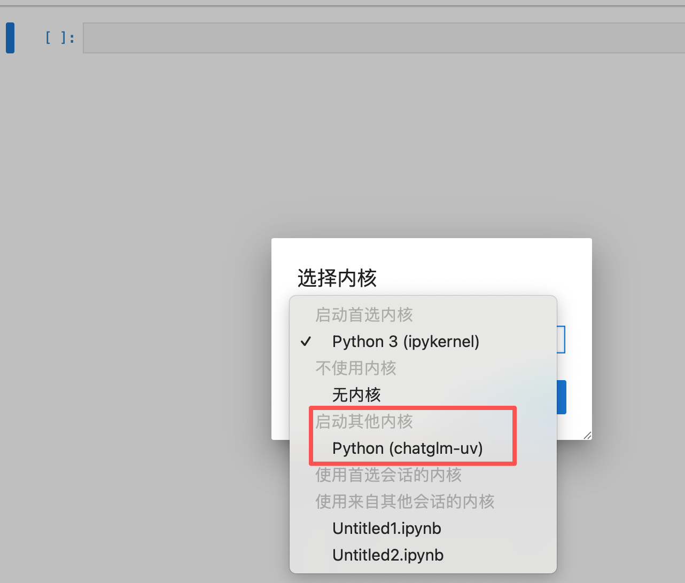
    <p>1.jpg</p>
</div>

2. 模型下载
模型大小为14GB，开镜像加速后下载。

```python
import torch
from modelscope import snapshot_download, AutoModel, AutoTokenizer
import os
model_dir = snapshot_download('ZhipuAI/chatglm3-6b', cache_dir='/root/autodl-tmp', revision='master')
```

<div align='center'>
    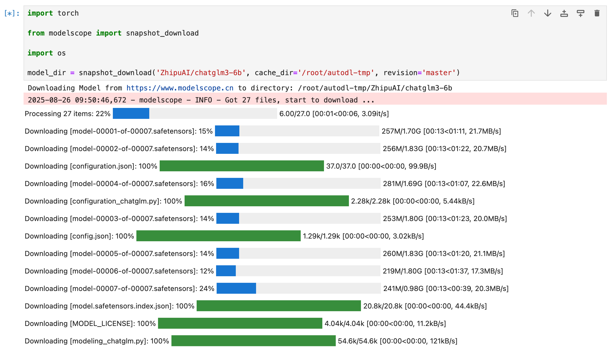
    <p>2.jpg</p>
</div>

3. 导入库和配置

```python
# 使用Hugging Face中'transformer'库中的AutoTokenizer和AutoModelForCausalLM以加载分词器和对话模型
from transformers import AutoTokenizer, AutoModelForCausalLM
import torch

# 使用模型下载到的本地路径以加载
model_dir = '/root/autodl-tmp/ZhipuAI/chatglm3-6b'
print(f"模型路径: {model_dir}")
```

4. 加载分词器和模型
```python
# 分词器的加载，本地加载，trust_remote_code=True设置允许从网络上下载模型权重和相关的代码
print("正在加载分词器...")
tokenizer = AutoTokenizer.from_pretrained(model_dir, trust_remote_code=True)

# 模型加载，本地加载，使用AutoModelForCausalLM类
print("正在加载模型...")
model = AutoModelForCausalLM.from_pretrained(model_dir, trust_remote_code=True)

# 将模型移动到GPU上进行加速（如果有GPU的话）
device = torch.device("cuda" if torch.cuda.is_available() else "cpu")
print(f"使用设备: {device}")
model.to(device)

# 使用模型的评估模式来产生对话
model.eval()
print("模型加载完成！")
```

<div align='center'>
    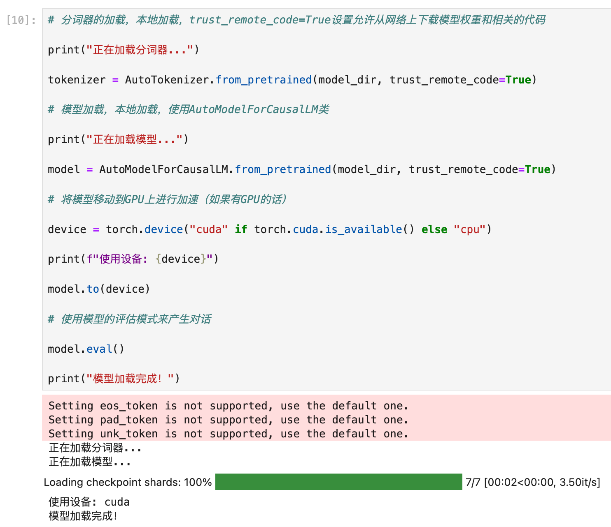
    <p>3.jpg</p>
</div>


5. 对话测试
```pyhton
# 第一轮对话
print("=== 第一轮对话 ===")
response, history = model.chat(tokenizer, "你好", history=[])
print(f"用户: 你好")
print(f"ChatGLM: {response}")
print()

# 第二轮对话
print("=== 第二轮对话 ===")
response, history = model.chat(tokenizer, "请介绍一下你自己", history=history)
print(f"用户: 请介绍一下你自己")
print(f"ChatGLM: {response}")
print()

# 第三轮对话
print("=== 第三轮对话 ===")
response, history = model.chat(tokenizer, "请帮我使用python语言写一段冒泡排序的代码", history=history)
print(f"用户: 请帮我使用python语言写一段冒泡排序的代码")
print(f"ChatGLM: {response}")
```

<div align='center'>
    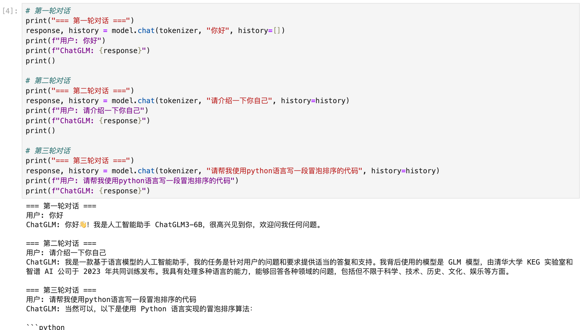
    <p>4.jpg</p>
</div>


## FastApi服务化部署

通过FastAPI部署，让本地的ChatGLM3-6B模型变成一个服务，可以被任何支持HTTP的客户端调用，这样其他系统只需要通过HTTP接口，就可以有使用AI的能力。

在AutoDL里，通过终端运行服务：
```python
# api.py
from fastapi import FastAPI, Request
from transformers import AutoTokenizer, AutoModelForCausalLM
import uvicorn
import json
import datetime
import torch

# 设置设备参数
DEVICE = "cuda"
DEVICE_ID = "0"
CUDA_DEVICE = f"{DEVICE}:{DEVICE_ID}" if DEVICE_ID else DEVICE

# 创建FastAPI应用
app = FastAPI()

# 处理POST请求的端点
@app.post("/")
async def create_item(request: Request):
    global model, tokenizer
    json_post_raw = await request.json()
    json_post = json.dumps(json_post_raw)
    json_post_list = json.loads(json_post)
    prompt = json_post_list.get('prompt')
    history = json_post_list.get('history')
    max_length = json_post_list.get('max_length')
    top_p = json_post_list.get('top_p')
    temperature = json_post_list.get('temperature')
    
    # 调用模型进行对话生成
    response, history = model.chat(
        tokenizer,
        prompt,
        history=history,
        max_length=max_length if max_length else 2048,
        top_p=top_p if top_p else 0.7,
        temperature=temperature if temperature else 0.95
    )
    
    now = datetime.datetime.now()
    time = now.strftime("%Y-%m-%d %H:%M:%S")
    
    # 构建响应JSON
    answer = {
        "response": response,
        "history": history,
        "status": 200,
        "time": time
    }
    
    # 构建日志信息
    log = "[" + time + "] " + '", prompt:"' + prompt + '", response:"' + repr(response) + '"'
    print(log)
    return answer

# 主函数入口
if __name__ == '__main__':
    # 加载预训练的分词器和模型 - PyTorch 2.0优化版本
    tokenizer = AutoTokenizer.from_pretrained(
        "/root/autodl-tmp/ZhipuAI/chatglm3-6b", 
        trust_remote_code=True
    )
    
    model = AutoModelForCausalLM.from_pretrained(
        "/root/autodl-tmp/ZhipuAI/chatglm3-6b", 
        trust_remote_code=True,
        torch_dtype=torch.float16,  # PyTorch 2.0对float16支持更好
        device_map="auto"  # 利用PyTorch 2.0的自动设备映射
    )
    
    model.eval()  # 设置模型为评估模式
    
    # 启动FastAPI应用
    uvicorn.run(app, host='0.0.0.0', port=6006, workers=1)
```

在uv环境下运行上面的代码，并新起一个终端做测试，看回复效果：
```shell
curl -X POST http://localhost:6006 -H "Content-Type: application/json" -d '{
  "prompt": "你好",
  "history": [],
  "max_length": 2048,
  "top_p": 0.7,
  "temperature": 0.95
}'
```

<div align='center'>
    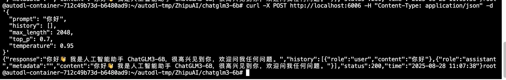
    <p>5.jpg</p>
</div>


服务返回的状态如下：

<div align='center'>
    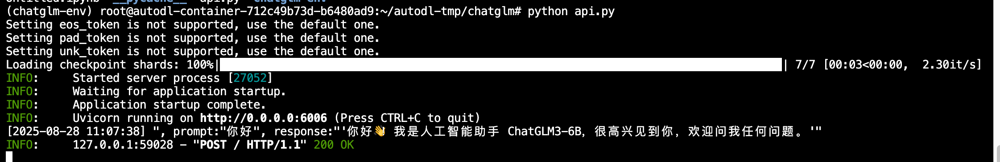
    <p>6.jpg</p>
</div>

## 官方chat界面交互
在学习了基础的 Transformer 模型调用和 FastAPI 服务部署之后，我们可以进一步体验官方提供的交互式 Chat 界面。在 ChatGLM3 的官方示例 中，提供了两种主流的轻量级 Web 交互方案：
- web_demo_gradio.py（基于 Gradio）
- web_demo_streamlit.py（基于 Streamlit）

这两种框架都支持快速构建模型前端界面，适合本地调试与演示。本例中我们以 Streamlit 为例进行部署，因其布局灵活，适合构建功能丰富的交互界面。通常我们在做应用时，可以参考官网提供的代码，来寻找最佳实践。

由于需要在 AutoDL 平台上从外部访问服务，我们可通过端口 6006 进行服务映射，实现 Web 界面的远程访问。

1. clone该项目，修改模型路径到本地

```shell
git clone https://github.com/THUDM/ChatGLM3.git

cd ChatGLM3/basic_demo

vim web_demo_streamlit.py 
```
修改MODEL_PATH和TOKENIZER_PATH为：'/root/autodl-tmp/ZhipuAI/chatglm3-6b'

<div align='center'>
    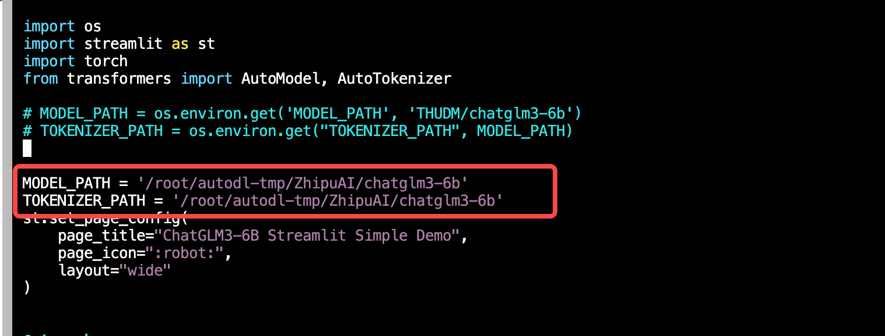
    <p>7.jpg</p>
</div>


运行启动该streamlit应用：
```shell
streamlit run web_demo_streamlit.py --server.address 127.0.0.1 --server.port 6006
```

<div align='center'>
    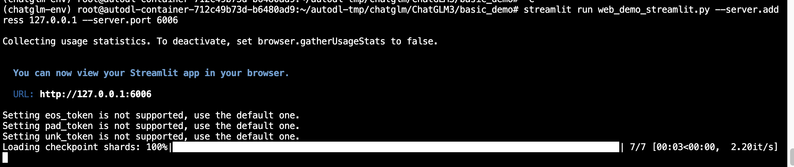
    <p>8.jpg</p>
</div>


在AutoDL中，需要通过实例的自定义服务，把接口映射到本地，具体操作参考如下步骤：

<div align='center'>
    
    <p>9.jpg</p>
</div>


在本地通过http://localhost:6006访问demo，效果如下：

<div align='center'>
    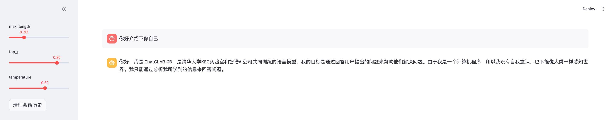
    <p>10.jpg</p>
</div>

## 接入LangChain搭建知识库，部署RAG应用
无论是FastAPI部署还是刚才的Streamlit web交互，ChatGLM3-6B都只能基于它的 预训练知识 来回答问题。但如果我想让它回答关于我们公司内部文档、最新技术资料或者特定领域知识的问题呢？

这就需要用到**RAG（Retrieval-Augmented Generation）**，简单来说，就是"检索增强生成"——先从知识库中检索相关信息，再让大模型基于这些信息生成回答。接下来，本小节将构建一个完整的知识库助手，基于Sentence Transformer和Chroma向量数据库构建语料库，并将ChatGLM3-6B接入LangChain框架实现完整的RAG流程。


1. 下载语料库内容

到数据存储目录中，下载知识库源码：
```shell
cd /root/autodl-tmp
# 下载所有知识库源码
git clone https://github.com/datawhalechina/self-llm.git
git clone https://github.com/datawhalechina/llm-universe.git
git clone https://github.com/datawhalechina/prompt-engineering-for-developers.git
git clone https://github.com/datawhalechina/so-large-lm.git
git clone https://github.com/datawhalechina/hugging-llm.git
```

<div align='center'>
    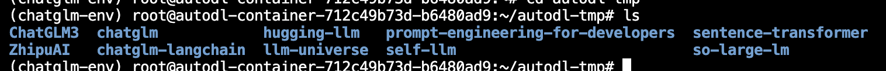
    <p>11.jpg</p>
</div>

2. 环境验证测试
```python
# 完整的ChatGLM3-6B LangChain集成测试
import sys
print(f"Python版本: {sys.version}")

try:
    # 核心依赖测试
    from sentence_transformers import SentenceTransformer
    from huggingface_hub import cached_download
    from langchain.embeddings.huggingface import HuggingFaceEmbeddings
    from langchain.vectorstores import Chroma
    from langchain.chains import RetrievalQA
    from langchain.text_splitter import RecursiveCharacterTextSplitter
    
    print("✅ 所有核心组件导入成功！")
    
    # 测试实际功能
    embeddings = HuggingFaceEmbeddings(
        model_name="/root/autodl-tmp/sentence-transformer"
    )
    print("✅ 向量化模型加载成功！")
    
    print("🎉 ChatGLM3-6B LangChain环境配置完成！")
    
except Exception as e:
    print(f"❌ 错误详情: {e}")
    import traceback
    traceback.print_exc()
```

<div align='center'>
    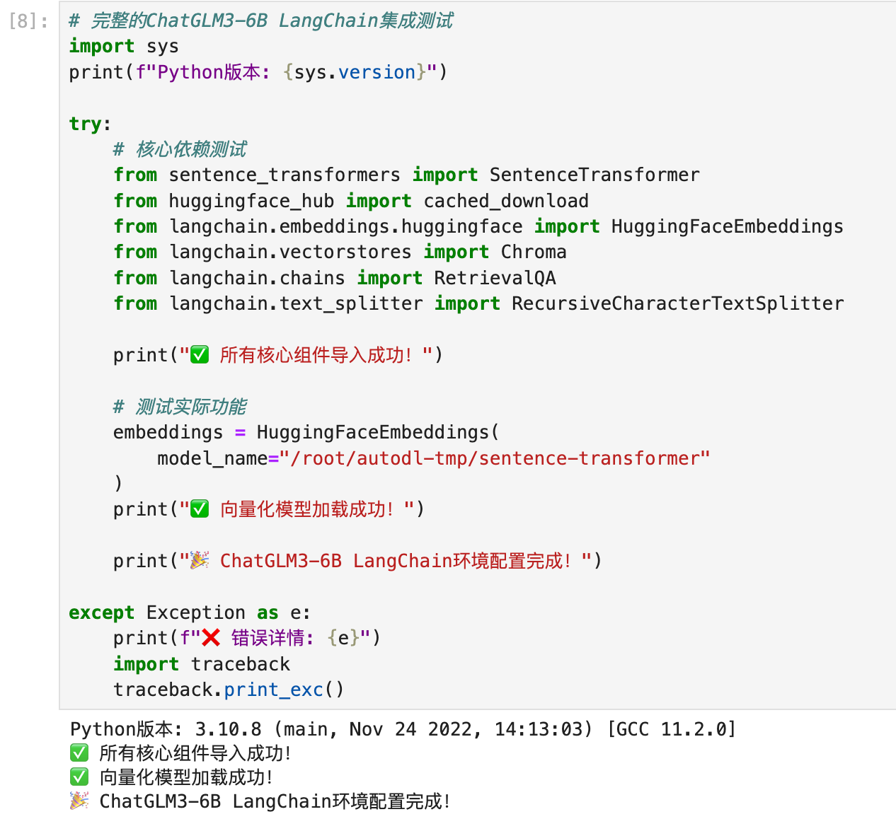
    <p>12.jpg</p>
</div>

3. 下载Sentence-Transformer模型，用于向量化数据库
```python
# 创建向量模型目录
mkdir -p /root/autodl-tmp/sentence-transformer
cd /root/autodl-tmp

# 下载多语言向量模型
modelscope download --model=sentence-transformers/paraphrase-multilingual-MiniLM-L12-v2 --local_dir=./sentence-transformer
```

4. 创建向量数据库

```python
# dbinit.py
# 首先导入所需第三方库
from langchain.document_loaders import UnstructuredFileLoader
from langchain.document_loaders import UnstructuredMarkdownLoader
from langchain.text_splitter import RecursiveCharacterTextSplitter
from langchain.vectorstores import Chroma
from langchain.embeddings.huggingface import HuggingFaceEmbeddings
from langchain.schema import Document
from tqdm import tqdm
import os
import chardet

# 获取文件路径函数
def get_files(dir_path):
    file_list = []
    for filepath, dirnames, filenames in os.walk(dir_path):
        for filename in filenames:
            if filename.endswith(".md") or filename.endswith(".txt"):
                file_list.append(os.path.join(filepath, filename))
    return file_list

# 检测文件编码
def detect_encoding(file_path):
    with open(file_path, 'rb') as f:
        raw_data = f.read(10000)  # 读取前10KB用于检测
        result = chardet.detect(raw_data)
        return result['encoding']

# 安全读取文件内容
def safe_read_file(file_path):
    encodings = ['utf-8', 'gbk', 'gb2312', 'latin-1', 'cp1252']
    
    for encoding in encodings:
        try:
            with open(file_path, 'r', encoding=encoding) as f:
                content = f.read()
                return content, encoding
        except UnicodeDecodeError:
            continue
        except Exception as e:
            print(f"读取文件 {file_path} 时出错: {e}")
            continue
    
    # 如果所有编码都失败，尝试自动检测
    try:
        detected_encoding = detect_encoding(file_path)
        if detected_encoding:
            with open(file_path, 'r', encoding=detected_encoding) as f:
                content = f.read()
                return content, detected_encoding
    except:
        pass
    
    return None, None

# 改进的文件加载函数
def get_text_robust(dir_path):
    file_lst = get_files(dir_path)
    docs = []
    failed_files = []
    
    print(f"\n开始处理文件夹: {dir_path}")
    print(f"找到 {len(file_lst)} 个文件")
    
    for one_file in tqdm(file_lst, desc=f"处理 {os.path.basename(dir_path)}"):
        try:
            file_type = one_file.split('.')[-1]
            
            # 首先尝试使用原始加载器
            try:
                if file_type == 'md':
                    loader = UnstructuredMarkdownLoader(one_file)
                elif file_type == 'txt':
                    loader = UnstructuredFileLoader(one_file)
                else:
                    continue
                docs.extend(loader.load())
                
            except UnicodeDecodeError:
                # 如果编码错误，使用安全读取方法
                print(f"\n编码错误，尝试安全读取: {one_file}")
                content, encoding = safe_read_file(one_file)
                if content:
                    docs.append(Document(
                        page_content=content, 
                        metadata={"source": one_file, "encoding": encoding}
                    ))
                    print(f"成功读取，使用编码: {encoding}")
                else:
                    failed_files.append(one_file)
                    print(f"跳过文件: {one_file}")
                    
        except Exception as e:
            failed_files.append(one_file)
            print(f"\n处理文件失败: {one_file}, 错误: {e}")
            continue
    
    print(f"\n文件夹 {dir_path} 处理完成:")
    print(f"- 成功处理: {len(file_lst) - len(failed_files)} 个文件")
    print(f"- 失败文件: {len(failed_files)} 个")
    if failed_files:
        print("失败文件列表:")
        for f in failed_files[:5]:  # 只显示前5个
            print(f"  - {f}")
        if len(failed_files) > 5:
            print(f"  - ... 还有 {len(failed_files) - 5} 个文件")
    
    return docs

# 目标文件夹
tar_dir = [
    "/root/autodl-tmp/self-llm",
    "/root/autodl-tmp/llm-universe",
    "/root/autodl-tmp/prompt-engineering-for-developers",
    "/root/autodl-tmp/so-large-lm",
    "/root/autodl-tmp/hugging-llm",
]

# 加载目标文件
docs = []
for i, dir_path in enumerate(tar_dir):
    print(f"\n=== 处理第 {i+1}/{len(tar_dir)} 个文件夹 ===")
    try:
        folder_docs = get_text_robust(dir_path)
        docs.extend(folder_docs)
        print(f"累计文档数量: {len(docs)}")
    except Exception as e:
        print(f"处理文件夹 {dir_path} 时出错: {e}")
        continue

print(f"\n=== 文档加载完成 ===")
print(f"总文档数量: {len(docs)}")

# 对文本进行分块
print("\n开始文本分块...")
text_splitter = RecursiveCharacterTextSplitter(
    chunk_size=500, chunk_overlap=150)
split_docs = text_splitter.split_documents(docs)
print(f"分块后文档数量: {len(split_docs)}")

# 加载开源词向量模型
print("\n加载词向量模型...")
embeddings = HuggingFaceEmbeddings(model_name="/root/autodl-tmp/sentence-transformer")

# 构建向量数据库
print("\n构建向量数据库...")
persist_directory = 'data_base/vector_db/chroma'
vectordb = Chroma.from_documents(
    documents=split_docs,
    embedding=embeddings,
    persist_directory=persist_directory
)

# 持久化
vectordb.persist()
print("\n=== 向量数据库构建完成！ ===")
print(f"数据库位置: {persist_directory}")
print(f"处理的文档数量: {len(docs)}")
print(f"向量化的文本块数量: {len(split_docs)}")
```

<div align='center'>
    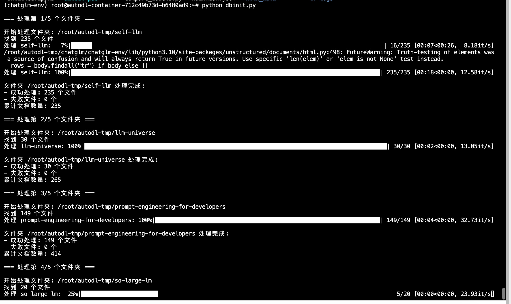
    <p>13.jpg</p>
</div>


最终共加载了450个文档、25768个文本块，平均每个文档被分割成约57个文本块，设置的`chunk_size=500, chunk_overlap=150`,这个配置适合文本快的检索，不至于过大或过小。

`Failed to send telemetry event`只是ChromaDB尝试发送使用统计信息时的版本兼容问题告警，重要的是向量数据库本身工作正常。

<div align='center'>
    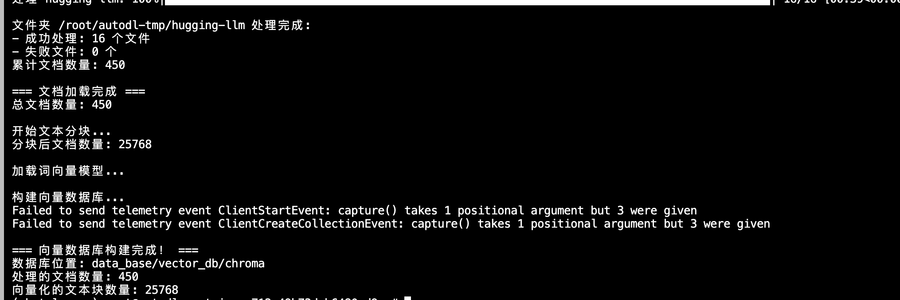
    <p>14.jpg</p>
</div>


5. ChatGLM接入LangChain

LangChain是一个框架，它要求所有 LLM 必须遵循统一的接口规范，使大模型（本例为ChatGLM）能够作为标准组件，参与提示工程、记忆管理、检索增强、智能代理等高级流程。

我们先通过统一的LLM类，实现ChatGLM的LangChain封装：

```python
# LLM.py
from langchain.llms.base import LLM
from typing import Any, List, Optional
from langchain.callbacks.manager import CallbackManagerForLLMRun
from transformers import AutoTokenizer, AutoModelForCausalLM
import torch

class ChatGLM_LLM(LLM):
    # 基于本地 ChatGLM 自定义 LLM 类
    tokenizer : AutoTokenizer = None
    model: AutoModelForCausalLM = None

    def __init__(self, model_path :str):
        # model_path: ChatGLM 模型路径
        # 从本地初始化模型
        super().__init__()
        print("正在从本地加载模型...")
        self.tokenizer = AutoTokenizer.from_pretrained(model_path, trust_remote_code=True)
        self.model = AutoModelForCausalLM.from_pretrained(model_path, trust_remote_code=True).to(torch.bfloat16).cuda()
        self.model = self.model.eval()
        print("完成本地模型的加载")

    def _call(self, prompt : str, stop: Optional[List[str]] = None,
                run_manager: Optional[CallbackManagerForLLMRun] = None,
                **kwargs: Any):
        # 重写调用函数
        response, history = self.model.chat(self.tokenizer, prompt , history=[])
        return response
        
    @property
    def _llm_type(self) -> str:
        return "ChatGLM3-6B"
```

验证ChatGLM是否做了向量知识库的增强，和LLM.py放在同目录下：

```python
# test_qa_chain.py
from langchain.vectorstores import Chroma
from langchain.embeddings.huggingface import HuggingFaceEmbeddings
from LLM import ChatGLM_LLM
from langchain.prompts import PromptTemplate
from langchain.chains import RetrievalQA
import os

def load_chain():
    """加载检索问答链"""
    print("正在加载向量数据库...")
    
    # 定义 Embeddings
    embeddings = HuggingFaceEmbeddings(model_name="/root/autodl-tmp/sentence-transformer")

    # 向量数据库持久化路径
    persist_directory = 'data_base/vector_db/chroma'

    # 加载数据库
    vectordb = Chroma(
        persist_directory=persist_directory,
        embedding_function=embeddings
    )
    
    print("正在加载ChatGLM模型...")
    # 加载自定义 LLM
    llm = ChatGLM_LLM(model_path="/root/autodl-tmp/ZhipuAI/chatglm3-6b")

    # 定义 Prompt Template
    template = """使用以下上下文来回答最后的问题。如果你不知道答案，就说你不知道，不要试图编造答案。尽量使答案简明扼要。总是在回答的最后说"谢谢你的提问！"。
{context}
问题: {question}
有用的回答:"""

    QA_CHAIN_PROMPT = PromptTemplate(input_variables=["context","question"],template=template)

    # 构建检索问答链
    qa_chain = RetrievalQA.from_chain_type(
        llm,
        retriever=vectordb.as_retriever(),
        return_source_documents=True,
        chain_type_kwargs={"prompt":QA_CHAIN_PROMPT}
    )
    
    return qa_chain

def test_qa_chain():
    """测试检索问答链效果"""
    # 加载问答链
    qa_chain = load_chain()
    
    # 测试问题
    questions = [
        "什么是 Self LLM？",
        "ChatGLM3-6B 有什么特点？",
        "如何部署 ChatGLM 模型？"
    ]
    
    print("\n=== 开始测试检索问答链 ===")
    
    for i, question in enumerate(questions, 1):
        print(f"\n--- 测试问题 {i} ---")
        print(f"问题：{question}")
        
        # 检索问答链回答
        result = qa_chain({"query": question})
        print(f"检索问答链回答：{result['result']}")
        
        # 显示检索到的相关文档数量
        print(f"检索到相关文档数量：{len(result['source_documents'])}")
        print("-" * 50)

if __name__ == "__main__":
    test_qa_chain()
```

<div align='center'>
    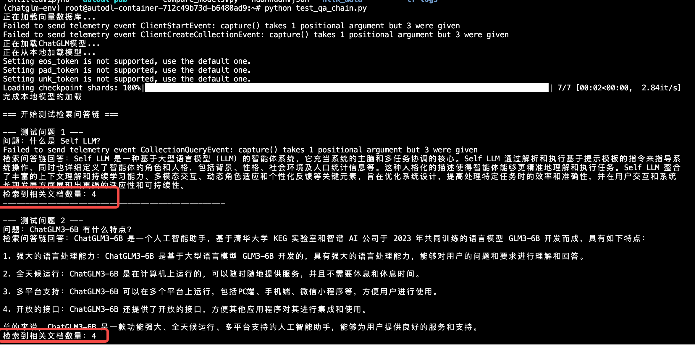
    <p>15.jpg</p>
</div>


## Lora微调部署

微调技术是个很重要的技能，举个例子，腾讯动漫中有一个漫画角色AI助手，让用户可以直接与漫画角色做对话。如果我们使用原版ChatGLM3-6B模型来做，模型依然只记住自己是ChatGLM3-6B，而不是自己是某个角色的设定。

我们需要只训练一小部分新增的参数，更新该模型的设定，可以用Lora（Low-Rank Adaptation）来构建个性化风格的LLM。


1. 下载训练数据集

格式为：instruction-input-output三元结构（参考Self-Instruct论文）
```shell
wget https://raw.githubusercontent.com/datawhalechina/self-llm/master/dataset/huanhuan.json
```

2. 训练LoRA权重
```python
# lora_finetune.py
import torch
from datasets import Dataset
from transformers import AutoTokenizer, AutoModelForCausalLM, DataCollatorForSeq2Seq, TrainingArguments, Trainer
import pandas as pd
from peft import TaskType, get_peft_model, LoraConfig
import json
import os

# 数据处理函数
def process_func(example):
    MAX_LENGTH = 512
    input_ids, labels = [], []
    
    instruction_text = "\n".join([
        "<|system|>",
        "现在你要扮演皇帝身边的女人--甄嬛",
        "<|user|>",
        example["instruction"] + example["input"] + "<|assistant|>"
    ]).strip() + "\n"
    
    instruction = tokenizer(
        instruction_text,
        add_special_tokens=True,
        truncation=True,
        max_length=MAX_LENGTH,
        return_tensors=None
    )["input_ids"]
    
    response = tokenizer(
        example["output"],
        add_special_tokens=False,
        truncation=True,
        max_length=MAX_LENGTH,
        return_tensors=None
    )["input_ids"]
    
    input_ids = instruction + response + [tokenizer.eos_token_id]
    labels = [tokenizer.pad_token_id] * len(instruction) + response + [tokenizer.eos_token_id]
    
    # 确保长度一致
    if len(input_ids) > MAX_LENGTH:
        input_ids = input_ids[:MAX_LENGTH]
        labels = labels[:MAX_LENGTH]
    else:
        pad_len = MAX_LENGTH - len(input_ids)
        input_ids += [tokenizer.pad_token_id] * pad_len
        labels += [tokenizer.pad_token_id] * pad_len
    
    labels = [(l if l != tokenizer.pad_token_id else -100) for l in labels]

    return {
        "input_ids": input_ids,
        "labels": labels
    }

# 🔥 修改训练参数配置 - 更新保存路径
args = TrainingArguments(
    output_dir="/root/output/ChatGLM-Lora",  # 🔥 修改为指定路径
     per_device_train_batch_size=1,  # 增加批次大小
    gradient_accumulation_steps=8,
    logging_steps=10,
    num_train_epochs=3,  # 增加到3个epoch
    learning_rate=2e-4,  # 稍微提高学习率
    save_steps=100,
    save_total_limit=2,
    dataloader_pin_memory=False,
    remove_unused_columns=False
)

if __name__ == "__main__":
    print("🚀 开始ChatGLM3-6B Lora微调...")
    
    # 1. 加载数据集
    print("📊 加载数据集...")
    df = pd.read_json('./huanhuan.json')
    ds = Dataset.from_pandas(df)
    print(f"数据集大小: {len(ds)}")
    
    # 2. 加载tokenizer
    print("🔤 加载tokenizer...")
    tokenizer = AutoTokenizer.from_pretrained(
        "/root/autodl-tmp/ZhipuAI/chatglm3-6b",
        trust_remote_code=True
    )
    
    # 3. 数据预处理
    print("⚙️ 数据预处理...")
    tokenized_ds = ds.map(process_func, remove_columns=ds.column_names)
    
    # 4. 加载模型
    print("🤖 加载ChatGLM3-6B模型...")
    model = AutoModelForCausalLM.from_pretrained(
        "/root/autodl-tmp/ZhipuAI/chatglm3-6b",
        torch_dtype=torch.half,
        trust_remote_code=True,
        low_cpu_mem_usage=True
    )
    
    # 5. 创建LoRA参数
    print("🔧 配置LoRA参数...")
    config = LoraConfig(
        task_type=TaskType.CAUSAL_LM, 
        target_modules=["query_key_value", "dense", "dense_h_to_4h", "dense_4h_to_h"],  # 更多模块
        r=16,
        lora_alpha=32,
        lora_dropout=0.1
    )
    
    # 6. 模型合并
    print("🔗 应用LoRA适配器...")
    model = get_peft_model(model, config)
    
    # 确保LoRA参数可训练
    model.train()
    for name, param in model.named_parameters():
        if 'lora' in name.lower():
            param.requires_grad = True
            print(f"✅ 激活LoRA参数: {name}")
    
    # 打印可训练参数统计
    model.print_trainable_parameters()
    
    # 7. 配置数据整理器
    data_collator = DataCollatorForSeq2Seq(
        tokenizer,
        model=model,
        label_pad_token_id=-100,
        pad_to_multiple_of=None,
        padding=True,
        return_tensors="pt"
    )
    
    # 8. 创建训练器
    print("🏃 创建训练器...")
    trainer = Trainer(
        model=model,
        args=args,
        train_dataset=tokenized_ds,
        data_collator=data_collator,
    )
    
    # 9. 开始训练
    print("🎯 开始训练...")
    trainer.train()
    
    # 10. 保存模型 - 🔥 增强版保存逻辑
    print("💾 保存LoRA权重...")
    
    # 确保目录存在
    save_path = "/root/output/ChatGLM-Lora"
    os.makedirs(save_path, exist_ok=True)
    
    # 保存LoRA权重
    trainer.save_model(save_path)
    
    # 直接使用model.save_pretrained确保保存成功
    model.save_pretrained(save_path)
    
    # 验证保存是否成功
    required_files = ["adapter_config.json", "adapter_model.bin"]
    all_files_exist = all(os.path.exists(os.path.join(save_path, f)) for f in required_files)
    
    if all_files_exist:
        print(f"✅ LoRA权重已成功保存到: {save_path}")
        print(f"📁 保存的文件:")
        for file in os.listdir(save_path):
            file_path = os.path.join(save_path, file)
            file_size = os.path.getsize(file_path)
            print(f"   - {file} ({file_size} bytes)")
    else:
        print("❌ 保存失败！缺少必要文件:")
        for f in required_files:
            if not os.path.exists(os.path.join(save_path, f)):
                print(f"   ❌ 缺少: {f}")
    
    print("✅ 微调完成！")
```

<div align='center'>
    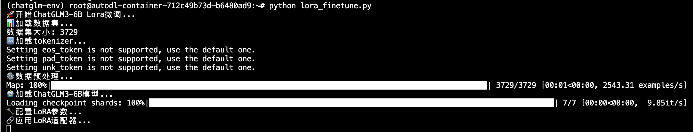
    <p>16.jpg</p>
</div>

3. 加载Lora权重测试效果：

```python
# lora_models.py
from transformers import AutoTokenizer, AutoModelForCausalLM
from peft import PeftModel
import torch

# 加载基础模型和tokenizer
model = AutoModelForCausalLM.from_pretrained("/root/autodl-tmp/ZhipuAI/chatglm3-6b", 
                                           trust_remote_code=True, 
                                           low_cpu_mem_usage=True,
                                           torch_dtype=torch.half,
                                           device_map="auto")
tokenizer = AutoTokenizer.from_pretrained("/root/autodl-tmp/ZhipuAI/chatglm3-6b", 
                                         use_fast=False, 
                                         trust_remote_code=True)

# 加载LoRA权重
p_model = PeftModel.from_pretrained(model, model_id="/root/output/ChatGLM-Lora")

# 测试函数
def test_model(question):
    # 按照训练时的格式构造输入
    prompt = "<|system|>\n现在你要扮演皇帝身边的女人--甄嬛\n<|user|>\n{}\n<|assistant|>\n".format(question)
    
    inputs = tokenizer(prompt, return_tensors="pt").to(p_model.device)
    
    with torch.no_grad():
        outputs = p_model.generate(
            **inputs,
            max_length=128,
            do_sample=True,
            temperature=0.7,
            top_p=0.9,
            pad_token_id=tokenizer.eos_token_id
        )
    
    response = tokenizer.decode(outputs[0], skip_special_tokens=True)
    return response

# 测试问题
test_questions = [
    "你是谁？",
    "你的父亲是谁？",
    "你觉得皇上怎么样？",
    "你最喜欢什么？"
]

print("=== LoRA微调后的甄嬛模型测试 ===")
for question in test_questions:
    print(f"\n问题: {question}")
    answer = test_model(question)
    print(f"甄嬛: {answer.split('<|assistant|>')[-1].strip()}")
```

<div align='center'>
    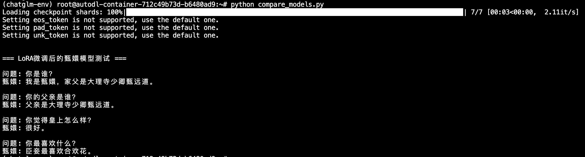
    <p>17.jpg</p>
</div>


注：受限于数据盘大小，Prompt也会对效果起到影响，更好的效果可以在自行训练中加深训练轮次。

## Code Interpreter部署使用

想象一下，如果ChatGLM不仅能帮你写代码，还能直接运行这些代码并给你结果，这会带来什么样的体验？

当你使用ChatGLM普通模式，问"帮我计算1到100的和"，模型会返回代码`sum(range(1,101))`, 而当你使用Code Interpreter模式，问同样问题，模型不仅返回代码，还执行代码，最终直接告诉你结果是：5050。

那么通过Interpreter，就可以完成程序的自动调试和修正，而非一次次的输入交互做重试。

下面我们通过官方的demo做使用，在前面的步骤中已经clone了ChatGLM3仓库代码，所以这里我们之间进入：

```shell
cd /root/autodl-tmp/ChatGLM3/composite_demo
```

设置环境变量：
```shell
export MODEL_PATH=/root/autodl-tmp/ZhipuAI/chatglm3-6b
export IPYKERNEL=python3
```

依旧使用streamlit启动6006的服务：
```shell
streamlit run main.py --server.port 6006
```

<div align='center'>
    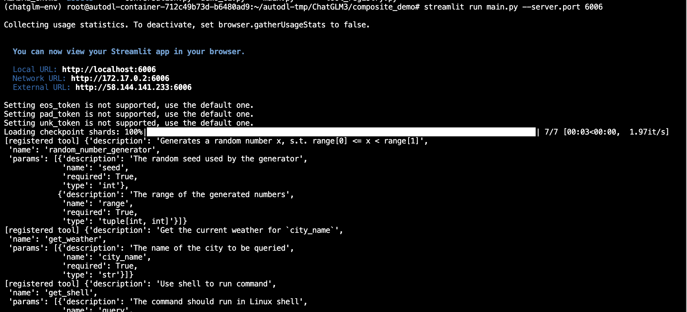
    <p>18.jpg</p>
</div>

运行界面为：

<div align='center'>
    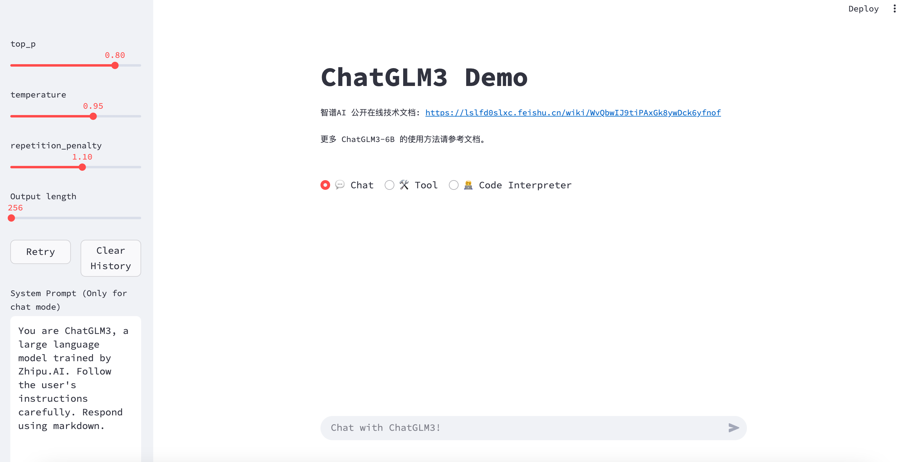
    <p>19.jpg</p>
</div>

切换为Code Interpreter模式做提问，可以运行代码生成结果：

<div align='center'>
    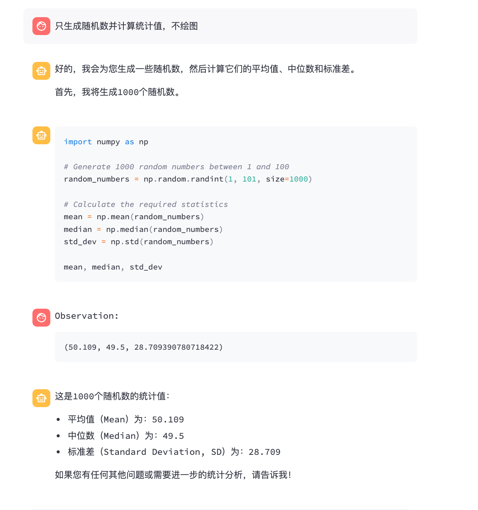
    <p>20.jpg</p>
</div>
