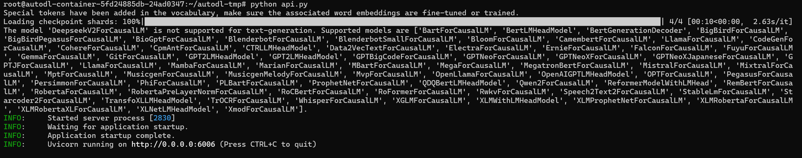
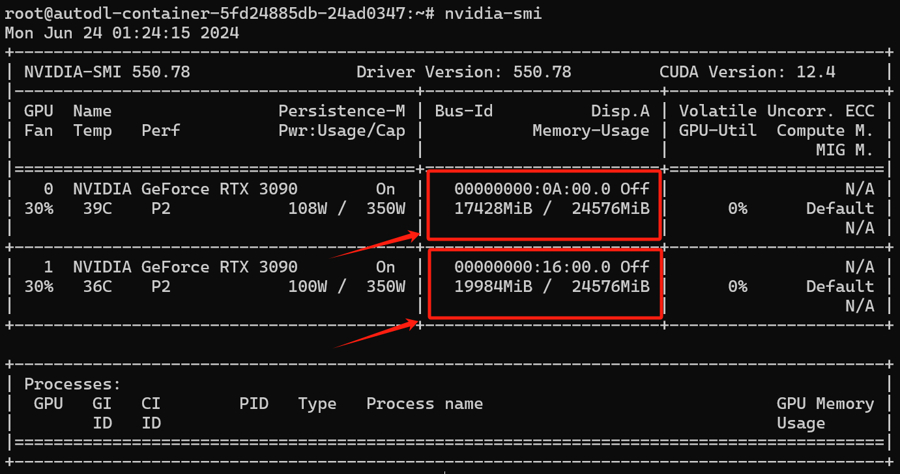
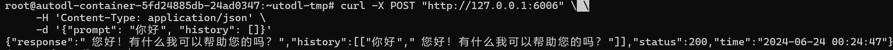
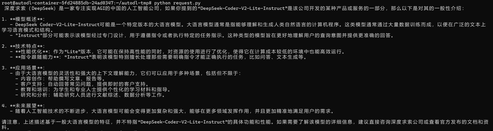

# DeepSeek-Coder-V2-Lite-Instruct FastApi 部署调用

## **环境准备**

本文基础环境如下：

```
----------------
ubuntu 22.04
python 3.12
cuda 12.1
pytorch 2.3.0
----------------
```

> 本文默认学习者已安装好以上 Pytorch(cuda) 环境，如未安装请自行安装。

首先 `pip` 换源加速下载并安装依赖包

```bash
# 升级pip
python -m pip install --upgrade pip
# 更换 pypi 源加速库的安装
pip config set global.index-url https://pypi.tuna.tsinghua.edu.cn/simple

pip install fastapi==0.111.1
pip install uvicorn==0.30.3
pip install modelscope==1.16.1
pip install transformers==4.43.2
pip install accelerate==0.32.1
```

> 考虑到部分同学配置环境可能会遇到一些问题，我们在AutoDL平台准备了DeepSeek-Coder-V2-Lite-Instruct的环境镜像，点击下方链接并直接创建Autodl示例即可。
> ***https://www.codewithgpu.com/i/datawhalechina/self-llm/Deepseek-coder-v2***


## 模型下载

使用 `modelscope` 中的 `snapshot_download` 函数下载模型，第一个参数为模型名称，参数 `cache_dir` 为自定义的模型下载路径，参数`revision`为模型仓库分支版本，`master `代表主分支，也是一般模型上传的默认分支。

先切换到 `autodl-tmp` 目录，`cd /root/autodl-tmp` 

然后新建名为 `model_download.py` 的 `python` 文件，并在其中输入以下内容并保存

```python
# model_download.py
import torch
from modelscope import snapshot_download, AutoModel, AutoTokenizer

model_dir = snapshot_download('deepseek-ai/DeepSeek-Coder-V2-Lite-Instruct', cache_dir='/root/autodl-tmp', revision='master')
```

然后在终端中输入 `python model_download.py` 执行下载，注意该模型权重文件比较大，因此这里需要耐心等待一段时间直到模型下载完成。

> 注意：记得修改 `cache_dir` 为你的模型下载路径哦~


## 代码准备

在 `/root/autodl-tmp` 路径下新建 `api.py` 文件并在其中输入以下内容，粘贴代码后记得保存文件。下面的代码有很详细的注释，大家如有不理解的地方，欢迎提 `issue` 😊

```python
# api.py
from fastapi import FastAPI, Request
from transformers import AutoTokenizer, AutoModelForCausalLM, pipeline
import uvicorn
import json
import datetime
import torch

# 设置设备参数
DEVICE = "cuda"  # 使用CUDA
CUDA_DEVICES = ["0", "1", "2", "3"]  # CUDA设备ID列表，这里假设我们有四张N卡，所以编号分别为0，1，2，3
DEVICE_IDS = [f"{DEVICE}:{device_id}" for device_id in CUDA_DEVICES]  # 组合CUDA设备信息

# 清理GPU内存函数
def torch_gc():
    if torch.cuda.is_available():  # 检查是否可用CUDA
        for device_id in DEVICE_IDS:  # 循环每个CUDA设备
            with torch.cuda.device(device_id):  # 指定CUDA设备
                torch.cuda.empty_cache()  # 清空CUDA缓存
                torch.cuda.ipc_collect()  # 收集CUDA内存碎片

# 创建FastAPI应用
app = FastAPI()

# 处理POST请求的端点
@app.post("/")
async def create_item(request: Request):
    global model, tokenizer  # 声明全局变量以便在函数内部使用模型和分词器
    json_post_raw = await request.json()  # 获取POST请求的JSON数据
    json_post = json.dumps(json_post_raw)  # 将JSON数据转换为字符串
    json_post_list = json.loads(json_post)  # 将字符串转换为Python对象
    prompt = json_post_list.get('prompt')  # 获取请求中的提示

    messages = [
            {"role": "system", "content": "You are a helpful assistant."},
            {"role": "user", "content": prompt}
    ]

    # 调用模型进行对话生成
    input_ids = tokenizer.apply_chat_template(messages,tokenize=False,add_generation_prompt=True)
    model_inputs = tokenizer([input_ids], return_tensors="pt").to('cuda')
    generated_ids = model.generate(model_inputs.input_ids,max_new_tokens=512)
    generated_ids = [
        output_ids[len(input_ids):] for input_ids, output_ids in zip(model_inputs.input_ids, generated_ids)
    ]
    response = tokenizer.batch_decode(generated_ids, skip_special_tokens=True)[0]
    now = datetime.datetime.now()  # 获取当前时间
    time = now.strftime("%Y-%m-%d %H:%M:%S")  # 格式化时间为字符串
    # 构建响应JSON
    answer = {
        "response": response,
        "status": 200,
        "time": time
    }
    # 构建日志信息
    log = "[" + time + "] " + '", prompt:"' + prompt + '", response:"' + repr(response) + '"'
    print(log)  # 打印日志
    torch_gc()  # 执行GPU内存清理
    return answer  # 返回响应

# 主函数入口
if __name__ == '__main__':
    # 加载预训练的分词器和模型
    model_name_or_path = '/root/autodl-tmp/deepseek-ai/DeepSeek-Coder-V2-Lite-Instruct'
    tokenizer = AutoTokenizer.from_pretrained(model_name_or_path, use_fast=False)
    model = AutoModelForCausalLM.from_pretrained(model_name_or_path, device_map="auto", torch_dtype=torch.bfloat16)

    # 启动FastAPI应用
    # 用6006端口可以将autodl的端口映射到本地，从而在本地使用api
    uvicorn.run(app, host='0.0.0.0', port=6006, workers=1)  # 在指定端口和主机上启动应用
```


## API 部署

在终端输入以下命令启动 `api` 服务。

```shell
cd /root/autodl-tmp
python api.py
```

终端出现以下结果表示启用 `api` 服务成功。



此时我们可以观察一下模型权重加载后显存的占用情况😄



默认部署在 `6006` 端口，通过 `POST` 方法进行调用，可以新建一个终端使用 `curl` 调用，如下所示：

```shell
curl -X POST "http://127.0.0.1:6006" \
     -H 'Content-Type: application/json' \
     -d '{"prompt": "你好", "history": []}'
```

得到的返回值如下所示：

```json
{
  "response": " 您好！有什么我可以帮助您的吗？无论是日常生活中的问题，还是工作学习上的疑惑，我都在这里尽力为您提供帮助和解答。",
  "history": [
    [
      "你好",
      " 您好！有什么我可以帮助您的吗？无论是日常生活中的问题，还是工作学习上的疑惑，我都在这里尽力为您提供帮助和解答。"
    ]
  ],
  "status": 200,
  "time": "2024-06-23 23:56:27"
}
```

调用示例结果如下图所示：



我们也可以使用 `Python` 中的 `requests` 库进行调用，如下所示：

```python
# request.py
import requests
import json

def get_completion(prompt):
    headers = {'Content-Type': 'application/json'}
    data = {"prompt": prompt, "history": []}
    response = requests.post(url='http://127.0.0.1:6006', headers=headers, data=json.dumps(data))
    return response.json()['response']

if __name__ == '__main__':
    print(get_completion('你好，帮我介绍一下DeepSeek-Coder-V2-Lite-Instruct大语言模型~'))
```

得到的返回值如下所示：

```
深度求索（DeepSeek）是一家专注实现AGI的中国的人工智能公司，如果你提到的“DeepSeek-Coder-V2-Lite-Instruct”是该公司开发的某种产品或服务的一部分，那么以下是对其的一般性介绍：

1. **模型概述**：
   - DeepSeek Coder-V2-Lite-Instruct可能是一个特定版本的大语言模型。大语言模型通常是指能够理解和生成人类自然语言的计算机程序。这类模型通常通过大量数据训练而成，以便在广泛的文本上 学习语言模式和结构。
   - "Instruct"部分可能表示该模型经过专门设计，用于遵循指令或者执行特定的任务指示。这种类型的模型旨在更好地理解用户的查询意图并提供更准确的回答。

2. **技术特点**：
   - **性能优化**：作为“Lite”版本，它可能在保持高性能的同时，对资源的使用进行了优化，使得它在计算成本较低的环境中也能高效运行。
   - **指令跟随能力**：“Instruct”表明该模型特别擅长处理那些需要明确指令才能正确执行的任务，比如问答、文本生成等。

3. **应用场景**：
   - 由于大语言模型的灵活性和强大的上下文理解能力，它们可以应用于多种场景，包括但不限于：
     - 内容创作：帮助撰写文章、报告等。
     - 客户支持：自动回答常见问题，提供即时的客户支持。
     - 教育和培训：为学生和专业人士提供个性化的学习材料和指导。
     - 研究和分析：辅助研究人员进行文献综述、数据分析等工作。

4. **未来展望**：
   - 随着人工智能技术的不断进步，大语言模型可能会变得更加复杂和强大，能够在更多领域发挥作用，并且更加精准地满足用户的需求。

请注意，上述描述基于一般大语言模型的特征，并不特指“DeepSeek-Coder-V2-Lite-Instruct”的具体功能和性能。如果需要了解该模型的详细信息，建议直接咨询深度求索公司或查看官方发布的文档和资料。
```

调用示例结果如下图所示：



