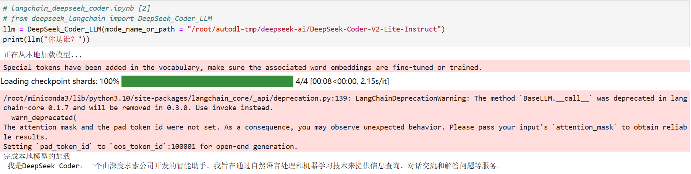
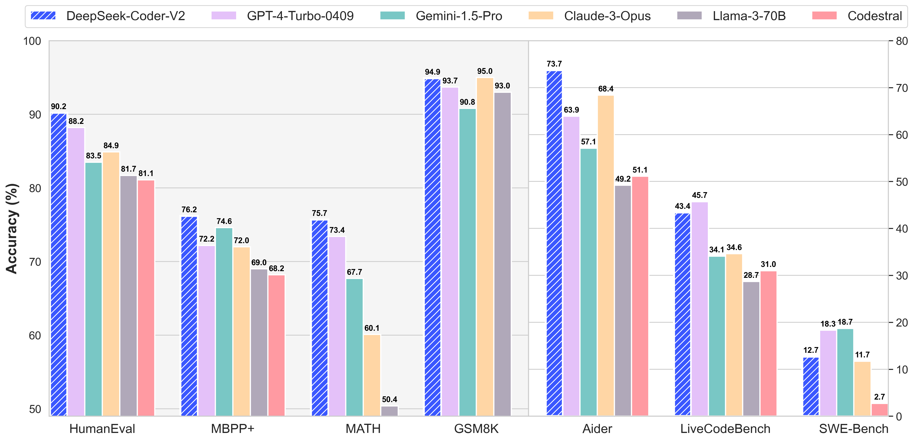
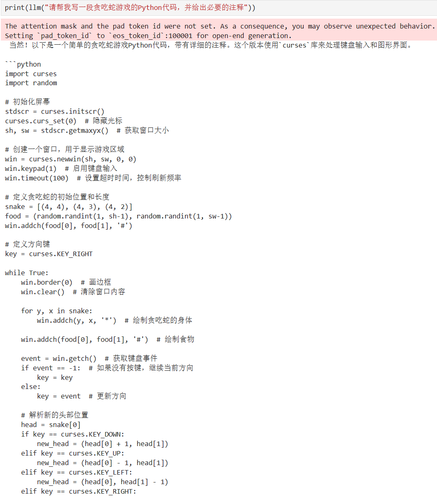

# DeepSeek-Coder-V2-Lite-Instruct 接入 LangChain

## **环境准备**

本文基础环境如下：

```
----------------
ubuntu 22.04
python 3.12
cuda 12.1
pytorch 2.3.0
----------------
```

> 本文默认学习者已安装好以上 Pytorch(cuda) 环境，如未安装请自行安装。

接下来开始环境配置、模型下载和运行演示 ~

`pip` 换源加速下载并安装依赖包

```shell
# 升级pip
python -m pip install --upgrade pip
# 更换 pypi 源加速库的安装
pip config set global.index-url https://pypi.tuna.tsinghua.edu.cn/simple

pip install modelscope==1.16.1
pip install langchain==0.2.3
pip install transformers==4.43.2
pip install accelerate==0.32.1
```

> 考虑到部分同学配置环境可能会遇到一些问题，我们在AutoDL平台准备了DeepSeek-Coder-V2-Lite-Instruct的环境镜像，点击下方链接并直接创建Autodl示例即可。
> ***https://www.codewithgpu.com/i/datawhalechina/self-llm/Deepseek-coder-v2***


## 模型下载

使用 `modelscope` 中的 `snapshot_download` 函数下载模型，第一个参数为模型名称，参数 `cache_dir` 为自定义的模型下载路径，参数`revision`为模型仓库分支版本，master代表主分支，也是一般模型上传的默认分支。

先切换到 `autodl-tmp` 目录，`cd /root/autodl-tmp` 

然后新建名为 `model_download.py` 的 `python` 脚本，并在其中输入以下内容并保存

```python
# model_download.py
import torch
from modelscope import snapshot_download, AutoModel, AutoTokenizer

model_dir = snapshot_download('deepseek-ai/DeepSeek-Coder-V2-Lite-Instruct', cache_dir='/root/autodl-tmp', revision='master')
```

然后在终端中输入 `python model_download.py` 执行下载，注意该模型权重文件比较大，因此这里需要耐心等待一段时间直到模型下载完成。


## 代码准备

为便捷构建 `LLM` 应用，我们需要基于本地部署的 `DeepSeek_Coder_LLM`，自定义一个 LLM 类，将 `DeepSeek-Coder-V2-Lite-Instruct` 接入到 `LangChain` 框架中。完成自定义 `LLM` 类之后，可以以完全一致的方式调用 `LangChain` 的接口，而无需考虑底层模型调用的不一致。

基于本地部署的 `DeepSeek-Coder-V2-Lite-Instruct` 自定义 `LLM` 类并不复杂，我们只需从 `LangChain.llms.base.LLM` 类继承一个子类，并重写构造函数与 `_call` 函数即可：

```python
# langchain_deepseek_coder.ipynb [1]
from langchain.llms.base import LLM
from typing import Any, List, Optional
from langchain.callbacks.manager import CallbackManagerForLLMRun
from transformers import AutoTokenizer, AutoModelForCausalLM, GenerationConfig, LlamaTokenizerFast
import torch

class DeepSeek_Coder_LLM(LLM):  # 定义一个继承自LLM的DeepSeek_Coder_LLM类
    # 类变量，初始化为None，将在初始化方法中被赋值
    tokenizer: AutoTokenizer = None
    model: AutoModelForCausalLM = None
        
    def __init__(self, mode_name_or_path: str):  # 初始化方法，接受模型路径或名称作为参数

        super().__init__()  # 调用父类的初始化方法
        print("正在从本地加载模型...")  # 打印加载模型的提示信息
        # 使用AutoTokenizer从预训练模型加载分词器
        self.tokenizer = AutoTokenizer.from_pretrained(mode_name_or_path, use_fast=False, trust_remote_code=True)
        # 使用AutoModelForCausalLM从预训练模型加载语言模型
        self.model = AutoModelForCausalLM.from_pretrained(
            mode_name_or_path,
            torch_dtype=torch.bfloat16,  # 设置PyTorch数据类型为bfloat16
            device_map="auto",  # 让模型自动选择设备
            trust_remote_code=True  # 信任远程代码
        )
        # 从预训练模型加载生成配置
        self.model.generation_config = GenerationConfig.from_pretrained(mode_name_or_path)
        print("完成本地模型的加载")  # 打印模型加载完成的提示信息
        
    def _call(self, prompt: str, stop: Optional[List[str]] = None,
               run_manager: Optional[CallbackManagerForLLMRun] = None,
               **kwargs: Any):  # 定义_call方法，用于生成文本

        messages = [{"role": "user", "content": prompt }]  # 定义消息列表，包含用户的角色和内容
        # 应用聊天模板，生成输入ID
        input_ids = self.tokenizer.apply_chat_template(messages, tokenize=False, add_generation_prompt=True)
        # 将输入ID转换为模型需要的输入格式，并转换为PyTorch张量
        model_inputs = self.tokenizer([input_ids], return_tensors="pt").to('cuda')
        # 使用模型生成文本，设置生成参数
        generated_ids = self.model.generate(
            model_inputs.input_ids,
            max_new_tokens=512,  # 最大新生成的token数
            top_k=5,  # 每次采样的token数
            top_p=0.8,  # 按概率分布采样
            temperature=0.3,  # 温度参数，影响生成文本的随机性
            repetition_penalty=1.1,  # 重复惩罚，避免重复生成相同的文本
            do_sample=True  # 是否使用采样
        )
        # 从生成的ID中提取实际生成的文本ID
        generated_ids = [
            output_ids[len(input_ids):] for input_ids, output_ids in zip(model_inputs.input_ids, generated_ids)
        ]
        # 将生成的ID解码为文本，并跳过特殊token
        response = self.tokenizer.batch_decode(generated_ids, skip_special_tokens=True)[0]
        return response  # 返回生成的文本

    @property
    def _llm_type(self) -> str:  # 定义一个属性，返回模型的类型
        return "DeepSeek_Coder_LLM"
```

在上述类定义中，我们分别重写了构造函数和 `_call` 函数：

- 对于构造函数，我们在对象实例化的一开始加载本地部署的 `DeepSeek-Coder-V2-Lite-Instruct` 模型，从而避免每一次调用都需要重新加载模型带来的时间浪费；

- `_call` 函数是 LLM 类的核心函数，`Langchain` 会调用改函数来调用 `LLM`，在改函数中，我们调用已实例化模型的 `generate` 方法，从而实现对模型的调用并返回调用结果。

此外，在实现自定义 `LLM` 类时，按照 `Langchain` 框架的要求，我们需要定义 `_identifying_params` 属性。这个属性的作用是返回一个字典，该字典包含了能够唯一标识这个 `LLM` 实例的参数。这个功能对于缓存和追踪非常重要，因为它能够帮助系统识别不同的模型配置，从而进行有效的缓存管理和日志追踪。

在整体项目中，我们将上诉代码封装为 `deepseek_langchain.py`，后续将直接从该文件中引入自定义的 `DeepSeek_Coder_LLM` 类。


## 模型调用

然后就可以像使用任何其他的 `Langchain` 大模型功能一样使用了。

我们先来简单测试一下模型的日常对话能力😊

```python
# langchain_deepseek_coder.ipynb [2]
# from deepseek_langchain import DeepSeek_Coder_LLM
llm = DeepSeek_Coder_LLM(mode_name_or_path = "/root/autodl-tmp/deepseek-ai/DeepSeek-Coder-V2-Lite-Instruct")
print(llm("你是谁？"))
```

得到的返回值如下所示：

```
我是DeepSeek Coder，一个由深度求索公司开发的智能助手。我旨在通过自然语言处理和机器学习技术来提供信息查询、对话交流和解答问题等服务。
```

调用示例结果如下图所示：



另外，根据官方的文档说明，`DeepSeek-Coder-V2-Lite-Instruct` 模型也有着极强的代码能力



所以我们不妨也来测试一个经典的代码问题🥰

```python
# langchain_deepseek_coder.ipynb [3]
print(llm("请帮我写一段贪吃蛇游戏的Python代码，并给出必要的注释"))

```

得到的返回值如下所示：

```python
当然！以下是一个简单的贪吃蛇游戏Python代码，带有详细的注释。这个版本使用`curses`库来处理键盘输入和图形界面。

```python
import curses
import random

# 初始化屏幕
stdscr = curses.initscr()
curses.curs_set(0)  # 隐藏光标
sh, sw = stdscr.getmaxyx()  # 获取窗口大小

# 创建一个窗口，用于显示游戏区域
win = curses.newwin(sh, sw, 0, 0)
win.keypad(1)  # 启用键盘输入
win.timeout(100)  # 设置超时时间，控制刷新频率

# 定义贪吃蛇的初始位置和长度
snake = [(4, 4), (4, 3), (4, 2)]
food = (random.randint(1, sh-1), random.randint(1, sw-1))
win.addch(food[0], food[1], '#')

# 定义方向键
key = curses.KEY_RIGHT

while True:
    win.border(0)  # 画边框
    win.clear()  # 清除窗口内容
    
    for y, x in snake:
        win.addch(y, x, '*')  # 绘制贪吃蛇的身体
    
    win.addch(food[0], food[1], '#')  # 绘制食物
    
    event = win.getch()  # 获取键盘事件
    if event == -1:  # 如果没有按键，继续当前方向
        key = key
    else:
        key = event  # 更新方向
    
    # 解析新的头部位置
    head = snake[0]
    if key == curses.KEY_DOWN:
        new_head = (head[0] + 1, head[1])
    elif key == curses.KEY_UP:
        new_head = (head[0] - 1, head[1])
    elif key == curses.KEY_LEFT:
        new_head = (head[0], head[1] - 1)
    elif key == curses.KEY_RIGHT:
```

调用示例结果如下图所示：


