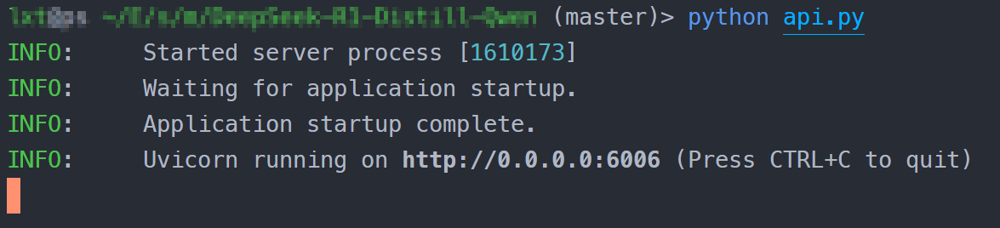
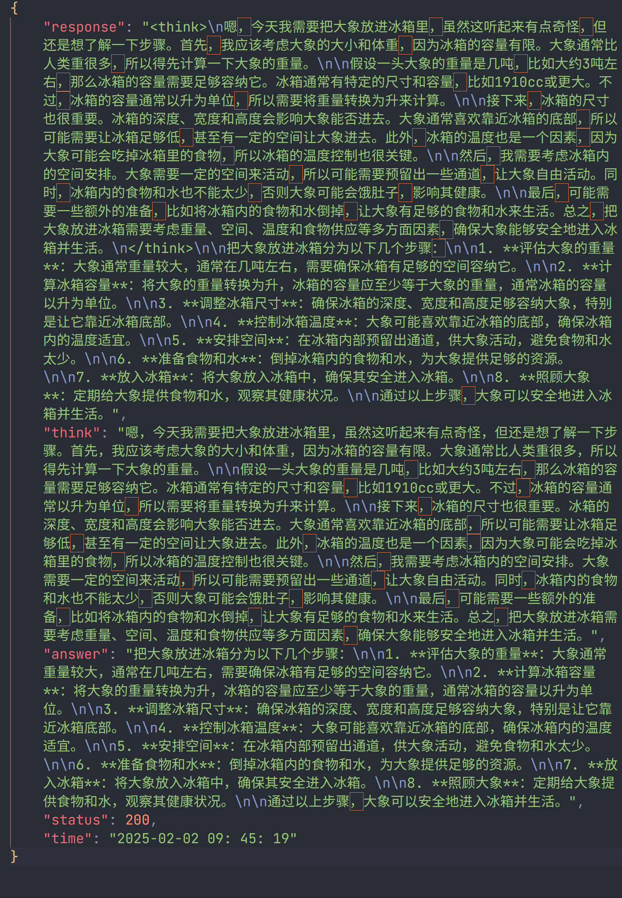
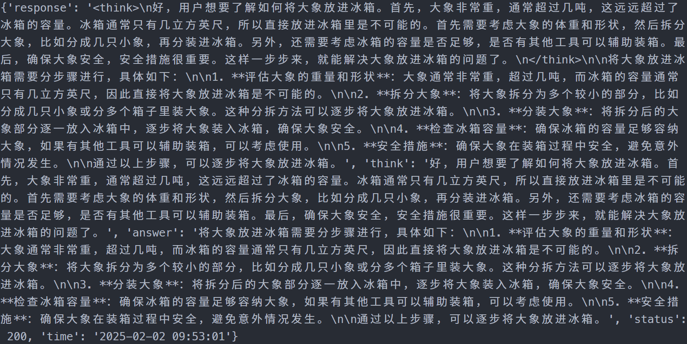

# DeepSeek-R1-Distill-Qwen-7B FastApi 部署调用

## 环境准备

本文基础环境如下：

```
----------------
ubuntu 22.04
python 3.12
cuda 12.1
pytorch 2.3.0
----------------
```

> 本文默认学习者已安装好以上 Pytorch(cuda) 环境，如未安装请自行安装。

首先 `pip` 换源加速下载并安装依赖包

```shell
# 升级pip
python -m pip install --upgrade pip
# 更换 pypi 源加速库的安装
pip config set global.index-url https://pypi.tuna.tsinghua.edu.cn/simple

pip install requests==2.32.3
pip install fastapi==0.115.8
pip install uvicorn==0.34.0
pip install transformers==4.48.2
pip install huggingface-hub==0.28.1
pip install accelerate==1.3.0
pip install modelscope==1.22.3
```

> 考虑到部分同学配置环境可能会遇到一些问题，我们在 AutoDL 平台准备了 DeepSeek-R1-Distill-Qwen 的环境镜像，点击下方链接并直接创建 Autodl 示例即可。
> ***https://www.codewithgpu.com/i/datawhalechina/self-llm/DeepSeek-R1-Distill-Qwen***

## 模型下载

使用 `modelscope` 中的 `snapshot_download` 函数下载模型，第一个参数为模型名称，参数 `cache_dir` 为模型的下载路径。

新建 `model_download.py` 文件并在其中输入以下内容，粘贴代码后请及时保存文件，如下图所示。并运行 `python model_download.py` 执行下载。

```python
from modelscope import snapshot_download

model_dir = snapshot_download('deepseek-ai/DeepSeek-R1-Distill-Qwen-7B', cache_dir='/root/autodl-tmp', revision='master')
```

> 注意：记得修改 `cache_dir` 为你的模型下载路径哦~

## 代码准备

新建 `api.py` 文件并在其中输入以下内容，粘贴代码后请及时保存文件。以下代码有很详细的注释，大家如有不理解的地方，欢迎提出 issue 。

```python
from fastapi import FastAPI, Request
from transformers import AutoTokenizer, AutoModelForCausalLM
import uvicorn
import json
import datetime
import torch
import re

# 设置设备参数
DEVICE = "cuda"  # 使用CUDA
DEVICE_ID = "0"  # CUDA设备ID，如果未设置则为空
CUDA_DEVICE = f"{DEVICE}:{DEVICE_ID}" if DEVICE_ID else DEVICE  # 组合CUDA设备信息

# 清理GPU内存函数
def torch_gc():
    if torch.cuda.is_available():  # 检查是否可用CUDA
        with torch.cuda.device(CUDA_DEVICE):  # 指定CUDA设备
            torch.cuda.empty_cache()  # 清空CUDA缓存
            torch.cuda.ipc_collect()  # 收集CUDA内存碎片
# 文本分割函数
def split_text(text):
    pattern = re.compile(r'<think>(.*?)</think>(.*)', re.DOTALL) # 定义正则表达式模式
    match = pattern.search(text) # 匹配 <think>思考过程</think>回答
  
    if match: # 如果匹配到思考过程
        think_content = match.group(1).strip() # 获取思考过程
        answer_content = match.group(2).strip() # 获取回答
    else:
        think_content = "" # 如果没有匹配到思考过程，则设置为空字符串
        answer_content = text.strip() # 直接返回回答
  
    return think_content, answer_content

# 创建FastAPI应用
app = FastAPI()

# 处理POST请求的端点
@app.post("/")
async def create_item(request: Request):
    global model, tokenizer  # 声明全局变量以便在函数内部使用模型和分词器
    json_post_raw = await request.json()  # 获取POST请求的JSON数据
    json_post = json.dumps(json_post_raw)  # 将JSON数据转换为字符串
    json_post_list = json.loads(json_post)  # 将字符串转换为Python对象
    prompt = json_post_list.get('prompt')  # 获取请求中的提示

    messages = [
            {"role": "user", "content": prompt}
    ]

    # 调用模型进行对话生成
    input_ids = tokenizer.apply_chat_template(messages,tokenize=False,add_generation_prompt=True)
    model_inputs = tokenizer([input_ids], return_tensors="pt").to(model.device)
    generated_ids = model.generate(model_inputs.input_ids,max_new_tokens=8192) # 思考需要输出更多的Token数，设为8K
    generated_ids = [
        output_ids[len(input_ids):] for input_ids, output_ids in zip(model_inputs.input_ids, generated_ids)
    ]
    response = tokenizer.batch_decode(generated_ids, skip_special_tokens=True)[0]
    think_content, answer_content = split_text(response) # 调用split_text函数，分割思考过程和回答
    now = datetime.datetime.now()  # 获取当前时间
    time = now.strftime("%Y-%m-%d %H:%M:%S")  # 格式化时间为字符串
    # 构建响应JSON
    answer = {
        "response": response,
        "think": think_content,
        "answer": answer_content,
        "status": 200,
        "time": time
    }
    # 构建日志信息
    log = f"[{time}], prompt:\"{prompt}\", response:\"{repr(response)}\", think:\"{think_content}\", answer:\"{answer_content}\""
    print(log)  # 打印日志
    torch_gc()  # 执行GPU内存清理
    return answer  # 返回响应

# 主函数入口
if __name__ == '__main__':
    # 加载预训练的分词器和模型
    model_name_or_path = '/root/autodl-tmp/deepseek-ai/DeepSeek-R1-Distill-Qwen-7B'
    tokenizer = AutoTokenizer.from_pretrained(model_name_or_path, use_fast=False)
    model = AutoModelForCausalLM.from_pretrained(model_name_or_path, device_map=CUDA_DEVICE, torch_dtype=torch.bfloat16)

    # 启动FastAPI应用
    # 用6006端口可以将autodl的端口映射到本地，从而在本地使用api
    uvicorn.run(app, host='0.0.0.0', port=6006, workers=1)  # 在指定端口和主机上启动应用
```

> 注意：记得修改 `model_name_or_path` 为你的模型下载路径哦~

## Api 部署

在终端输入以下命令启动api服务：

```shell
python api.py
```

加载完毕后出现如下信息说明成功。



默认部署在 6006 端口，通过 POST 方法进行调用，可以使用 curl 调用，如下所示：

```shell
curl -X POST "http://127.0.0.1:6006" \
     -H 'Content-Type: application/json' \
     -d '{"prompt": "请简要说明，把大象放进冰箱分为几步？"}'
```



也可以使用 python 中的 requests 库进行调用，如下所示：

```python
import requests
import json

def get_completion(prompt):
    headers = {'Content-Type': 'application/json'}
    data = {"prompt": prompt}
    response = requests.post(url='http://127.0.0.1:6006', headers=headers, data=json.dumps(data))
    return response.json()['response']

if __name__ == '__main__':
    print(get_completion('请简要说明，把大象放进冰箱分为几步？'))
```

得到的返回值如下所示：

```json
{'response': '<think>\n好，用户想要了解如何将大象放进冰箱。首先，大象非常重，通常超过几吨，这远远超过了冰箱的容量。冰箱通常只有几立方英尺，所以直接放进冰箱里是不可能的。首先需要考虑大象的体重和形状，然后拆分大象，比如分成几只小象，再分装进冰箱。另外，还需要考虑冰箱的容量是否足够，是否有其他工具可以辅助装箱。最后，确保大象安全，安全措施很重要。这样一步步来，就能解决大象放进冰箱的问题了。\n</think>\n\n将大象放进冰箱需要分步骤进行，具体如下：\n\n1. **评估大象的重量和形状**：大象通常非常重，超过几吨，而冰箱的容量通常只有几立方英尺，因此直接将大象放进冰箱是不可能的。\n\n2. **拆分大象**：将大象拆分为多个较小的部分，比如分成几只小象或分多个箱子里装大象。这种分拆方法可以逐步将大象放进冰箱。\n\n3. **分装大象**：将拆分后的大象部分逐一放入冰箱中，逐步将大象装入冰箱，确保大象安全。\n\n4. **检查冰箱容量**：确保冰箱的容量足够容纳大象，如果有其他工具可以辅助装箱，可以考虑使用。\n\n5. **安全措施**：确保大象在装箱过程中安全，避免意外情况发生。\n\n通过以上步骤，可以逐步将大象放进冰箱。', 'think': '好，用户想要了解如何将大象放进冰箱。首先，大象非常重，通常超过几吨，这远远超过了冰箱的容量。冰箱通常只有几立方英尺，所以直接放进冰箱里是不可能的。首先需要考虑大象的体重和形状，然后拆分大象，比如分成几只小象，再分装进冰箱。另外，还需要考虑冰箱的容量是否足够，是否有其他工具可以辅助装箱。最后，确保大象安全，安全措施很重要。这样一步步来，就能解决大象放进冰箱的问题了。', 'answer': '将大象放进冰箱需要分步骤进行，具体如下：\n\n1. **评估大象的重量和形状**：大象通常非常重，超过几吨，而冰箱的容量通常只有几立方英尺，因此直接将大象放进冰箱是不可能的。\n\n2. **拆分大象**：将大象拆分为多个较小的部分，比如分成几只小象或分多个箱子里装大象。这种分拆方法可以逐步将大象放进冰箱。\n\n3. **分装大象**：将拆分后的大象部分逐一放入冰箱中，逐步将大象装入冰箱，确保大象安全。\n\n4. **检查冰箱容量**：确保冰箱的容量足够容纳大象，如果有其他工具可以辅助装箱，可以考虑使用。\n\n5. **安全措施**：确保大象在装箱过程中安全，避免意外情况发生。\n\n通过以上步骤，可以逐步将大象放进冰箱。', 'status': 200, 'time': '2025-02-02 09:53:01'}
```


