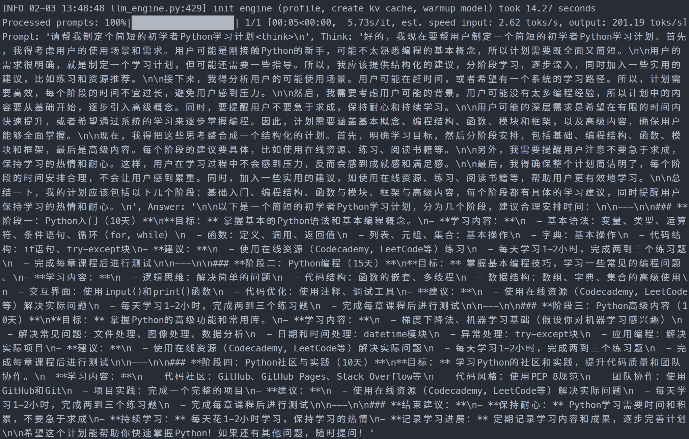
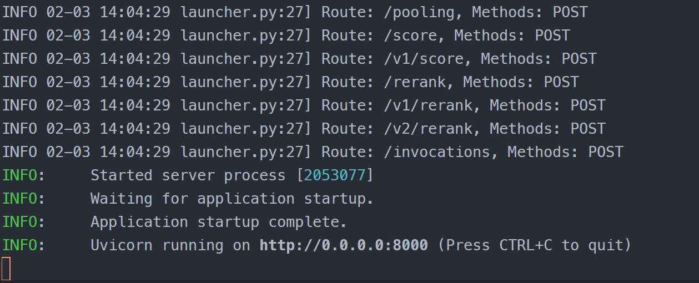

# 04-DeepSeek-R1-Distill-Qwen-7B vLLM 部署调用

## **vLLM 简介**

`vLLM` 框架是一个高效的大语言模型**推理和部署服务系统**，具备以下特性：

- **高效的内存管理**：通过 `PagedAttention` 算法，`vLLM` 实现了对 `KV` 缓存的高效管理，减少了内存浪费，优化了模型的运行效率。
- **高吞吐量**：`vLLM` 支持异步处理和连续批处理请求，显著提高了模型推理的吞吐量，加速了文本生成和处理速度。
- **易用性**：`vLLM` 与 `HuggingFace` 模型无缝集成，支持多种流行的大型语言模型，简化了模型部署和推理的过程。兼容 `OpenAI` 的 `API` 服务器。
- **分布式推理**：框架支持在多 `GPU` 环境中进行分布式推理，通过模型并行策略和高效的数据通信，提升了处理大型模型的能力。
- **开源共享**：`vLLM` 由于其开源的属性，拥有活跃的社区支持，这也便于开发者贡献和改进，共同推动技术发展。


## 环境准备  

本文基础环境如下：

```
----------------
ubuntu 22.04
python 3.12
cuda 12.1
pytorch 2.3.0
----------------
```

> 本文默认学习者已配置好以上 `Pytorch (cuda)` 环境，如未配置请先自行安装。

首先 `pip` 换源加速下载并安装依赖包

```bash
python -m pip install --upgrade pip
pip config set global.index-url https://pypi.tuna.tsinghua.edu.cn/simple

pip install modelscope==1.22.3
pip install openai==1.61.0
pip install tqdm==4.67.1
pip install transformers==4.48.2
pip install vllm==0.7.1
```

> 考虑到部分同学配置环境可能会遇到一些问题，我们在 AutoDL 平台准备了 DeepSeek-R1-Distill 的环境镜像，点击下方链接并直接创建 Autodl 示例即可。
> ***https://www.codewithgpu.com/i/datawhalechina/self-llm/DeepSeek-R1-Distill-self-llm***

## 模型下载

使用 modelscope 中的 snapshot_download 函数下载模型，第一个参数为模型名称，参数 cache_dir 为模型的下载路径。

新建 `model_download.py` 文件并在其中输入以下内容，粘贴代码后记得保存文件。

```python
from modelscope import snapshot_download

model_dir = snapshot_download('deepseek-ai/DeepSeek-R1-Distill-Qwen-7B', cache_dir='/root/autodl-tmp', revision='master')
```

然后在终端中输入 `python model_download.py` 执行下载，这里需要耐心等待一段时间直到模型下载完成。

> 注意：记得修改 `cache_dir` 为你的模型下载路径哦~


## **代码准备**

### **Python脚本**

新建 `vllm_model.py` 文件并在其中输入以下内容，粘贴代码后请及时保存文件。下面的代码有很详细的注释，如有不理解的地方，欢迎大家提 `issue`。

首先从 `vLLM` 库中导入 `LLM` 和 `SamplingParams` 类。`LLM` 类是使用 `vLLM` 引擎运行离线推理的主要类。`SamplingParams` 类指定采样过程的参数，用于控制和调整生成文本的随机性和多样性。

`vLLM` 提供了非常方便的封装，我们直接传入模型名称或模型路径即可，不必手动初始化模型和分词器。

我们可以通过这个代码示例熟悉下 ` vLLM` 引擎的使用方式。被注释的部分内容可以丰富模型的能力，但不是必要的，大家可以按需选择，自己多多动手尝试 ~

```python
# vllm_model.py
from vllm import LLM, SamplingParams
from transformers import AutoTokenizer
import os
import json

# 自动下载模型时，指定使用modelscope; 否则，会从HuggingFace下载
os.environ['VLLM_USE_MODELSCOPE']='True'

def get_completion(prompts, model, tokenizer=None, max_tokens=8192, temperature=0.6, top_p=0.95, max_model_len=2048):
    stop_token_ids = [151329, 151336, 151338]
    # 创建采样参数。temperature 控制生成文本的多样性，top_p 控制核心采样的概率
    sampling_params = SamplingParams(temperature=temperature, top_p=top_p, max_tokens=max_tokens, stop_token_ids=stop_token_ids)
    # 初始化 vLLM 推理引擎
    llm = LLM(model=model, tokenizer=tokenizer, max_model_len=max_model_len,trust_remote_code=True)
    outputs = llm.generate(prompts, sampling_params)
    return outputs


if __name__ == "__main__":    
    # 初始化 vLLM 推理引擎
    model='/root/autodl-temp/deepseek-ai/DeepSeek-R1-Distill-Qwen-7B' # 指定模型路径
    # model="deepseek-ai/DeepSeek-R1-Distill-Qwen-7B" # 指定模型名称，自动下载模型
    tokenizer = None
    # 加载分词器后传入vLLM 模型，但不是必要的。
    # tokenizer = AutoTokenizer.from_pretrained(model, use_fast=False) 
    
    text = ["请帮我制定个简短的初学者Python学习计划<think>\n", ] # 可用 List 同时传入多个 prompt，根据 DeepSeek 官方的建议，每个 prompt 都需要以 <think>\n 结尾，如果是数学推理内容，建议包含（中英文皆可）：Please reason step by step, and put your final answer within \boxed{}.

    # messages = [
    #     {"role": "user", "content": prompt+"<think>\n"}
    # ]
    # 作为聊天模板的消息，不是必要的。
    # text = tokenizer.apply_chat_template(
    #     messages,
    #     tokenize=False,
    #     add_generation_prompt=True
    # )

    outputs = get_completion(text, model, tokenizer=tokenizer, max_tokens=8192, temperature=0.6, top_p=0.95, max_model_len=2048) # 思考需要输出更多的 Token 数，max_tokens 设为 8K，根据 DeepSeek 官方的建议，temperature应在 0.5-0.7，推荐 0.6

    # 输出是一个包含 prompt、生成文本和其他信息的 RequestOutput 对象列表。
    # 打印输出。
    for output in outputs:
        prompt = output.prompt
        generated_text = output.outputs[0].text
        if r"</think>" in generated_text:
            think_content, answer_content = generated_text.split(r"</think>")
        else:
            think_content = ""
            answer_content = generated_text
        print(f"Prompt: {prompt!r}, Think: {think_content!r}, Answer: {answer_content!r}")
```
运行代码

```bash
python vllm_model.py
```

结果如下：

```bash
Prompt: '请帮我制定个简短的初学者Python学习计划<think>\n', Think: '好的，我现在要帮用户制定一个简短的初学者Python学习计划。首先，我得考虑用户的使用场景和需求。用户可能是刚接触Python的新手，可能不太熟悉编程的基本概念，所以计划需要既全面又简短。\n\n用户的需求很明确，就是制定一个学习计划，但可能还需要一些指导。所以，我应该提供结构化的建议，分阶段学习，逐步深入，同时加入一些实用的建议，比如练习和资源推荐。\n\n接下来，我得分析用户的可能使用场景。用户可能在赶时间，或者希望有一个系统的学习路径。所以，计划需要高效，每个阶段的时间不宜过长，避免用户感到压力。\n\n然后，我需要考虑用户可能的背景。用户可能没有太多编程经验，所以计划中的内容要从基础开始，逐步引入高级概念。同时，要提醒用户不要急于求成，保持耐心和持续学习。\n\n用户可能的深层需求是希望在有限的时间内快速提升，或者希望通过系统的学习来逐步掌握编程。因此，计划需要涵盖基本概念、编程结构、函数、模块和框架，以及高级内容，确保用户能够全面掌握。\n\n现在，我得把这些思考整合成一个结构化的计划。首先，明确学习目标，然后分阶段安排，包括基础、编程结构、函数、模块和框架，最后是高级内容。每个阶段的建议要具体，比如使用在线资源、练习、阅读书籍等。\n\n另外，我需要提醒用户注意不要急于求成，保持学习的热情和耐心。这样，用户在学习过程中不会感到压力，反而会感到成就感和满足感。\n\n最后，我得确保整个计划简洁明了，每个阶段的时间安排合理，不会让用户感到累重。同时，加入一些实用的建议，如使用在线资源、练习、阅读书籍等，帮助用户更有效地学习。\n\n总结一下，我的计划应该包括以下几个阶段：基础入门、编程结构、函数与模块、框架与高级内容，每个阶段都有具体的学习建议，同时提醒用户保持学习的热情和耐心。\n', Answer: '\n\n以下是一个简短的初学者Python学习计划，分为几个阶段，建议合理安排时间：\n\n---\n\n### **阶段一：Python入门（10天）**\n**目标：** 掌握基本的Python语法和基本编程概念。\n- **学习内容：**\n  - 基本语法：变量、类型、运算符、条件语句、循环（for, while）\n  - 函数：定义、调用、返回值\n  - 列表、元组、集合：基本操作\n  - 字典：基本操作\n  - 代码结构：if语句、try-except块\n- **建议：**\n  - 使用在线资源（Codecademy, LeetCode等）练习\n  - 每天学习1-2小时，完成两到三个练习题\n  - 完成每章课程后进行测试\n\n---\n\n### **阶段二：Python编程（15天）**\n**目标：** 掌握基本编程技巧，学习一些常见的编程问题。\n- **学习内容：**\n  - 逻辑思维：解决简单的问题\n  - 代码结构：函数的嵌套、多线程\n  - 数据结构：数组、字典、集合的高级使用\n  - 交互界面：使用input()和print()函数\n  - 代码优化：使用注释、调试工具\n- **建议：**\n  - 使用在线资源（Codecademy, LeetCode等）解决实际问题\n  - 每天学习1-2小时，完成两到三个练习题\n  - 完成每章课程后进行测试\n\n---\n\n### **阶段三：Python高级内容（10天）**\n**目标：** 掌握Python的高级功能和常用库。\n- **学习内容：**\n  - 梯度下降法、机器学习基础（假设你对机器学习感兴趣）\n  - 解决常见问题：文件处理、图像处理、数据分析\n  - 日期和时间处理：datetime模块\n  - 异常处理：try-except块\n  - 应用编程：解决实际项目\n- **建议：**\n  - 使用在线资源（Codecademy, LeetCode等）解决实际问题\n  - 每天学习1-2小时，完成两到三个练习题\n  - 完成每章课程后进行测试\n\n---\n\n### **阶段四：Python社区与实践（10天）**\n**目标：** 学习Python的社区和实践，提升代码质量和团队协作。\n- **学习内容：**\n  - 代码社区：GitHub、GitHub Pages、Stack Overflow等\n  - 代码风格：使用PEP 8规范\n  - 团队协作：使用GitHub和Git\n  - 项目实践：完成一个完整的项目\n- **建议：**\n  - 使用在线资源（Codecademy, LeetCode等）解决实际问题\n  - 每天学习1-2小时，完成两到三个练习题\n  - 完成每章课程后进行测试\n\n---\n\n### **结束建议：**\n- **保持耐心：** Python学习需要时间和积累，不要急于求成\n- **持续学习：** 每天花1-2小时学习，保持学习的热情\n- **记录学习进展：** 定期记录学习内容和成果，逐步完善计划\n\n希望这个计划能帮助你快速掌握Python！如果还有其他问题，随时提问！'
```




### 创建兼容 OpenAI API 接口的服务器

`DeepSeek-R1-Distill-Qwen` 兼容 `OpenAI API` 协议，所以我们可以直接使用 `vLLM` 创建 `OpenAI API` 服务器。`vLLM` 部署实现 `OpenAI API` 协议的服务器非常方便。默认会在 http://localhost:8000 启动服务器。服务器当前一次托管一个模型，并实现列表模型、`completions` 和 `chat completions` 端口。

- `completions`：是基本的文本生成任务，模型会在给定的提示后生成一段文本。这种类型的任务通常用于生成文章、故事、邮件等。
- `chat completions`：是面向对话的任务，模型需要理解和生成对话。这种类型的任务通常用于构建聊天机器人或者对话系统。

在创建服务器时，我们可以指定模型名称、模型路径、聊天模板等参数。

- `--host` 和 `--port` 参数指定地址。
- `--model` 参数指定模型名称。
- `--chat-template` 参数指定聊天模板。
- `--served-model-name` 指定服务模型的名称。
- `--max-model-len` 指定模型的最大长度。

```bash
python -m vllm.entrypoints.openai.api_server \
  --model /root/autodl-tmp/deepseek-ai/DeepSeek-R1-Distill-Qwen-7B \
  --served-model-name DeepSeek-R1-Distill-Qwen-7B \
  --max-model-len=2048
```

加载完毕后出现如下信息说明服务成功启动



- 通过 `curl` 命令查看当前的模型列表

```bash
curl http://localhost:8000/v1/models
```

​	得到的返回值如下所示

```json
{
    "object": "list",
    "data": [
        {
            "id": "DeepSeek-R1-Distill-Qwen-7B",
            "object": "model",
            "created": 1738591538,
            "owned_by": "vllm",
            "root": "/root/autodl-tmp/deepseek-ai/DeepSeek-R1-Distill-Qwen-7B",
            "parent": null,
            "max_model_len": 2048,
            "permission": [
                {
                    "id": "modelperm-05ee4d8c73c44ca890ab982f3b43de88",
                    "object": "model_permission",
                    "created": 1738591538,
                    "allow_create_engine": false,
                    "allow_sampling": true,
                    "allow_logprobs": true,
                    "allow_search_indices": false,
                    "allow_view": true,
                    "allow_fine_tuning": false,
                    "organization": "*",
                    "group": null,
                    "is_blocking": false
                }
            ]
        }
    ]
}
```

- 使用 `curl` 命令测试 `OpenAI Completions API` 


```bash
curl http://localhost:8000/v1/completions \
    -H "Content-Type: application/json" \
    -d '{
        "model": "DeepSeek-R1-Distill-Qwen-7B",
        "prompt": "我想问你，5的阶乘是多少？<think>\n",
        "max_tokens": 1024,
        "temperature": 0
    }'
```

​	得到的返回值如下所示

```json
{
    "id": "cmpl-aaa8af926770477ab42c2ab865cdc5da",
    "object": "text_completion",
    "created": 1738592033,
    "model": "DeepSeek-R1-Distill-Qwen-7B",
    "choices": [
        {
            "index": 0,
            "text": "首先，5的阶乘是指从1乘到5的乘积。\n\n计算步骤如下：\n\n1. 5 × 4 = 20\n2. 20 × 3 = 60\n3. 60 × 2 = 120\n4. 120 × 1 = 120\n\n因此，5的阶乘等于120。\n</think>\n\n**解答：**\n\n5的阶乘（写作 \\(5!\\)) 表示从1乘到5的乘积。计算如下：\n\n\\[\n5! = 5 \\times 4 \\times 3 \\times 2 \\times 1 = 120\n\\]\n\n**最终答案：**\n\n\\[\n\\boxed{120}\n\\]",
            "logprobs": null,
            "finish_reason": "stop",
            "stop_reason": null,
            "prompt_logprobs": null
        }
    ],
    "usage": {
        "prompt_tokens": 13,
        "total_tokens": 177,
        "completion_tokens": 164,
        "prompt_tokens_details": null
    }
}
```

- 用 `Python` 脚本请求 `OpenAI Completions API` 


```python
# vllm_openai_completions.py
from openai import OpenAI
client = OpenAI(
    base_url="http://localhost:8000/v1",
    api_key="sk-xxx", # 随便填写，只是为了通过接口参数校验
)

completion = client.chat.completions.create(
  model="DeepSeek-R1-Distill-Qwen-7B",
  messages=[
    {"role": "user", "content": "我想问你，5的阶乘是多少？<think>\n"}
  ]
)

print(completion.choices[0].message)
```

```shell
python vllm_openai_completions.py
```

​	得到的返回值如下所示

```
ChatCompletionMessage(content='首先，5的阶乘是指从1乘到5的乘积。\n\n计算步骤如下：\n\n1. 5 × 4 = 20\n2. 20 × 3 = 60\n3. 60 × 2 = 120\n4. 120 × 1 = 120\n\n因此，5的阶乘等于120。\n</think>\n\n**解答：**\n\n5的阶乘（写作 \\(5!\\)) 表示从1乘到5的乘积。计算如下：\n\n\\[\n5! = 5 \\times 4 \\times 3 \\times 2 \\times 1 = 120\n\\]\n\n**最终答案：**\n\n\\[\n\\boxed{120}\n\\]', refusal=None, role='assistant', function_call=None, tool_calls=[])
```

- 用 `curl` 命令测试 `OpenAI Chat Completions API` 


```bash
curl http://localhost:8000/v1/chat/completions \
    -H "Content-Type: application/json" \
    -d '{
        "model": "DeepSeek-R1-Distill-Qwen-7B",
        "messages": [
            {"role": "user", "content": "我想问你，5的阶乘是多少？<think>\n"}
        ]
    }'
```

得到的返回值如下所示

```json
{
    "id": "chatcmpl-2942afba07544b5dbaad4e245671770d",
    "object": "chat.completion",
    "created": 1738592210,
    "model": "DeepSeek-R1-Distill-Qwen-7B",
    "choices": [
        {
            "index": 0,
            "message": {
                "role": "assistant",
                "reasoning_content": null,
                "content": "\n\n5的阶乘（factorial）是计算在5的前面接数的连乘积。具体计算如下：\n\n5! = 5 × 4 × 3 × 2 × 1 = 120",
                "tool_calls": []
            },
            "logprobs": null,
            "finish_reason": "stop",
            "stop_reason": null
        }
    ],
    "usage": {
        "prompt_tokens": 15,
        "total_tokens": 64,
        "completion_tokens": 49,
        "prompt_tokens_details": null
    },
    "prompt_logprobs": null
}
```

- 用 `Python` 脚本请求 `OpenAI Chat Completions API` 


```python
# vllm_openai_chat_completions.py
from openai import OpenAI
openai_api_key = "sk-xxx" # 随便填写，只是为了通过接口参数校验
openai_api_base = "http://localhost:8000/v1"

client = OpenAI(
    api_key=openai_api_key,
    base_url=openai_api_base,
)

chat_outputs = client.chat.completions.create(
    model="DeepSeek-R1-Distill-Qwen-7B",
    messages=[
        {"role": "user", "content": "什么是深度学习？"},
    ]
)
print(chat_outputs)
```

```shell
python vllm_openai_chat_completions.py
```

得到的返回值如下所示

```
ChatCompletion(id='chatcmpl-34386ff2bc8145d0af8f8245fa792197', choices=[Choice(finish_reason='stop', index=0, logprobs=None, message=ChatCompletionMessage(content='<think>\n深度学习是一种通过多层神经网络来解决复杂问题的技术。它不仅利用传统机器学习的方法，还引入了大量计算机科学和神经科学的知识。深度学习算法利用大量数据来进行学习，能够自动提取复杂的特征或解决非线性问题。在图像识别、语音识别、情感分析等任务中，深度学习算法的表现尤为突出。虽然深度学习算法的准确性来源于大量训练数据，但这也意味着训练数据的质量和规模是一个关键的技术挑战。在相反的情况下，过拟合和过学习可能会影响模型的表现。\n\n深度学习经历了从基层到高层的 Architectual evolution。从基本的单层感知机到复杂的高级模型，如卷积神经网络（CNN）、循环神经网络（RNN）、长短期记忆网络（LSTM）、这些结构如何帮助模型更好地理解和处理数据，是深度学习中非常重要的环节。\n\n最后，在实际应用中，需要考虑各种策略，比如数据和算法的兼容性，模型的可解释性等，以确保深度学习模型在实际应用中的有效性。此外，持续优化和改进模型即使在面临挑战的情况下，也是深度学习领域的重要工作。\n</think>\n\n深度学习是基于神经网络通过多层的递归结构来解决复杂问题的技术。它通过修改神经网络的结构和并结合多种优化算法来学习和抽取多种特征信息，使其能够在任何工业和科学研究中表现优异，尤其是在 attach图像识别、语音识别、情感分析等千年难破的难题上表现出色。\n\n深度学习能够自动学习和发现数据中的特征，不需要人工干预。通过海量的数据进行训练，深度学习模型能够自动提取复杂的特征，并利用这些特征解决难以用传统方法直接解决的问题。\n\n深度学习的核心在于算法的复杂性，这些算法能够识别和理解细节中的潜在关系，同时考虑到数据中的非线性交互作用。这种非线性性让深度学习能够处理复杂接近真实的数据分布，并在面对记忆不清晰或者复杂数据时表现出突出的表现。\n\n例如，在语音识别中，深度学习模型能够识别 nuanced的语音特征，而不仅仅是简单的转过的语音或大老景的nr frhotmail。同样，在图像识别中，深度学习能够捕捉到复杂的纹理和颜色变化，使其识别更精细的细节。\n\n总结而言，深度学习通过构建复杂的神经网络结构，结合先进的训练方法，可以自动提取数据中的有效特征，从而解决非线性问题，同时在低真实通用性能成本下展现出目前最好的水平。', refusal=None, role='assistant', audio=None, function_call=None, tool_calls=[], reasoning_content=None), stop_reason=None)], created=1738592410, model='DeepSeek-R1-Distill-Qwen-7B', object='chat.completion', service_tier=None, system_fingerprint=None, usage=CompletionUsage(completion_tokens=511, prompt_tokens=7, total_tokens=518, completion_tokens_details=None, prompt_tokens_details=None), prompt_logprobs=None)
```

另外，在以上所有的在请求处理过程中， `API` 后端都会打印相对应的日志和统计信息😊


## 推理速度测试

既然 `vLLM` 是一个高效的大型语言模型推理和部署服务系统，那么我们不妨就测试一下模型的回复生成速度。看看和原始的速度相比有多大的提升。这里直接使用 `vLLM` 自带的 `benchmark_throughput.py` 脚本进行测试。可以将当前文件夹 `benchmark_throughput.py` 脚本放在 `/root/autodl-tmp/` 目录下；或者也可以自行[下载最新版脚本](https://github.com/vllm-project/vllm/blob/main/benchmarks/benchmark_throughput.py)

下面是一些 `benchmark_throughput.py` 脚本的参数说明：

- `--model` 参数指定模型路径或名称。
- `--backend` 推理后端，可以是 `vllm`、`hf` 和 `mii`。分布对应 `vLLM`、`HuggingFace` 和 `Mii` 推理后端。
- `--input-len` 输入长度
- `--output-len` 输出长度
- `--num-prompts` 生成的 prompt 数量
- `--seed` 随机种子
- `--dtype` 数据类型
- `--max-model-len` 模型最大长度
- `--hf_max_batch_size` `transformers` 库的最大批处理大小（仅仅对于 `hf` 推理后端有效且为必填字段）
- `--dataset` 数据集路径。（如未设置会自动生成数据）


测试 `vLLM` 推理速度的命令和参数设置

```bash
python benchmark_throughput.py \
	--model /root/autodl-tmp/qwen/DeepSeek-R1-Distill-Qwen-7B \
	--backend vllm \
	--input-len 64 \
	--output-len 128 \
	--num-prompts 25 \
	--seed 2025 \
  --dtype float16 \
  --max-model-len 512
```

得到的结果如下所示

```
Throughput: 29.34 requests/s, 5632.68 total tokens/s, 3755.12 output tokens/s
```