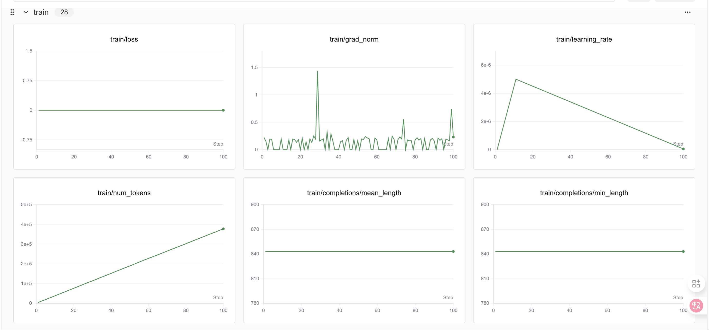

# DeepSeek-R1-Distill-Qwen3-8B GRPO微调教程

> 话不多说，直接开始！

本文使用的测试环境为单张 A100，显存 80GB，可根据需求切换不同参数量的模型，实测4B 24G显存 is enough！
使用的框架为 Unsloth

Unsloth 是一个极其强调资源节省的框架，把所有的资源节省做到了极致，具体来讲Unsloth能够将 Llama-3、Mistral、Phi-4 和 Gemma 等大型语言模型的微调速度提升 2 倍，内存占用减少 70%，并且准确率没有任何下降！
官方文档非常全面，详细指导了如何训练自己的定制模型。其中涵盖了安装和更新 Unsloth、创建数据集、运行和部署模型等基本要素。 Unsloth 让大家在本地或在 Google Colab 和 Kaggle 等平台上训练像 Llama 3 这样的模型变得极其简单。Unsloth简化了整个训练工作流程，包括模型加载、量化、训练、评估、运行、保存、导出，以及与 Ollama、llama.cpp 和 vLLM 等推理引擎的集成。
Unsloth定期与 Hugging Face、Google 和 Meta 的团队合作，以修复 LLM 训练和模型中的错误。因此，当使用 Unsloth 进行训练或使用模型时，可以期待获得最准确的结果。 Unsloth 具有高度可定制性，允许更改聊天模板或数据集格式等内容。Unsloth还为视觉、文本转语音 (TTS)、BERT、强化学习 (RL) 等提供了预构建的脚本！此外，Unsloth支持所有训练方法和所有基于 Transformer 的模型。

## 教程概览

本教程将指导您完成 **DeepSeek-R1-Distill-Qwen3-8B 模型的 GRPO（Group Relative Policy Optimization）微调**，这是一种先进的强化学习技术，专门用于提升大语言模型在特定任务上的表现。

### 什么是GRPO？

GRPO（Group Relative Policy Optimization）是一种强化学习优化技术，通过设计多个奖励函数来评估模型输出的不同方面，从而指导模型学习期望的行为模式。在数学推理任务中，GRPO可以帮助模型：

- 学会按照特定格式输出答案
- 提高推理过程的逻辑性
- 增强答案的准确性
- 改善输出的结构化程度

### 本教程的学习内容

1. **环境设置**: 安装Unsloth和相关依赖
2. **模型加载**: 加载DeepSeek-R1-Distill-Qwen3-8B预训练模型
3. **LoRA配置**: 设置高效的参数微调
4. **数据处理**: 处理GSM8K数学推理数据集
5. **格式设计**: 定义结构化的输出格式
6. **奖励函数**: 设计多维度评估体系
7. **GRPO训练**: 执行强化学习微调
8. **效果验证**: 测试微调后的模型
9. **模型保存**: 保存训练结果
10. **可视化监控**: 使用SwanLab跟踪训练过程


```python
# 安装依赖包
# pip install unsloth vllm==0.8.5.post1
```

```python
# 安装语言检测库
# pip install langid -qq
```

```python
from unsloth import FastLanguageModel
import torch
max_seq_length = 1024 
lora_rank = 32

model, tokenizer = FastLanguageModel.from_pretrained(
    model_name = "/opt/tiger/test0/DeepSeek-R1-0528-Qwen3-8B",
    max_seq_length = max_seq_length,
    load_in_4bit = True, # 对于LoRA 16位设置为False
    fast_inference = True, # 启用vLLM快速推理
    max_lora_rank = lora_rank,
    gpu_memory_utilization = 0.7, # 如果内存不足请减少此值
)

model = FastLanguageModel.get_peft_model(
    model,
    r = lora_rank, # 选择任何大于0的数字！建议8, 16, 32, 64, 128
    target_modules = [
        "q_proj", "k_proj", "v_proj", "o_proj",
        "gate_proj", "up_proj", "down_proj",
    ],
    lora_alpha = lora_rank*2, # *2可以加速训练
    use_gradient_checkpointing = "unsloth", # 减少内存使用
    random_state = 3407,
)
```

### GRPO对话模板

```python
reasoning_start = None
reasoning_end = None
user_token = None
assistant_token = None

for token in tokenizer.get_added_vocab().keys():
    if "think" in token and "/" in token:
        reasoning_end = token
    elif "think" in token:
        reasoning_start = token
    elif "user" in token:
        user_token = token
    elif "assistant" in token:
        assistant_token = token

system_prompt = \
f"""你接到一个问题。
请思考这个问题并提供你的解题过程。
你必须用印尼语思考。"""
system_prompt
```

```python
print(tokenizer.apply_chat_template([
    {"role" : "user", "content" : "What is 1+1?"},
    {"role" : "assistant", "content" : f"<think>I think it's 2.2</think>2"},
    {"role" : "user", "content" : "What is 1+1?"},
    {"role" : "assistant", "content" : f"<think>I think it's 2.2</think>2"},
], tokenize = False, add_generation_prompt = True))
```

### 数据准备
```python
from datasets import load_dataset
dataset = load_dataset("open-r1/DAPO-Math-17k-Processed", "en", split = "train")
dataset
```

让我们看看第一行数据：

```python
dataset[0]["prompt"]
```

```python
dataset[0]["solution"]
```

在GSM8K中，我们注意到所有答案都有####标记，所以我们需要提取它。但对于Open R1数据集，我们可以跳过下面的处理。

```python
def extract_hash_answer(text):
    # if "####" not in text: return None
    # return text.split("####")[1].strip()
    return text
extract_hash_answer(dataset[0]["solution"])
```

让我们映射数据集！并查看第一行：

```python
dataset = dataset.map(lambda x: {
    "prompt" : [
        {"role": "system", "content": system_prompt},
        {"role": "user",   "content": x["prompt"]},
    ],
    "answer": extract_hash_answer(x["solution"]),
})
dataset[0]
```

我们创建一个正则表达式格式来匹配推理部分和答案：

```python
import re

# 添加可选的EOS标记匹配
solution_end_regex = rf"{reasoning_end}(.*)"

match_format = re.compile(solution_end_regex, re.DOTALL)
match_format
```

我们验证它能正常工作：

```python
match_format.findall(
    "Let me think!</think>"\
    f"Hence, the solution is 2.",
)
```

```python
match_format.findall(
    "<think>Let me think!</think>"\
    f"\n\nHence, the solution is 2",
)
```

我们现在要创建一个奖励函数来完全匹配格式 - 如果成功匹配我们给3分：

```python
def match_format_exactly(completions, **kwargs):
    scores = []
    for completion in completions:
        score = 0
        response = completion[0]["content"]
        # 匹配是否完全符合格式！
        if match_format.search(response) is not None: score += 3.0
        scores.append(score)
    return scores
```

如果失败，我们希望在至少部分遵循格式时奖励模型，通过计算每个符号：

```python
def match_format_approximately(completions, **kwargs):
    scores = []
    for completion in completions:
        score = 0
        response = completion[0]["content"]
        # 计算看到多少个关键词 - 如果太多我们会惩罚！
        # 如果我们看到1个，那么加一些分！

        # 不需要奖励<think>因为我们总是预置它！
        score += 0.5 if response.count(reasoning_start) == 1 else -1.0
        score += 0.5 if response.count(reasoning_end)   == 1 else -1.0
        scores.append(score)
    return scores
```

我们想要提取生成的答案，并奖励或惩罚它！我们还根据答案与真实答案的比率来奖励：

```python
def check_answer(prompts, completions, answer, **kwargs):
    question = prompts[0][-1]["content"]
    responses = [completion[0]["content"] for completion in completions]

    extracted_responses = [
        guess.group(1)
        if (guess := match_format.search(r)) is not None else None \
        for r in responses
    ]

    scores = []
    for guess, true_answer in zip(extracted_responses, answer):
        score = 0
        if guess is None:
            scores.append(-2.0)
            continue
        # 正确答案得5分！
        if guess == true_answer:
            score += 5.0
        # 如果看到空格但奖励较少
        elif guess.strip() == true_answer.strip():
            score += 3.5
        else:
            # 我们也通过比率奖励接近的答案！
            # 即如果答案在某个范围内，奖励它！
            try:
                ratio = float(guess) / float(true_answer)
                if   ratio >= 0.9 and ratio <= 1.1: score += 2.0
                elif ratio >= 0.8 and ratio <= 1.2: score += 1.5
                else: score -= 2.5 # 惩罚错误答案
            except:
                score -= 4.5 # 惩罚
        scores.append(score)
    return scores
```

有时答案可能不是1个数字，而是像句子一样，例如"解决方案是$20" -> 我们提取20。

我们还移除可能的逗号，例如123,456

```python
match_numbers = re.compile(
    r".*?[\s]{0,}([-]?[\d\.\,]{1,})",
    flags = re.MULTILINE | re.DOTALL
)
print(match_numbers.findall("  0.34  "))
print(match_numbers.findall("  123,456  "))
print(match_numbers.findall("  -0.234  "))
print(match_numbers.findall("17"))
```

最后，我们将尝试强制思考过程使用印尼语。这是DeepSeek R1论文中使用的`语言一致性奖励`的简单版本

```python
import langid

def get_lang(text: str) -> str:
    if not text:
        return "und"
    lang, _ = langid.classify(text)
    return lang


print(get_lang("Hello, How are you")) # 这应该返回en
print(get_lang("Aku berpikir kalau aku adalah kamu")) # 这应该返回id
print(get_lang("我在这里")) # 这应该返回zh
```

```python
import re

def format_and_language_reward_func(completions, **kwargs):
    scores = []

    for completion_item in completions:
        if not completion_item or not isinstance(completion_item[0], dict) or "content" not in completion_item[0]:
            scores.append(-5.0)
            print(f"警告：格式错误的完成项，分配默认低分: {completion_item}")
            continue

        content = completion_item[0]["content"]

        lang = get_lang(content)

        if lang == 'id':
            score = 5.0
        elif lang == 'en':
            score = -3.0
        elif lang == 'zh':
            score = -3.0
        else:
            score = -5.0

        scores.append(score)

    return scores
```

```python
prompts = [
    [{"role": "assistant", "content": "What is the result of (1 + 2) * 4?"}],
    [{"role": "assistant", "content": "What is the result of (3 + 1) * 2?"}],
]
completions = [
    [{"role": "assistant", "content": "<think>The sum of 1 and 2 is 3, which we multiply by 4 to get 12.</think><answer>(1 + 2) * 4 = 12</answer>"}],
    [{"role": "assistant", "content": "The sum of 3 and 1 is 4, which we multiply by 2 to get 8. So (3 + 1) * 2 = 8."}],
]
format_and_language_reward_func(prompts=prompts, completions=completions)
```

我们现在准备主函数，它将打印生成的响应和真实答案，以及另一个奖励函数，通过`float`将文本转换为浮点数并查看是否相同。

```python
global PRINTED_TIMES
PRINTED_TIMES = 0
global PRINT_EVERY_STEPS
PRINT_EVERY_STEPS = 5

def check_numbers(prompts, completions, answer, **kwargs):
    question = prompts[0][-1]["content"]
    responses = [completion[0]["content"] for completion in completions]

    extracted_responses = [
        guess.group(1)
        if (guess := match_numbers.search(r)) is not None else None \
        for r in responses
    ]

    scores = []
    # 只在每几步打印一次
    global PRINTED_TIMES
    global PRINT_EVERY_STEPS
    if PRINTED_TIMES % PRINT_EVERY_STEPS == 0:
        print(
            '*'*20 + f"问题:\n{question}", f"\n答案:\n{answer[0]}", f"\n响应:\n{responses[0]}", f"\n提取的:\n{extracted_responses[0]}"
        )
    PRINTED_TIMES += 1

    for guess, true_answer in zip(extracted_responses, answer):
        if guess is None:
            scores.append(-2.5)
            continue
        # 转换为数字
        try:
            true_answer = float(true_answer.strip())
            # 移除逗号，如123,456
            guess       = float(guess.strip().replace(",", ""))
            scores.append(3.5 if guess == true_answer else -1.5)
        except:
            scores.append(0)
            continue
    return scores
```

获取前90%的提示长度，这样我们就不会意外截断它们！

即我们将移除前10%的长提示。

```python
tokenized = dataset.map(
    lambda x: {"tokens" : tokenizer.apply_chat_template(x["prompt"], add_generation_prompt = True, tokenize = True)},
    batched = True,
)
print(tokenizer.decode(tokenized[0]["tokens"]))
tokenized = tokenized.map(lambda x: {"L" : len(x["tokens"])})

import numpy as np
maximum_length = int(np.quantile(tokenized["L"], 0.9))
print("最大长度 = ", maximum_length)

# 只过滤小于90%最大长度的样本
dataset = dataset.select(np.where(np.array(tokenized["L"]) <= maximum_length)[0])
del tokenized
```

<a name="Train"></a>
### 训练模型

现在设置GRPO训练器和所有配置！

```python
max_prompt_length = maximum_length + 1 # +1以防万一！
max_completion_length = max_seq_length - max_prompt_length

from vllm import SamplingParams
vllm_sampling_params = SamplingParams(
    min_p = 0.1,
    top_p = 1.0,
    top_k = -1,
    seed = 3407,
    stop = [tokenizer.eos_token],
    include_stop_str_in_output = True,
)

from trl import GRPOConfig, GRPOTrainer
training_args = GRPOConfig(
    vllm_sampling_params = vllm_sampling_params,
    temperature = 1.0,
    learning_rate = 5e-6,
    weight_decay = 0.01,
    warmup_ratio = 0.1,
    lr_scheduler_type = "linear",
    optim = "adamw_8bit",
    logging_steps = 1,
    per_device_train_batch_size = 1,
    gradient_accumulation_steps = 1, # 增加到4以获得更平滑的训练
    num_generations = 4, # 如果内存不足请减少
    max_prompt_length = max_prompt_length,
    max_completion_length = max_completion_length,
    # num_train_epochs = 1, # 对于完整训练运行设置为1
    max_steps = 100,
    save_steps = 100,
    report_to = "swanlab", # 可以使用Weights & Biases
    output_dir = "outputs",

    # 用于可选的训练+评估
    # fp16_full_eval = True,
    # per_device_eval_batch_size = 4,
    # eval_accumulation_steps = 1,
    # eval_strategy = "steps",
    # eval_steps = 1,
)
```

让我们运行训练器！如果你向上滚动，你会看到一个奖励表格。目标是看到`reward`列增加！

你可能需要等待150到200步才能看到任何效果。前100步你可能会得到0奖励。请耐心等待！

| 步骤 | 训练损失 | 奖励    | 奖励标准差 | 完成长度        | kl       |
|------|---------------|-----------|------------|-------------------|----------|
| 1    | 0.000000      | 0.125000  | 0.000000   | 200.000000        | 0.000000 |
| 2    | 0.000000      | 0.072375  | 0.248112   | 200.000000        | 0.000000 |
| 3    | 0.000000      | -0.079000 | 0.163776   | 182.500000        | 0.000005 |

```python
# 用于可选的训练+评估
# new_dataset = dataset.train_test_split(test_size = 0.01)

trainer = GRPOTrainer(
    model = model,
    processing_class = tokenizer,
    reward_funcs = [
        match_format_exactly,
        match_format_approximately,
        check_answer,
        check_numbers,
        format_and_language_reward_func,
    ],
    args = training_args,
    train_dataset = dataset,

    # 用于可选的训练+评估
    # train_dataset = new_dataset["train"],
    # eval_dataset = new_dataset["test"],
)
trainer.train()
```

<a name="Inference"></a>
### 推理
现在让我们试试刚刚训练的模型！首先，让我们先试试没有经过GRPO训练的模型：

```python
text = "What is the sqrt of 101?"

from vllm import SamplingParams
sampling_params = SamplingParams(
    temperature = 1.0,
    top_k = 50,
    max_tokens = 1024,
)
output = model.fast_generate(
    [text],
    sampling_params = sampling_params,
    lora_request = None,
)[0].outputs[0].text

output
```

现在使用我们刚刚用GRPO训练的LoRA - 我们首先保存LoRA！

```python
model.save_lora("grpo_lora")
```

验证LoRA确实被训练了！

```python
from safetensors import safe_open

tensors = {}
with safe_open("grpo_lora/adapter_model.safetensors", framework = "pt") as f:
    # 验证A和B都非零
    for key in f.keys():
        tensor = f.get_tensor(key)
        n_zeros = (tensor == 0).sum() / tensor.numel()
        assert(n_zeros.item() != tensor.numel())
```

现在我们加载LoRA并测试。我们在不使用自定义系统提示的情况下进行测试，这应该不会（或很少）影响模型的原始推理能力：

```python
messages = [
    {"role": "user",   "content": "Solve (x + 2)^2 = 0"},
]

text = tokenizer.apply_chat_template(
    messages,
    add_generation_prompt = True, # 生成时必须添加
    tokenize = False,
)
from vllm import SamplingParams
sampling_params = SamplingParams(
    temperature = 1.0,
    top_k = 50,
    max_tokens = 2048,
)
output = model.fast_generate(
    text,
    sampling_params = sampling_params,
    lora_request = model.load_lora("grpo_lora"),
)[0].outputs[0].text

output
```

接下来，让我们使用系统提示进行测试，这应该使用新语言：

```python
messages = [
    {"role": "system", "content": system_prompt},
    {"role": "user",   "content": "Solve (x + 2)^2 = 0"},
]

text = tokenizer.apply_chat_template(
    messages,
    add_generation_prompt = True, # 生成时必须添加
    tokenize = False,
)
from vllm import SamplingParams
sampling_params = SamplingParams(
    temperature = 1.0,
    top_k = 50,
    max_tokens = 2048,
)
output = model.fast_generate(
    text,
    sampling_params = sampling_params,
    lora_request = model.load_lora("grpo_lora"),
)[0].outputs[0].text

output
```

让我们比较使用系统提示但不使用LoRA的结果

```python
messages = [
    {"role": "system", "content": system_prompt},
    {"role": "user",   "content": "Solve (x + 2)^2 = 0"},
]

text = tokenizer.apply_chat_template(
    messages,
    add_generation_prompt = True, # 生成时必须添加
    tokenize = False,
)
from vllm import SamplingParams
sampling_params = SamplingParams(
    temperature = 1.0,
    top_k = 50,
    max_tokens = 2048,
)
output = model.fast_generate(
    text,
    sampling_params = sampling_params,
    lora_request = None,
)[0].outputs[0].text

output
```

让我们取20个样本，比较使用LoRA和不使用LoRA的情况，看看哪一个有更好的正确语言使用量

```python
sample_dataset = dataset.shuffle(seed = 3407).select(range(20))
sample_dataset
```

```python
with_lora_id_count = 0
without_lora_id_count = 0

print("在20个样本上比较使用和不使用LoRA的语言使用情况:")
print("=" * 60)

for i, sample in enumerate(sample_dataset):
    messages = [
        {"role": "system", "content": system_prompt},
        {"role": "user", "content": sample["prompt"][1]["content"]},
    ]

    text = tokenizer.apply_chat_template(
        messages,
        add_generation_prompt=True,
        tokenize=False,
    )

    output_with_lora = model.fast_generate(
        text,
        sampling_params=sampling_params,
        lora_request=model.load_lora("grpo_lora"),
    )[0].outputs[0].text

    output_without_lora = model.fast_generate(
        text,
        sampling_params=sampling_params,
        lora_request=None,
    )[0].outputs[0].text

    lang_with_lora = get_lang(output_with_lora)
    lang_without_lora = get_lang(output_without_lora)

    if lang_with_lora == 'id':
        with_lora_id_count += 1
    if lang_without_lora == 'id':
        without_lora_id_count += 1

    # 每5个样本打印进度
    if (i + 1) % 5 == 0:
        print(f"已处理 {i + 1}/20 个样本...")

print("\n" + "=" * 60)
print("结果:")
print(f"使用LoRA - 印尼语响应: {with_lora_id_count}/20 ({with_lora_id_count/20*100:.1f}%)")
print(f"不使用LoRA - 印尼语响应: {without_lora_id_count}/20 ({without_lora_id_count/20*100:.1f}%)")
print(f"改进: 使用LoRA增加了{with_lora_id_count - without_lora_id_count}个印尼语响应")
```

我们的推理模型要好得多 - 它不总是正确的，因为我们只训练了大约一个小时 - 如果我们延长序列长度并训练更长时间会更好！

<a name="Save"></a>
### 保存为float16格式用于VLLM

我们还支持直接保存为`float16`。选择`merged_16bit`用于float16或`merged_4bit`用于int4。我们还允许`lora`适配器作为备选方案。使用`push_to_hub_merged`上传到你的Hugging Face账户！你可以去https://huggingface.co/settings/tokens获取你的个人令牌。

```python
# 合并为16位
if False: model.save_pretrained_merged("model", tokenizer, save_method = "merged_16bit",)
if False: model.push_to_hub_merged("hf/model", tokenizer, save_method = "merged_16bit", token = "")

# 合并为4位
if False: model.save_pretrained_merged("model", tokenizer, save_method = "merged_4bit",)
if False: model.push_to_hub_merged("hf/model", tokenizer, save_method = "merged_4bit", token = "")

# 仅LoRA适配器
if False:
    model.save_pretrained("model")
    tokenizer.save_pretrained("model")
if False:
    model.push_to_hub("hf/model", token = "")
    tokenizer.push_to_hub("hf/model", token = "")
```

### GGUF / llama.cpp 转换
要保存为`GGUF` / `llama.cpp`，我们现在原生支持它！我们克隆`llama.cpp`并默认保存为`q8_0`。我们允许所有方法，如`q4_k_m`。使用`save_pretrained_gguf`进行本地保存，使用`push_to_hub_gguf`上传到HF。

一些支持的量化方法（完整列表在我们的[Wiki页面](https://github.com/unslothai/unsloth/wiki#gguf-quantization-options)）：
* `q8_0` - 快速转换。高资源使用，但通常可接受。
* `q4_k_m` - 推荐。对一半的attention.wv和feed_forward.w2张量使用Q6_K，其他使用Q4_K。
* `q5_k_m` - 推荐。对一半的attention.wv和feed_forward.w2张量使用Q6_K，其他使用Q5_K。

[**新功能**] 要微调并自动导出到Ollama，试试我们的[Ollama笔记本](https://colab.research.google.com/github/unslothai/notebooks/blob/main/nb/Llama3_(8B)-Ollama.ipynb)

```python
# 保存为8位Q8_0
if False: model.save_pretrained_gguf("model", tokenizer,)
# 记住去https://huggingface.co/settings/tokens获取令牌！
# 并将hf改为你的用户名！
if False: model.push_to_hub_gguf("hf/model", tokenizer, token = "")

# 保存为16位GGUF
if False: model.save_pretrained_gguf("model", tokenizer, quantization_method = "f16")
if False: model.push_to_hub_gguf("hf/model", tokenizer, quantization_method = "f16", token = "")

# 保存为q4_k_m GGUF
if False: model.save_pretrained_gguf("model", tokenizer, quantization_method = "q4_k_m")
if False: model.push_to_hub_gguf("hf/model", tokenizer, quantization_method = "q4_k_m", token = "")

# 保存为多个GGUF选项 - 如果你想要多个选项会快很多！
if False:
    model.push_to_hub_gguf(
        "hf/model", # 将hf改为你的用户名！
        tokenizer,
        quantization_method = ["q4_k_m", "q8_0", "q5_k_m",],
        token = "",
    )
```


### 本试验的试验记录

#### GRPO阶段


400个step之后loss会有明显变化

## 教程总结

🎉 恭喜！你已经成功完成了DeepSeek-R1-Distill-Qwen3-8B的GRPO微调教程。

### 本教程涵盖的核心概念：

1. **GRPO微调**: 使用奖励函数指导模型学习特定输出格式
2. **LoRA技术**: 高效的参数微调方法，节省显存和时间
3. **奖励函数设计**: 多层次评估体系，从格式到内容的全面评价
4. **结构化输出**: 训练模型按照特定格式输出推理过程和答案
5. **SwanLab监控**: 实时跟踪训练进度和指标变化

### 学到的技能：

- ✅ 设置GRPO训练环境
- ✅ 设计多维度奖励函数
- ✅ 配置LoRA参数进行高效微调
- ✅ 处理数学推理数据集
- ✅ 监控和分析训练过程
- ✅ 保存和部署微调模型

### 进一步探索：

1. **调整奖励函数**: 设计更复杂的评估机制
2. **扩展数据集**: 使用更大或不同类型的数据集
3. **优化参数**: 尝试不同的LoRA配置和训练参数
4. **模型评估**: 在测试集上系统评估模型性能
5. **应用部署**: 将模型集成到实际应用中

### 注意事项：

- 本教程使用了较少的训练步数作为演示，实际应用中建议使用更多步数
- 可以根据显存情况调整批次大小和生成数量
- SwanLab提供了丰富的可视化功能，建议深入探索

感谢你的学习！如果有任何问题，欢迎查看SwanLab的实验记录或重新运行代码。

# 总结

Congratulations！看到了这，你已经初步实现了一个简单的RL实战，掌握了使用 Unsloth 对 Gemma3 这类大模型进行 GRPO 微调的具体操作步骤，更能体会到 Unsloth 在大幅提升训练速度、显著降低显存占用方面的强大优势，从而使在有限资源下进行复杂强化学习实验成为可能！如果支持我们的工作希望得到你的star！！这是我们持续更新的最大动力！！！

# 相关链接

- 完整可运行的代码：[Github](https://github.com/datawhalechina/self-llm/blob/master/models/DeepSeek-R1-Distill-Qwen/05-DeepSeek-R1-Distill-Qwen3-8B-GRPO及swanlab可视化.ipynb)
- 综述：https://arxiv.org/abs/2001.06921
- deepseek-r1：https://arxiv.org/abs/2501.12948
- 数学原理：https://blog.csdn.net/weixin\_38991876/article/details/146474767
- Unsloth：https://docs.unsloth.ai/
