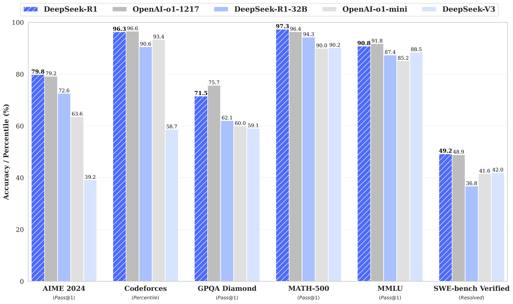

DeepSeek-R1-Zero是一个通过大规模强化学习（RL）训练的模型，没有监督微调（SFT）作为初步步骤，在推理方面表现出色。通过RL，DeepSeek-R1-Zero自然地出现了许多强大而有趣的推理行为。然而，DeepSeek-R1-Zero遇到了诸如无休止的重复、可读性差和语言混合等挑战。为了解决这些问题并进一步提高推理性能，DeepSeek团队引入了DeepSeek-R1，它在强化学习之前整合了冷启动数据。DeepSeek-R2在数学、代码和推理任务方面的性能与OpenAI-o1相当。为了支持研究界，DeepSeek团队开源了DeepSeek-R1-Zero、DeepSeek-R1，以及基于Llama和Qwen从DeepSeek-R2中提取的六个密集模型。DeepSeek-R1-Distill-Qwen-32B在各种基准测试中表现优于OpenAI-o1-mini，为密集模型实现了最新的最先进结果。

