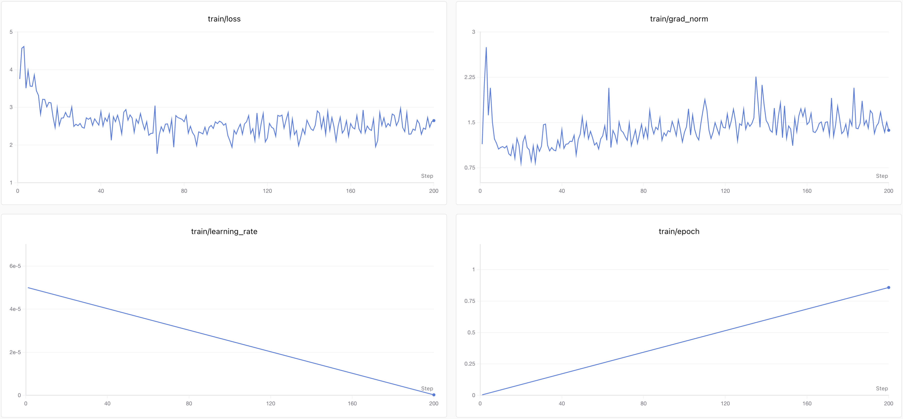

# 01-DeepSeek-V4-Flash-LoRA 及 SwanLab 可视化记录

本节介绍如何基于 transformers、peft 等框架，使用开源 [Chat-甄嬛](https://github.com/KMnO4-zx/huanhuan-chat) 项目中的**嬛嬛数据集**对 DeepSeek-V4-Flash 的 BF16 权重进行 LoRA 微调，以构建能够模拟甄嬛对话风格的个性化 LLM。数据集路径为 [`../../dataset/huanhuan.jsonl`](../../dataset/huanhuan.jsonl)，训练过程使用 [SwanLab](https://github.com/swanhubx/swanlab) 记录和可视化指标。

> **LoRA** 是一种高效微调方法，深入了解其原理可参见博客：[知乎|深入浅出 LoRA](https://zhuanlan.zhihu.com/p/650197598)。

- 训练代码：[01-DeepSeek-V4-Flash-LoRA.py](./01-DeepSeek-V4-Flash-LoRA.py)
- 推理代码：[01-DeepSeek-V4-Flash-LoRA-Inference.py](./01-DeepSeek-V4-Flash-LoRA-Inference.py)
- 模型：[DeepSeek-V4-Flash](https://huggingface.co/deepseek-ai/DeepSeek-V4-Flash)，本文训练使用社区发布的 [BF16 权重](https://huggingface.co/RedHatAI/DeepSeek-V4-Flash-BF16)
- 数据集：[huanhuan](../../dataset/huanhuan.jsonl)
- 实验硬件：8 张 NVIDIA RTX PRO 6000 Blackwell Server Edition 96GB 显卡

<br>

## 目录

- [01-DeepSeek-V4-Flash-LoRA 及 SwanLab 可视化记录](#01-deepseek-v4-flash-lora-及-swanlab-可视化记录)
  - [目录](#目录)
  - [1. 环境配置](#1-环境配置)
  - [2. 模型下载](#2-模型下载)
  - [3. 指令集构建](#3-指令集构建)
  - [4. 数据格式化](#4-数据格式化)
  - [5. 加载模型和 tokenizer](#5-加载模型和-tokenizer)
  - [6. 定义 LoRA 配置](#6-定义-lora-配置)
  - [7. 自定义 TrainingArguments 参数](#7-自定义-trainingarguments-参数)
  - [8. SwanLab 可视化](#8-swanlab-可视化)
    - [SwanLab 简介](#swanlab-简介)
    - [实例化 SwanLabCallback](#实例化-swanlabcallback)
  - [9. 使用 Trainer 训练](#9-使用-trainer-训练)
  - [10. 训练结果演示](#10-训练结果演示)
  - [11. 加载 LoRA 权重推理](#11-加载-lora-权重推理)

<br>

## 1. 环境配置

实验所依赖的基础开发环境如下：

```text
----------------
ubuntu 22.04
Python 3.12
cuda 13.0
pytorch 2.11.0
----------------
```

> 本文默认已安装上述 PyTorch 和 CUDA 环境。

首先 `pip` 换源加速下载并安装依赖包：

```shell
# 升级pip
python -m pip install --upgrade pip
# 更换 pypi 源加速库的安装
pip config set global.index-url https://pypi.tuna.tsinghua.edu.cn/simple

pip install transformers==5.12.1 # Hugging Face 的模型库，用于加载和训练模型
pip install accelerate==1.14.0 # 用于分布式训练和混合精度训练
pip install datasets==5.0.0 # 用于加载和处理数据集
pip install peft==0.19.1 # 用于 LoRA 微调
pip install swanlab==0.8.4 # 用于记录和可视化训练指标
pip install huggingface_hub # 用于从 Hugging Face 下载模型
pip install kernels==0.14.1 # 用于加载 FP4 + FP8 推理算子
```

## 2. 模型下载

DeepSeek 官方发布的 `deepseek-ai/DeepSeek-V4-Flash` 为 FP4 + FP8 混合精度权重，适合推理部署，但不能直接用于本教程的 LoRA 训练。本文训练使用社区发布的 [RedHatAI/DeepSeek-V4-Flash-BF16](https://huggingface.co/RedHatAI/DeepSeek-V4-Flash-BF16)，推理时加载 DeepSeek 官方 FP4 + FP8 权重。

使用 `huggingface_hub` 中的 `snapshot_download` 函数下载模型。第一个参数 `repo_id` 为模型名称，第二个参数 `local_dir` 为模型的下载路径。

在 `/root/autodl-tmp` 路径下新建 `model_download.py` 文件并在其中粘贴以下代码，并保存文件。

```python
from huggingface_hub import snapshot_download

model_dir = snapshot_download(
    repo_id="RedHatAI/DeepSeek-V4-Flash-BF16",
    local_dir="/root/autodl-tmp/RedHatAI/DeepSeek-V4-Flash-BF16",
)
print(f"模型下载完成，保存路径为：{model_dir}")
```

> 注意：请将 `local_dir` 修改为实际的模型下载路径。

在终端运行 `python /root/autodl-tmp/model_download.py` 执行下载，模型体积较大，下载时间较久。

推理部分使用官方 FP4 + FP8 权重，可以将下载代码中的 `repo_id` 和 `local_dir` 分别修改为：

```python
repo_id="deepseek-ai/DeepSeek-V4-Flash"
local_dir="/root/autodl-tmp/deepseek-ai/DeepSeek-V4-Flash"
```

> 注意：BF16 权重约为 532GB，官方 FP4 + FP8 权重约为 149GB。如果同时保存两份权重，建议预留不少于 700GB 的磁盘空间。AutoDL 实例的数据盘空间不足时，可以将权重放到文件存储路径，例如 `/root/autodl-fs/models/DeepSeek-V4-Flash-BF16`。

## 3. 指令集构建

LLM 的微调一般指指令微调过程。所谓指令微调，是说我们使用的微调数据形如：

```json
{
  "instruction": "回答以下用户问题，仅输出答案。",
  "input": "1+1等于几?",
  "output": "2"
}
```

其中，`instruction` 是用户指令，告知模型其需要完成的任务；`input` 是用户输入，是完成用户指令所必须的输入内容；`output` 是模型应该给出的输出。

即我们的核心训练目标是让模型具有理解并遵循用户指令的能力。因此，在指令集构建时，我们应针对我们的目标任务，针对性构建任务指令集。

本节使用 [**Chat-甄嬛**](https://github.com/KMnO4-zx/huanhuan-chat) 项目作为示例，目标是构建能够模拟甄嬛对话风格的个性化 LLM，因此指令格式如下：

```json
{
  "instruction": "你是谁？",
  "input": "",
  "output": "家父是大理寺少卿甄远道。"
}
```

本节使用的示例数据集位于 [`../../dataset/huanhuan.jsonl`](../../dataset/huanhuan.jsonl)，共 3729 条 `instruction/input/output` 数据。

## 4. 数据格式化

LoRA 训练前需要对文本进行格式化和编码。`input_ids` 保存完整对话的 token ID，`labels` 中的用户输入部分设为 `-100`，训练时只计算助手回答部分的损失。

DeepSeek-V4-Flash 没有提供 Jinja 格式的 `chat_template`。本文按照模型仓库 `encoding` 目录中的官方 chat 模式定义对话格式：

```python
def encode_chat_text(system_prompt, user_content, assistant_content=None):
    text = (
        "<｜begin▁of▁sentence｜>"
        f"{system_prompt}"
        "<｜User｜>"
        f"{user_content}"
        "<｜Assistant｜></think>"
    )
    if assistant_content is not None:
        text += f"{assistant_content}<｜end▁of▁sentence｜>"
    return text
```

然后我们就可以定义预处理函数 `process_func`，这个函数用于对每一个样本，编码其输入、输出文本并返回一个编码后的字典，方便模型使用：

```python
def process_func(example):
    MAX_LENGTH = 2048  # 设置最大序列长度为 2048 个 token
    system_prompt = "现在你要扮演皇帝身边的女人--甄嬛。"
    instruction = str(example.get("instruction") or "")
    user_input = str(example.get("input") or "")
    output = str(example.get("output") or "")
    user_content = instruction + user_input

    prompt_text = encode_chat_text(system_prompt, user_content)
    full_text = encode_chat_text(system_prompt, user_content, output)

    prompt_ids = tokenizer(prompt_text, add_special_tokens=False)["input_ids"]
    full = tokenizer(full_text, add_special_tokens=False)
    input_ids = full["input_ids"]
    attention_mask = full.get("attention_mask", [1] * len(input_ids))
    labels = [-100] * len(prompt_ids) + input_ids[len(prompt_ids):]

    if tokenizer.eos_token_id is not None and (not input_ids or input_ids[-1] != tokenizer.eos_token_id):
        input_ids.append(tokenizer.eos_token_id)
        attention_mask.append(1)
        labels.append(tokenizer.eos_token_id)

    if len(input_ids) > MAX_LENGTH:  # 超出最大序列长度截断
        input_ids = input_ids[:MAX_LENGTH]
        attention_mask = attention_mask[:MAX_LENGTH]
        labels = labels[:MAX_LENGTH]

    return {
        "input_ids": input_ids,
        "attention_mask": attention_mask,
        "labels": labels,
    }
```

加载数据集：

```python
from datasets import load_dataset

data_path = "../../dataset/huanhuan.jsonl"
dataset = load_dataset("json", data_files=data_path, split="train")
```

## 5. 加载模型和 tokenizer

下面加载 tokenizer 和 DeepSeek-V4-Flash 的 BF16 权重。通过 `dtype=torch.bfloat16` 指定模型精度，并使用 `device_map="auto"` 将模型自动分配到可见的 GPU。

```python
import torch
from transformers import AutoModelForCausalLM, AutoTokenizer

model_path = "/root/autodl-tmp/RedHatAI/DeepSeek-V4-Flash-BF16"

tokenizer = AutoTokenizer.from_pretrained(
    model_path,
    use_fast=True,
    trust_remote_code=True,
)
if tokenizer.pad_token is None:
    tokenizer.pad_token = tokenizer.eos_token
if tokenizer.pad_token_id is None and tokenizer.eos_token_id is not None:
    tokenizer.pad_token_id = tokenizer.eos_token_id
tokenizer.padding_side = "right"

tokenized_id = dataset.map(process_func, remove_columns=dataset.column_names)

model = AutoModelForCausalLM.from_pretrained(
    model_path,
    dtype=torch.bfloat16,
    device_map="auto",
    trust_remote_code=True,
    low_cpu_mem_usage=True,
)
```

> 注意：请将 `model_path` 修改为实际的模型路径。

> 注意：这里需要填写 BF16 权重路径，不要使用官方 FP4 + FP8 权重路径进行训练。

> 注意：DeepSeek-V4-Flash 模型较大，建议使用 `device_map="auto"` 进行加载，避免在每张显卡上完整复制一份模型。

如果想要查看模型结构，可以打印模型：

```python
print(model)
```

在 DeepSeek-V4-Flash 的 attention 模块中，可以看到与常见 LLaMA/Qwen 模型不同的投影层名称，例如 `q_a_proj`、`q_b_proj`、`kv_proj`、`o_a_proj`、`o_b_proj`。因此本文不会使用 `q_proj`、`k_proj`、`v_proj`、`o_proj` 作为 LoRA target。

## 6. 定义 LoRA 配置

`LoraConfig` 用于设置 LoRA 微调参数，本文使用的主要参数如下：

- `task_type`：微调任务类型，因果语言模型使用 `CAUSAL_LM`。
- `target_modules`：注入 LoRA 的模型层名称。
- `r`：LoRA 的秩。
- `lora_alpha`：LoRA 的缩放参数。
- `lora_dropout`：LoRA 层的 Dropout 比例。

本文配置的 LoRA 缩放系数为 `lora_alpha / r = 2`。

```python
from peft import LoraConfig, TaskType, get_peft_model

config = LoraConfig(
    task_type=TaskType.CAUSAL_LM,
    target_modules=["q_a_proj", "q_b_proj", "kv_proj", "o_b_proj"],
    inference_mode=False,     # 训练模式
    r=16,                     # LoRA 秩
    lora_alpha=32,            # LoRA 缩放参数
    lora_dropout=0.05         # Dropout 比例
)

model = get_peft_model(model, config)
model.print_trainable_parameters()
```

> 注意：这里没有注入 `o_a_proj`。`o_a_proj` 在 DeepSeek-V4-Flash 中是 grouped linear 结构，PEFT 会将其按普通 Linear 处理，训练时可能触发 grouped shape mismatch。因此本文只选择 `q_a_proj`、`q_b_proj`、`kv_proj`、`o_b_proj`。

本教程配置下，可训练参数量约为 46,149,632。

## 7. 自定义 TrainingArguments 参数

`TrainingArguments` 用于配置训练过程，本文使用的主要参数如下：

- `output_dir`：模型的输出路径
- `per_device_train_batch_size`：单次迭代的样本数。
- `gradient_accumulation_steps`：梯度累积步数。
- `logging_steps`：训练日志记录间隔。
- `max_steps`：最大训练步数
- `gradient_checkpointing`：使用计算时间换取更低的显存占用。

```python
from transformers import TrainingArguments

args = TrainingArguments(
    output_dir="./output/DeepSeek-V4-Flash-LoRA",
    per_device_train_batch_size=1,
    gradient_accumulation_steps=16,
    logging_steps=1,
    max_steps=200,
    save_steps=100,
    save_total_limit=2,
    learning_rate=5e-5,
    save_on_each_node=True,
    bf16=True,
    fp16=False,
    gradient_checkpointing=True,
    gradient_checkpointing_kwargs={"use_reentrant": False},
    remove_unused_columns=False,
    report_to=[],
)
```

开启梯度检查点：

```python
model.config.use_cache = False
if hasattr(model, "enable_input_require_grads"):
    model.enable_input_require_grads()
if hasattr(model, "gradient_checkpointing_enable"):
    model.gradient_checkpointing_enable(gradient_checkpointing_kwargs={"use_reentrant": False})
```

## 8. SwanLab 可视化

### SwanLab 简介

[SwanLab](https://github.com/swanhubx/swanlab) 是一个开源的模型训练记录工具，面向 AI 研究者，提供了训练可视化、自动日志记录、超参数记录、实验对比、多人协同等功能。在 `SwanLab` 上，研究者能基于直观的可视化图表发现训练问题，对比多个实验找到研究灵感，并通过在线链接的分享与基于组织的多人协同训练，打破团队沟通的壁垒。

**为什么要记录训练**

相较于软件开发，模型训练更像一个实验科学。一个品质优秀的模型背后，往往是成千上万次实验。研究者需要不断尝试、记录、对比，积累经验，才能找到最佳的模型结构、超参数与数据配比。在这之中，如何高效进行记录与对比，对于研究效率的提升至关重要。

### 实例化 SwanLabCallback

建议先在 [SwanLab 官网](https://swanlab.cn/) 注册账号，然后在训练初始化阶段选择

`(2) Use an existing SwanLab account` 并使用 private API Key 登录

SwanLab 与 Transformers 已经做好了集成，用法是在 Trainer 的 callbacks 参数中添加 SwanLabCallback 实例，就可以自动记录超参数和训练指标，简化代码如下：

```python
from swanlab.integration.transformers import SwanLabCallback

swanlab_callback = SwanLabCallback(
    project="deepseek-v4-flash",
    experiment_name="huanhuan-r16-a32-200step",
)
```

独立训练脚本默认不启用 SwanLab，只有传入 `--swanlab-project` 时才会创建 `SwanLabCallback`；不启用时保持 `TrainingArguments(report_to=[])`。

## 9. 使用 Trainer 训练

我们使用 `Trainer` 类来管理训练过程。`TrainingArguments` 用于设置训练参数，`Trainer` 则负责实际的训练逻辑。

```python
from transformers import DataCollatorForSeq2Seq, Trainer

trainer = Trainer(
    model=model,                 # 要训练的模型
    args=args,                   # 训练参数
    train_dataset=tokenized_id,  # 训练数据集
    data_collator=DataCollatorForSeq2Seq(
        tokenizer=tokenizer,
        padding=True,
        label_pad_token_id=-100,
    ),
    callbacks=[swanlab_callback],
)

trainer.train()                  # 开始训练
trainer.save_model(args.output_dir)
tokenizer.save_pretrained(args.output_dir)
```

完整训练代码见 [01-DeepSeek-V4-Flash-LoRA.py](./01-DeepSeek-V4-Flash-LoRA.py)。在 8 张显卡的环境中，可以使用以下命令启动训练并开启 SwanLab 记录：

```shell
python 01-DeepSeek-V4-Flash-LoRA.py \
    --swanlab-project deepseek-v4-flash \
    --swanlab-experiment huanhuan-r16-a32-200step
```

## 10. 训练结果演示

训练完成后，打开 SwanLab，可以查看训练过程中记录的参数和训练指标。

访问可视化训练过程：[huanhuan-r16-a32-200step](https://swanlab.cn/@kites/deepseek-v4-flash/runs/datcum4b/chart)

在 SwanLab 上查看训练过程中的 loss、grad_norm、learning_rate 和 epoch 变化：



本次实验完成 200 step，训练耗时约 74 分钟，最终 `train_loss` 为 2.605。

训练完成后的 LoRA 权重会保存在：

```text
./output/DeepSeek-V4-Flash-LoRA
```

至此，DeepSeek-V4-Flash 的 LoRA 微调训练已完成。如果需要进一步改善效果，可以增加训练步数或根据任务构建更高质量的数据集。

<br>

## 11. 加载 LoRA 权重推理

得到 checkpoint 之后，加载官方 FP4 + FP8 基础模型并挂载 LoRA 权重进行推理。完整推理代码见 [01-DeepSeek-V4-Flash-LoRA-Inference.py](./01-DeepSeek-V4-Flash-LoRA-Inference.py)：

```python
from transformers import AutoModelForCausalLM, AutoTokenizer
import torch
from peft.functional import cast_adapter_dtype

model_path = "/root/autodl-tmp/deepseek-ai/DeepSeek-V4-Flash" # 官方 FP4 + FP8 基础模型路径
lora_path = "./output/DeepSeek-V4-Flash-LoRA" # 训练得到的 LoRA 权重路径，按实际填写


def encode_chat_text(system_prompt, user_content, assistant_content=None):
    text = (
        "<｜begin▁of▁sentence｜>"
        f"{system_prompt}"
        "<｜User｜>"
        f"{user_content}"
        "<｜Assistant｜></think>"
    )
    if assistant_content is not None:
        text += f"{assistant_content}<｜end▁of▁sentence｜>"
    return text


# 加载 tokenizer
tokenizer = AutoTokenizer.from_pretrained(lora_path, use_fast=True, trust_remote_code=True)
if tokenizer.pad_token is None:
    tokenizer.pad_token = tokenizer.eos_token
if tokenizer.pad_token_id is None and tokenizer.eos_token_id is not None:
    tokenizer.pad_token_id = tokenizer.eos_token_id

# 加载官方 FP4 + FP8 基础模型
model = AutoModelForCausalLM.from_pretrained(
    model_path,
    dtype=torch.bfloat16,
    device_map="auto",
    trust_remote_code=True,
    low_cpu_mem_usage=True,
)

# 加载 LoRA 权重，并将 adapter 权重转换为可计算的浮点精度
model.load_adapter(
    lora_path,
    adapter_name="default",
    low_cpu_mem_usage=True,
)
cast_adapter_dtype(model, adapter_name="default")
model.set_adapter("default")
model.eval()

# 使用 DeepSeek-V4 官方 chat 模式构造对话
text = encode_chat_text(
    system_prompt="现在你要扮演皇帝身边的女人--甄嬛。",
    user_content="你是谁？",
)

inputs = tokenizer(text, return_tensors="pt").to(model.device)

with torch.no_grad():
    generated_ids = model.generate(
        **inputs,
        max_new_tokens=128,
        do_sample=False,
        pad_token_id=tokenizer.pad_token_id,
        eos_token_id=tokenizer.eos_token_id,
)

output_ids = generated_ids[0][inputs["input_ids"].shape[1]:]
generate_text = tokenizer.decode(output_ids, skip_special_tokens=True)
generate_text = generate_text.split("<｜end▁of▁sentence｜>", 1)[0].strip()
print(generate_text)
```

运行推理脚本：

```shell
python 01-DeepSeek-V4-Flash-LoRA-Inference.py \
    --model-path /root/autodl-tmp/deepseek-ai/DeepSeek-V4-Flash \
    --adapter-path ./output/DeepSeek-V4-Flash-LoRA
```

输出示例：

```text
我是甄嬛，家父是大理寺少卿甄远道。
```

从输出可以看出，LoRA 权重已成功加载，模型能够按照训练数据中的人物设定回答。
