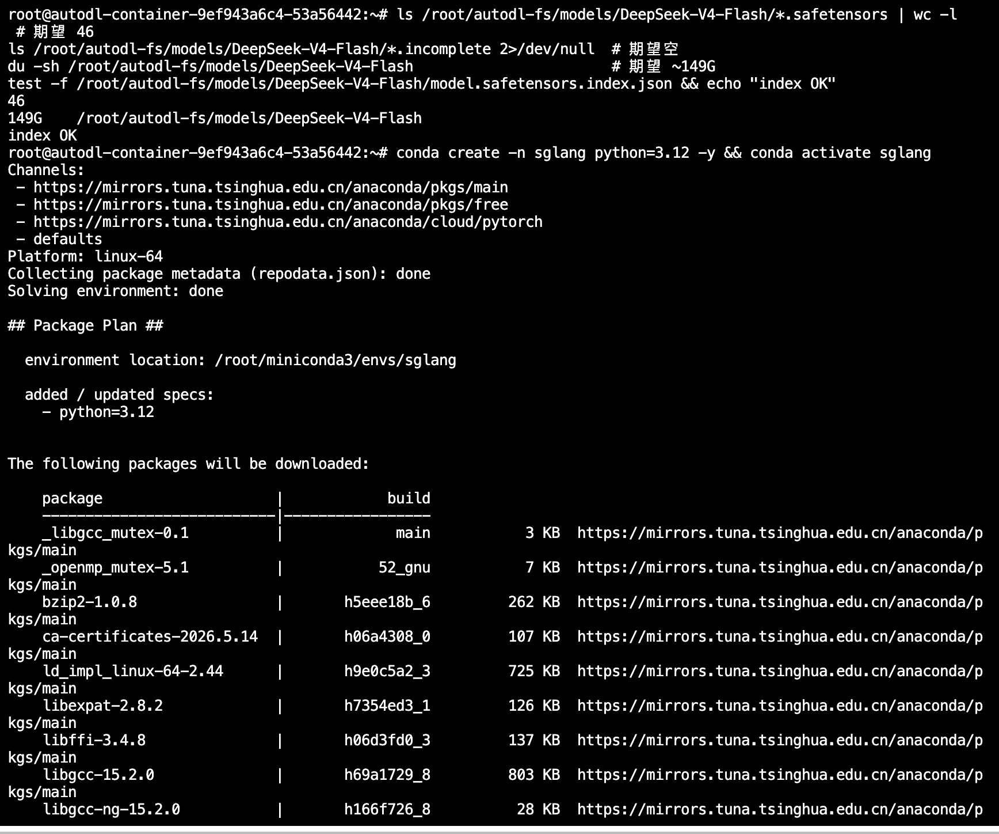
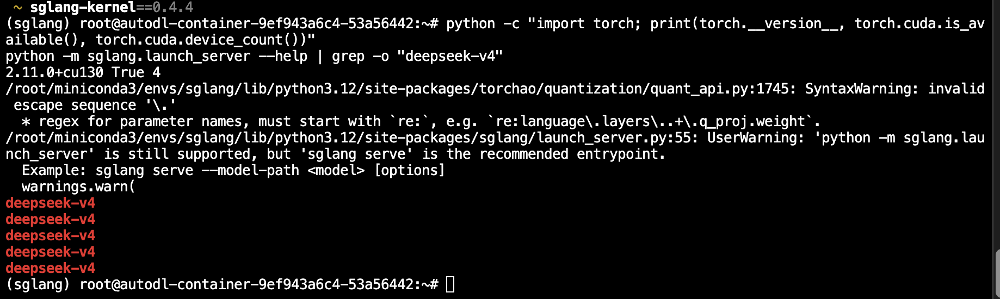
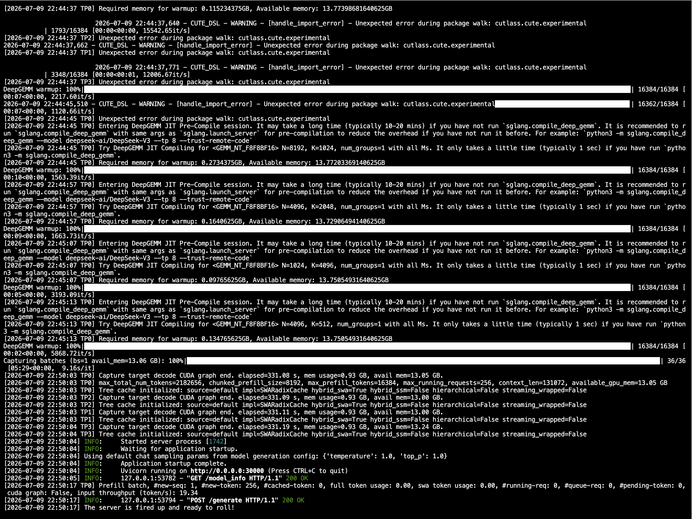
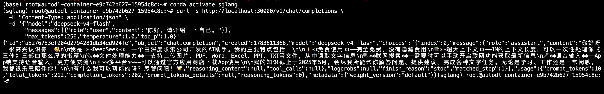
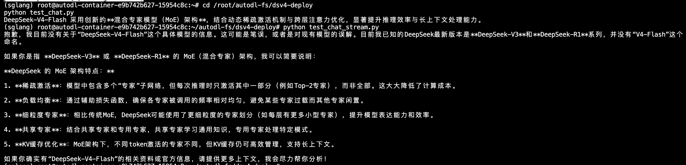
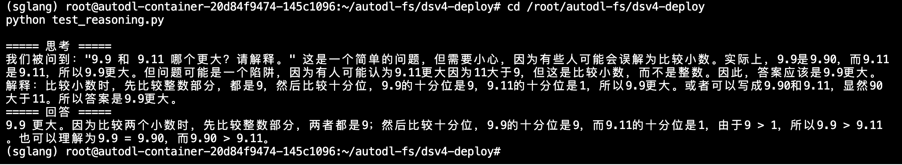
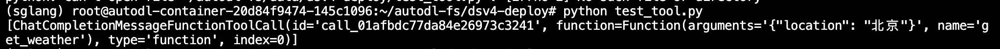

# 02-DeepSeek-V4-Flash SGLang 部署

本节介绍如何使用 SGLang 部署 DeepSeek-V4-Flash，并提供 OpenAI 兼容接口。教程包含两种部署方式：

- RTX PRO 6000 Blackwell：使用 SGLang 官方 Docker 镜像和官方验证配置；
- NVIDIA H200：使用 Python 环境部署，本文已在单机 4 张 H200 上完成启动和接口验证。

本文使用 DeepSeek 官方发布的 [DeepSeek-V4-Flash](https://huggingface.co/deepseek-ai/DeepSeek-V4-Flash) Instruct 权重。该权重约 149GB，共 46 个 `safetensors` 分片，其中 MoE 专家为 FP4，Attention 和 Dense 层为 FP8。

- 模型：[deepseek-ai/DeepSeek-V4-Flash](https://huggingface.co/deepseek-ai/DeepSeek-V4-Flash)
- 框架：[SGLang](https://github.com/sgl-project/sglang)
- 官方部署配置：[DeepSeek-V4 SGLang Cookbook](https://docs.sglang.io/cookbook/autoregressive/DeepSeek/DeepSeek-V4)
- 实测硬件：4 张 NVIDIA H200 141GB

<br>

## 目录

- [02-DeepSeek-V4-Flash SGLang 部署](#02-deepseek-v4-flash-sglang-部署)
  - [目录](#目录)
  - [1. 模型与硬件准备](#1-模型与硬件准备)
    - [1.1 下载模型](#11-下载模型)
    - [1.2 检查硬件](#12-检查硬件)
  - [2. RTX PRO 6000 官方 Docker 部署](#2-rtx-pro-6000-官方-docker-部署)
    - [2.1 拉取镜像](#21-拉取镜像)
    - [2.2 启动服务](#22-启动服务)
  - [3. 4×H200 Python 环境部署](#3-4h200-python-环境部署)
    - [3.1 创建环境](#31-创建环境)
    - [3.2 启动服务](#32-启动服务)
  - [4. 接口调用](#4-接口调用)
    - [4.1 普通对话](#41-普通对话)
    - [4.2 流式输出](#42-流式输出)
    - [4.3 思考模式](#43-思考模式)
    - [4.4 工具调用](#44-工具调用)
  - [5. 实验验证](#5-实验验证)

<br>

## 1. 模型与硬件准备

### 1.1 下载模型

可以使用 Hugging Face CLI 下载模型：

```shell
pip install -U huggingface_hub
hf download deepseek-ai/DeepSeek-V4-Flash \
    --local-dir /root/autodl-fs/models/DeepSeek-V4-Flash
```

国内网络环境也可以使用 ModelScope：

```shell
pip install -U modelscope
modelscope download \
    --model deepseek-ai/DeepSeek-V4-Flash \
    --local_dir /root/autodl-fs/models/DeepSeek-V4-Flash
```

下载完成后检查分片数量和残留文件：

```shell
MODEL_PATH=/root/autodl-fs/models/DeepSeek-V4-Flash

ls "$MODEL_PATH"/model-*.safetensors | wc -l
ls "$MODEL_PATH"/*.incomplete 2>/dev/null || echo "no incomplete"
du -sh "$MODEL_PATH"
test -f "$MODEL_PATH/model.safetensors.index.json" && echo "index OK"
```

正常情况下应输出 46 个分片、没有 `.incomplete` 文件，模型目录约为 149GB。



### 1.2 检查硬件

```shell
nvidia-smi
nvidia-smi topo -m
```

H200 实测环境还应记录当前软件版本：

```shell
python - <<'PY'
from importlib.metadata import version
import torch

print("sglang:", version("sglang"))
print("sglang-kernel:", version("sglang-kernel"))
print("torch:", torch.__version__)
print("torch cuda:", torch.version.cuda)
print("cuda available:", torch.cuda.is_available())
print("gpu count:", torch.cuda.device_count())
for index in range(torch.cuda.device_count()):
    print(index, torch.cuda.get_device_name(index))
PY
```

> 提交前补充 `images/02-01.png`：同一张终端截图中保留 4 张 H200、驱动、CUDA、SGLang、SGLang Kernel 和 PyTorch 版本。

## 2. RTX PRO 6000 官方 Docker 部署

SGLang 官方 Cookbook 已验证 RTX PRO 6000 的 DeepSeek-V4-Flash 低延迟配置。该配置使用两张 96GB RTX PRO 6000、`TP=2` 和 FlashInfer MXFP4 MoE 后端。RTX PRO 6000 只支持 Flash 模型；不要在该配置中启用 HiCache 或 MegaMoE。

注意：如果你在云服务器上部署，一般不提供 Docker 运行时或需要私有云部署Docker，建议直接跳转第三节。

### 2.1 拉取镜像

```shell
docker pull lmsysorg/sglang:latest
```

### 2.2 启动服务

假设模型位于 `/data/models/DeepSeek-V4-Flash`：

```shell
docker run --rm \
  --gpus '"device=0,1"' \
  --shm-size 32g \
  --ipc=host \
  -p 30000:30000 \
  -v /data/models/DeepSeek-V4-Flash:/models/DeepSeek-V4-Flash:ro \
  lmsysorg/sglang:latest \
  sglang serve \
    --trust-remote-code \
    --model-path /models/DeepSeek-V4-Flash \
    --served-model-name deepseek-v4-flash \
    --tp 2 \
    --moe-runner-backend flashinfer_mxfp4 \
    --mem-fraction-static 0.92 \
    --cuda-graph-max-bs-decode 32 \
    --reasoning-parser deepseek-v4 \
    --tool-call-parser deepseekv4 \
    --host 0.0.0.0 \
    --port 30000
```

如果服务器有 4 张 RTX PRO 6000，上述命令仍只使用 GPU 0 和 GPU 1。需要换卡时修改 `device=0,1`。

服务启动后可直接执行第 4 节的接口测试。

## 3. 4×H200 Python 环境部署

### 3.1 创建环境

本文实测环境使用 Python 3.12、PyTorch 2.11.0+cu130 和 4 张 H200：

```shell
conda create -n sglang python=3.12 -y
conda activate sglang

export UV_CACHE_DIR=/dev/shm/uv-cache-sglang
export UV_DEFAULT_INDEX=https://pypi.tuna.tsinghua.edu.cn/simple
export UV_LINK_MODE=copy
mkdir -p "$UV_CACHE_DIR"

python -m pip install --upgrade pip
python -m pip install uv
uv pip install --prerelease=allow sglang
uv pip install --force-reinstall sglang-kernel \
  --index-url https://docs.sglang.ai/whl/cu130/
```

安装后检查 CUDA 和 DeepSeek-V4 parser：

```shell
python -c "import torch; print(torch.__version__, torch.cuda.is_available(), torch.cuda.device_count())"
python -m sglang.launch_server --help | grep -o "deepseek-v4" | head
```



### 3.2 启动服务

H200 可以直接加载官方 FP4+FP8 混合权重。本文采用 TP=4 和 Marlin W4A16 MoE 后端，并将上下文长度先设为 128K：

```shell
conda activate sglang

export CUDA_VISIBLE_DEVICES=0,1,2,3
export PYTORCH_CUDA_ALLOC_CONF=expandable_segments:True

sglang serve \
  --model-path /root/autodl-fs/models/DeepSeek-V4-Flash \
  --served-model-name deepseek-v4-flash \
  --trust-remote-code \
  --tp 4 \
  --host 0.0.0.0 \
  --port 30000 \
  --mem-fraction-static 0.85 \
  --context-length 131072 \
  --moe-runner-backend marlin \
  --reasoning-parser deepseek-v4 \
  --tool-call-parser deepseekv4 \
  --speculative-algorithm EAGLE \
  --speculative-num-steps 3 \
  --speculative-eagle-topk 1 \
  --speculative-num-draft-tokens 4
```

首次启动需要完成模型加载、内核预热和 CUDA Graph 捕获，耗时会明显长于后续启动。日志末尾出现以下内容表示服务已经就绪：

```text
Application startup complete.
Uvicorn running on http://0.0.0.0:30000
The server is fired up and ready to roll!
```



另开一个终端检查 4 张卡的显存：

```shell
nvidia-smi
```

> 提交前补充 `images/02-09.png`：服务加载完成后的 4 张 H200 显存占用。

## 4. 接口调用

SGLang 提供 OpenAI 兼容接口，默认地址为 `http://127.0.0.1:30000/v1`。

### 4.1 普通对话

```shell
curl -sS http://127.0.0.1:30000/v1/chat/completions \
  -H 'Content-Type: application/json' \
  -d '{
    "model":"deepseek-v4-flash",
    "messages":[{"role":"user","content":"你好，请用一句话介绍自己。"}],
    "max_tokens":256,
    "temperature":1.0,
    "top_p":1.0
  }' | python -m json.tool --no-ensure-ascii
```



### 4.2 流式输出

先安装 OpenAI Python SDK：

```shell
uv pip install openai
```

创建 `test_chat_stream.py`：

```python
from openai import OpenAI

client = OpenAI(base_url="http://127.0.0.1:30000/v1", api_key="EMPTY")

response = client.chat.completions.create(
    model="deepseek-v4-flash",
    messages=[{"role": "user", "content": "请简要介绍 DeepSeek-V4-Flash 的 MoE 架构。"}],
    max_tokens=512,
    temperature=1.0,
    top_p=1.0,
    stream=True,
)

for chunk in response:
    if chunk.choices and chunk.choices[0].delta.content:
        print(chunk.choices[0].delta.content, end="", flush=True)
print()
```

```shell
python test_chat_stream.py
```



### 4.3 思考模式

创建 `test_reasoning.py`：

```python
from openai import OpenAI

client = OpenAI(base_url="http://127.0.0.1:30000/v1", api_key="EMPTY")

response = client.chat.completions.create(
    model="deepseek-v4-flash",
    messages=[{"role": "user", "content": "9.9 和 9.11 哪个更大？请解释。"}],
    max_tokens=1024,
    temperature=1.0,
    top_p=1.0,
    extra_body={"chat_template_kwargs": {"thinking": True}},
    stream=True,
)

thinking_started = False
answer_started = False

for chunk in response:
    if not chunk.choices:
        continue
    delta = chunk.choices[0].delta
    if getattr(delta, "reasoning_content", None):
        if not thinking_started:
            print("\n===== 思考 =====")
            thinking_started = True
        print(delta.reasoning_content, end="", flush=True)
    if delta.content:
        if thinking_started and not answer_started:
            print("\n===== 回答 =====")
            answer_started = True
        print(delta.content, end="", flush=True)
print()
```

```shell
python test_reasoning.py
```



### 4.4 工具调用

创建 `test_tool.py`：

```python
from openai import OpenAI

client = OpenAI(base_url="http://127.0.0.1:30000/v1", api_key="EMPTY")

tools = [{
    "type": "function",
    "function": {
        "name": "get_weather",
        "description": "查询指定城市的天气",
        "parameters": {
            "type": "object",
            "properties": {"location": {"type": "string"}},
            "required": ["location"],
        },
    },
}]

response = client.chat.completions.create(
    model="deepseek-v4-flash",
    messages=[{"role": "user", "content": "北京今天天气如何？"}],
    tools=tools,
    extra_body={"chat_template_kwargs": {"thinking": True}},
)

print(response.choices[0].message.tool_calls)
```

```shell
python test_tool.py
```



## 5. 实验验证

本教程在 4 张 NVIDIA H200 上完成了模型加载、普通对话、流式输出、思考模式和工具调用验证。模型加载后可以通过 `nvidia-smi` 查看各卡显存占用和请求期间的 GPU 利用率。


完成以上测试后，DeepSeek-V4-Flash 即可通过 SGLang 的 OpenAI 兼容接口对外提供服务。
