# 03-DeepSeek-V4-Flash vLLM 部署

本节介绍如何在单机 4 张 NVIDIA RTX PRO 6000 Blackwell Server Edition 96GB 上，使用 vLLM 部署 DeepSeek-V4-Flash，并提供 OpenAI 兼容接口。教程包含两种部署方式：

- 本地工作站或裸金属服务器：使用 vLLM 官方 Docker 镜像部署；
- 不提供 Docker 运行时的云平台：在 Python 环境中编译 SM120 固定预览分支，本文已完成启动和接口验证。

RTX PRO 6000 的计算能力为 SM120。官方 Docker 路线使用已经包含 FlashInfer 0.6.14 的固定 nightly 镜像；Python 路线使用针对 SM120 的 vLLM 固定预览分支，完整编译 CUDA 扩展后直接加载 DeepSeek 官方 FP4+FP8 混合权重。

- 模型：[deepseek-ai/DeepSeek-V4-Flash](https://huggingface.co/deepseek-ai/DeepSeek-V4-Flash)
- 官方镜像：[vllm/vllm-openai](https://hub.docker.com/r/vllm/vllm-openai)
- 上游支持：[vLLM PR #41834](https://github.com/vllm-project/vllm/pull/41834)
- 固定源码：[jasl/vllm@sm120-pr-41834-stable-preview-20260717](https://github.com/jasl/vllm/tree/sm120-pr-41834-stable-preview-20260717)
- 实测硬件：4 张 NVIDIA RTX PRO 6000 Blackwell Server Edition 96GB

> Docker 路线使用 vLLM 官方 nightly 镜像，Python 路线采用社区预览分支，不是 vLLM 正式稳定版；复现实验时应使用文中固定的 tag 和 commit，不要直接替换为不断变化的 `main` 分支。

<br>

## 目录

- [03-DeepSeek-V4-Flash vLLM 部署](#03-deepseek-v4-flash-vllm-部署)
  - [目录](#目录)
  - [1. 环境与模型检查](#1-环境与模型检查)
    - [1.1 磁盘规划](#11-磁盘规划)
    - [1.2 下载模型](#12-下载模型)
    - [1.3 检查 GPU、CUDA 和模型](#13-检查-gpucuda-和模型)
  - [2. RTX PRO 6000 官方 Docker 部署](#2-rtx-pro-6000-官方-docker-部署)
  - [3. 创建编译环境](#3-创建编译环境)
    - [3.1 设置目录](#31-设置目录)
    - [3.2 创建 Python 环境](#32-创建-python-环境)
    - [3.3 获取固定源码](#33-获取固定源码)
  - [4. 安装 CUDA 依赖](#4-安装-cuda-依赖)
    - [4.1 安装构建依赖](#41-安装构建依赖)
    - [4.2 安装 FlashInfer](#42-安装-flashinfer)
    - [4.3 安装完整运行依赖](#43-安装完整运行依赖)
  - [5. 编译 vLLM](#5-编译-vllm)
    - [5.1 验证编译产物](#51-验证编译产物)
  - [6. 启动服务](#6-启动服务)
    - [6.1 关键参数说明](#61-关键参数说明)
  - [7. 接口调用](#7-接口调用)
    - [7.1 查询模型](#71-查询模型)
    - [7.2 普通中文输出](#72-普通中文输出)
    - [7.3 流式输出](#73-流式输出)
    - [7.4 思考模式](#74-思考模式)
    - [7.5 工具调用](#75-工具调用)
  - [8. 实验验证](#8-实验验证)
  - [9. 可选优化](#9-可选优化)
    - [9.1 启动优化配置](#91-启动优化配置)
    - [9.2 验证 MTP2 推测解码](#92-验证-mtp2-推测解码)
    - [9.3 验证 Prefix Cache](#93-验证-prefix-cache)

<br>

## 1. 环境与模型检查

### 1.1 磁盘规划

本文使用以下目录：

| 内容 | 路径 | 建议空间 |
| --- | --- | ---: |
| 模型权重 | `/root/autodl-fs/models/DeepSeek-V4-Flash` | 约 149GB |
| Python 环境、源码和编译产物 | `/root/autodl-tmp/dsv4-vllm-sm120` | 至少 100GB |
| 下载和解压缓存 | `/dev/shm/dsv4-vllm-sm120` | 至少 20GB |

不要把 Python 环境和源码编译目录放在 30GB 的系统盘中。`/dev/shm` 只存放缓存，不要把 conda 环境安装到其中。

```shell
df -h /root/autodl-tmp /root/autodl-fs /dev/shm
df -i /root/autodl-tmp /root/autodl-fs /dev/shm
```

### 1.2 下载模型

可以使用 Hugging Face CLI 下载模型：

```shell
python -m pip install -U huggingface_hub
hf download deepseek-ai/DeepSeek-V4-Flash \
  --local-dir /root/autodl-fs/models/DeepSeek-V4-Flash
```

国内网络环境也可以使用 ModelScope：

```shell
python -m pip install -U modelscope
modelscope download \
  --model deepseek-ai/DeepSeek-V4-Flash \
  --local_dir /root/autodl-fs/models/DeepSeek-V4-Flash
```

两种方式选择一种即可，不要重复下载。

### 1.3 检查 GPU、CUDA 和模型

```shell
nvidia-smi
nvcc --version
nvidia-smi topo -m

MODEL_PATH=/root/autodl-fs/models/DeepSeek-V4-Flash
ls "$MODEL_PATH"/model-*.safetensors | wc -l
ls "$MODEL_PATH"/*.incomplete 2>/dev/null || echo "no incomplete"
test -f "$MODEL_PATH/model.safetensors.index.json" && echo "index OK"
```

检查结果应满足：

- 4 张 RTX PRO 6000 Blackwell Server Edition，每张约 96GB；
- `nvcc` 为 CUDA 13.0；
- 模型包含 46 个权重分片，且没有 `.incomplete` 文件。

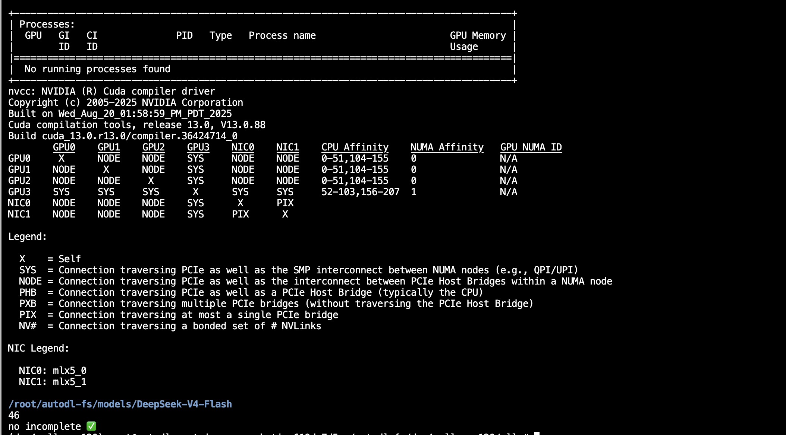

## 2. RTX PRO 6000 官方 Docker 部署

该方式适合已经安装 Docker、NVIDIA 驱动和 NVIDIA Container Toolkit 的本地工作站或裸金属服务器。

> 注意：云服务器一般不提供 Docker 运行时，或需要使用私有云部署 Docker。遇到这种情况请跳转到第 3 节。

先确认容器能够识别 4 张显卡：

```shell
docker version
docker run --rm --gpus all nvidia/cuda:13.0.1-base-ubuntu22.04 nvidia-smi
```

本文固定使用下面的官方 nightly 镜像。不要替换成 `vllm/vllm-openai:v0.25.1`：该稳定镜像固定使用 FlashInfer 0.6.13，不包含本配置所需的 FlashInfer 0.6.14。

```shell
export VLLM_IMAGE=vllm/vllm-openai:nightly-c71a583aa9f81400528e67e3d818f66b804e8340
docker pull "$VLLM_IMAGE"
```

假设模型位于 `/data/models/DeepSeek-V4-Flash`，执行：

```shell
export MODEL_PATH=/data/models/DeepSeek-V4-Flash

docker run --rm \
  --runtime nvidia \
  --gpus '"device=0,1,2,3"' \
  --ipc=host \
  -p 8000:8000 \
  -e NCCL_P2P_DISABLE=1 \
  -e VLLM_ENGINE_READY_TIMEOUT_S=3600 \
  -v "$MODEL_PATH":/models/DeepSeek-V4-Flash:ro \
  "$VLLM_IMAGE" \
    --model /models/DeepSeek-V4-Flash \
    --served-model-name deepseek-v4-flash \
    --trust-remote-code \
    --tensor-parallel-size 4 \
    --enable-expert-parallel \
    --kv-cache-dtype fp8 \
    --block-size 256 \
    --gpu-memory-utilization 0.85 \
    --max-model-len 131072 \
    --max-num-seqs 4 \
    --max-num-batched-tokens 4096 \
    --kernel-config '{"moe_backend":"marlin"}' \
    --tokenizer-mode deepseek_v4 \
    --reasoning-parser deepseek_v4 \
    --tool-call-parser deepseek_v4 \
    --enable-auto-tool-choice \
    --disable-custom-all-reduce \
    --enforce-eager \
    --host 0.0.0.0 \
    --port 8000
```

其中 `marlin` 用于避免 SM120 误选只支持 SM100 的 DeepGEMM MegaMoE 后端。该官方镜像路线先以 128K 上下文和 Eager 模式验证基础服务，不要启用 MTP 或 DSpark 推测解码。日志出现 `Application startup complete` 后，可以直接执行第 7 节的接口测试。

云平台若不提供 Docker 运行时，请继续使用下面的 Python 源码编译路线。

## 3. 创建编译环境

### 3.1 设置目录

```shell
export VLLM_RUN=/root/autodl-tmp/dsv4-vllm-sm120
export VLLM_ENV="$VLLM_RUN/env"
export VLLM_SRC="$VLLM_RUN/vllm"
export VLLM_SHM=/dev/shm/dsv4-vllm-sm120
export WHEEL_DIR="$VLLM_RUN/wheels"

export CONDA_PKGS_DIRS="$VLLM_SHM/conda-pkgs"
export UV_CACHE_DIR="$VLLM_SHM/uv-cache"
export PIP_CACHE_DIR="$VLLM_SHM/pip-cache"
export TMPDIR="$VLLM_RUN/tmp"
export XDG_CACHE_HOME="$VLLM_RUN/cache/xdg"
export TORCHINDUCTOR_CACHE_DIR="$VLLM_RUN/cache/torchinductor"
export UV_LINK_MODE=copy

mkdir -p "$VLLM_RUN" "$CONDA_PKGS_DIRS" "$UV_CACHE_DIR" \
  "$PIP_CACHE_DIR" "$TMPDIR" "$XDG_CACHE_HOME" \
  "$TORCHINDUCTOR_CACHE_DIR" "$WHEEL_DIR"
```

### 3.2 创建 Python 环境

```shell
conda create -p "$VLLM_ENV" python=3.12 pip -y
conda activate "$VLLM_ENV"

python -m pip install --no-cache-dir --upgrade pip uv \
  -i https://pypi.tuna.tsinghua.edu.cn/simple
```

### 3.3 获取固定源码

```shell
git -c http.version=HTTP/1.1 clone --depth 1 \
  --branch sm120-pr-41834-stable-preview-20260717 \
  https://github.com/jasl/vllm.git "$VLLM_SRC"

cd "$VLLM_SRC"
git describe --tags --always
git rev-parse HEAD
```

预期输出为：

```text
sm120-pr-41834-stable-preview-20260717
f63bfd3d7b425b10e0b5e0e2c130fe113a85d009
```

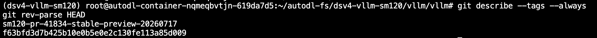

如果服务器无法访问 GitHub，可以在本地电脑下载并上传：

```shell
# 本地电脑
cd ~/Downloads
git -c http.version=HTTP/1.1 clone --depth 1 \
  --branch sm120-pr-41834-stable-preview-20260717 \
  https://github.com/jasl/vllm.git vllm
tar -czf vllm-sm120-20260717.tar.gz vllm
```

将压缩包上传到 `/root/autodl-fs` 后解压：

```shell
mkdir -p /root/autodl-tmp/dsv4-vllm-sm120
tar -xzf /root/autodl-fs/vllm-sm120-20260717.tar.gz \
  -C /root/autodl-tmp/dsv4-vllm-sm120
```

## 4. 安装 CUDA 依赖

### 4.1 安装构建依赖

```shell
export VLLM_RUN=/root/autodl-tmp/dsv4-vllm-sm120
export VLLM_SRC="$VLLM_RUN/vllm"
export VLLM_SHM=/dev/shm/dsv4-vllm-sm120
export WHEEL_DIR="$VLLM_RUN/wheels"
export UV_CACHE_DIR="$VLLM_SHM/uv-cache"
export UV_LINK_MODE=copy
export UV_DEFAULT_INDEX=https://pypi.tuna.tsinghua.edu.cn/simple
export UV_HTTP_TIMEOUT=600
export UV_HTTP_CONNECT_TIMEOUT=60
export UV_HTTP_RETRIES=10

conda activate "$VLLM_RUN/env"
cd "$VLLM_SRC"

uv pip install --verbose --no-progress \
  -r requirements/build/cuda.txt \
  --torch-backend=cu130
```

### 4.2 安装 FlashInfer

该分支固定使用：

- `flashinfer-cubin==0.6.14`，约 436.7MiB；
- `flashinfer-python==0.6.14`，约 13.9MiB。

如果云服务器不能访问 GitHub Release，先在本地电脑下载：

```shell
cd ~/Downloads

curl -L --fail -C - \
  -o flashinfer_cubin-0.6.14-py3-none-any.whl \
  https://github.com/flashinfer-ai/flashinfer/releases/download/v0.6.14/flashinfer_cubin-0.6.14-py3-none-any.whl

curl -L --fail -C - \
  -o flashinfer_python-0.6.14-py3-none-any.whl \
  https://pypi.tuna.tsinghua.edu.cn/packages/f2/8f/b101913cb2b3687654f56681cfe9836d447526be663c149966470ef70531/flashinfer_python-0.6.14-py3-none-any.whl

shasum -a 256 flashinfer_cubin-0.6.14-py3-none-any.whl
shasum -a 256 flashinfer_python-0.6.14-py3-none-any.whl
```

对应的 SHA256 为：

```text
7bbed9f3851b59f3f6f6cb344810775bbce8a1c012ecf9a502bebd91cfb6433e  flashinfer_cubin-0.6.14-py3-none-any.whl
d124369346a3d48eac67e31c42f7a3c813bcc0abc10e2e36db413b7b3dfd97df  flashinfer_python-0.6.14-py3-none-any.whl
```

通过 JupyterLab 上传到 `/root/autodl-fs` 后复制到本地 SSD：

```shell
cp /root/autodl-fs/flashinfer_cubin-0.6.14-py3-none-any.whl "$WHEEL_DIR/"
cp /root/autodl-fs/flashinfer_python-0.6.14-py3-none-any.whl "$WHEEL_DIR/"

sha256sum "$WHEEL_DIR"/flashinfer_*.whl

uv pip install --no-deps \
  "$WHEEL_DIR/flashinfer_cubin-0.6.14-py3-none-any.whl" \
  "$WHEEL_DIR/flashinfer_python-0.6.14-py3-none-any.whl"
```

### 4.3 安装完整运行依赖

原始 `requirements/cuda.txt` 含有 FlashInfer 的额外下载源。前一步已经安装两个固定 wheel，因此生成一份不含该额外源的本地依赖文件：

```shell
cd "$VLLM_SRC"

FLASHINFER_INDEX_RE='^[[:space:]]*--extra-index-url[[:space:]]+https://flashinfer\.ai/whl/?[[:space:]]*$'
CUDA_REQ_LOCAL="$VLLM_SRC/requirements/cuda-autodl.txt"

test "$(grep -cE "$FLASHINFER_INDEX_RE" requirements/cuda.txt)" -eq 1
grep -vE "$FLASHINFER_INDEX_RE" requirements/cuda.txt > "$CUDA_REQ_LOCAL"

set -o pipefail
uv pip install --verbose --no-progress \
  "$WHEEL_DIR/flashinfer_cubin-0.6.14-py3-none-any.whl" \
  "$WHEEL_DIR/flashinfer_python-0.6.14-py3-none-any.whl" \
  -r "$CUDA_REQ_LOCAL" \
  --torch-backend=cu130 \
  2>&1 | tee "$VLLM_RUN/cuda-install.log"
```

安装完成后检查版本：

```shell
python -c "import torch; print('torch', torch.__version__, 'cuda', torch.version.cuda)"
python -c "from importlib.metadata import version; print('flashinfer-python', version('flashinfer-python')); print('flashinfer-cubin', version('flashinfer-cubin')); print('tilelang', version('tilelang'))"
flashinfer show-config
```

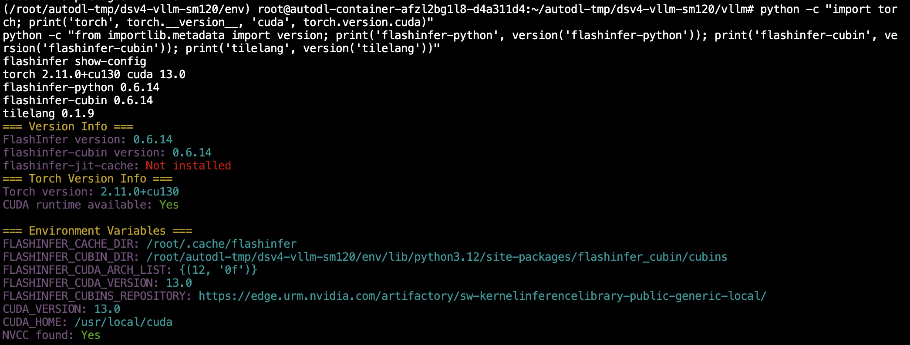

首次执行 `flashinfer show-config` 时显示 `compiled: 0` 属于正常的 JIT 初始状态，不代表 vLLM 编译失败。

## 5. 编译 vLLM

设置 SM120 编译参数：

```shell
export VLLM_RUN=/root/autodl-tmp/dsv4-vllm-sm120
export VLLM_SRC="$VLLM_RUN/vllm"
export VLLM_SHM=/dev/shm/dsv4-vllm-sm120
export UV_CACHE_DIR="$VLLM_SHM/uv-cache"
export TMPDIR="$VLLM_RUN/tmp"
export XDG_CACHE_HOME="$VLLM_RUN/cache/xdg"
export UV_LINK_MODE=copy

conda activate "$VLLM_RUN/env"
cd "$VLLM_SRC"

export CUDA_HOME=/usr/local/cuda
export PATH="$CUDA_HOME/bin:$PATH"
export CUDA_ARCH_LIST=120a
export TORCH_CUDA_ARCH_LIST=12.0a
export VLLM_TARGET_DEVICE=cuda
export VLLM_USE_PRECOMPILED=0
unset VLLM_PRECOMPILED_WHEEL_LOCATION
export MAX_JOBS=8
export NVCC_THREADS=2

python - <<'PY'
from torch.utils.cpp_extension import _get_cuda_arch_flags
print("Torch CUDA arch flags:", _get_cuda_arch_flags())
PY

set -o pipefail
uv pip install --verbose --no-progress --no-build-isolation -e . \
  2>&1 | tee "$VLLM_RUN/vllm-build.log"
```

编译用时与 CPU 核数有关，本次实验约为 2 小时。日志末尾出现 `Built vllm` 和 `Installed vllm` 表示安装完成。

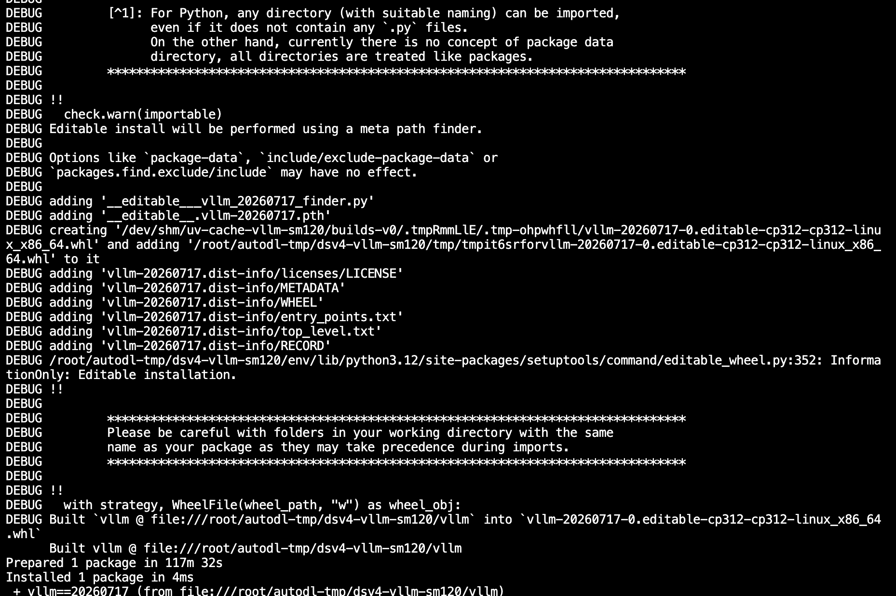

### 5.1 验证编译产物

```shell
export VLLM_RUN=/root/autodl-tmp/dsv4-vllm-sm120
conda activate "$VLLM_RUN/env"
cd "$VLLM_RUN/vllm"

test "$(git rev-parse HEAD)" = "f63bfd3d7b425b10e0b5e0e2c130fe113a85d009"
vllm --version

python - <<'PY'
import importlib.metadata as metadata
import torch
import vllm
import vllm._C_stable_libtorch as vllm_C
import vllm._moe_C_stable_libtorch as vllm_moe_C
from vllm import _custom_ops

caps = [torch.cuda.get_device_capability(i)
        for i in range(torch.cuda.device_count())]
fp4_registered = hasattr(torch.ops._C, "scaled_fp4_quant")

print("vLLM version:", metadata.version("vllm"))
print("vLLM Python:", vllm.__file__)
print("vLLM core extension:", vllm_C.__file__)
print("vLLM MoE extension:", vllm_moe_C.__file__)
print("custom ops: OK")
print("scaled_fp4_quant registered:", fp4_registered)
print("Torch:", torch.__version__)
print("CUDA runtime:", torch.version.cuda)
print("CUDA capabilities:", caps)

assert fp4_registered
assert len(caps) == 4
assert all(cap == (12, 0) for cap in caps)
PY
```

预期版本为 `20260717`，并输出两个原生扩展路径、`scaled_fp4_quant registered: True` 和 4 个 `(12, 0)`。

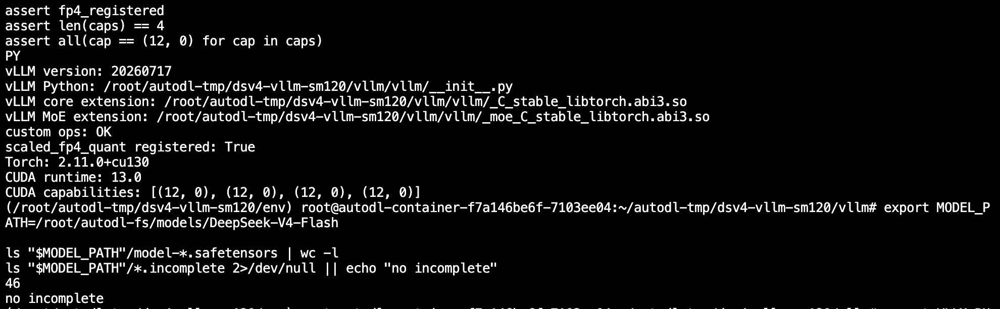

## 6. 启动服务

首次启动采用 Eager 模式和 NCCL 通信，先验证模型加载、FP4 算子、Sparse MLA 和 OpenAI 服务是否正常：

```shell
export VLLM_RUN=/root/autodl-tmp/dsv4-vllm-sm120
conda activate "$VLLM_RUN/env"

export MODEL_PATH=/root/autodl-fs/models/DeepSeek-V4-Flash
export CUDA_VISIBLE_DEVICES=0,1,2,3
export PYTORCH_CUDA_ALLOC_CONF=expandable_segments:True
export VLLM_ENGINE_READY_TIMEOUT_S=3600
export HF_HOME="$VLLM_RUN/huggingface"
export TORCHINDUCTOR_CACHE_DIR="$VLLM_RUN/cache/torchinductor"
export FLASHINFER_WORKSPACE_BASE="$VLLM_RUN/cache/flashinfer"
export TMPDIR="$VLLM_RUN/tmp"
export XDG_CACHE_HOME="$VLLM_RUN/xdg-cache"

unset VLLM_USE_DEEP_GEMM
unset VLLM_DISABLED_KERNELS
unset FLASHINFER_DISABLE_VERSION_CHECK

mkdir -p "$HF_HOME" "$TORCHINDUCTOR_CACHE_DIR" \
  "$FLASHINFER_WORKSPACE_BASE" "$TMPDIR" "$XDG_CACHE_HOME"

vllm serve "$MODEL_PATH" \
  --trust-remote-code \
  --tensor-parallel-size 4 \
  --kv-cache-dtype fp8 \
  --block-size 256 \
  --gpu-memory-utilization 0.85 \
  --max-model-len 131072 \
  --max-num-seqs 4 \
  --max-num-batched-tokens 4096 \
  --tokenizer-mode deepseek_v4 \
  --reasoning-parser deepseek_v4 \
  --tool-call-parser deepseek_v4 \
  --enable-auto-tool-choice \
  --served-model-name deepseek-v4-flash \
  --disable-custom-all-reduce \
  --enforce-eager \
  --host 0.0.0.0 \
  --port 8000 \
  2>&1 | tee "$VLLM_RUN/serve-eager.log"
```

日志出现 `Application startup complete` 后服务即可访问：

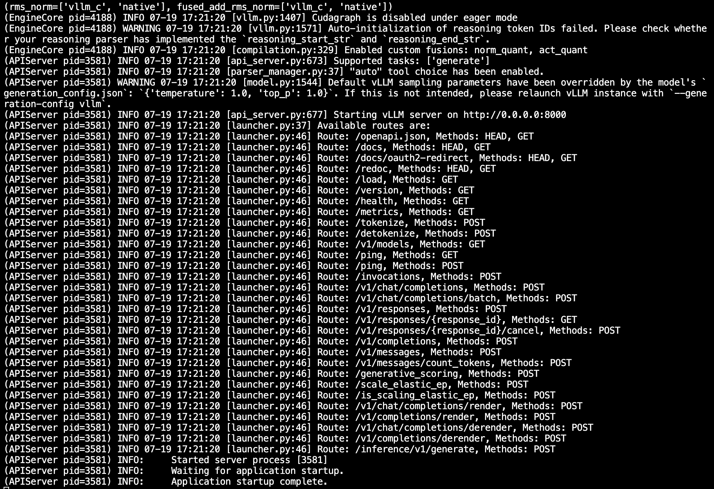

模型加载完成后，每张卡约占用 84GB 显存：

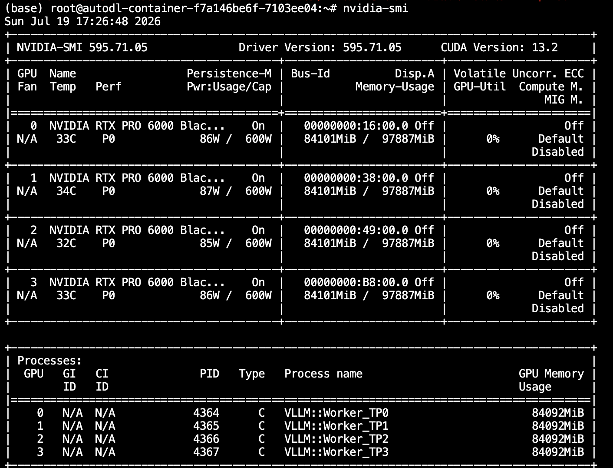

### 6.1 关键参数说明

| 参数 | 作用 |
| --- | --- |
| `--tensor-parallel-size 4` | 将模型按张量并行方式部署到 4 张 GPU |
| `--kv-cache-dtype fp8` | 使用 FP8 KV Cache，降低长上下文的显存占用 |
| `--block-size 256` | 设置 KV Cache 的块大小，与 DeepSeek-V4 的稀疏注意力配置配合使用 |
| `--gpu-memory-utilization 0.85` | 预留部分显存，避免首次编译或运行时显存不足 |
| `--max-model-len 131072` | 将基础验证的最大上下文长度设为 128K |
| `--max-num-seqs 4` | 限制同时处理的序列数量 |
| `--max-num-batched-tokens 4096` | 限制单次调度的 token 数量，降低首次部署压力 |
| `--tokenizer-mode deepseek_v4` | 使用 DeepSeek-V4 专用编码方式 |
| `--reasoning-parser deepseek_v4` | 解析思考内容与最终回答 |
| `--tool-call-parser deepseek_v4` | 解析 DeepSeek-V4 工具调用结果 |
| `--disable-custom-all-reduce` | 使用 NCCL 通信路径，避免当前 PCIe 多卡环境下的自定义 AllReduce 兼容问题 |
| `--enforce-eager` | 先关闭 CUDA Graph，以 Eager 模式完成基础正确性验证 |

## 7. 接口调用

### 7.1 查询模型

```shell
curl -sS http://127.0.0.1:8000/v1/models \
  | python -m json.tool --no-ensure-ascii
```

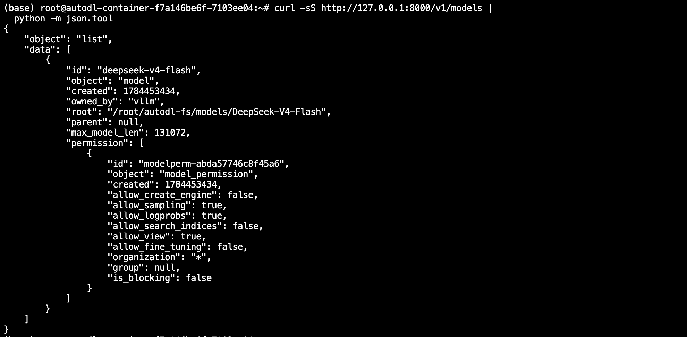

### 7.2 普通中文输出

安装 OpenAI Python SDK：

另外开一个终端

```shell
export VLLM_RUN=/root/autodl-tmp/dsv4-vllm-sm120
conda activate "$VLLM_RUN/env"
uv pip install openai
```

创建 `test_chat.py`：

```python
from openai import OpenAI

client = OpenAI(base_url="http://127.0.0.1:8000/v1", api_key="EMPTY")

response = client.chat.completions.create(
    model="deepseek-v4-flash",
    messages=[{
        "role": "user",
        "content": "用一句话介绍 DeepSeek-V4-Flash 的架构亮点。",
    }],
    max_tokens=256,
    temperature=1.0,
    top_p=1.0,
    extra_body={"thinking": {"type": "disabled"}},
)

print(response.choices[0].message.content)
```

```shell
python test_chat.py
```

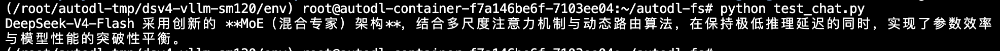

### 7.3 流式输出

创建 `test_chat_stream.py`：

```python
from openai import OpenAI

client = OpenAI(base_url="http://127.0.0.1:8000/v1", api_key="EMPTY")

response = client.chat.completions.create(
    model="deepseek-v4-flash",
    messages=[{
        "role": "user",
        "content": "请简要介绍 DeepSeek-V4-Flash 的 MoE 架构。",
    }],
    max_tokens=512,
    temperature=1.0,
    top_p=1.0,
    stream=True,
    extra_body={"thinking": {"type": "disabled"}},
)

for chunk in response:
    if chunk.choices and chunk.choices[0].delta.content:
        print(chunk.choices[0].delta.content, end="", flush=True)
print()
```

```shell
python test_chat_stream.py
```
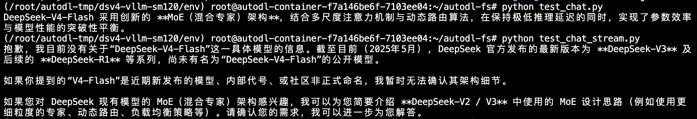


### 7.4 思考模式

创建 `test_reasoning.py`：

```python
from openai import OpenAI

client = OpenAI(base_url="http://127.0.0.1:8000/v1", api_key="EMPTY")

response = client.chat.completions.create(
    model="deepseek-v4-flash",
    messages=[{
        "role": "user",
        "content": "9.9 和 9.11 哪个更大？请解释。",
    }],
    max_tokens=1024,
    temperature=1.0,
    top_p=1.0,
    stream=True,
    extra_body={"thinking": {"type": "enabled"}},
)

thinking_started = False
answer_started = False

for chunk in response:
    if not chunk.choices:
        continue
    delta = chunk.choices[0].delta
    reasoning = getattr(delta, "reasoning_content", None)
    if reasoning:
        if not thinking_started:
            print("\n===== 思考 =====")
            thinking_started = True
        print(reasoning, end="", flush=True)
    if delta.content:
        if thinking_started and not answer_started:
            print("\n===== 回答 =====")
            answer_started = True
        print(delta.content, end="", flush=True)
print()
```

```shell
python test_reasoning.py
```
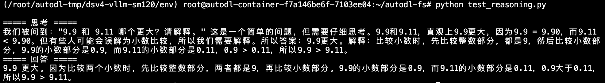

输出应分为“思考”和“回答”两部分。


### 7.5 工具调用

创建 `test_tool.py`：

```python
from openai import OpenAI

client = OpenAI(base_url="http://127.0.0.1:8000/v1", api_key="EMPTY")

tools = [{
    "type": "function",
    "function": {
        "name": "get_weather",
        "description": "查询指定城市的天气",
        "parameters": {
            "type": "object",
            "properties": {"location": {"type": "string"}},
            "required": ["location"],
        },
    },
}]

response = client.chat.completions.create(
    model="deepseek-v4-flash",
    messages=[{
        "role": "user",
        "content": "北京今天天气如何？请调用工具查询。",
    }],
    tools=tools,
    tool_choice="auto",
    temperature=0,
    max_tokens=256,
    extra_body={"thinking": {"type": "disabled"}},
)

for tool_call in response.choices[0].message.tool_calls or []:
    print("工具：", tool_call.function.name)
    print("参数：", tool_call.function.arguments)
```

```shell
python test_tool.py
```
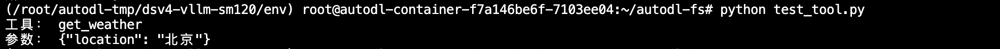
预期输出包含 `get_weather` 和北京。


## 8. 实验验证

本教程在 4 张 RTX PRO 6000 Blackwell Server Edition 上完成了源码编译、模型加载和 OpenAI 兼容接口验证。服务运行时 4 张显卡均参与推理，单卡显存占用约为 84GB。

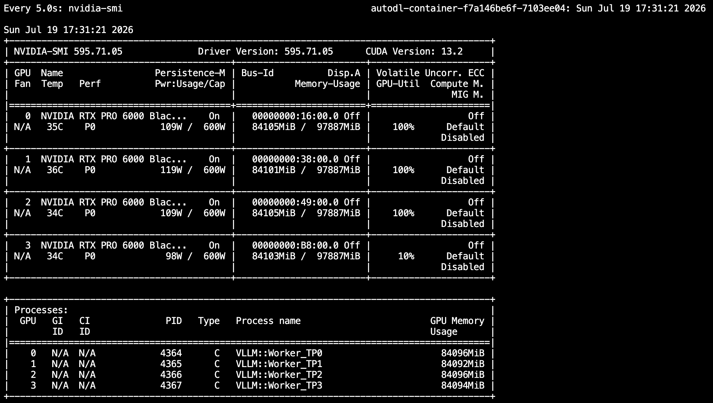


## 9. 可选优化

本节不作为基础部署的完成条件。只有 Eager 配置通过接口和稳定性测试后，再停止原服务并尝试 CUDA Graph、Prefix Cache 和 MTP2：

### 9.1 启动优化配置

```shell
vllm serve "$MODEL_PATH" \
  --trust-remote-code \
  --tensor-parallel-size 4 \
  --kv-cache-dtype fp8 \
  --block-size 256 \
  --gpu-memory-utilization 0.85 \
  --max-model-len 131072 \
  --max-num-seqs 4 \
  --max-num-batched-tokens 4096 \
  --tokenizer-mode deepseek_v4 \
  --reasoning-parser deepseek_v4 \
  --tool-call-parser deepseek_v4 \
  --enable-auto-tool-choice \
  --served-model-name deepseek-v4-flash \
  --enable-prefix-caching \
  --compilation-config '{"cudagraph_mode":"FULL_AND_PIECEWISE"}' \
  --speculative-config '{"method":"mtp","num_speculative_tokens":2}' \
  --disable-custom-all-reduce \
  --host 0.0.0.0 \
  --port 8000
```

首次启动会重新捕获 CUDA Graph。日志出现 `Application startup complete`，说明服务在同时启用 CUDA Graph、Prefix Cache 和 MTP2 后完成启动。

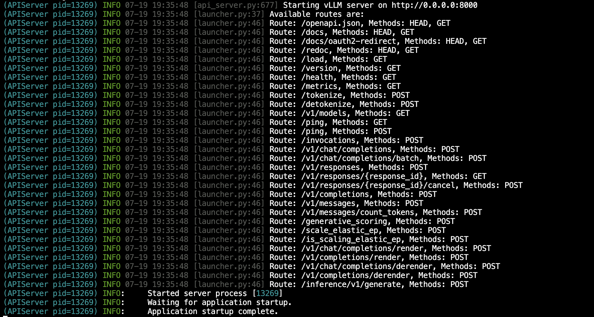

### 9.2 验证 MTP2 推测解码

执行第 7.3 节的流式输出脚本，产生一段长度足够的回复：

```shell
python test_chat_stream.py
```

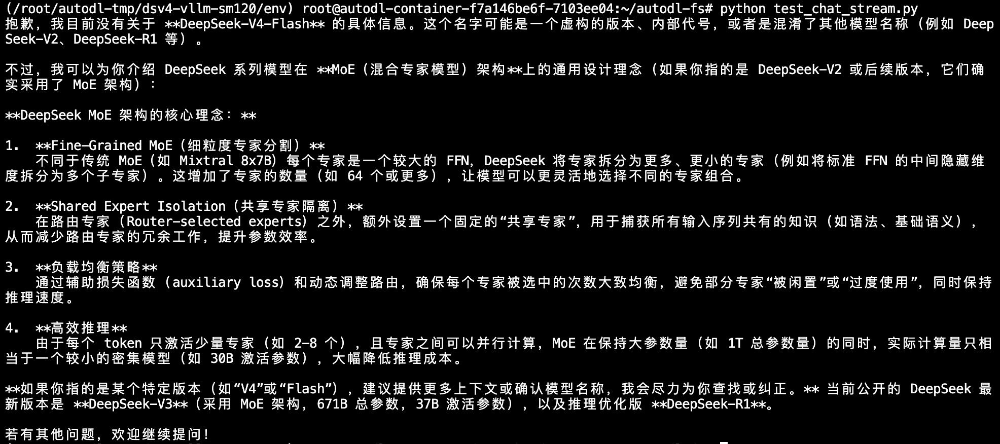

随后查询 vLLM 的推测解码指标：

```shell
curl -sS http://127.0.0.1:8000/metrics \
  | grep -E '^vllm:spec_decode_num_(drafts|draft_tokens|accepted_tokens)'
```

本次测试共产生 444 个 draft token，其中 264 个被接受，draft token 接受率约为 59.5%。`draft_tokens` 和 `accepted_tokens` 均大于 0，说明 MTP2 已参与生成过程。

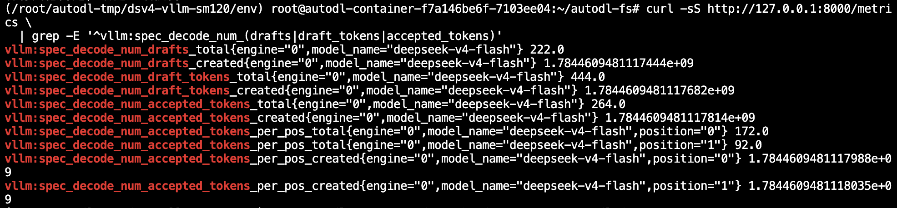

### 9.3 验证 Prefix Cache

创建 `test_prefix_cache.py`，连续发送两次具有相同长前缀的请求：

```python
import time
from openai import OpenAI

client = OpenAI(
    base_url="http://127.0.0.1:8000/v1",
    api_key="EMPTY",
)

shared_text = (
    "DeepSeek-V4-Flash 采用混合专家架构，并使用稀疏注意力处理长上下文。"
    "以下内容用于测试相同长前缀的 KV Cache 复用。\n"
) * 800

messages = [{
    "role": "user",
    "content": shared_text + "\n请用一句话总结以上资料。",
}]

for index in range(1, 3):
    start = time.perf_counter()
    first_token_time = None
    answer = []

    stream = client.chat.completions.create(
        model="deepseek-v4-flash",
        messages=messages,
        max_tokens=64,
        temperature=1.0,
        stream=True,
        extra_body={"thinking": {"type": "disabled"}},
    )

    for chunk in stream:
        content = chunk.choices[0].delta.content
        if content:
            if first_token_time is None:
                first_token_time = time.perf_counter()
            answer.append(content)

    if first_token_time is None:
        print(f"第 {index} 次请求没有返回正文")
    else:
        print(f"第 {index} 次请求 TTFT：{first_token_time - start:.3f} 秒")
        print("回答：", "".join(answer))
```

运行脚本并查询 Prefix Cache 指标：

```shell
python test_prefix_cache.py

curl -sS http://127.0.0.1:8000/metrics \
  | grep -E '^vllm:prefix_cache_(queries|hits)'
```

本次测试中，首次请求的 TTFT 为 18.686 秒，第二次请求降至 0.470 秒，同时 `prefix_cache_hits_total` 大于 0，说明相同长前缀的 KV Cache 已被复用。

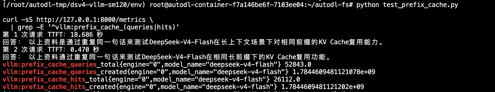

该配置成功后仍可重复第 7 节的思考模式和工具调用测试；如果优化配置启动失败，继续使用已经验证的 Eager 配置即可，不影响基础部署。
