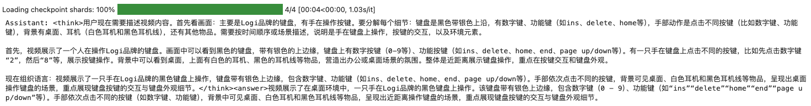
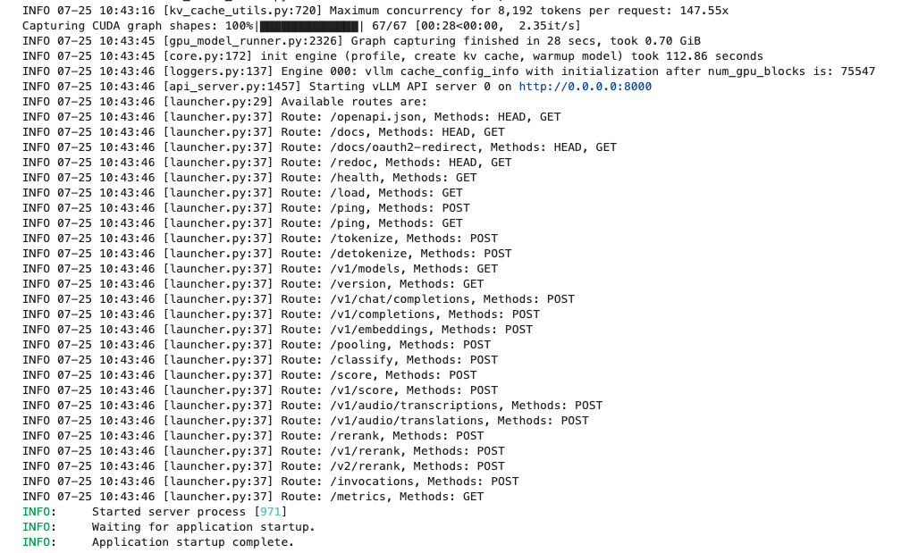
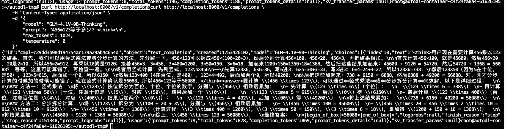
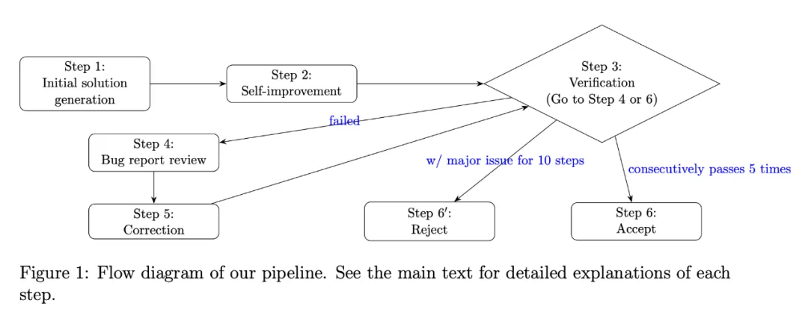
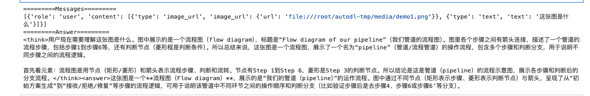
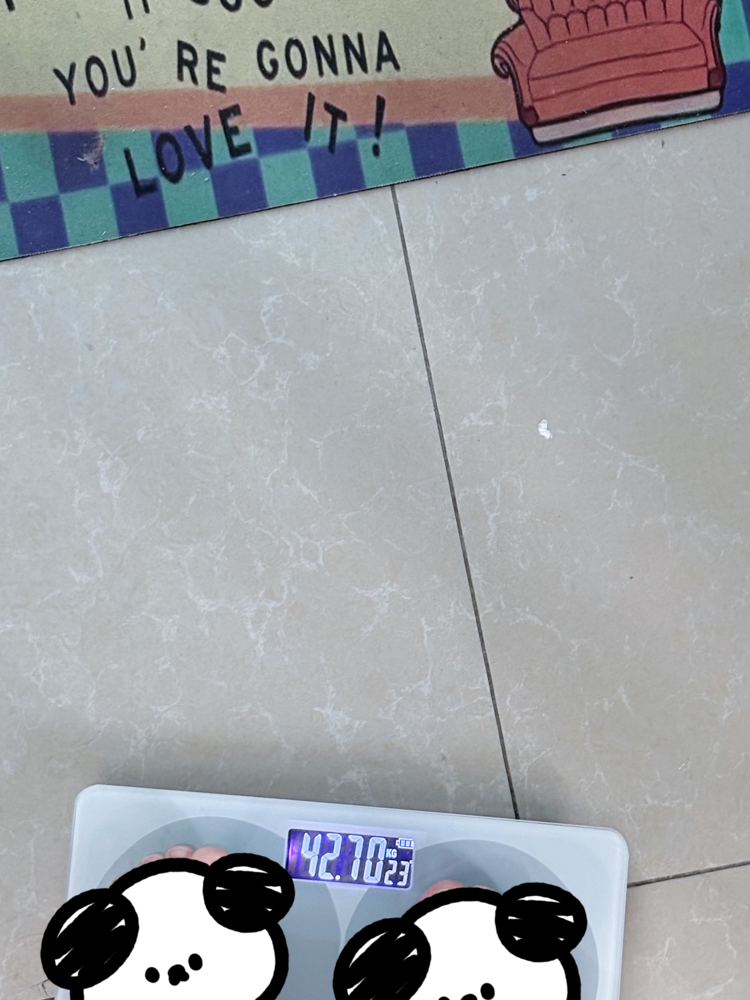

# 01-GLM-4.1V-Thinking vLLM部署调用

[GLM-4.1V-Thinking](https://github.com/THUDM/GLM-4.1V-Thinking) 是一由智谱 AI 基于 [GLM-4-9B-0414](https://github.com/THUDM/GLM-4) 基座模型推出的新版VLM开源模型，引入思考范式，通过课程采样强化学习 RLCS（Reinforcement Learning with Curriculum Sampling）全面提升模型能力， 达到 10B 参数级别的视觉语言模型的最强性能。

## 环境准备

本文的试验基础环境如下：

```
----------------
PyTorch  2.5.1
Python  3.12(ubuntu22.04)
CUDA  12.4
GPU  A800-80GB(80GB) * 1
----------------
```

1. 克隆GLM4.1V项目仓库

```bash
git clone https://github.com/THUDM/GLM-4.1V-Thinking.git
cd GLM-4.1V-Thinking
```

1. `pip`换源加速，下载并安装依赖包

```bash
python -m pip install --upgrade pip
pip config set global.index-url https://pypi.tuna.tsinghua.edu.cn/simple

pip install modelscope
pip install -r GLM-4.1V-Thinking/requirements.txt
```

关键依赖项包括：

- torch>=2.7.1
- gradio>=5.35.0
- PyMuPDF>=1.26.1
- av>=14.4.0（用于视频处理）
- accelerate>=1.6.0
- 从GitHub获取的最新transformers和vLLM

## 模型下载

模型可以从Hugging Face和ModelScope仓库获取。可以显式下载，也可以在首次使用时执行仓库代码自动下载。

### ModelScope

新建 .py/.ipynb 文件，复制下述代码并执行：使用 modelscope 中的 snapshot_download 函数下载模型，第一个参数为模型名称，参数 cache_dir 为模型自定义下载路径。

```python
from modelscope import snapshot_download
model_dir = snapshot_download('Qwen/Qwen3-8B', cache_dir='/root/autodl-tmp', revision='master')
```

### Hugging Face CLI

```bash
huggingface-cli download THUDM/GLM-4.1V-9B-Thinking --local-dir /root/autodl-tmp/GLM-4.1V-9B-Thinking
```

ps：记得修改对应的 `cache_dir` / `local_dir`为你的模型下载路径哦~

## transformers调用代码

使用`transformers`库作为推理的改写交互脚本进行调用测试

```python
import argparse
import re
import torch
from transformers import AutoProcessor, Glm4vForConditionalGeneration

def build_content(image_paths, video_path, text):
    content = []
    if image_paths:
        for img_path in image_paths:
            content.append({"type": "image", "url": img_path})
    if video_path:
        content.append({"type": "video", "url": video_path})
    content.append({"type": "text", "text": text})
    return content

processor = AutoProcessor.from_pretrained("/root/autodl-tmp/ZhipuAI/GLM-4.1V-9B-Thinking", use_fast=True)
model = Glm4vForConditionalGeneration.from_pretrained(
    "/root/autodl-tmp/ZhipuAI/GLM-4.1V-9B-Thinking", torch_dtype=torch.bfloat16, device_map="cuda:0"
)
messages = []
messages.append(
    {
        "role": "user",
        "content": [
            {"type": "video", "url": "/root/autodl-tmp/media/demo3.mp4"},
            {"type": "text", "text": "这个视频的内容是什么？"},
        ],
    }
)
inputs = processor.apply_chat_template(
    messages,
    tokenize=True,
    add_generation_prompt=True,
    return_dict=True,
    return_tensors="pt",
    padding=True,
).to(model.device)

output = model.generate(
    **inputs,
    max_new_tokens=25000,
    repetition_penalty=1.0,
    do_sample=1.0 > 0,
    top_k=2,
    temperature=1.0,
)
raw = processor.decode(
    output[0][inputs["input_ids"].shape[1] : -1], skip_special_tokens=False
)
match = re.search(r"<answer>(.*?)</answer>", raw, re.DOTALL)
answer = match.group(1).strip() if match else ""
messages.append(
    {"role": "assistant", "content": [{"type": "text", "text": answer}]}
)
print(f"Assistant: {raw}")
```

使用的视频文件示例：

[vdieo-1.mp4](images/vdieo-1.mp4)

执行代码结果如下：



```
Assistant: <think>用户现在需要描述视频内容。首先看画面：主要是Logi品牌的键盘，有手在操作按键。要分解每个细节：键盘是黑色带银色上沿，有数字键、功能键（如ins、delete、home等），手部动作是点击不同按键（比如数字键、功能键），背景有桌面、耳机（白色耳机和黑色耳机线），还有其他物品。需要按时间顺序或场景描述，说明是手在键盘上操作，按键的交互，以及环境元素。

首先，视频展示了一个人在操作Logi品牌的键盘。画面中可以看到黑色的键盘，带有银色的上边缘，键盘上有数字按键（0-9等）、功能按键（如ins、delete、home、end、page up/down等）。有一只手在键盘上点击不同的按键，比如先点击数字键“2”，然后“8”等，展示按键操作。背景中可以看到桌面，上面有白色的耳机、黑色的耳机线等物品，营造出办公或桌面场景的氛围。整体是近距离展示键盘操作，重点在按键交互和键盘外观。

现在组织语言：视频展示了一只手在Logi品牌的黑色键盘上操作，键盘带有银色上边缘，包含数字键、功能键（如ins、delete、home、end、page up/down等）。手部依次点击不同的按键，背景可见桌面、白色耳机和黑色耳机线等物品，呈现出桌面操作键盘的场景，重点展现键盘按键的交互与键盘外观细节。</think><answer>视频展示了在桌面环境中，一只手在Logi品牌的黑色键盘上操作。该键盘带有银色上边缘，包含数字键（0 - 9）、功能键（如“ins”“delete”“home”“end”“page up/down”等）。手部依次点击不同的按键（如数字键、功能键），背景中可见桌面、白色耳机和黑色耳机线等物品，呈现出近距离操作键盘的场景，重点展现键盘按键的交互与键盘外观细节。
```

## vLLM调用代码准备

首先从 `vLLM` 库中导入 `LLM` 和 `SamplingParams` 类。`LLM` 类是使用 `vLLM` 引擎运行离线推理的主要类。`SamplingParams` 类指定采样过程的参数，用于控制和调整生成文本的随机性和多样性。

`vLLM` 提供了非常方便的封装，我们直接传入模型名称或模型路径即可，不必手动初始化模型和分词器。

在 `/root/autodl-tmp` 路径下新建 `vllm_model.py` 文件并在其中输入以下内容

```python
# vllm_model.py
from vllm import LLM, SamplingParams
from transformers import AutoTokenizer
import os
import json

def prepare_model(model_path, max_tokens=512, temperature=0.8, top_p=0.95, max_model_len=2048):
    # 初始化 vLLM 推理引擎
    llm = LLM(model=model_path, tokenizer=model_path, max_model_len=max_model_len,trust_remote_code=True)
    return llm

def get_completion(prompts, llm, max_tokens=512, temperature=0.8, top_p=0.95, max_model_len=2048):
    stop_token_ids = [151329, 151336, 151338]
    # 创建采样参数。temperature 控制生成文本的多样性，top_p 控制核心采样的概率
    sampling_params = SamplingParams(temperature=temperature, top_p=top_p, max_tokens=max_tokens, stop_token_ids=stop_token_ids)
    # 初始化 vLLM 推理引擎
    outputs = llm.generate(prompts, sampling_params)
    return outputs

# 初始化 vLLM 推理引擎
model_path = '/root/autodl-tmp/ZhipuAI/GLM-4.1V-9B-Thinking'
tokenizer = AutoTokenizer.from_pretrained(model_path)
llm = prepare_model(model_path)

prompt = "5的阶乘是多少？"
messages = [
    {"role": "user", "content": prompt}
]

# 应用template中的chat模板
text = tokenizer.apply_chat_template(
    messages,
    tokenize=False,
    add_generation_prompt=True
)

outputs = get_completion(text, llm, max_tokens=1024, temperature=1, top_p=1, max_model_len=2048)
print(outputs[0].outputs[0].text)
```

执行代码结果如下：


GLM-4.1V-9B-Thinking支持多种类型的多模态输入，但有特定限制：

| **输入类型** | **最大允许数量** | **格式支持** |
| --- | --- | --- |
| 图片 | 10张图片（Gradio），300（API） | JPG, JPEG, PNG, GIF, BMP, TIFF, WEBP |
| 视频 | 1个视频 | MP4, AVI, MKV, MOV, WMV, FLV, WEBM, MPEG, M4V |
| 文档 | 1个PDF或1个PPT | PDF, PPT, PPTX（内部转换为图片） |

## 创建兼容 OpenAI API 接口的服务器

`GLM-4.1V-Thinking` 兼容 `OpenAI API` 协议，所以我们可以直接使用 `vLLM` 创建 `OpenAI API` 服务器。`vLLM` 部署实现 `OpenAI API` 协议的服务器非常方便。默认会在 [http://localhost:8000](http://localhost:8000/) 启动服务器。服务器当前一次托管一个模型，并实现列表模型、`completions` 和 `chat completions` 端口。

- `completions`：是基本的文本生成任务，模型会在给定的提示后生成一段文本。这种类型的任务通常用于生成文章、故事、邮件等。
- `chat completions`：是面向对话的任务，模型需要理解和生成对话。这种类型的任务通常用于构建聊天机器人或者对话系统。

在创建服务器时，我们可以指定模型名称、模型路径、聊天模板等参数。

- `-host` 和 `-port` 参数指定地址。
- `-model` 参数指定模型名称。
- `-chat-template` 参数指定聊天模板。
- `-served-model-name` 指定服务模型的名称。
- `-max-model-len` 指定模型的最大长度。

```bash
vllm serve /root/autodl-tmp/ZhipuAI/GLM-4.1V-9B-Thinking
    --served-model-name GLM-4.1V-9B-Thinking
    --max_model_len 25000
    --limit-mm-per-prompt '{"image": 32, "video": 1}'
    --allowed-local-media-path /
```



- 通过 `curl` 命令查看当前的模型列表

```bash
curl http://localhost:8000/v1/models
```

得到的返回值如下所示

```json
{
	"object":"list",
	"data":[
		{
			"id":"GLM-4.1V-9B-Thinking",
			"object":"model",
			"created":1753411607,
			"owned_by":"vllm",
			"root":"/root/autodl-tmp/ZhipuAI/GLM-4.1V-9B-Thinking",
			"parent":null,
			"max_model_len":8192,
			"permission":[
				{
						"id":"modelperm-7a0d15b7334b4d19b024c2829c96b44a",
						"object":"model_permission",
						"created":1753411607,
						"allow_create_engine":false,
						"allow_sampling":true,
						"allow_logprobs":true,
						"allow_search_indices":false,
						"allow_view":true,
						"allow_fine_tuning":false,
						"organization":"*",
						"group":null,
						"is_blocking":false
						}
					]
			}
		]
}
```

- 使用 `curl` 命令测试 `OpenAI Completions API`

```
curl http://localhost:8000/v1/completions \
    -H "Content-Type: application/json" \
    -d '{
        "model": "GLM-4.1V-9B-Thinking",
        "prompt": "456*123等于多少？<think>\n",
        "max_tokens": 1024,
        "temperature": 0
    }'
```

 得到的返回值如下所示



• 用 `Python` 脚本请求 `OpenAI Chat Completions API` 的单图像示例

```bash
# vllm_openai_completions.py
import argparse
import os
from openai import OpenAI

def get_media_type(file_path):
    video_extensions = {".mp4", ".avi", ".mov"}
    image_extensions = {".jpg", ".jpeg", ".png"}
    _, ext = os.path.splitext(file_path.lower())
    return (
        "video_url"
        if ext in video_extensions
        else "image_url"
        if ext in image_extensions
        else None
    )

def create_content_item(media_path, media_type):
    if media_path.startswith(("http://", "https://")):
        url = media_path
    else:
        url = "file://" + media_path

    if media_type == "video_url":
        return {"type": "video_url", "video_url": {"url": url}}
    else:
        return {"type": "image_url", "image_url": {"url": url}}

client = OpenAI(
    base_url="http://localhost:8000/v1",
    api_key="sk-xxx", # 随便填写，只是为了通过接口参数校验
)

media_path = "/root/autodl-tmp/media/demo1.png"
media_type = get_media_type(media_path)
messages = [
    {
        "role": "user",
        "content": [
            create_content_item(media_path, media_type),
            {"type": "text", "text": "这张图是什么"},
        ],
    }
]
print("=========Messages=========")
print(messages)
response = client.chat.completions.create(
    model="GLM-4.1V-9B-Thinking",
    messages = messages,
    temperature = 1.0,
    top_p = None,
    extra_body = {
        "skip_special_tokens": False,
        "repetition_penalty": 1.0,
    },
)
print("=========Answer=========")
print(response.choices[0].message.content.strip())
```

示例使用的图像如下所示：



得到的结果如下所示：



• 用 `Python` 脚本请求 `OpenAI Chat Completions API` 的多图像分析

```python
# vllm_openai_completions.py
# 上述代码不变
media_path_1 = "/root/autodl-tmp/media/demo2-1.JPG"
media_path_2 = "/root/autodl-tmp/media/demo2-2.JPG"

messages = [
    {
        "role": "user",
        "content": [
            create_content_item(media_path_1, media_type),
            create_content_item(media_path_2, media_type),
            {"type": "text", "text": "这两张图像之间可能有哪些关联？"},
        ],
    }
]
```

分别传入多张图像的路径进行解析，GLM-4.1V-Thinking 可同时分析多达 10 张图像

示例使用的图像如下所示：
<div style="display: flex; justify-content: center; gap: 20px; margin: 20px 0;">
    
    
</div>

执行代码结果如下：

Assistant: 根据提供的参考信息，这两张图片之间可能存在以下几种关联：

1. 健康生活方式关联
第1张图片展示的是无糖可口可乐，强调"0糖 0脂肪 0卡路里"，表明产品定位为健康饮品选择
第2张图片显示体重秤和体重记录(42.7公斤)，这直接与体重管理相关
两者共同反映了现代人对健康饮食和体重管理的关注
2. 时间与行为关联
第2张图片中的日期"10/23"可能表示特定日期，与第1张图片的可口可乐消费相关
可能是在10月23日，这个人选择了无糖可乐作为健康饮品，并记录了体重
3. 心理动机关联
第1张图片中的无糖可乐可能代表一种健康选择的替代品，减少糖分和卡路里摄入
第2张图片中的"YOU'RE GONNA LOVE IT!"可能是在鼓励自己坚持健康的生活方式，包括选择无糖饮料
4. 产品与消费者关联
第1张图片是可口可乐的产品信息
第2张图片可能是消费者使用无糖可乐后的记录或反馈，展示了产品的健康益处
这些关联表明，这两张图片可能共同讲述了一个关于健康意识增强、注重体重管理的生活方式故事，其中无糖可乐作为健康饮食选择的一部分。
