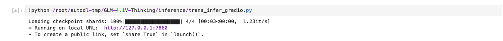

# 02-GLM-4.1V-Thinking Gradio部署

THUDM也提供一个gradio界面脚本，搭建一个可以直接使用的 Web 界面，支持图片，视频，PDF，PPT等多模态输入。当然，如果glm4.1v在本地调用的及修改对应的模型路径即可。


```bash
python /root/autodl-tmp/GLM-4.1V-Thinking/inference/trans_infer_gradio.py
```

使用AutoDL的云端机器的小伙伴根据自己系统的指引连接即可

```bash
ssh -F /dev/null -CNg -L 7860:127.0.0.1:7860 [root@connect.nma1.seetacloud.com](mailto:root@connect.nma1.seetacloud.com) -p 36185
```

## 启动示例




