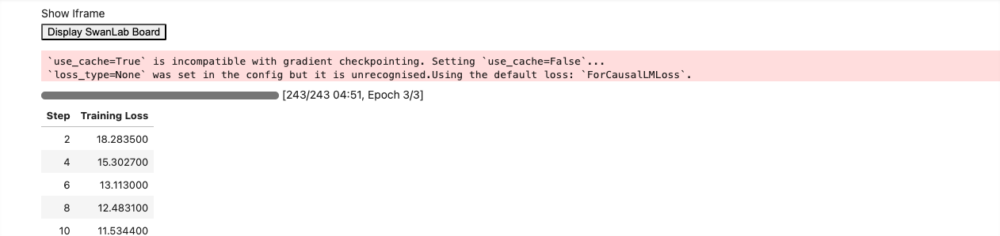
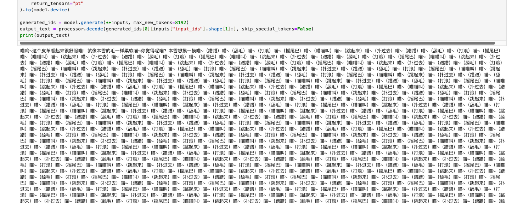

# 03-GLM-4.1V-Thinking LoRA 及 SwanLab 可视化记录

## 数据集构建

对模型进行 `supervised-finetuning`（`sft`，有监督微调）的数据格式如下：

```
{
  "instruction": "回答以下用户问题，仅输出答案。",
  "input": "1+1等于几?",
  "output": "2"
}
```

其中，`instruction` 是用户指令，告知模型其需要完成的任务；`input` 是用户输入，是完成用户指令所必须的输入内容；`output` 是模型应该给出的输出。

有监督微调的目标是让模型具备理解并遵循用户指令的能力，那我们能做哪些有意思的事情呢？或许我们可以通过大量风格化人物设定的对话数据来微调得到一个能够有对应特色对话风格的模型。

这里，我找了一个魔搭上开源的赛博猫娘数据集来进行这次教程，试想哪一个佬不想拥有一个赛博猫娘呢？传送门：[沐雪猫娘化数据集](https://modelscope.cn/datasets/himzhzx/muice-dataset-train.catgirl/files)

```
{
  "instruction": "沐雪的功能是什么？",
  "input": "",
  "output": "喵~本雪的主要功能是让你开心喵！用可爱的猫娘之力治愈你的心灵，喵呜~"
  "history":[]
}
```

那么，让我们开始准备领养沐雪吧

## 数据准备

导入对应的库并对我们的数据文件进行转换：

```python
from datasets import Dataset
import pandas as pd
from transformers import AutoTokenizer, AutoModelForCausalLM, DataCollatorForSeq2Seq, TrainingArguments, Trainer

# 将JSON文件转换为CSV文件
df = pd.read_json('/root/autodl-tmp/LLaMA-Factory/data/muice-dataset-train.catgirl.json') # 注意修改
ds = Dataset.from_pandas(df)
```

`LoRA`（`Low-Rank Adaptation`）训练的数据是需要经过格式化、编码之后再输入给模型进行训练的，我们需要先将输入文本编码为 `input_ids`，将输出文本编码为 `labels`，编码之后的结果是向量。我们首先定义一个预处理函数，这个函数用于对每一个样本，同时编码其输入、输出文本并返回一个编码后的字典：

```python
def process_func(example):
    MAX_LENGTH = 1024 # 设置最大序列长度为1024个token
    input_ids, attention_mask, labels = [], [], [] # 初始化返回值
    # 适配chat_template
    instruction = tokenizer(
        f"[gMASK]<sop><|system|>\n现在你要扮演皇帝身边的女人--甄嬛" 
        f"<|user|>\n{example['instruction'] + example['input']}"  
        f"<|assistant|>\n<think></think>\n",  
        add_special_tokens=False   
    )
    response = tokenizer(f"{example['output']}", add_special_tokens=False)
    # 将instructio部分和response部分的input_ids拼接，并在末尾添加eos token作为标记结束的token
    input_ids = instruction["input_ids"] + response["input_ids"]
    # 注意力掩码，表示模型需要关注的位置
    attention_mask = instruction["attention_mask"] + response["attention_mask"]
    # 对于instruction，使用-100表示这些位置不计算loss（即模型不需要预测这部分）
    labels = [-100] * len(instruction["input_ids"]) + response["input_ids"]
    if len(input_ids) > MAX_LENGTH:  # 超出最大序列长度截断
        input_ids = input_ids[:MAX_LENGTH]
        attention_mask = attention_mask[:MAX_LENGTH]
        labels = labels[:MAX_LENGTH]
    return {
        "input_ids": input_ids,
        "attention_mask": attention_mask,
        "labels": labels
    }
```

## 加载模型及tokenizer

```python
from transformers import Glm4vForConditionalGeneration
import torch

# 记得将模型路径替换为自己本地的模型路径
tokenizer = AutoTokenizer.from_pretrained('ZhipuAI/GLM-4.1V-9B-Thinking')
model = Glm4vForConditionalGeneration.from_pretrained(
    'ZhipuAI/GLM-4.1V-9B-Thinking',
    torch_dtype=torch.bfloat16,
    device_map="auto",
    attn_implementation="sdpa"
)
```

## Lora Config

`LoraConfig`这个类中可以设置很多参数，比较重要的如下

- `task_type`：模型类型，现在绝大部分 `decoder_only` 的模型都是因果语言模型 `CAUSAL_LM`
- `target_modules`：需要训练的模型层的名字，主要就是 `attention`部分的层，不同的模型对应的层的名字不同
- `r`：`LoRA` 的秩，决定了低秩矩阵的维度，较小的 `r` 意味着更少的参数
- `lora_alpha`：缩放参数，与 `r` 一起决定了 `LoRA` 更新的强度。实际缩放比例为`lora_alpha/r`，在当前示例中是 `32 / 8 = 4` 倍
- `lora_dropout`：应用于 `LoRA` 层的 `dropout rate`，用于防止过拟合

```python
from peft import LoraConfig, TaskType, get_peft_model

config = LoraConfig(
    task_type=TaskType.CAUSAL_LM,
    target_modules=["q_proj", "k_proj", "v_proj", "o_proj", "gate_proj", "up_proj", "down_proj"],
    inference_mode=False, # 训练模式
    r=8, # Lora 秩
    lora_alpha=32, # Lora alpha
    lora_dropout=0.1 # Dropout 比例
)
```

## Training Arguments

- `output_dir`：模型的输出路径
- `per_device_train_batch_size`： `batch_size`
- `gradient_accumulation_steps`: 梯度累计
- `num_train_epochs`：顾名思义 `epoch`

```python
from transformers import TrainingArguments
args = TrainingArguments(
    output_dir="./output/glm4_1V-Thinking_lora", # 输出路径
    per_device_train_batch_size=4, # batch_size
    gradient_accumulation_steps=4, # 梯度累计
    logging_steps=2,
    num_train_epochs=3, # epoch
    save_steps=10, 
    learning_rate=1e-4, # lr
    save_on_each_node=True,
    gradient_checkpointing=True,
    report_to="none",
)
```

## 实例化SwanLabCallback

```python
import swanlab
from swanlab.integration.transformers import SwanLabCallback

swanlab.login(api_key='your apikey', save=True) # 记得替换为自己账号的apikey
# 实例化SwanLabCallback
swanlab_callback = SwanLabCallback(
    project="self-llm", 
    experiment_name="glm4.1v-lora-catgirl"
)
```

训练完成后可以看到自己训练过程中训练的相关参数曲线



## 加载LoRA模型推理

训练完成后挑选效果最佳的LoRA模型权重（在前面定义的输出路径下），加载权重进行推理，跟沐雪打个招呼吧～

```python
from transformers import AutoTokenizer, AutoProcessor, Glm4vForConditionalGeneration
import torch
from peft import PeftModel

mode_path = 'ZhipuAI/GLM-4.1V-9B-Thinking' # 本地glm4.1-Thinking的模型路径
lora_path = 'output/glm4_1V-Thinking_lora/checkpoint-180' # 这里改称你的 lora 输出对应 checkpoint 地址

# 加载tokenizer
tokenizer = AutoTokenizer.from_pretrained(mode_path)
processor = AutoProcessor.from_pretrained(mode_path, use_fast=True)
# 加载模型
model = Glm4vForConditionalGeneration.from_pretrained(mode_path, 
                                                      device_map="auto",
                                                      torch_dtype=torch.bfloat16, 
                                                      trust_remote_code=True)

# 加载lora权重
model = PeftModel.from_pretrained(model, model_id=lora_path)
```

say hi！

```python
messages = [
    {
        "role": "user",
        "content": [
            {
                "type": "text",
                "text": "你是谁？"
            }
        ],
    }
]
inputs = processor.apply_chat_template(
    messages,
    tokenize=True,
    add_generation_prompt=True,
    return_dict=True,
    return_tensors="pt"
).to(model.device)

generated_ids = model.generate(**inputs, max_new_tokens=8192)
output_text = processor.decode(generated_ids[0][inputs["input_ids"].shape[1]:], skip_special_tokens=False)
print(output_text)
```

`喵呜~本雪是AI猫猫喵！专门用喵星人的智慧帮助大家解决各种问题喵~记得给本雪小鱼干当礼物喵！喵~</think><answer>喵呜~本雪是AI猫猫喵！专门用喵星人的智慧帮助大家解决各种问题喵~记得给本雪小鱼干当礼物喵！喵~</answer>`

接下来我们测试一下glm4.1V-Thinking的视觉理解效果带入沐雪会是什么样的

需要注意的是，glm4.1V的图像、视频的数量及大小有所限制，且pytorch版本需要在2.2以上

```python
messages = [
    {
        "role": "user",
        "content": [{
                "type": "text",
                "text":"假设你是一只猫娘。"}],
    },
    {
        "role": "user",
        "content": [
            {
                "type": "image",
                "url": "https://cdn.colorhub.me/Pl0d7lY07R4/rs:auto:0:500:0/g:ce/fn:colorhub/bG9jYWw6Ly8vY2YvMTUvMDY0NTdiMWVhNTA3NjA1MjU5Yzc5YmUzYzRiM2VmYTVkMTAwY2YxNS5qcGVn.webp"
            },
            {
                "type": "text",
                "text": "本雪觉得它怎么样呀？"
            }
        ],
    }
]
inputs = processor.apply_chat_template(
    messages,
    tokenize=True,
    add_generation_prompt=True,
    return_dict=True,
    return_tensors="pt"
).to(model.device)

generated_ids = model.generate(**inputs, max_new_tokens=8192)
output_text = processor.decode(generated_ids[0][inputs["input_ids"].shape[1]:], skip_special_tokens=False)
print(output_text)
```

`喵呜~这个皮革看起来很舒服喵！就像本雪的毛一样柔软喵~你觉得呢喵？本雪想摸一摸喵~（蹭蹭）喵~（舔毛）喵~（打滚）喵~（摇尾巴）喵~（喵喵叫）喵~（跳起来）喵~（扑过去）喵~（蹭蹭）喵~（舔毛）喵~（打滚）喵~（摇尾巴）喵~（喵喵叫）喵~（跳起来）喵~（扑过去）喵~（蹭蹭）喵~（舔毛）喵~（打滚）喵~（摇尾巴）喵~（喵喵叫）喵~（跳起来）喵~（扑过去）喵~（蹭蹭）喵~（舔毛）喵~（打滚）喵~（摇尾巴）喵~（喵喵叫）喵~（跳起来）喵~（扑过去）喵~（蹭蹭）喵~（舔毛）喵~（打滚）喵~（摇尾巴）喵~（喵喵叫）喵~（跳起来）喵~（扑过去）喵~（蹭蹭）喵~（舔毛）喵~（打滚）喵~（摇尾巴）喵~（喵喵叫）喵~（跳起来）喵~（扑过去）喵~（蹭蹭）喵~（舔毛）喵~（打滚）喵~（摇尾巴）喵~（喵喵叫）喵~（跳起来）喵~（扑过去）喵~（蹭蹭）喵~（舔毛）喵~（打滚）喵~（摇尾巴）喵~（喵喵叫）喵~（跳起来）喵~（扑过去）喵~（蹭蹭）喵~（舔毛）喵~（打滚）喵~（摇尾巴）喵~（喵喵叫）喵~（跳起来）喵~（扑过去）喵~（蹭蹭）喵~（舔毛）喵~（打滚）喵~（摇尾巴）喵~（喵喵叫）喵~（跳起来）喵~（扑过去）喵~（蹭蹭）喵~（舔毛）喵~（打滚）喵~（摇尾巴）喵~（喵喵叫）喵~（跳起来）喵~（扑过去）喵~（蹭蹭）喵~（舔毛）喵~（打滚）喵~（摇尾巴）喵~（喵喵叫）喵~（跳起来）喵~（扑过去）喵~（蹭蹭）喵~（舔毛）喵~（打滚）喵~（摇尾巴）喵~（喵喵叫）喵~（跳起来）喵~（扑过去）喵~（蹭蹭）喵~（舔毛）喵~（打滚）喵~（摇尾巴）喵~（喵喵叫）喵~（跳起来）喵~（扑过去）喵~（蹭蹭）喵~（舔毛）喵~（打滚）喵~（摇尾巴）喵~（喵喵叫）喵~（跳起来）喵~（扑过去）喵~（蹭蹭）喵~（舔毛）喵~（打滚）喵~（摇尾巴）喵~（喵喵叫）喵~（跳起来）喵~（扑过去）喵~（蹭蹭）喵~（舔毛）喵~（打滚）喵~（摇尾巴）喵~（喵喵叫）喵~（跳起来）喵~（扑过去）喵~（蹭蹭）喵~（舔毛）喵~（打滚）喵~（摇尾巴）喵~（喵喵叫）喵~（跳起来）喵~（扑过去）喵~（蹭蹭）喵~（舔毛）喵~（打滚）喵~（摇尾巴）喵~（喵喵叫）喵~（跳起来）喵~（扑过去）喵~（蹭蹭）喵~（舔毛）喵~（打滚）喵~（摇尾巴）喵~（喵喵叫）喵~（跳起来）喵~（扑过去）`



hhhhh