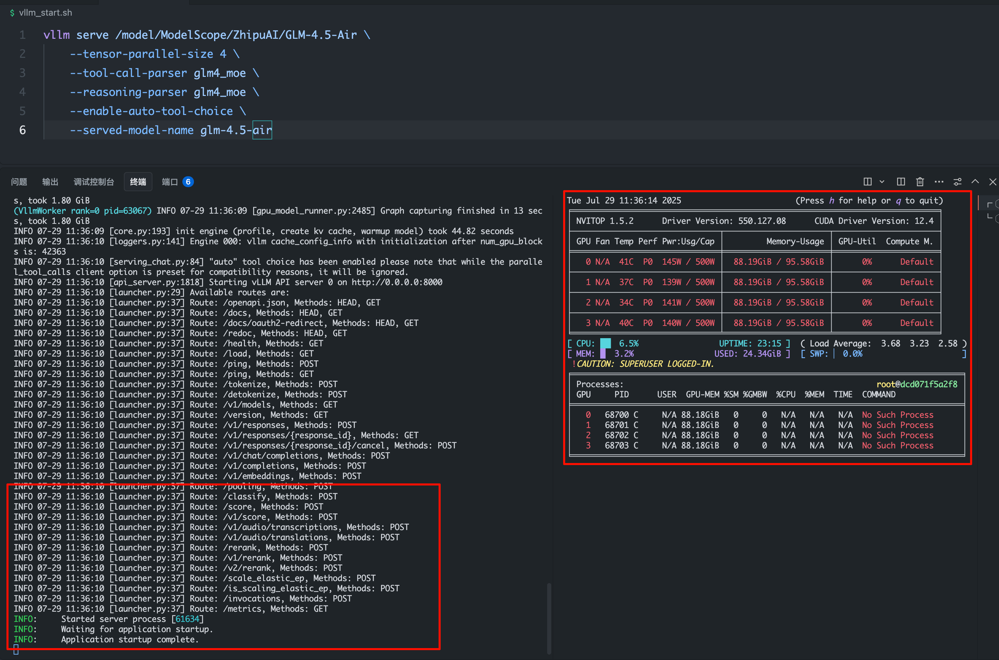
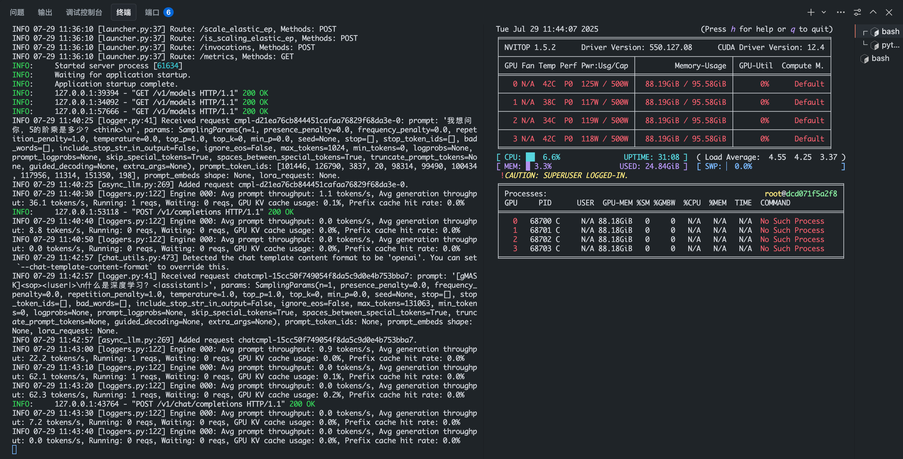

# 01-GLM-4.5-Air vLLM 部署调用

## **vLLM 简介**

`vLLM` 框架是一个高效的大语言模型**推理和部署服务系统**，具备以下特性：

- **高效的内存管理**：通过 `PagedAttention` 算法，`vLLM` 实现了对 `KV` 缓存的高效管理，减少了内存浪费，优化了模型的运行效率。
- **高吞吐量**：`vLLM` 支持异步处理和连续批处理请求，显著提高了模型推理的吞吐量，加速了文本生成和处理速度。
- **易用性**：`vLLM` 与 `HuggingFace` 模型无缝集成，支持多种流行的大型语言模型，简化了模型部署和推理的过程。兼容 `OpenAI` 的 `API` 服务器。
- **分布式推理**：框架支持在多 `GPU` 环境中进行分布式推理，通过模型并行策略和高效的数据通信，提升了处理大型模型的能力。
- **开源共享**：`vLLM` 由于其开源的属性，拥有活跃的社区支持，这也便于开发者贡献和改进，共同推动技术发展。

## 环境准备

本文基础环境如下：

```
----------------
ubuntu 22.04
python 3.10
cuda 12.4
pytorch 2.7.1
----------------
```

> 本文默认学习者已配置好以上 `Pytorch (cuda)` 环境，如未配置请先自行安装。

首先 `pip` 换源加速下载并安装依赖包

```bash
python -m pip install --upgrade pip
pip config set global.index-url https://pypi.tuna.tsinghua.edu.cn/simple

pip install modelscope
pip install vllm>=0.10.0
```

> 考虑到部分同学配置环境可能会遇到一些问题，我们在 ucloud 平台准备了 GLM-4.5-Air 的环境镜像，点击下方链接并直接创建 ucloud 示例即可。
> ***https://www.compshare.cn/images/lUQhKDCeCdZW?referral_code=ELukJdQS3vvCwYIfgsQf2C***

## 模型下载

使用 modelscope 中的 snapshot_download 函数下载模型，第一个参数为模型名称，参数 cache_dir 为模型的下载路径。

新建 `model_download.py` 文件并在其中输入以下内容，粘贴代码后记得保存文件。

```python
from modelscope import snapshot_download

model_dir = snapshot_download('ZhipuAI/GLM-4.5-Air', cache_dir='your_model_dir', revision='master')
```

然后在终端中输入 `python model_download.py` 执行下载，这里需要耐心等待一段时间直到模型下载完成。

> 注意：记得修改 `cache_dir` 为你的模型下载路径哦~

## **代码准备**

### **Python 脚本**

新建 `vllm_model.py` 文件并在其中输入以下内容，粘贴代码后请及时保存文件。下面的代码有很详细的注释，如有不理解的地方，欢迎大家提 `issue`。

首先从 `vLLM` 库中导入 `LLM` 和 `SamplingParams` 类。`LLM` 类是使用 `vLLM` 引擎运行离线推理的主要类。`SamplingParams` 类指定采样过程的参数，用于控制和调整生成文本的随机性和多样性。

`vLLM` 提供了非常方便的封装，我们直接传入模型名称或模型路径即可，不必手动初始化模型和分词器。

然后，通过使用分词器的 apply_chat_template 函数，将我们的 prompt（提示词）格式化为模型所需的输入格式。

我们可以通过这个代码示例熟悉下 `vLLM` 引擎的使用方式。被注释的部分内容可以丰富模型的能力，但不是必要的，大家可以按需选择，自己多多动手尝试 ~

```python
from vllm import LLM, SamplingParams
from transformers import AutoTokenizer
import os
import json

# 自动下载模型时，指定使用modelscope; 否则，会从HuggingFace下载
os.environ['VLLM_USE_MODELSCOPE']='True'

def get_completion(prompts, model, tokenizer=None, temperature=0.6, top_p=0.95, top_k=20, min_p=0, max_tokens=4096, max_model_len=8192):
    stop_token_ids = [151645, 151643]
    # 创建采样参数。temperature 控制生成文本的多样性，top_p 控制核心采样的概率，top_k 通过限制候选词的数量来控制生成文本的质量和多样性, min_p 通过设置概率阈值来筛选候选词，从而在保证文本质量的同时增加多样性
    sampling_params = SamplingParams(temperature=temperature, top_p=top_p, top_k=top_k, min_p=min_p, max_tokens=max_tokens, stop_token_ids=stop_token_ids)  # max_tokens 用于限制模型在推理过程中生成的最大输出长度
    # 初始化 vLLM 推理引擎
    llm = LLM(model=model, tokenizer=tokenizer, max_model_len=max_model_len,trust_remote_code=True, tensor_parallel_size=4)  # max_model_len 用于限制模型在推理过程中可以处理的最大输入和输出长度之和。
    outputs = llm.generate(prompts, sampling_params)
    return outputs


if __name__ == "__main__":
    # 初始化 vLLM 推理引擎
    model='/model/ModelScope/ZhipuAI/GLM-4.5-Air' # 指定模型路径
    tokenizer = AutoTokenizer.from_pretrained(model) # 加载分词器

    prompt = "给我一个关于大模型的简短介绍。"
    messages = [
        {"role": "user", "content": prompt}
    ]
    text = tokenizer.apply_chat_template(
        messages,
        tokenize=False,
        add_generation_prompt=True,
        enable_thinking=True  # 是否开启思考模式，默认为 True
    )

    outputs = get_completion(text, model, tokenizer=None, temperature=0.6, top_p = 0.95, top_k=20, min_p=0)  # 对于思考模式，官方建议使用以下参数：temperature = 0.6，TopP = 0.95，TopK = 20，MinP = 0。

    # 输出是一个包含 prompt、生成文本和其他信息的 RequestOutput 对象列表。
    # 打印输出。
    for output in outputs:
        prompt = output.prompt
        generated_text = output.outputs[0].text
        print(f"Prompt: {prompt!r}, \nResponse: {generated_text!r}")
```

运行代码

```bash
python vllm_model.py
```

结果如下：

```bash
Prompt: '[gMASK]<sop><|user|>\n给我一个关于大模型的简短介绍。<|assistant|>', 
Response: '\n<think>用户需要一个关于大模型的简短介绍。首先，我需要明确“大模型”的核心定义，应该是指大规模语言模型（LLM），比如GPT、文心一言这些。然后，要涵盖它的基本原理，比如基于深度学习，在海量数据上训练。接着，主要功能，比如文本生成、问答、翻译、代码辅助等。还要提到技术基础，比如Transformer架构，因为这是关键。另外，可能需要简单提一下应用场景，比如办公、教育、创作等。最后，点出它的意义，比如推动AI普及，改变人机交互方式。要注意简短，所以每个部分不能太展开，用概括性的语言。避免太技术化的术语，保持易懂。结构上，先定义，再原理，功能，基础，应用，意义。这样逻辑清晰，用户容易理解。检查有没有遗漏重要点，比如“大规模”体现在数据量和参数规模，可能需要提到。确保语言流畅，没有冗余信息。</think>大模型是指基于深度学习技术，在海量文本、图像等多模态数据上进行训练的大规模人工智能模型，核心代表是大型语言模型（LLM）。它通过“Transformer”等架构学习数据中的复杂模式，具备自然语言理解、生成、问答、翻译、逻辑推理等通用智能。例如，GPT、文心一言、Claude等产品能辅助写作、编程、决策等，正逐步渗透到办公、教育、医疗等领域，成为推动AI普及的关键技术，其能力随数据规模和算力提升持续进化，有望重塑人机交互方式。'
```

模型的 response 由两部分组成，一部分是思考过程，用\<think>和\</think>包裹住，另一部分是最终答案，在\</think>标识符之后。


### 创建兼容 OpenAI API 接口的服务器

`GLM-4.5-Air` 兼容 `OpenAI API` 协议，所以我们可以直接使用 `vLLM` 创建 `OpenAI API` 服务器。`vLLM` 部署实现 `OpenAI API` 协议的服务器非常方便。默认会在 http://localhost:8000 启动服务器。服务器当前一次托管一个模型，并实现列表模型、`completions` 和 `chat completions` 端口。

- `completions`：是基本的文本生成任务，模型会在给定的提示后生成一段文本。这种类型的任务通常用于生成文章、故事、邮件等。
- `chat completions`：是面向对话的任务，模型需要理解和生成对话。这种类型的任务通常用于构建聊天机器人或者对话系统。

在创建服务器时，我们可以指定模型名称、模型路径、聊天模板等参数。

- `--host` 和 `--port` 参数指定地址。
- `--model` 参数指定模型名称。
- `--chat-template` 参数指定聊天模板。
- `--served-model-name` 指定服务模型的名称。
- `--max-model-len` 指定模型的最大长度。
- `--reasoning-parser` 指定如何解析模型生成的推理内容。设置 --enable-reasoning 参数时，--reasoning-parser 是必需的。推理模型会在输出中包含一个额外的 reasoning_content 字段，该字段包含导致最终结论的推理步骤。通过指定合适的解析器，可以正确提取和格式化这些推理内容。例如 deepseek_r1 解析器适用于 DeepSeek R1 系列模型，能够解析 <think> ... </think> 格式的内容

我们复制以下命令到终端上，就可以成功启动 Qwen3-8 B 模型的 API 接口

```bash
vllm serve /model/ModelScope/ZhipuAI/GLM-4.5-Air \
    --tensor-parallel-size 4 \
    --tool-call-parser glm4_moe \
    --reasoning-parser glm4_moe \
    --enable-auto-tool-choice \
    --served-model-name glm-4.5-air
```

加载完毕后出现如下信息说明服务成功启动



- 使用 `curl` 命令测试 `OpenAI Completions API`

```bash
curl http://localhost:8000/v1/completions \
    -H "Content-Type: application/json" \
    -d '{
        "model": "glm-4.5-air",
        "prompt": "我想问你，5的阶乘是多少？<think>\n",
        "max_tokens": 1024,
        "temperature": 0
    }'
```

​ 得到的返回值如下所示

```json
{
  "id":"cmpl-d21ea76cb844451cafaa76829f68da3e",
  "object":"text_completion",
  "created":1753789225,
  "model":"glm-4.5-air",
  "choices":[
    {
      "index":0,
      "text":"<think>首先，用户的问题是：“5的阶乘是多少？”阶乘是一个数学概念，表示所有小于或等于该数的正整数的乘积。所以，5的阶乘，记作5!，是5 × 4 × 3 × 2 × 1。\n\n现在，我需要计算这个值。让我一步步来：\n\n- 5 × 4 = 20\n\n- 20 × 3 = 60\n\n- 60 × 2 = 120\n\n- 120 × 1 = 120\n\n所以，5! = 120。\n\n我应该确保没有遗漏任何步骤。阶乘的定义是n! = n × (n-1) × (n-2) × ... × 1，对于正整数n。5! 确实是5×4×3×2×1。\n\n我也可以回想一下常见的阶乘值：1! = 1, 2! = 2, 3! = 6, 4! = 24, 5! = 120。是的，120是正确的。\n\n用户的问题是中文的：“5的阶乘是多少？”，所以我应该用中文回复，以保持一致性。\n\n回复应该清晰、直接。既然这是一个简单的计算，我可以直接给出答案，并简要解释一下，以帮助用户理解。\n\n最终答案：5的阶乘是120。\n\n为了完整性，我可以说：“5的阶乘是5 × 4 × 3 × 2 × 1 = 120。”\n\n这样既提供了答案，又展示了计算过程，有助于用户理解阶乘的概念。</think>5的阶乘（记作5!）是所有小于或等于5的正整数的乘积。计算过程如下：\n\n- 5! = 5 × 4 × 3 × 2 × 1\n- 5 × 4 = 20\n- 20 × 3 = 60\n- 60 × 2 = 120\n- 120 × 1 = 120\n\n因此，**5的阶乘是120**。\n\n阶乘在数学中常用于组合、排列和概率等领域。如果您有其他问题，欢迎随时问！ 😊",
      "logprobs":null,
      "finish_reason":"stop",
      "stop_reason":151336,
      "prompt_logprobs":null
    }
  ],
  "service_tier":null,
  "system_fingerprint":null,
  "usage":{
    "prompt_tokens":11,
    "total_tokens":460,
    "completion_tokens":449,
    "prompt_tokens_details":null
    },
  "kv_transfer_params":null
  }
```

- 用 `Python` 脚本请求 `OpenAI Completions API`

```python
from openai import OpenAI
openai_api_key = "sk-xxx" # 随便填写，只是为了通过接口参数校验
openai_api_base = "http://localhost:8000/v1"

client = OpenAI(
    api_key=openai_api_key,
    base_url=openai_api_base,
)

chat_outputs = client.chat.completions.create(
    model="glm-4.5-air",
    messages=[
        {"role": "user", "content": "什么是深度学习？"},
    ]
)
print(chat_outputs)
```

```shell
python vllm_openai_completions.py
```

​ 得到的返回值如下所示

```
ChatCompletion(id='chatcmpl-15cc50f749054f8da5c9d0e4b753bba7', choices=[Choice(finish_reason='stop', index=0, logprobs=None, message=ChatCompletionMessage(content='深度学习是机器学习的一个**子领域**，它模仿人脑的**神经网络结构**，通过深层级的**人工神经网络**来学习数据中复杂的模式和信息。它的核心在于使用**多层处理单元（神经元）**组成的模型，自动从大量数据中**提取特征**，并用于**分类、预测、生成**等任务。\n\n以下是深度学习的核心概念和特点：\n\n---\n\n### **1. 核心机制：人工神经网络**\n* **神经元（节点）**：如同人脑中的神经细胞，接收输入信号，进行加权计算，并通过激活函数处理输出。\n* **层结构**：\n  * **输入层**：接收原始数据（如图像像素、文本词汇）。\n  * **隐藏层**：核心层，层数越多模型越“深”（故名“深度”学习）。每层提取不同层次的特征：\n    * 浅层：学习基础特征（如边缘、颜色块）。\n    * 深层：学习复杂抽象特征（如物体部件、语义概念）。\n  * **输出层**：生成最终结果（如分类标签、预测数值）。\n* **连接权重**：神经元之间连接的强度，通过训练数据不断**调整**以优化模型性能。\n\n---\n\n### **2. 关键特点**\n* **自动特征提取**：\n  * 传统机器学习依赖人工设计特征（如提取图片颜色、纹理），而深度学习能**自动学习**数据中的关键特征，减少人工干预。\n  * 适用于复杂、高维数据（如图像、语音、自然语言）。\n* **处理大规模数据的能力**：\n  * 在海量数据（如图片、视频、文本）上训练时，深度学习模型能发挥强大优势，学习更复杂的模式。\n* **端到端学习**：\n  * 可以直接从原始输入（如像素）映射到最终输出（如物体名称），省略中间步骤。\n* **强大的非线性建模**：\n  * 通过激活函数（如ReLU、Sigmoid）引入非线性，实现复杂函数逼近。\n\n---\n\n### **3. 与传统机器学习的区别**\n| 特性                | 传统机器学习                     | 深度学习                          |\n|---------------------|----------------------------------|-----------------------------------|\n| **特征工程**        | 需手动设计特征                   | 自动学习特征                      |\n| **数据需求**        | 中小规模即可有效                | 通常需大规模数据                  |\n| **模型复杂度**      | 相对简单（如SVM、决策树）        | 结构复杂（数十至上千层）          |\n| **适用场景**        | 结构化数据、小规模任务           | 非结构化数据（图像/语音/文本）    |\n| **计算资源**        | 较低需求                         | 高需求（GPU/TPU加速）            |\n\n---\n\n### **4. 常见的深度学习架构**\n* **卷积神经网络（CNN）**：\n  * **用途**：图像识别、目标检测、医学影像分析。\n  * **特点**：利用卷积层捕捉空间局部特征（如边缘、形状）。\n  * **代表**：ResNet、YOLO、U-Net。\n* **循环神经网络（RNN）/ LSTM**：\n  * **用途**：自然语言处理（翻译）、时间序列预测（股票）、语音识别。\n  * **特点**：处理序列数据，具备“记忆”能力（LSTM解决长期依赖问题）。\n* **Transformer**：\n  * **用途**：机器翻译、文本生成（ChatGPT）、跨模态任务。\n  * **特点**：基于自注意力机制，并行计算高效，打破序列顺序限制。\n* **生成对抗网络（GAN）**：\n  * **用途**：图像生成（人脸、艺术品）、风格迁移、数据增强。\n  * **特点**：生成器与判别器博弈生成逼真数据。\n* **图神经网络（GNN）**：\n  * **用途**：社交网络分析、推荐系统、分子结构预测。\n  * **特点**：处理图结构数据（节点与边的关系）。\n\n---\n\n### **5. 典型应用领域**\n* **计算机视觉**：人脸识别、自动驾驶、医疗影像诊断。\n* **自然语言处理（NLP）**：智能客服、机器翻译、情感分析、文本摘要。\n* **语音技术**：语音助手（Siri、小爱同学）、语音转文字。\n* **推荐系统**：电商（淘宝）、视频（抖音）、音乐（Spotify）的个性化推荐。\n* **科学与工程**：新药研发、气候预测、材料科学建模。\n* **艺术创作**：AI绘画（Midjourney）、音乐生成。\n\n---\n\n### **6. 挑战与局限性**\n* **数据依赖**：需要海量高质量数据，小样本易过拟合。\n* **计算成本高**：训练大模型需高性能硬件（GPU集群）和大量能源。\n* **可解释性差**：难以理解模型决策依据（“黑箱”问题）。\n* **安全与伦理风险**：算法偏见、深度伪造（Deepfake）、隐私泄露。\n* **鲁棒性不足**：对抗样本（微小扰动可导致错误识别）。\n\n---\n\n### **总结**\n深度学习通过**多层神经网络**的层次化特征学习，实现了对复杂数据（尤其是非结构化数据）的自动化分析。它在图像识别、语音处理、自然语言理解等任务中取得了突破性进展，推动人工智能进入实际应用的关键阶段。然而，它仍面临数据、算力、解释性和伦理等多重挑战，是当前AI研究的核心方向之一。\n\n如果你对某个具体应用（如自动驾驶中的物体检测）或技术细节（如反向传播算法）感兴趣，欢迎进一步提问！', refusal=None, role='assistant', annotations=None, audio=None, function_call=None, tool_calls=[], reasoning_content='嗯，用户问的是"什么是深度学习？"，这是一个非常基础但重要的问题。用户可能是刚开始接触人工智能领域的学生，或者是对技术感兴趣的普通用户。从问题的简洁性来看，用户可能没有专业背景，需要避免直接堆砌术语。\n\n先从核心概念切入比较好。深度学习本质是机器学习的一个子集，关键在于"深度神经网络的层次结构"。用户容易混淆"深度"和"机器学习"的关系，需要明确类比：传统机器学习像用现成的乐高积木拼东西，而深度学习是自己制造积木再拼装。\n\n用户可能更关心实际应用而非数学原理。应该重点列举生活化案例，比如手机拍照的美颜、语音助手、医疗影像诊断这些具体场景。提到自动驾驶时要注意简化，避免让用户误会所有车都能自动驾驶。\n\n技术原理部分需要分层解释。先说明神经元和激活函数就像生物神经元传递信号，再用"特征自动提取"这个比喻解释深度优势。用户可能听说过"梯度消失"但不懂，暂时不必展开，但可以提"反向传播算法"这个关键词作为延伸点。\n\n风险提示很有必要。用户可能在实际使用中遇到过算法推荐的信息茧房问题，或者听过AI换脸的负面新闻。提到偏见和隐私时要用"数据偏见""隐私泄露"这样准确但易懂的表述。\n\n最后留个钩子比较稳妥。用户如果对某个应用特别感兴趣（比如医疗或游戏），可能会追问细节。结尾的开放提问能让对话自然延续，比如问"您对哪个应用场景更感兴趣？"比直接列目录更友好。'), stop_reason=151336)], created=1753789377, model='glm-4.5-air', object='chat.completion', service_tier=None, system_fingerprint=None, usage=CompletionUsage(completion_tokens=1538, prompt_tokens=9, total_tokens=1547, completion_tokens_details=None, prompt_tokens_details=None), prompt_logprobs=None, kv_transfer_params=None)
```

另外，在以上所有的在请求处理过程中， `API` 后端都会打印相对应的日志和统计信息:


