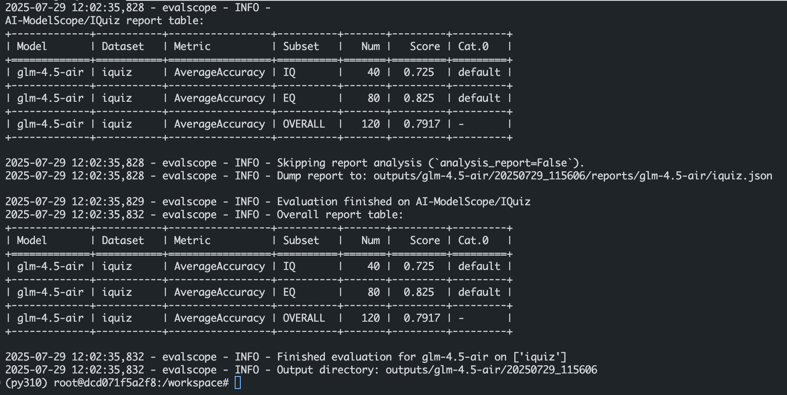
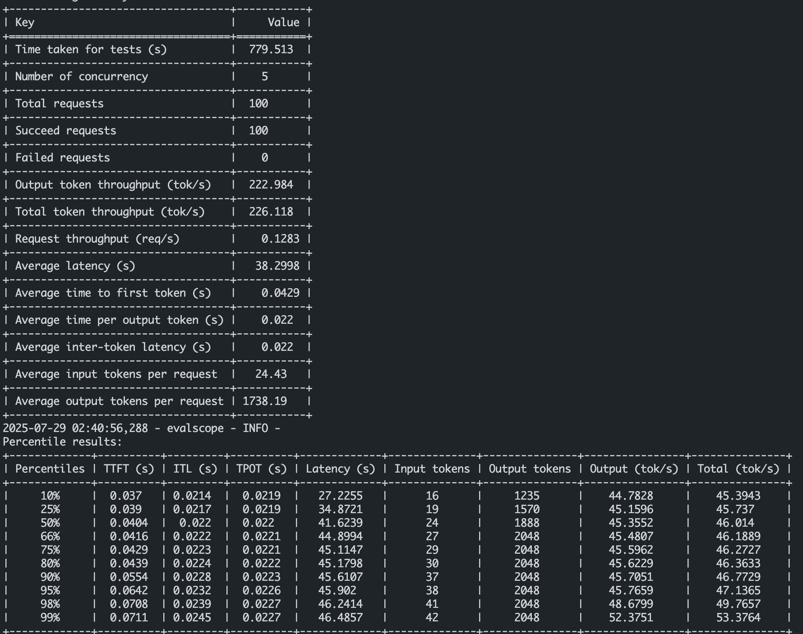

# 02-GLM-4.5-Air EvalScope 智商情商&&并发评测

## 大模型评测是什么

大语言模型评测是指对大语言模型（LLM）在多种任务和场景下的性能进行全面评估的过程。评测的目的是衡量模型的通用能力、特定领域表现、效率、鲁棒性、安全性等多方面性能，以便优化模型设计、指导技术选型和推动模型在实际应用中的部署。

评测的主要内容包括以下几个方面：

- 通用能力：评估模型在语言理解、生成、推理等方面的基础能力。
- 特定领域表现：针对特定任务（如数学推理、代码生成、情感分析等）的性能评估。
- 效率与资源消耗：包括模型的训练和推理时间、计算资源需求等。
- 鲁棒性与可靠性：评估模型在面对噪声、对抗攻击或输入扰动时的稳定性。
- 伦理与安全性：检测模型是否会产生有害内容、是否存在偏见或歧视。

EvalScope 是魔搭社区官方推出的模型评测与性能基准测试框架，内置多个常用测试基准和评测指标，如 MMLU、CMMLU、C-Eval、GSM8K、ARC、HellaSwag、TruthfulQA、MATH 和 HumanEval 等；支持多种类型的模型评测，包括 LLM、多模态 LLM、embedding 模型和 reranker 模型。EvalScope 还适用于多种评测场景，如端到端 RAG 评测、竞技场模式和模型推理性能压测等。此外，通过 ms-swift 训练框架的无缝集成，可一键发起评测，实现了模型训练到评测的全链路支持。
官网地址：https://evalscope.readthedocs.io/zh-cn/latest/get_started

# EvalScope 评测使用方法

## 环境准备

本文基础环境如下：

```
----------------
ubuntu 22.04
python 3.10
Cuda  12.4
PyTorch  2.7.1
----------------
```

**pip 安装 EvalScope：**

```
pip install evalscope                # 安装 Native backend (默认)
# 额外选项
pip install evalscope[opencompass]   # 安装 OpenCompass backend
pip install evalscope[vlmeval]       # 安装 VLMEvalKit backend
pip install evalscope[rag]           # 安装 RAGEval backend
pip install evalscope[perf]          # 安装 模型压测模块 依赖
pip install evalscope[all]           # 安装所有 backends (Native, OpenCompass, VLMEvalKit, RAGEval)
```

> 考虑到部分同学配置环境可能会遇到一些问题，我们在 ucloud 平台准备了 GLM-4.5-Air 的环境镜像，点击下方链接并直接创建 ucloud 示例即可。
> ***https://www.compshare.cn/images/lUQhKDCeCdZW?referral_code=ELukJdQS3vvCwYIfgsQf2C***


## 模型评测方法

下面我们以**智商情商评测**为例，对 GLM-4.5-Air 模型进行评测。

我们将使用 EvalScope 模型评测框架，在 IQuiz 数据集上进行评测，这个数据集中收集了 40 道 IQ 测试和 80 道 EQ 测试选择题，其中包括一些经典问题：

- 数字 9.8 和 9.11 哪个大？

- 单词 strawberry 和 blueberry 中一共有多少个 r ？

- 刘雨正在休假，突然被要求开车送领导去机场，他正为休假计划的泡汤而懊恼，因此在送领导时，刹车踩得比较用力。在车上，领导突然说：“小刘啊，这不愧是有着悠久历史的西安，我这坐车有一种回到古代坐马车的感觉。” 领导是什么意思？

可以点击[这里](https://modelscope.cn/datasets/AI-ModelScope/IQuiz/dataPeview)看看你能答对多少，再期待一下 AI 模型的表现吧。

### 步骤一： **创建 vLLM 服务器**

这里我们参照第一节vllm部署模型环节，使用 vLLM 创建兼容 OpenAI API 接口的服务器，然后使用 EvalScope 进行评测。当然接入其他的 api 也是可以的。

在终端输入以下命令，即可用 vLLM 部署 GLM-4.5-Air 模型到一个兼容 OpenAI API 接口的服务器上。

```bash
vllm serve /model/ModelScope/ZhipuAI/GLM-4.5-Air \
    --tensor-parallel-size 4 \
    --tool-call-parser glm4_moe \
    --reasoning-parser glm4_moe \
    --enable-auto-tool-choice \
    --served-model-name glm-4.5-air
```

### 步骤二： **执行评测**

我们可以使用 EvalScope 命令进行评测，直接在终端输入以下命令：

```bash
evalscope eval \
  --model glm-4.5-air \
  --api-url http://localhost:8000/v1 \
  --api-key EMPTY \
  --eval-type service \
  --eval-batch-size 16 \
  --datasets iquiz \
  --work-dir outputs/glm-4.5-air
```

也可以使用 Python 命令进行评测：

新建 eval_api.py 文件，并输入以下代码：

```python
# 导入执行任务的函数和任务配置类
from evalscope.run import run_task
from evalscope.config import TaskConfig

# 配置任务参数
task_cfg = TaskConfig(
    model='glm-4.5-air',  # 指定使用的模型
    api_url='http://localhost:8000/v1/chat/completions',  # 指定API端点，这里使用的是ollama默认的api接口
    api_key='sk-xxxxxxx',  # API密钥（需替换为实际密钥，ollama 的api_key）
    eval_type='service',  # 指定评估类型为服务模式
    datasets=['iquiz'],  # 指定使用的数据集(这个测试集可以快速测试模型的智商和情商)
    generation_config={  # 文本生成配置
        'max_tokens': 4096,  # 最大令牌数
        'max_new_tokens': 4096,  # 最大新生成令牌数
        'temperature': 1.0,  # 温度参数，这里设置为1.0，模型的输出随机性较大，所以可能会有些实验误差
    },
    work_dir='outputs/glm-4.5-air',  # 输出目录
)

# 执行任务
run_task(task_cfg=task_cfg)
```

新建一个 bash 窗口，也就是终端中执行。
控制台运行`python eval_api.py`命令即可。

等待 3 分钟左右评测就完成啦，控制台输出的结果如下图所示：



## 并发测试

在终端输入以下命令，即可用 vLLM 部署 GLM-4.5-Air 模型到一个兼容 OpenAI API 接口的服务器上。

```bash
vllm serve /model/ModelScope/ZhipuAI/GLM-4.5-Air \
    --tensor-parallel-size 4 \
    --tool-call-parser glm4_moe \
    --reasoning-parser glm4_moe \
    --enable-auto-tool-choice \
    --served-model-name glm-4.5-air \
    --port 8000
```

然后使用以下命令进行并发测试：

> 注：作者在 4卡H20 上部署 GLM-4.5-Air 模型，并发测试时使用 5、10、15、20 个线程。

```bash
MODEL="glm-4.5-air"
NUMBER=100
PARALLEL=20

evalscope perf \
    --url "http://localhost:8000/v1/chat/completions" \
    --parallel ${PARALLEL} \
    --model ${MODEL} \
    --number ${NUMBER} \
    --api openai \
    --dataset openqa \
    --stream \
    --swanlab-api-key 'your-swanlab-api-key' \
    --name "${MODEL}-number${NUMBER}-parallel${PARALLEL}"
```

- `--url`：指定模型服务的 API 接口地址，这里是本地部署的 vLLM 服务地址。
- `--parallel`：指定并发请求的线程数，这里设置为 20 个线程。
- `--model`：指定要评测的模型名称，这里是 glm-4.5-air。
- `--number`：指定每个线程要发送的请求数量，这里设置为 100 个请求。
- `--api`：指定评测使用的 API 类型，这里是 openai。
- `--dataset`：指定评测使用的数据集，这里是 openqa。
- `--stream`：指定是否使用流式输出，这里设置为 true。
- `--swanlab-api-key`：指定 swanlab 的 API 密钥，这里需要替换为实际的 API 密钥。
- `--name`：指定评测任务的名称，这里是 glm-4.5-air-number100-parallel20。

测试结果可以在我的 [性能评测](https://swanlab.cn/@kmno4/perf_benchmark/charts) 上查看，如下图所示：


