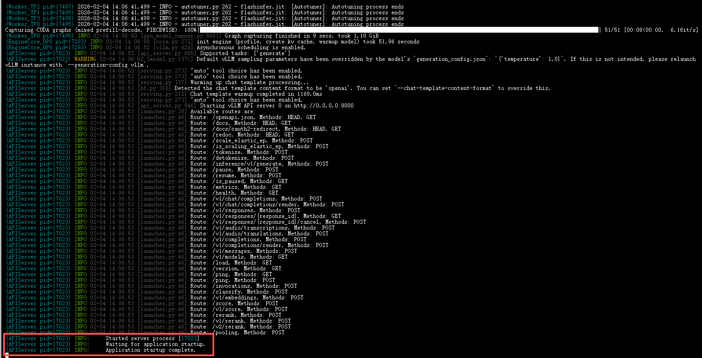
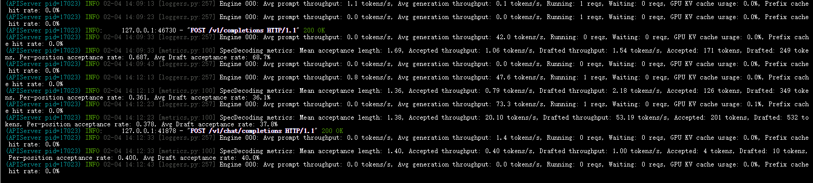

# 01-GLM-4.7-Flash vLLM 部署调用

## **vLLM 简介**

`vLLM` 框架是一个高效的大语言模型**推理和部署服务系统**，具备以下特性：

- **高效的内存管理**：通过 `PagedAttention` 算法，`vLLM` 实现了对 `KV` 缓存的高效管理，减少了内存浪费，优化了模型的运行效率。
- **高吞吐量**：`vLLM` 支持异步处理和连续批处理请求，显著提高了模型推理的吞吐量，加速了文本生成和处理速度。
- **易用性**：`vLLM` 与 `HuggingFace` 模型无缝集成，支持多种流行的大型语言模型，简化了模型部署和推理的过程。兼容 `OpenAI` 的 `API` 服务器。
- **分布式推理**：框架支持在多 `GPU` 环境中进行分布式推理，通过模型并行策略和高效的数据通信，提升了处理大型模型的能力。
- **开源共享**：`vLLM` 由于其开源的属性，拥有活跃的社区支持，这也便于开发者贡献和改进，共同推动技术发展。

## 环境准备

本文基础环境如下：

```
----------------
ubuntu 22.04
python 3.12.3
cuda 12.8
pytorch 2.8.0
----------------
```

> 本文默认学习者已配置好以上 `Pytorch (cuda)` 环境，如未配置请先自行安装。

首先 `pip` 换源加速下载并安装依赖包

```bash
python -m pip install --upgrade pip
pip config set global.index-url https://pypi.tuna.tsinghua.edu.cn/simple

pip install modelscope
pip install vllm>=0.10.0
```

> 考虑到部分同学配置环境可能会遇到一些问题，我们在 ucloud 平台准备了 GLM-4.7-Flash 的环境镜像，点击下方链接并直接创建 ucloud 示例即可。
> ***[datawhalechina/self-llm/GLM-4.7-Flash-VLLM | AutoDL](https://www.codewithgpu.com/i/datawhalechina/self-llm/GLM-4.7-Flash-VLLM)***

## 模型下载

使用 modelscope 中的 snapshot_download 函数下载模型，第一个参数为模型名称，参数 cache_dir 为模型的下载路径。

新建 `model_download.py` 文件并在其中输入以下内容，粘贴代码后记得保存文件。

```python
from modelscope import snapshot_download

model_dir = snapshot_download('ZhipuAI/GLM-4.7-Flash', cache_dir='your_model_dir', revision='master')
```

然后在终端中输入 `python model_download.py` 执行下载，这里需要耐心等待一段时间直到模型下载完成。

> 注意：记得修改 `cache_dir` 为你的模型下载路径哦~

## **代码准备**

### **Python 脚本**

新建 `vllm_model.py` 文件并在其中输入以下内容，粘贴代码后请及时保存文件。下面的代码有很详细的注释，如有不理解的地方，欢迎大家提 `issue`。

首先从 `vLLM` 库中导入 `LLM` 和 `SamplingParams` 类。`LLM` 类是使用 `vLLM` 引擎运行离线推理的主要类。`SamplingParams` 类指定采样过程的参数，用于控制和调整生成文本的随机性和多样性。

`vLLM` 提供了非常方便的封装，我们直接传入模型名称或模型路径即可，不必手动初始化模型和分词器。

然后，通过使用分词器的 apply_chat_template 函数，将我们的 prompt（提示词）格式化为模型所需的输入格式。

我们可以通过这个代码示例熟悉下 `vLLM` 引擎的使用方式。被注释的部分内容可以丰富模型的能力，但不是必要的，大家可以按需选择，自己多多动手尝试 ~

```python
from vllm import LLM, SamplingParams
from transformers import AutoTokenizer
import os
import json

# 自动下载模型时，指定使用modelscope; 否则，会从HuggingFace下载
os.environ['VLLM_USE_MODELSCOPE']='True'

def get_completion(prompts, model, tokenizer=None, temperature=0.6, top_p=0.95, top_k=20, min_p=0, max_tokens=4096, max_model_len=8192):
    stop_token_ids = [151645, 151643]
    # 创建采样参数。temperature 控制生成文本的多样性，top_p 控制核心采样的概率，top_k 通过限制候选词的数量来控制生成文本的质量和多样性, min_p 通过设置概率阈值来筛选候选词，从而在保证文本质量的同时增加多样性
    sampling_params = SamplingParams(temperature=temperature, top_p=top_p, top_k=top_k, min_p=min_p, max_tokens=max_tokens, stop_token_ids=stop_token_ids)  # max_tokens 用于限制模型在推理过程中生成的最大输出长度
    # 初始化 vLLM 推理引擎
    llm = LLM(model=model, tokenizer=tokenizer, max_model_len=max_model_len,trust_remote_code=True, tensor_parallel_size=4)  # max_model_len 用于限制模型在推理过程中可以处理的最大输入和输出长度之和。
    outputs = llm.generate(prompts, sampling_params)
    return outputs


if __name__ == "__main__":
    # 初始化 vLLM 推理引擎
    model='/root/autodl-fs/ZhipuAI/GLM-4.7-Flash' # 指定模型路径
    tokenizer = AutoTokenizer.from_pretrained(model) # 加载分词器

    prompt = "给我一个关于大模型的简短介绍。"
    messages = [
        {"role": "user", "content": prompt}
    ]
    text = tokenizer.apply_chat_template(
        messages,
        tokenize=False,
        add_generation_prompt=True,
        enable_thinking=True  # 是否开启思考模式，默认为 True
    )

    outputs = get_completion(text, model, tokenizer=None, temperature=0.6, top_p = 0.95, top_k=20, min_p=0)  # 对于思考模式，官方建议使用以下参数：temperature = 0.6，TopP = 0.95，TopK = 20，MinP = 0。

    # 输出是一个包含 prompt、生成文本和其他信息的 RequestOutput 对象列表。
    # 打印输出。
    for output in outputs:
        prompt = output.prompt
        generated_text = output.outputs[0].text
        print(f"Prompt: {prompt!r}, \nResponse: {generated_text!r}")
```

运行代码

```bash
python vllm_model.py
```

结果如下：

```bash
Prompt: '[gMASK]<sop><|user|>给我一个关于大模型的简短介绍。<|assistant|><think>', 
Response: '1. **分析用户请求：**\n    *   **主题：** 大语言模型（LLM）。\n    *   **格式：** 简短介绍。\n    *   **语言：** 中文（简体）。\n\n2.  **确定大语言模型介绍的关键组成部分：**\n    *   **定义：** 它是什么？（基于深度学习的AI模型，使用海量文本数据进行训练）。\n    *   **机制：** 它是如何工作的？（预测下一个词，神经网络，Transformer架构）。\n    *   **能力：** 它能做什么？（文本生成、翻译、摘要、问答、代码编写）。\n    *   **意义：** 为什么它很重要？（通用人工智能的里程碑，赋能各种应用）。\n\n3.  **起草 - 迭代1（心理大纲）：**\n    大语言模型是像GPT-4或LLaMA这样的AI。它们阅读了互联网上的大量文本。它们学习语言模式来预测下一个词。它们可以写文章、回答问题和翻译。它们是AI领域的一个大突破。\n\n4.  **润色 - 迭代2（增加专业语调并精简）：**\n    大语言模型（LLM）是一种基于深度学习的AI模型。它们通过阅读海量文本数据来学习语言规律。核心机制是预测下一个词。它们能完成写作、翻译、编程等任务。它们代表了人工智能的重要进步。\n\n5.  **打磨 - 迭代3（构建影响力与清晰度）：**\n    *   *标题：* 清晰的定义。\n    *   *核心：* 数据 + 架构（Transformer）。\n    *   *功能：* 生成与理解。\n    *   *影响：* 生产力。\n\n    *草稿：*\n    **大语言模型（LLM）** 是一种基于深度学习的人工智能技术，其核心是通过处理海量文本数据来学习人类语言的模式和逻辑。\n\n    **主要特点：**\n    1.  **海量训练：** 读取互联网上的书籍、文章、代码等数据。\n    2.  **预测机制：** 基于上下文，预测下一个最可能出现的字或词。\n    3.  **通用能力：** 具备理解、生成、翻译、总结和问答等多种能力。\n\n    **总结：** 它们是当前AI领域的核心突破，能够像人类一样进行流畅的文本交互，极大地提升了信息处理效率。\n\n6.  **最终审查：** 这是否满足“简短介绍”的要求？是的。它涵盖了定义、机制、功能，并以一个简洁的总结结尾。它易于阅读。\n\n7.  **最终输出生成**（与迭代3中的思维过程相匹配）。</think>**大语言模型** 是一种基于深度学习的人工智能技术，其核心是通过处理海量文本数据来学习人类语言的模式和逻辑。\n\n**简单来说，它有以下几个关键点：**\n\n1.  **海量训练：** 就像读完了互联网上几乎所有的书籍、文章和代码，从中提取语言规律。\n2.  **预测机制：** 它的核心工作原理是根据前面的内容，预测下一个最可能出现的字或词。\n3.  **通用能力：** 它不仅能写文章、写代码，还能进行翻译、总结、回答问题甚至进行创意写作。\n\n**总结：** 大模型是目前人工智能领域最先进的成果之一，它让机器具备了像人类一样流畅理解和使用语言的能力。'
```

模型的 response 由两部分组成，一部分是思考过程，用\<think>和\</think>包裹住，另一部分是最终答案，在\</think>标识符之后。

### 创建兼容 OpenAI API 接口的服务器

`GLM-4.7-Flash` 兼容 `OpenAI API` 协议，所以我们可以直接使用 `vLLM` 创建 `OpenAI API` 服务器。`vLLM` 部署实现 `OpenAI API` 协议的服务器非常方便。默认会在 http://localhost:8000 启动服务器。服务器当前一次托管一个模型，并实现列表模型、`completions` 和 `chat completions` 端口。

- `completions`：是基本的文本生成任务，模型会在给定的提示后生成一段文本。这种类型的任务通常用于生成文章、故事、邮件等。
- `chat completions`：是面向对话的任务，模型需要理解和生成对话。这种类型的任务通常用于构建聊天机器人或者对话系统。

在创建服务器时，我们可以指定模型名称、模型路径、聊天模板等参数。

- `--host` 和 `--port` 参数指定地址。
- `--model` 参数指定模型名称。
- `--chat-template` 参数指定聊天模板。
- `--served-model-name` 指定服务模型的名称。
- `--max-model-len` 指定模型的最大长度。
- `--reasoning-parser` 指定如何解析模型生成的推理内容。设置 --enable-reasoning 参数时，--reasoning-parser 是必需的。推理模型会在输出中包含一个额外的 reasoning_content 字段，该字段包含导致最终结论的推理步骤。通过指定合适的解析器，可以正确提取和格式化这些推理内容。

我们复制以下命令到终端上，就可以成功启动 GLM-4.7-Flash 模型的 API 接口

```bash
vllm serve /root/autodl-fs/ZhipuAI/GLM-4.7-Flash \
     --tensor-parallel-size 4 \
     --speculative-config.method mtp \
     --speculative-config.num_speculative_tokens 1 \
     --tool-call-parser glm47 \
     --reasoning-parser glm45 \
     --enable-auto-tool-choice \
     --served-model-name glm-4.7-flash
```

加载完毕后出现如下信息说明服务成功启动



- 使用 `curl` 命令测试 `OpenAI Completions API`

```bash
curl http://localhost:8000/v1/completions \
    -H "Content-Type: application/json" \
    -d '{
        "model": "glm-4.7-flash",
        "prompt": "我想问你，5的阶乘是多少？<think>\n",
        "max_tokens": 1024,
        "temperature": 0
    }'
```

得到的返回值如下所示

```json
{
    "id": "cmpl-aad3ef9bd715b799",
    "object": "text_completion",
    "created": 1770185345,
    "model": "glm-4.7-flash",
    "choices": [
        {
            "index": 0,
            "text": "1.  **分析用户请求：** 用户正在用中文询问“5的阶乘是多少？”（5的阶乘是多少？）。\n\n2.  **识别核心概念：** “阶乘”指的是一个从1到给定正整数 $n$ 的所有整数的乘积。它通常表示为 $n!$。\n\n3.  **确定具体数值：** 用户询问的是 $5!$。\n\n4.  **执行计算：**\n    *   $5! = 5 \\times 4 \\times 3 \\times 2 \\times 1$\n    *   $5 \\times 4 = 20$\n    *   $20 \\times 3 = 60$\n    *   $60 \\times 2 = 120$\n    *   $120 \\times 1 = 120$\n\n5.  **构思回答：**\n    *   直接回答：120。\n    *   可选但有用的背景信息：解释阶乘是什么（$1 \\times 2 \\times 3 \\times \\dots \\times n$）。\n    *   语言：中文，与提示相匹配。\n\n6.  **起草回复（内心独白/草稿）：**\n    *   *草稿 1：* 5的阶乘是120。\n    *   *草稿 2（更详细）：* 5的阶乘（5!）等于 5 × 4 × 3 × 2 × 1 = 120。\n\n7.  **最终润色：** 草稿 2 是最好的。它清晰、简洁，并提供了计算过程。\n\n8.  **最终输出生成：** （与草稿 2 匹配）。\n    5的阶乘（5!）等于 5 × 4 × 3 × 2 × 1，结果是 **120**。</think>5的阶乘（5!）等于 5 × 4 × 3 × 2 × 1，结果是 **120**。",
            "logprobs": null,
            "finish_reason": "stop",
            "stop_reason": 154827,
            "token_ids": null,
            "prompt_logprobs": null,
            "prompt_token_ids": null
        }
    ],
    "service_tier": null,
    "system_fingerprint": null,
    "usage": {
        "prompt_tokens": 11,
        "total_tokens": 432,
        "completion_tokens": 421,
        "prompt_tokens_details": null
    },
    "kv_transfer_params": null
}
```

- 用 `Python` 脚本请求 `OpenAI Completions API`

```python
from openai import OpenAI
openai_api_key = "sk-xxx" # 随便填写，只是为了通过接口参数校验
openai_api_base = "http://localhost:8000/v1"

client = OpenAI(
    api_key=openai_api_key,
    base_url=openai_api_base,
)

chat_outputs = client.chat.completions.create(
    model="glm-4.7-flash",
    messages=[
        {"role": "user", "content": "什么是算法？"},
    ]
)
print(chat_outputs)
```

```shell
python vllm_openai_completions.py
```

得到的返回值如下所示

```
ChatCompletion(id='chatcmpl-9c75c2da0a63ae6e', choices=[Choice(finish_reason='stop', index=0, logprobs=None, message=ChatCompletionMessage(content='**算法（Algorithm）** 是解决特定问题的一系列清晰、明确的指令。\n\n你可以把它想象成一个**详细的菜谱**或**给朋友的指路说明**：\n\n1.  **输入**：你需要什么材料或数据？（例如：我要切哪些菜）\n2.  **处理步骤**：必须按顺序完成的动作？（例如：先切葱，再起锅烧油，然后下菜翻炒均匀。不能先炒菜再切葱。）\n3.  **输出**：这道菜或者路线最终的结果是什么？（例如：一盘炒好的葱爆羊肉，或者你到达目的地的地图。）\n\n### 算法的几个核心特征\n\n在计算机科学中，一个严谨的算法通常需要满足以下五个特点：\n\n1.  **确定性**：每一步指令都必须是毫无歧义的，不能模棱两可。\n2.  **有限性**：算法必须在执行有限步之后结束，不能无限循环下去。\n3.  **输入**：一个算法有零个或多个输入（不需要算也可以开始）。\n4.  **输出**：一个算法至少会产生一个或多个结果。\n5.  **可行性**：算法中的每一步操作都必须是能够通过执行有限次完成的（即现实可行的）。\n\n### 生活中的常见例子\n\n虽然听起来很高级，但其实算法无处不在：\n\n*   **数学计算**：计算三角形面积 ($S = \\frac{1}{2} \\times a \\times b \\times \\sin(C)$) 这本身就是一个简单的算法。\n*   **搜索引擎**：当你输入“今天天气”时，搜索引擎背后的算法会抓取数据、计算相关性、并进行排序，最后给出结果。\n*   **GPS 导航**：算法计算道路距离、拥堵情况，为你规划出一条最快的行驶路线。\n*   **推荐系统**：像抖音、淘宝或 Netflix 这样的平台，都在使用算法来分析你的浏览习惯，猜你喜欢看什么或买什么。\n*   **排序**：将一列数字从小到大排列，无论是手动还是电脑，都遵循着特定的排序算法逻辑。\n\n简单来说，**算法就是让计算机（或人）完成任务的具体操作规程。**', refusal=None, role='assistant', annotations=None, audio=None, function_call=None, tool_calls=[], reasoning='1. **分析用户请求：** 用户在问“什么是算法？”（中文）。\n\n2. **识别意图：** 核心目标是寻求对“算法”这一概念的定义和解释。这是一个标准的、教育性的查询。\n\n3. **检查安全性：** 该请求是良性的。它没有违反任何安全准则（没有仇恨言论、危险内容、色情内容、个人身份信息 PII 等）。没有尝试越狱或提取系统提示词。\n\n4. **确定解释的深度：**\n    *   *基础定义：* 算法是一系列清晰、可执行的指令。\n    *   *类比：* 使用一个平实的类比（如食谱、给朋友指路）让它变得易于理解。\n    *   *关键特性：* 提及电脑科学中通常要求什么（输入/输出、有限性、确定性、可行性）。\n    *   *例子：* 数学公式、搜索引擎排序、GPS 导航、推荐算法（例如 Netflix）。\n    *   *重要性：* 解释它们在技术和社会中的角色。\n\n5. **起草回复（内心独白/中文初稿）：**\n    *   首先进行简单定义：算法是一组解决问题或执行特定任务的规则。\n    *   使用“菜谱”类比：就像做菜，有步骤（切菜、炒菜）。\n    *   电脑科学的语境：信息处理、数据解析、数学计算。\n    *   5 个关键特征：\n        1.  输入（输入）\n        2.  输出（输出）\n        3.  有限性（有限性）——不能永远循环。\n        4.  确定性（确定性）——每一步都定义明确。\n        5.  可行性（可行性）——每一步都可以执行。\n    *   现实世界的例子：\n        *   简单：排序数字。\n        *   复杂：Google 搜索、TikTok 推荐算法、物流（路线规划）。\n    *   结论：它们是现代科技的“大脑”或“引擎”。\n\n6. **完善和格式化：** 使用项目符号使其结构化，以提高可读性。确保语气乐于助人且信息量大。\n\n7. **最终润色（中文）：**\n    *   **定义：** 算法是一套定义明确的指令序列。\n    *   **类比：** 比如“菜谱”或“步骤说明书”。\n    *   **核心特征：** 有输入、有输出、有限步、确定性、可行性。\n    *   **例子：** 排序、搜索、推荐。\n\n8. **构建最终输出：**（着手根据这些点生成中文回复。）', reasoning_content='1. **分析用户请求：** 用户在问“什么是算法？”（中文）。\n\n2. **识别意图：** 核心目标是寻求对“算法”这一概念的定义和解释。这是一个标准的、教育性的查询。\n\n3. **检查安全性：** 该请求是良性的。它没有违反任何安全准则（没有仇恨言论、危险内容、色情内容、个人身份信息 PII 等）。没有尝试越狱或提取系统提示词。\n\n4. **确定解释的深度：**\n    *   *基础定义：* 算法是一系列清晰、可执行的指令。\n    *   *类比：* 使用一个平实的类比（如食谱、给朋友指路）让它变得易于理解。\n    *   *关键特性：* 提及电脑科学中通常要求什么（输入/输出、有限性、确定性、可行性）。\n    *   *例子：* 数学公式、搜索引擎排序、GPS 导航、推荐算法（例如 Netflix）。\n    *   *重要性：* 解释它们在技术和社会中的角色。\n\n5. **起草回复（内心独白/中文初稿）：**\n    *   首先进行简单定义：算法是一组解决问题或执行特定任务的规则。\n    *   使用“菜谱”类比：就像做菜，有步骤（切菜、炒菜）。\n    *   电脑科学的语境：信息处理、数据解析、数学计算。\n    *   5 个关键特征：\n        1.  输入（输入）\n        2.  输出（输出）\n        3.  有限性（有限性）——不能永远循环。\n        4.  确定性（确定性）——每一步都定义明确。\n        5.  可行性（可行性）——每一步都可以执行。\n    *   现实世界的例子：\n        *   简单：排序数字。\n        *   复杂：Google 搜索、TikTok 推荐算法、物流（路线规划）。\n    *   结论：它们是现代科技的“大脑”或“引擎”。\n\n6. **完善和格式化：** 使用项目符号使其结构化，以提高可读性。确保语气乐于助人且信息量大。\n\n7. **最终润色（中文）：**\n    *   **定义：** 算法是一套定义明确的指令序列。\n    *   **类比：** 比如“菜谱”或“步骤说明书”。\n    *   **核心特征：** 有输入、有输出、有限步、确定性、可行性。\n    *   **例子：** 排序、搜索、推荐。\n\n8. **构建最终输出：**（着手根据这些点生成中文回复。）'), stop_reason=154827, token_ids=None)], created=1770185962, model='glm-4.7-flash', object='chat.completion', service_tier=None, system_fingerprint=None, usage=CompletionUsage(completion_tokens=1019, prompt_tokens=8, total_tokens=1027, completion_tokens_details=None, prompt_tokens_details=None), prompt_logprobs=None, prompt_token_ids=None, kv_transfer_params=None)
```

- 用 `Python` 脚本请求 `OpenAI Completions API`

```python
from openai import OpenAI

client = OpenAI(
    api_key="a", # 随便填写，只是为了通过接口参数校验
    base_url="http://localhost:8000/v1"
)

def add(a: float, b: float):
    return a + b

def mul(a: float, b: float):
    return a * b

def compare(a: float, b: float):
    if a > b:
        return f'{a} is greater than {b}'
    elif a < b:
        return f'{b} is greater than {a}'
    else:
        return f'{a} is equal to {b}'

def count_letter_in_string(a: str, b: str):
    string = a.lower()
    letter = b.lower()
  
    count = string.count(letter)
    return(f"The letter '{letter}' appears {count} times in the string.")


tools = [
{
    'type': 'function',
    'function': {
        'name': 'add',
        'description': 'Compute the sum of two numbers',
        'parameters': {
            'type': 'object',
            'properties': {
                'a': {
                    'type': 'int',
                    'description': 'A number',
                },
                'b': {
                    'type': 'int',
                    'description': 'A number',
                },
            },
            'required': ['a', 'b'],
        },
    }
}, 
{
    'type': 'function',
    'function': {
        'name': 'mul',
        'description': 'Calculate the product of two numbers',
        'parameters': {
            'type': 'object',
            'properties': {
                'a': {
                    'type': 'int',
                    'description': 'A number',
                },
                'b': {
                    'type': 'int',
                    'description': 'A number',
                },
            },
            'required': ['a', 'b'],
        },
    }
},
{
    'type': 'function',
    'function': {
        'name': 'count_letter_in_string',
        'description': 'Count letter number in a string',
        'parameters': {
            'type': 'object',
            'properties': {
                'a': {
                    'type': 'str',
                    'description': 'source string',
                },
                'b': {
                    'type': 'str',
                    'description': 'letter',
                },
            },
            'required': ['a', 'b'],
        },
    }
},
{
    'type': 'function',
    'function': {
        'name': 'compare',
        'description': 'Compare two number, which one is bigger',
        'parameters': {
            'type': 'object',
            'properties': {
                'a': {
                    'type': 'float',
                    'description': 'A number',
                },
                'b': {
                    'type': 'float',
                    'description': 'A number',
                },
            },
            'required': ['a', 'b'],
        },
    }
}
]

def function_call_playground(prompt):
    messages = [{'role': 'user', 'content': prompt}]
    response = client.chat.completions.create(
        model="glm-4.7-flash",
        messages = messages,
        temperature=0.01,
        top_p=0.95,
        stream=False,
        tools=tools)

    # print(response)
    func1_name = response.choices[0].message.tool_calls[0].function.name
    func1_args = response.choices[0].message.tool_calls[0].function.arguments
    func1_out = eval(f'{func1_name}(**{func1_args})')
    # print(func1_out)

    messages.append(response.choices[0].message)
    messages.append({
        'role': 'tool',
        'content': f'{func1_out}',
        'tool_call_id': response.choices[0].message.tool_calls[0].id
    })
    # print(messages)
    response = client.chat.completions.create(
        model="glm-4.7-flash",
        messages=messages,
        temperature=0.01,
        top_p=0.95,
        stream=False,
        tools=tools)
    return response.choices[0].message.content
  
prompts = [
    "用中文回答：strawberry中有多少个r?", 
    "用中文回答：9.11和9.9，哪个小?"
]

for prompt in prompts:
    print(function_call_playground(prompt))
```

```shell
python vllm_openai_completions.py
```

得到的返回值如下所示

```
在字符串"strawberry"中，字母'r'出现了3次。
9.11比9.9小。

根据比较结果，9.9比9.11大，所以9.11更小。
```

另外，在以上所有的在请求处理过程中， `API` 后端都会打印相对应的日志和统计信息:


