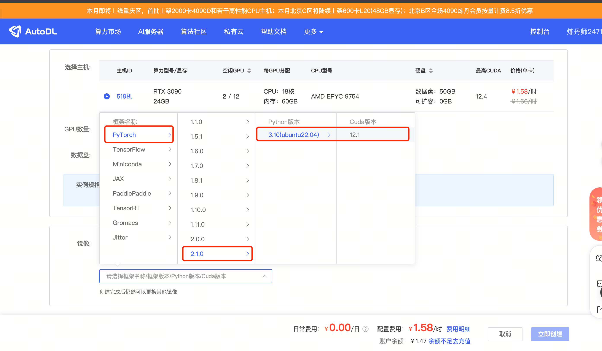

# 04-GLM-4-9B-Chat vLLM 部署调用

## **vLLM 简介**

vLLM 框架是一个高效的大型语言模型（LLM）**推理和部署服务系统**，具备以下特性：

- **高效的内存管理**：通过 PagedAttention 算法，vLLM 实现了对 KV 缓存的高效管理，减少了内存浪费，优化了模型的运行效率。
- **高吞吐量**：vLLM 支持异步处理和连续批处理请求，显著提高了模型推理的吞吐量，加速了文本生成和处理速度。
- **易用性**：vLLM 与 HuggingFace 模型无缝集成，支持多种流行的大型语言模型，简化了模型部署和推理的过程。兼容 OpenAI 的 API 服务器。
- **分布式推理**：框架支持在多 GPU 环境中进行分布式推理，通过模型并行策略和高效的数据通信，提升了处理大型模型的能力。
- **开源**：vLLM 是开源的，拥有活跃的社区支持，便于开发者贡献和改进，共同推动技术发展。

## **环境准备**

在 Autodl 平台中租赁一个 3090 等 24G 显存的显卡机器，如下图所示镜像选择 PyTorch-->2.1.0-->3.10(ubuntu22.04)-->12.1

接下来打开刚刚租用服务器的 JupyterLab，并且打开其中的终端开始环境配置、模型下载和运行演示。



pip 换源加速下载并安装依赖包

```bash
# 升级pip
python -m pip install --upgrade pip
# 更换 pypi 源加速库的安装
pip config set global.index-url https://pypi.tuna.tsinghua.edu.cn/simple

pip install modelscope==1.11.0
pip install openai==1.17.1
pip install torch==2.1.2+cu121
pip install tqdm==4.64.1
pip install transformers==4.39.3
# 下载flash-attn 请等待大约10分钟左右~
MAX_JOBS=8 pip install flash-attn --no-build-isolation
pip install vllm==0.4.0.post1
```

直接安装 vLLM 会安装 CUDA 12.1 版本。

```bash
pip install vllm
```

如果我们需要在 CUDA 11.8 的环境下安装 vLLM，可以使用以下命令，指定 vLLM 版本和 python 版本下载。

```bash
export VLLM_VERSION=0.4.0
export PYTHON_VERSION=38
pip install https://github.com/vllm-project/vllm/releases/download/v${VLLM_VERSION}/vllm-${VLLM_VERSION}+cu118-cp${PYTHON_VERSION}-cp${PYTHON_VERSION}-manylinux1_x86_64.whl --extra-index-url https://download.pytorch.org/whl/cu118
```

> 考虑到部分同学配置环境可能会遇到一些问题，我们在 AutoDL 平台准备了 vLLM 的环境镜像，该镜像适用于任何需要 vLLM 的部署环境。点击下方链接并直接创建 AutoDL 示例即可。（vLLM 对 torch 版本要求较高，且越高的版本对模型的支持更全，效果更好，所以新建一个全新的镜像。） **https://www.codewithgpu.com/i/datawhalechina/self-llm/GLM-4**

使用 modelscope 中的 snapshot_download 函数下载模型，第一个参数为模型名称，参数 cache_dir 为模型的下载路径。

在 /root/autodl-tmp 路径下新建 model_download.py 文件并在其中输入以下内容，粘贴代码后请及时保存文件，如下图所示。并运行 `python /root/autodl-tmp/model_download.py` 执行下载，模型大小为 14GB，下载模型大概需要 2 分钟。

```bash
import torch 
from modelscope import snapshot_download, AutoModel, AutoTokenizer
osmodel_dir = snapshot_download('ZhipuAI/glm-4-9b-chat', cache_dir='/root/autodl-tmp', revision='master')
```

## **代码准备**

### **python 文件**

在 /root/autodl-tmp 路径下新建 vllm_model.py 文件并在其中输入以下内容，粘贴代码后请及时保存文件。下面的代码有很详细的注释，大家如有不理解的地方，欢迎提出 issue。

首先从 vLLM 库中导入 LLM 和 SamplingParams 类。`LLM` 类是使用 vLLM 引擎运行离线推理的主要类。`SamplingParams` 类指定采样过程的参数，用于控制和调整生成文本的随机性和多样性。

vLLM 提供了非常方便的封装，我们直接传入模型名称或模型路径即可，不必手动初始化模型和分词器。

我们可以通过这个 demo 熟悉下 vLLM 引擎的使用方式。被注释的部分内容可以丰富模型的能力，但不是必要的，大家可以按需选择。

```python
from vllm import LLM, SamplingParams
from transformers import AutoTokenizer
import os
import json

# 自动下载模型时，指定使用modelscope。不设置的话，会从 huggingface 下载
# os.environ['VLLM_USE_MODELSCOPE']='True'

def get_completion(prompts, model, tokenizer=None, max_tokens=512, temperature=0.8, top_p=0.95, max_model_len=2048):
    stop_token_ids = [151329, 151336, 151338]
    # 创建采样参数。temperature 控制生成文本的多样性，top_p 控制核心采样的概率
    sampling_params = SamplingParams(temperature=temperature, top_p=top_p, max_tokens=max_tokens, stop_token_ids=stop_token_ids)
    # 初始化 vLLM 推理引擎
    llm = LLM(model=model, tokenizer=tokenizer, max_model_len=max_model_len,trust_remote_code=True)
    outputs = llm.generate(prompts, sampling_params)
    return outputs


if __name__ == "__main__":    
    # 初始化 vLLM 推理引擎
    model='/root/autodl-tmp/ZhipuAI/glm-4-9b-chat' # 指定模型路径
    # model="THUDM/glm-4-9b-chat" # 指定模型名称，自动下载模型
    tokenizer = None
    # tokenizer = AutoTokenizer.from_pretrained(model, use_fast=False) # 加载分词器后传入vLLM 模型，但不是必要的。
    
    text = ["给我介绍一下大型语言模型。",
           "告诉我如何变强。"]
    # messages = [
    #     {"role": "system", "content": "你是一个有用的助手。"},
    #     {"role": "user", "content": prompt}
    # ]
    # 作为聊天模板的消息，不是必要的。
    # text = tokenizer.apply_chat_template(
    #     messages,
    #     tokenize=False,
    #     add_generation_prompt=True
    # )

    outputs = get_completion(text, model, tokenizer=tokenizer, max_tokens=512, temperature=1, top_p=1, max_model_len=2048)

    # 输出是一个包含 prompt、生成文本和其他信息的 RequestOutput 对象列表。
    # 打印输出。
    for output in outputs:
        prompt = output.prompt
        generated_text = output.outputs[0].text
        print(f"Prompt: {prompt!r}, Generated text: {generated_text!r}")
```
结果如下：
```bash
Prompt: '给我介绍一下大型语言模型。', Generated text: '大型语言模型是一种基于深度学习的自然语言处理技术，它能够理解、生成和翻译自然语言，为用户提供丰富的语言交互体验。\n\n以下是关于大型语言模型的一些关键信息：\n\n### 1. 设计目标\n\n- **理解自然语言**：能够理解用户的意图和需求，并进行相应的响应。\n- **生成自然语言**：根据输入生成符合语法和语义的自然语言回答。\n- **翻译自然语言**：在多种语言之间进行流畅的翻译。\n\n### 2. 技术架构\n\n- **深度学习**：采用神经网络技术对大量文本数据进行训练，以实现模型的理解、生成和翻译能力。\n- **预训练**：通过在大量无标注数据上进行预训练，使模型具备初步的语言理解和生成能力。\n- **微调**：在特定任务上进行微调，进一步提升模型在该任务上的表现。\n\n### 3. 应用场景\n\n- **问答系统**：如搜索引擎、智能客服、知识问答等。\n- **文本生成**：如内容创作、摘要生成、对话生成等。\n- **机器翻译**：在跨语言交流、全球电商等领域有广泛应用。\n\n### 4. 发展趋势\n\n- **模型规模不断扩大**：随着计算力的提升，模型规模将逐渐增大，性能也将相应提升。\n- **多模态融合**：将自然语言处理与图像、语音等其他模态信息融合，实现更全面的交互体验。\n- **可解释性和公平性**：关注模型的可解释性和公平性，提高用户对模型的信任。\n\n大型语言模型在改善人机交互、促进信息传播等方面具有重要作用。\n\n大型语言模型（Large Language Models，LLMs）是一种基于深度学习的自然语言处理（Natural Language Processing，NLP）技术，其核心能力在于理解和生成自然语言。以下是一些关于大型语言模型的关键点：\n\n1. **模型规模**：大型语言模型的规模巨大，通常包含数十亿至数千亿个参数。例如，GPT-3拥有1750亿个参数，是迄今为止最大的语言模型。\n\n2. **训练数据**：这些模型通常在大量文本数据上进行训练，包括书籍、新闻、网页等。这些数据帮助模型学习语言的高级特性，比如语法、语义和风格。\n\n3. **生成能力**：大型语言模型能够根据给定文本或上下文自主生成连贯、富有逻辑性的文本。这种能力在文本生成、摘要、机器翻译等领域有广泛的应用。\n\n4. **适应能力**：尽管这些模型能够生成'


Prompt: '告诉我如何变强。', Generated text: '\n变强是一个全面的提升过程，它包括身体、心理和精神的各个方面。以下是一些建议，希望能帮助你实现变强的目标：\n\n1. **身体强化**：\n   - **规律锻炼**：制定一个合理的训练计划，包括有氧运动（如跑步、游泳）和重量训练，可以提高身体的耐力和力量。\n   - **营养饮食**：健康饮食对身体的恢复和生长至关重要。保证摄入足够的蛋白质、碳水化合物、脂肪和微量元素。\n   - **充足睡眠**：保证每晚7-9小时的高质量睡眠，有助于身体恢复和内分泌平衡。\n\n2. **心理调适**：\n   - **正面思考**：保持积极的心态，面对挑战时，适时调整自己的心态，避免消极情绪的影响。\n   - **抗压能力**：培养面对挫折和压力的能力，可以通过冥想、瑜伽等方式来增强情绪管理能力。\n\n3. **精神成长**：\n   - **持续学习**：通过阅读、上课、参加讨论等方式，不断丰富自己的知识和视野。\n   - **目标设定**：明确自己的长期和短期目标，并制定实现这些目标的计划。\n\n具体措施如下：\n\n- **制定计划**：根据自身情况制定详细的计划，如每周锻炼几次，每次锻炼多长时间等。\n- **跟踪进度**：记录自己的训练和饮食，定期进行自我评估，调整计划。\n- **寻求帮助**：如果条件允许，可以聘请专业教练进行指导。\n- **保持耐心**：变强是一个长期的过程，需要耐心和毅力。\n\n请根据自己的实际情况，有选择性地采纳这些建议，不断努力，你会越来越强的。加油！🌟💪✊🏼🏃\u200d♀️🏃\u200d♂️👊\u200d♀️👊\u200d♂️🏋️\u200d♀️🏋️\u200d♂️🥗🍎💤📚💼🥼🧘\u200d♀️🧘\u200d♂️🎯🎯🎯。🎉🎉🎉🎉🎉🎉🎉🎉🎉🎉🎉🎉🎉🎉🎉🎉🎉🎉🎉🎉🎉🎉🎉🎉🎉🎉🎉🎉🎉'
```

### **创建兼容 OpenAI API 接口的服务器**

GLM4 兼容 OpenAI API 协议，所以我们可以直接使用 vLLM 创建 OpenAI API 服务器。vLLM 部署实现 OpenAI API 协议的服务器非常方便。默认会在 <u>http://localhost:8000</u> 启动服务器。服务器当前一次托管一个模型，并实现列表模型、completions 和 chat completions 端口。

- completions：是基本的文本生成任务，模型会在给定的提示后生成一段文本。这种类型的任务通常用于生成文章、故事、邮件等。
- chat completions：是面向对话的任务，模型需要理解和生成对话。这种类型的任务通常用于构建聊天机器人或者对话系统。

在创建服务器时，我们可以指定模型名称、模型路径、聊天模板等参数。

- --host 和 --port 参数指定地址。
- --model 参数指定模型名称。
- --chat-template 参数指定聊天模板。
- --served-model-name 指定服务模型的名称。
- --max-model-len 指定模型的最大长度。

这里指定 `--max-model-len=2048` 是因为 GLM4-9b-Chat 模型的最大长度过长 128K，导致 vLLM 初始化 KV 缓存时消耗资源过大。

```bash
python -m vllm.entrypoints.openai.api_server --model /root/autodl-tmp/ZhipuAI/glm-4-9b-chat  --served-model-name glm-4-9b-chat --max-model-len=2048 --trust-remote-code
```

1. 通过 curl 命令查看当前的模型列表。

```bash
curl http://localhost:8000/v1/models
```

得到的返回值如下所示：

```bash
{"object":"list","data":[{"id":"glm-4-9b-chat","object":"model","created":1717567231,"owned_by":"vllm","root":"glm-4-9b-chat","parent":null,"permission":[{"id":"modelperm-4fdf01c1999f4df1a0fe8ef96fd07c2f","object":"model_permission","created":1717567231,"allow_create_engine":false,"allow_sampling":true,"allow_logprobs":true,"allow_search_indices":false,"allow_view":true,"allow_fine_tuning":false,"organization":"*","group":null,"is_blocking":false}]}]}
```

1. 使用 curl 命令测试 OpenAI Completions API 。

```bash
curl http://localhost:8000/v1/completions \
    -H "Content-Type: application/json" \
    -d '{
            "model": "glm-4-9b-chat",
            "prompt": "你好",        
            "max_tokens": 7,        
            "temperature": 0    
         }'
```

得到的返回值如下所示：

```bash
{"id":"cmpl-8bba2df7cfa1400da705c58946389cc1","object":"text_completion","created":1717568865,"model":"glm-4-9b-chat","choices":[{"index":0,"text":"，请问有什么可以帮助您的？您好","logprobs":null,"finish_reason":"length","stop_reason":null}],"usage":{"prompt_tokens":3,"total_tokens":10,"completion_tokens":7}}
```

也可以用 python 脚本请求 OpenAI Completions API 。这里面设置了额外参数 `extra_body`，我们传入了 `stop_token_ids` 停止词 id。当 openai api 无法满足时可以采用 vllm 官方文档方式添加。https://docs.vllm.ai/en/latest/serving/openai_compatible_server.html

```python
from openai import OpenAI
client = OpenAI(
    base_url="http://localhost:8000/v1",
    api_key="token-abc123", # 随便设，只是为了通过接口参数校验
)

completion = client.chat.completions.create(
  model="glm-4-9b-chat",
  messages=[
    {"role": "user", "content": "你好"}
  ],
  # 设置额外参数
  extra_body={
    "stop_token_ids": [151329, 151336, 151338]
  }
)

print(completion.choices[0].message)
```

得到的返回值如下所示：

```bash
ChatCompletionMessage(content='\n你好👋！很高兴见到你，有什么可以帮助你的吗？', role='assistant', function_call=None, tool_calls=None)
```

1. 用 curl 命令测试 OpenAI Chat Completions API 。

```bash
curl http://localhost:8000/v1/chat/completions \
    -H "Content-Type: application/json" \
    -d '{        
            "model": "glm-4-9b-chat",
            "messages": [            
                  {"role": "system", "content": "You are a helpful assistant."},
                  {"role": "user", "content": "你好"}
            ],
            "max_tokens": 7,        
            "temperature": 0 
            
         }'
```

得到的返回值如下所示：

```bash
{"id":"cmpl-8b02ae787c7747ecaf1fb6f72144b798","object":"chat.completion","created":1717569334,"model":"glm-4-9b-chat","choices":[{"index":0,"message":{"role":"assistant","content":"\n你好👋！很高兴"},"logprobs":null,"finish_reason":"length","stop_reason":null}],"usage":{"prompt_tokens":16,"total_tokens":23,"completion_tokens":7}
```

也可以用 python 脚本请求 OpenAI Chat Completions API 。

```python
from openai import OpenAIopenai_api_key = "EMPTY" # 随便设，只是为了通过接口参数校验openai_api_base = "http://localhost:8000/v1"client = OpenAI(
    api_key=openai_api_key,
    base_url=openai_api_base,
)

chat_outputs = client.chat.completions.create(
    model="glm-4-9b-chat",
    messages=[
        {"role": "system", "content": "You are a helpful assistant."},
        {"role": "user", "content": "你好"},
    ],
      # 设置额外参数
      extra_body={
        "stop_token_ids": [151329, 151336, 151338]
  }
)
print(chat_outputs)
```

得到的返回值如下所示：

```bash
ChatCompletion(id='cmpl-16b1c36dc695426cacee23b79d179d52', choices=[Choice(finish_reason='stop', index=0, logprobs=None, message=ChatCompletionMessage(content='\n你好👋！有什么可以帮助你的吗？', role='assistant', function_call=None, tool_calls=None), stop_reason=151336)], created=1717569519, model='glm-4-9b-chat', object='chat.completion', system_fingerprint=None, usage=CompletionUsage(completion_tokens=12, prompt_tokens=16, total_tokens=28))
```

在处理请求时 API 后端也会打印一些日志和统计信息。

## **速度测试**

既然说 vLLM 是一个高效的大型语言模型推理和部署服务系统，那么我们就来测试一下模型的生成速度。看看和原始的速度有多大的差距。这里直接使用 vLLM 自带的 benchmark_throughput.py 脚本进行测试。可以将当前文件夹 benchmark_throughput.py 脚本放在 /root/autodl-tmp/ 下。或者大家可以自行<u>下载脚本</u>。

下面是一些 benchmark_throughput.py 脚本的参数说明：

- --model 参数指定模型路径或名称。
- --backend 推理后端，可以是 vllm、hf 和 mii。分布对应 vLLM、HuggingFace 和 Mii 推理后端。
- --input-len 输入长度
- --output-len 输出长度
- --num-prompts 生成的 prompt 数量
- --seed 2024 随机种子
- --dtype float16 浮点数精度
- --max-model-len 模型最大长度
- --hf_max_batch_size transformers 库的最大批处理大小（只有 hf 推理后端有效，且必须）
- --dataset 数据集路径。（未设置会自动生成数据）

测试 vLLM 的速度：

```bash
python benchmark_throughput.py \
        --model /root/autodl-tmp/ZhipuAI/glm-4-9b-chat \
        --backend vllm \
        --input-len 64 \
        --output-len 128 \
        --num-prompts 25 \
        --seed 2024 \
    --dtype float16 \
    --max-model-len 512 \
    --trust-remote-code
```

得到的结果如下所示：

```
Throughput: 7.41 requests/s, 1423.36 tokens/s
```

测试原始方式（使用 hunggingface 的 transformers 库）的速度：

```bash
python benchmark_throughput.py \
        --model /root/autodl-tmp/ZhipuAI/glm-4-9b-chat \
        --backend hf \
        --input-len 64 \
        --output-len 128 \
        --num-prompts 25 \
        --seed 2024 \
        --dtype float16 \
    --hf-max-batch-size 25 \
    --trust-remote-code
```

得到的结果如下所示：

```
Throughput: 3.40 requests/s, 652.15 tokens/s
```

对比两者的速度，在本次测试中 vLLM 的速度要比原始的速度快 **100%** 以上（本次测试相对比较随意，仅供本 case 参考，不对其他 case 有参考意义）。

| 推理框架 | Throughput | tokens/s |
| :---: | :---: | :---: |
| vllm | 7.41 requests/s | 1423.36 tokens/s |
| hf | 3.40 requests/s | 652.15 tokens/s |
| diff | 117.94% | 118.26% |
