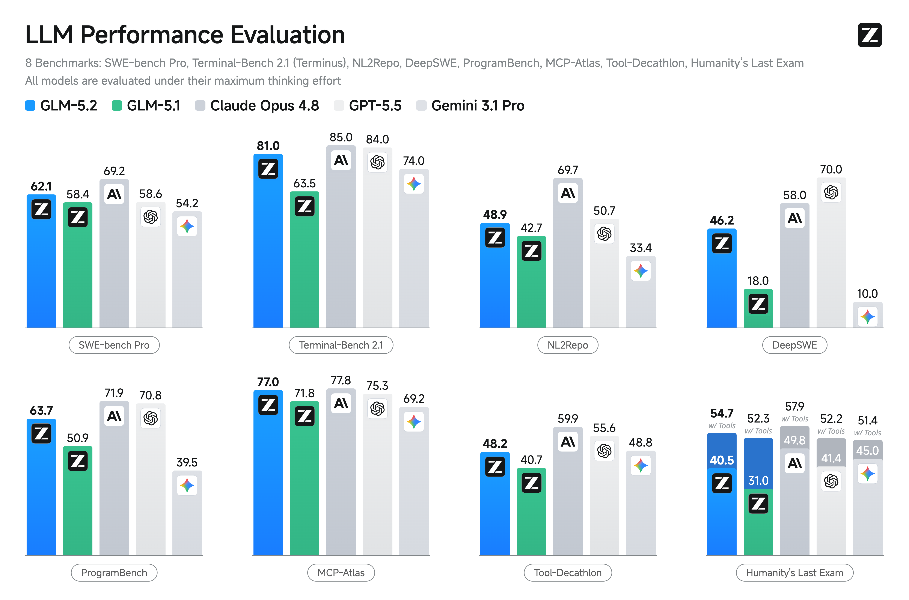
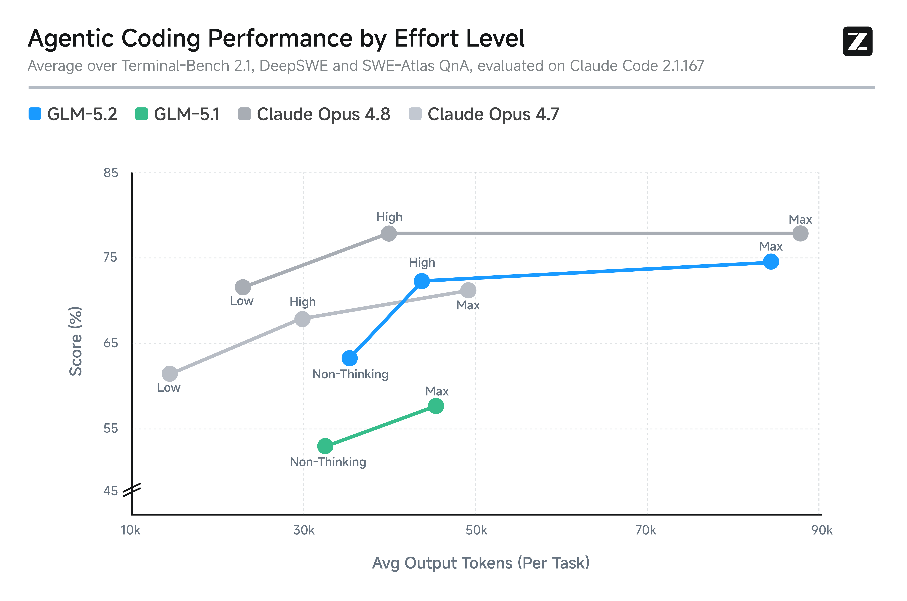
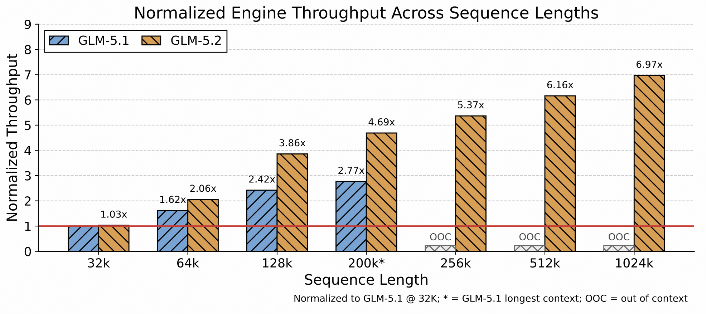

# 01 GLM-5.2 技术报告解读：从 GLM-5 到长上下文 Agentic Engineering

## 1 模型介绍

GLM-5.2 是智谱面向长程任务推出的开源混合专家（MoE）模型，总参数量约为 753B。它延续了 GLM-5 系列的 MLA、DSA 和 MTP 设计，并进一步引入 IndexShare，以降低超长上下文下的索引计算开销。

### 1.1 模型架构预览

下面是经过省略后的 GLM-5.2 关键配置：

```jsonc
{
  "architectures": [
    "GlmMoeDsaForCausalLM"
  ],
  "model_type": "glm_moe_dsa",
  "dtype": "bfloat16",
  "num_hidden_layers": 78,
  "hidden_size": 6144,
  "num_attention_heads": 64,
  "max_position_embeddings": 1048576,
  "mlp_layer_types": [
    "dense",
    "dense",
    "dense",
    "sparse",
    "sparse"
    // 后续重复的 sparse 项省略
  ],
  "n_routed_experts": 256,
  "n_shared_experts": 1,
  "num_experts_per_tok": 8,
  "moe_intermediate_size": 2048,
  "q_lora_rank": 2048,
  "kv_lora_rank": 512,
  "qk_head_dim": 256,
  "qk_nope_head_dim": 192,
  "qk_rope_head_dim": 64,
  "v_head_dim": 256,
  "index_topk": 2048,
  "index_topk_freq": 4,
  "index_head_dim": 128,
  "index_n_heads": 32,
  "index_share_for_mtp_iteration": true,
  "indexer_types": [
    "full",
    "full",
    "full",
    "shared",
    "shared",
    "shared",
    "full",
    "shared"
    // 后续重复项省略
  ],
  "num_nextn_predict_layers": 1,
  "vocab_size": 154880
}
```

从配置上看，GLM-5.2 并不是完全更换基础架构，而是在 GLM-5.1 已有的 `glm_moe_dsa` 架构上继续演进。两者都保留了 MoE、MLA、DSA 和 MTP 等核心结构，并且在层数、隐藏维度、专家数量、每 token 激活专家数、MLA 的 KV latent 维度以及 DSA Top-K 选择规模上基本一致。

在这个基础上，GLM-5.2 的变化主要体现在两个方向：一是上下文窗口从 GLM-5.1 的约 200K token 扩展到 GLM-5.2 的约 1M token；二是 GLM-5.2 增加了与 IndexShare 相关的配置，它在每四个稀疏注意力层中复用同一个索引器，降低长上下文下的重复索引开销。

### 1.2 GLM-5.2 的主要能力

GLM-5.2 的主要能力体现在长程工程任务、代码与智能体执行以及灵活的推理控制三个方面。凭借稳定的 100 万 token 上下文，模型能够在大型代码实现、自动化研究、性能优化和复杂调试等长轨迹任务中持续保持任务状态并完成多步骤操作；同时，它具备代码库理解与修改、终端操作、工具调用和复杂软件工程任务执行能力，并支持多档思考强度，使用户能够根据任务难度在执行效果、推理速度和计算成本之间进行权衡。

#### 1.2.1 效果对比


> GLM-5.2 在三项长程工程评测里均为表现最好的开源模型，其中 FrontierSWE 和 PostTrainBench 接近 Opus 4.8，但在 SWE-Marathon 上仍有明显差距。



> GLM-5.2 在代码、终端操作、仓库理解和工具调用等任务上表现较为均衡，其中 Terminal-Bench 2.1 和 MCP-Atlas 已接近前沿闭源模型，但在 DeepSWE、NL2Repo 和 Tool-Decathlon 等复杂任务上仍有明显提升空间。



> GLM-5.2 可以通过调节思考强度，在任务效果、执行速度和计算成本之间进行权衡；在相近的 token 预算下，其 Agentic Coding 能力明显高于 GLM-5.1，整体表现大致位于 Claude Opus 4.7 与 Claude Opus 4.8 之间。

> 以上图片及评测结果均来自 [GLM-5.2 官方技术博客](https://z.ai/blog/glm-5.2)，相关结论仅适用于官方列出的对比模型、评测设置和测试时间范围。

## 2 GLM-5.2 核心架构更新

### 2.1 稀疏注意力（DSA）的跨层索引共享（IndexShare）

GLM-5 采用了 DeepSeek-V3.2 提出的 DeepSeek Sparse Attention（DSA，稀疏注意力），并通过持续预训练将其适配到自身的多头潜在注意力（MLA）架构中。在此基础上，GLM-5.2 针对多层网络重复执行索引计算的问题，进一步引入跨层索引共享机制 IndexShare。


> 图片来源：[GLM-5.2 官方技术博客](https://z.ai/blog/glm-5.2)。

在理解 IndexShare 之前，我们先来回顾一下 DSA 中的 Lightning Indexer。它是位于稀疏注意力计算之前的轻量级索引模块，用于快速计算当前 query token 与历史 token 的相关性分数，并从中选出 Top-K 个重要位置，使注意力模块仅需读取并计算这些位置对应的 KV，从而降低长上下文注意力的计算开销。

Lightning Indexer 根据当前 query token 的 hidden state $h_t$ 和第 $s$ 个历史 token 的 hidden state $h_s$，计算索引分数 $I_{t,s}$。该分数用于估计历史位置 $s$ 对当前注意力计算的重要程度：

```math
I_{t,s}
=
\sum_{j=1}^{H^I}
w^I_{t,j}
\cdot
\mathrm{ReLU}
\left(
\left(\mathbf{q}^I_{t,j}\right)^\top
\mathbf{k}^I_s
\right)
```

Lightning Indexer 根据索引分数，从可见的历史位置中选出得分最高的 $k$ 个位置：

```math
\mathcal{S}_t
=
\mathrm{TopK}_{s \leq t}
\left(
I_{t,s},k
\right)
```

其中，$\mathcal{S}_t$ 表示针对位置 $t$ 选出的历史位置集合。Lightning Indexer 以较低成本计算当前 query 与历史位置之间的索引分数，随后，注意力模块仅对集合 $\mathcal{S}_t$ 中对应的 Key 和 Value 执行稀疏注意力计算，从而降低长上下文场景下的计算开销。

在 Transformers 的 GLM-5.2 实现中，IndexShare 的核心逻辑位于注意力层的 `forward` 方法中，代码如下：

```python
# ===== Indexer (DSA sparse mask) =====
# attention_mask is [B, 1, S, T] (4D) for eager and (2D) otherwise but indexer works with [B, S, T] (3D)
if not self.skip_topk or prev_topk_indices is None:
    indexer_mask = (
        attention_mask[:, 0, :, :]
        if attention_mask is not None and attention_mask.dim() == 4
        else attention_mask.unsqueeze(1)
        if attention_mask is not None
        else None
    )
    topk_indices = self.indexer(
        hidden_states,
        q_resid,
        position_embeddings,
        indexer_mask,
        use_cache=past_key_values is not None,
    )  # [B, S, topk]
else:
    topk_indices = prev_topk_indices  # [B, S, topk]
```

当前层需要执行完整索引计算或尚无可复用结果时，模型调用 `self.indexer(...)` 生成 `topk_indices`；否则，当前层直接使用 `prev_topk_indices`，跳过 Lightning Indexer 的点积与 Top-K 操作。结合 `index_topk_freq = 4`，每组 4 个层只需执行一次索引计算，从而减少其余 3 个层的 Indexer 计算开销。

### 2.2 多步 MTP 的效率与接受率优化

#### 2.2.1 索引共享（IndexShare）与键值缓存复用（KVShare）

GLM-5 在 DeepSeek-V3 的 MTP 设计基础上，将训练阶段的 MTP 展开为 3 个连续预测步骤，并让这 3 个逻辑 MTP layers 共享同一套参数，从而在保持与 DeepSeek-V3 单层 MTP draft model 基本相同的参数量和权重显存成本下，增强连续多 token 预测能力并提高推测解码的接受率。

GLM-5.2 从计算效率和接受率两个方面进一步优化了多步 MTP：仅在第一个预测步骤运行 Indexer，后续步骤复用其 Top-K 索引，并在训练时同步复用第一步的 KV Cache。


> 图片来源：[GLM-5.2 官方技术博客](https://z.ai/blog/glm-5.2)。

如图所示，第一次 MTP 预测使用的 $h_1$ 到 $h_4$ 全部来自主模型，并根据这些隐藏表示计算 Top-K 索引和 KV Cache，再结合 $e_5$ 与 $h_4$ 生成 MTP 隐藏表示 $h_5$；进入第二个预测步骤后，$h_5$ 仍会与 $e_6$ 一起作为当前输入生成新的 query，但模型不再重新运行 Indexer，也不会将 $h_5$ 加入可关注的历史 KV，而是直接复用第一步从 $h_1$ 到 $h_4$ 中选出的 Top-K 索引及其 KV Cache。这样既能减少后续 MTP 步骤中的 Indexer 点积和 Top-K 开销，又能避免 MTP 生成的中间状态作为历史 KV 被反复引用，从而使训练与推理阶段使用的历史注意力上下文保持一致（不再引入来源不同的 MTP 隐藏状态作为历史 KV），并提高推测解码的接受率。

#### 2.2.2 拒绝采样与端到端总变差损失（e2e TV Loss）

[Bebop](https://arxiv.org/abs/2606.12370) 是 Qwen 团队提出的 MTP 优化方法，主要用于解决强化学习 rollout 过程中主模型输出熵发生变化、导致 MTP 草稿 token 接受率下降的问题。当主模型的输出分布熵较高时，概率会分散到多个合理 token 上，即使 MTP 的整体分布已经接近主模型，两个模型的最高概率 token 也可能不同，导致接受率下降。Bebop 改用概率拒绝采样：首先从草稿分布 $q$ 中采样候选 token，再按照以下概率决定是否接受：

```math
\hat{y}\sim q
```

```math
P_{\mathrm{accept}}(\hat{y})
=
\min
\left(
1,
\frac{p(\hat{y})}{q(\hat{y})}
\right)
```

拒绝采样的期望接受率等于主模型与草稿模型概率分布的重合程度：

```math
\alpha_{\mathrm{RS}}
=
\sum_y
\min
\left(
p(y),q(y)
\right)
=
1-d_{\mathrm{TV}}(p,q)
```

其中，总变差距离定义为：

```math
d_{\mathrm{TV}}(p,q)
=
\frac{1}{2}
\sum_y
\left|
p(y)-q(y)
\right|
```

因此，减小主模型与草稿模型之间的总变差距离，就等价于提高拒绝采样的期望接受率。传统交叉熵和 KL 散度只能间接约束这一距离，Bebop 因此提出直接最小化总变差距离的 TV Loss：

```math
\mathcal{L}_{\mathrm{TV}}
=
d_{\mathrm{TV}}(p,q)
=
1-
\sum_y
\min
\left(
p(y),q(y)
\right)
```

对于包含 $\gamma$ 个预测步骤的多步 MTP，前面的 token 一旦被拒绝，后面的草稿 token 也无法继续接受，因此其期望接受长度为：

```math
\mathbb{E}[L]
=
\sum_{j=1}^{\gamma}
\prod_{i=1}^{j}
\left(
1-d_{\mathrm{TV}}(p_i,q_i)
\right)
```

在此基础上，Bebop 提出端到端总变差损失（e2e TV Loss）：

```math
\mathcal{L}_{\mathrm{e2e}}
=
1-
\frac{1}{\gamma}
\sum_{j=1}^{\gamma}
\prod_{i=1}^{j}
\left(
1-d_{\mathrm{TV}}(p_i,q_i)
\right)
```

该目标不再单独优化每个 MTP 步骤，而是直接优化整个多步推测解码过程的期望接受长度，并自然提高前面预测步骤的重要性。

GLM-5.2 借鉴了 Qwen 团队提出的 Bebop 方法：在训练阶段使用端到端总变差损失，核心就是通过最小化 TV 距离，让 MTP 的概率分布尽量贴近主模型的概率分布，从而提高草稿 token 在拒绝采样中的接受率。推理时，系统按照 $\min(1, p(\hat{y})/q(\hat{y}))$ 的概率接受 MTP 生成的草稿 token；若草稿 token 被拒绝，则从目标分布与草稿分布的正残差中重新采样。这样可以在保持最终生成结果服从目标模型分布的同时，提高草稿 token 的复用率。

## 3 面向 100 万 token 上下文的推理系统优化

随着 GLM-5.2 将上下文窗口扩展到 100 万 token，推理瓶颈逐渐从单纯的 GPU 计算转向 KV Cache 容量、长上下文算子和 CPU 调度开销。由于每个 token 的 KV Cache 大小并未随计算量同步下降，因此需要进一步优化推理系统，才能在有限 GPU 资源下兼顾超长上下文、并发能力和 token 吞吐量。



> 图片来源：[GLM-5.2 官方技术博客](https://z.ai/blog/glm-5.2)。

显存层面，基于 LayerSplit 进一步细化内存管理与并行策略，为 KV Cache 释放更多可用空间；在 GPU 层面，针对开销随上下文长度增长的算子进行优化，并协调算子执行与缓存传输，降低数据搬运对预填充和解码的影响；在 CPU 层面，则优化缓存管理、请求调度和运行时执行路径，减少 GPU 等待造成的流水线空闲。

## 4 GLM-5.2 后训练体系

### 4.1 slime：智能体强化学习基础设施

在 GLM 系列中，slime 已在 GLM-4.5 中用于强化学习后训练；GLM-5 延续这一框架，并将其作为统一的后训练基础设施。它主要用于解决强化学习训练中 rollout 数据生成效率低、长程智能体轨迹阻塞同步训练，以及不同任务和智能体框架难以接入同一训练流程的问题。slime 的核心架构如下图所示：


> 图片来源：[THUDM/slime](https://github.com/THUDM/slime)。

slime 主要由训练模块、rollout 模块和数据缓冲区三个部分组成。这种设计将任务相关的 rollout 逻辑、模型推理和参数训练相互解耦：不同任务只需实现自己的数据生成与奖励逻辑，就可以通过统一接口接入系统；多个 SGLang server 可以并行生成轨迹，缓解 rollout 吞吐瓶颈；训练引擎和推理引擎还可以部署在不同 GPU 上异步运行，使较长或较慢的智能体轨迹不会阻塞整个训练过程。

GLM-5 并没有为 slime 引入新的系统组件，而是继续将其作为统一的后训练基础设施，重点利用其在任务接入、rollout 吞吐、长尾延迟优化、故障容错和多任务编排等方面的能力。

其中，在复杂智能体训练方面，GLM-5.2 进一步扩展了 slime 的能力：它既支持可以访问模型概率等内部信息的“白盒 rollout”，也支持只通过 API 获取结果的“黑盒 rollout”；对于过长的执行过程，可以通过“轨迹压缩”将历史信息整理成更短的子轨迹继续训练；对于复杂任务，还可以使用“子智能体工作流”，让主智能体把不同子任务交给多个子智能体执行。在此基础上，GLM-5.2 使用并行在线策略蒸馏（OPD），将十余个擅长不同领域的专家模型所具备的能力集中训练到一个最终模型中。

系统层面，slime 会分别创建 `prefill` 和 `decode` 两组 SGLang 推理服务，并由 Router 负责请求转发，从而将计算密集的预填充阶段与访存密集的逐 token 解码阶段部署到不同设备上，同时将对应的 SGLang 服务组织为不同的 worker group；其次，slime 支持使用 FP8 存储 KV Cache，以更低的显存占用容纳更长的生成轨迹和更多并发请求。这些机制共同缓解了长轨迹生成中的 KV Cache 容量、阶段负载不均和训练/推理资源利用问题。

### 4.2 编码智能体强化学习中的反作弊机制

编码强化学习通常使用测试是否通过作为奖励信号，因此模型可能不去真正解决问题，而是通过读取隐藏测试文件、复制参考答案、查找上游提交或直接下载目标源码等方式获得高分。这类行为虽然能够提高训练和评测奖励，却没有提升模型的实际编码能力，还会污染强化学习的训练信号。GLM-5.2 在训练和评测过程中引入了在线反作弊机制：首先使用规则过滤器尽可能识别可疑工具调用，再由大语言模型裁判判断其真实意图。确认作弊后，系统会拦截对应调用并返回无效信息，但不会终止整条 rollout，使智能体仍可继续完成任务。这样既能阻止模型利用捷径获取奖励，也能避免直接丢弃轨迹所导致的训练不稳定。

## 5 参考资料

1. [GLM-5: From Vibe Coding to Agentic Engineering](https://arxiv.org/abs/2602.15763)
2. [GLM-5.2 官方技术博客](https://z.ai/blog/glm-5.2)
3. [GLM-5.2 模型卡](https://huggingface.co/zai-org/GLM-5.2)
4. [Transformers：GLM MoE DSA 实现](https://github.com/huggingface/transformers/blob/main/src/transformers/models/glm_moe_dsa/modeling_glm_moe_dsa.py)
5. [Bebop: Breaking Entropy Bounds](https://arxiv.org/abs/2606.12370)
6. [THUDM/slime](https://github.com/THUDM/slime)
