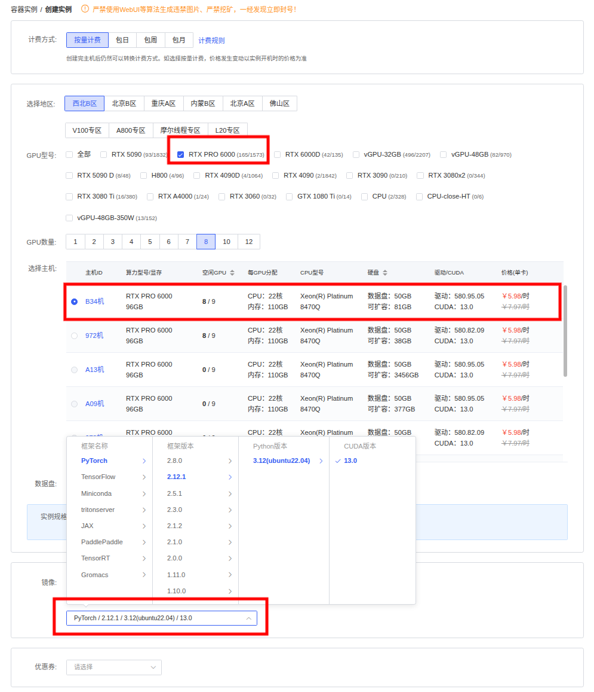
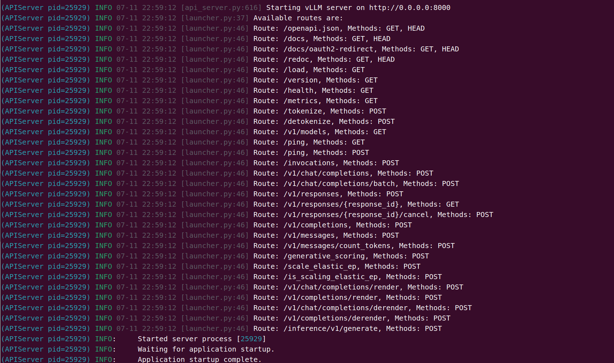
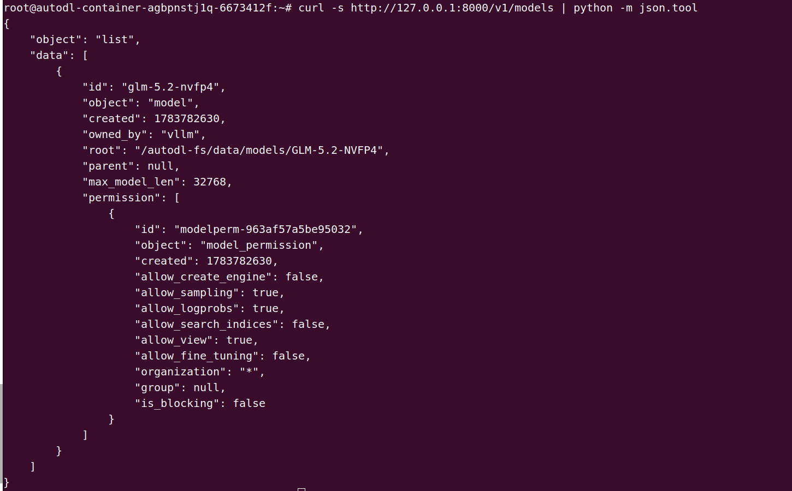
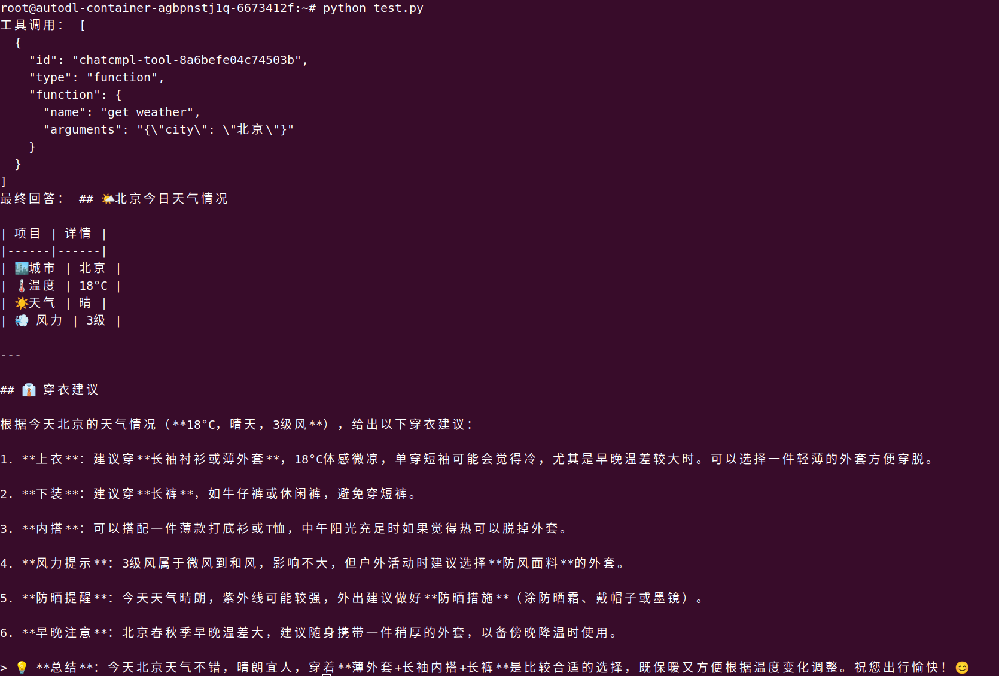

# 02 GLM-5.2 vLLM 部署调用

## 1 vLLM 简介

`vLLM` 框架是一个高效的大语言模型**推理和部署服务系统**，具备以下特性：

- **高效的 KV Cache 管理与请求调度**：vLLM 通过 PagedAttention、连续批处理和异步调度提高显存利用率与请求吞吐量。
- **GLM-5.2 架构支持**：vLLM 原生支持 GLM-5.2 使用的 `glm_moe_dsa` 架构，并支持 DSA 稀疏注意力、张量并行和专家并行。
- **MTP 推测解码加速**：GLM-5.2 内置 MTP 层，vLLM 可以直接使用其连续生成多个草稿 token，再由主模型并行验证，无需加载额外的草稿模型。
- **推理控制与工具调用**：vLLM 提供兼容 OpenAI API 的服务接口，并可通过 `glm45` reasoning parser 解析思考内容，通过 `glm47` tool-call parser 和自动工具选择支持 GLM-5.2 的工具调用与智能体工作流。

> `GLM-5.2` 官方明确说明模型权重支持多种本地部署与推理框架，包括 `SGLang`（v0.5.13.post1+）、`vLLM`（v0.23.0+）、`Transformers`、`KTransformers` 和 `Unsloth` 等。同时，面向华为昇腾 `Ascend NPU` 平台，也支持通过 `vLLM-Ascend`、`xLLM`、`SGLang` 等框架进行推理部署。本教程使用 `vLLM` 进行部署，**文中的启动日志与接口返回均为实测真实输出**。

## 2 GLM-5.2 架构

`GLM-5.2` 采用**面向长上下文与 Agentic Engineering 的高效 MoE + DSA 架构**：模型基于 **DeepSeek Sparse Attention（DSA，稀疏注意力）** 和 **Multi-head Latent Attention（MLA，多头潜在注意力）**，通过 Lightning Indexer 为每个 query 动态选择最相关的 Top-K 历史 KV，而不是对全部历史 token 执行稠密注意力计算，从而降低 1M 长上下文场景下的注意力计算开销。

`GLM-5.2` 面向长程任务、复杂代码任务和工具调用场景，支持稳定的 **1M-token context**，并提供多档 **thinking effort** 以在性能与延迟之间做权衡。其模型类型为 `glm_moe_dsa`，部署时需要推理框架支持 DSA 稀疏注意力、IndexShare 与 MTP 阶段的索引复用逻辑，以及 GLM 系列 chat template。

> 由于该架构较新，请确保安装较新版本的推理框架。推荐使用 `vLLM v0.23.0+`，以保证对 `GLM-5.2`、`glm_moe_dsa` 模型类型、DSA 稀疏注意力和长上下文推理的兼容。本文使用 vLLM v0.25.0 从源码部署 `nvidia/GLM-5.2-NVFP4`，具体启动参数见后文。

## 3 环境准备

在 [AutoDL](https://www.autodl.com/) 平台租用一台配备 8 张 NVIDIA RTX PRO 6000 Blackwell Server Edition GPU 的实例，每张 GPU 显存为 96 GB。基础镜像依次选择 `PyTorch` → `2.12.1` → `Python 3.12（Ubuntu 22.04）` → `CUDA 13.0`，如下图所示。



本教程使用基础镜像中已有的 PyTorch 和 CUDA Toolkit，并从源码编译安装 vLLM，因此需要先激活镜像预装的 CUDA 编译工具链。

```shell
cat >> ~/.bashrc <<'EOF'

# CUDA 13.0
export CUDA_HOME=/usr/local/cuda
export PATH="${CUDA_HOME}/bin:${PATH}"
export TRITON_PTXAS_PATH="${CUDA_HOME}/bin/ptxas"
EOF
source ~/.bashrc
```

实测基础镜像环境如下：

```text
----------------
Ubuntu 22.04.5 LTS
Python 3.12.3
NVIDIA 驱动 580.95.05
CUDA Toolkit 13.0
NVCC 13.0.88
PTXAS 13.0.88
GPU: NVIDIA RTX PRO 6000 Blackwell Server Edition（96G，SM120）
GCC 11.4.0
G++ 11.4.0
CMake 3.22.1
PyTorch 2.12.1+cu130
----------------
```

## 4 模型下载

使用 Hugging Face Hub 提供的 `hf download` 命令下载模型。首先安装 Hugging Face Hub：

```shell
python -m pip install -U huggingface_hub
```

下载 GLM-5.2 NVFP4 量化模型：

```bash
mkdir -p /autodl-fs/data/models/GLM-5.2-NVFP4

hf download nvidia/GLM-5.2-NVFP4 \
  --local-dir /autodl-fs/data/models/GLM-5.2-NVFP4 \
  --max-workers 8
```

> 注意：请根据实际存储路径修改 `--local-dir`，并确保目标磁盘有足够的可用空间。

## 5 代码编译安装

克隆代码前，先开启 AutoDL 平台提供的学术资源加速。详细使用方法参见：[AutoDL 学术资源加速](https://www.autodl.com/docs/network_turbo/)。

```shell
source /etc/network_turbo
```

安装从源码编译 vLLM 所需的外部依赖 `Triton` 和 `flash-attention`：

```shell
# Triton 源代码安装
mkdir -p /root/workspace/deps
cd /root/workspace/deps
git clone  --branch v3.5.1  --depth 1  --single-branch  https://github.com/triton-lang/triton.git  triton

# flash-attention 源代码安装
git clone https://github.com/vllm-project/flash-attention.git flash-attention
cd  flash-attention
# flash-attention 的源码版本应与 vLLM v0.25.0 中 cmake/external_projects/vllm_flash_attn.cmake 固定的版本一致
git checkout --detach "2c839c33742309ec41e620bf837495ec9926c56e"
git -c http.version=HTTP/1.1  submodule update  --init  --depth 1  --single-branch  --jobs 1  csrc/cutlass
```

> 为避免 vLLM 构建时自动拉取依赖因网络波动失败，这里提前准备 Triton 和 flash-attention 源码。

下载 vLLM v0.25.0 源代码：

```shell
cd ~/workspace
git clone https://github.com/vllm-project/vllm.git
cd ~/workspace/vllm
# 选择 vLLM-V0.25.0
git fetch --tags
git checkout v0.25.0
```

配置编译环境并从源码安装 vLLM v0.25.0：

```shell
cd ~/workspace/vllm
# 移除 vLLM 对 Torch 系列包的版本约束，编译时复用基础镜像已有的 torch 2.12.1+cu130
python use_existing_torch.py --prefix

# 针对 Blackwell SM120 以 Release 模式编译，并设置 CUDA 编译并行度
export TORCH_CUDA_ARCH_LIST="12.0"
export MAX_JOBS=16
export NVCC_THREADS=4
export CMAKE_BUILD_TYPE=Release

# vLLM v0.25.0 启动时会通过 TorchCodec 加载多模态模块，因此需要安装 FFmpeg 及其共享动态库
apt-get update
DEBIAN_FRONTEND=noninteractive apt-get install -y ffmpeg

# 安装构建依赖，不覆盖已有 torch
pip install -r requirements/build/cuda.txt

# 指定预先下载的本地依赖源码，避免 vLLM 在构建阶段再次从 GitHub 拉取
export TRITON_KERNELS_SRC_DIR="$HOME/workspace/deps/triton/python/triton_kernels/triton_kernels"
export VLLM_FLASH_ATTN_SRC_DIR="$HOME/workspace/deps/flash-attention"

# 复用当前环境中的 PyTorch 和 CUDA 工具链，从源码编译并安装 vLLM
pip install --no-build-isolation  .

# vLLM v0.25.0 的 SM120 Sparse MLA 需要 FlashInfer 0.6.14 新增的
# kv_scale_format 参数，因此将 Python API 与 cubin 同步升级到 0.6.14。
python -m pip install \
  --index-url https://pypi.org/simple \
  --no-deps \
  --force-reinstall \
  "flashinfer-python==0.6.14"

python -m pip install \
  --index-url https://flashinfer.ai/whl \
  --no-deps \
  --force-reinstall \
  "flashinfer-cubin==0.6.14"
```

> 该步骤会针对 Blackwell SM120 编译 vLLM 的 C++/CUDA 扩展、flash-attention 和 NVFP4 等 GPU 算子，并将编译产物安装到当前 Python 环境。首次进行完整编译时，通常需要较长时间。

## 6 GLM-5.2 特性测试

首先启动 vLLM 基础服务：

```bash
MODEL=/autodl-fs/data/models/GLM-5.2-NVFP4
CUDA_VISIBLE_DEVICES=0,1,2,3,4,5,6,7 vllm serve "$MODEL" \
  --tensor-parallel-size 8 \
  --enable-expert-parallel \
  --trust-remote-code \
  --reasoning-parser glm45 \
  --tool-call-parser glm47 \
  --max-model-len 32768 \
  --enable-auto-tool-choice \
  --kv-cache-dtype fp8_e4m3 \
  --served-model-name glm-5.2-nvfp4 \
  --host 0.0.0.0 \
  --port 8000
```

当终端输出 `Starting vLLM server on http://0.0.0.0:8000` 和 `Application startup complete.` 时，表示 GLM-5.2-NVFP4 已成功部署，OpenAI 兼容 API 服务已在 8000 端口启动。



此时可以通过 `/v1/models` 和 `/v1/chat/completions` 等接口访问模型服务。



### 6.1 工具调用测试

下面使用本地模拟的天气工具，演示“模型选择工具 → 程序执行工具 → 模型生成最终答案”的完整流程。首先创建 Python 脚本：

```python
import json
import requests

url = "http://127.0.0.1:8000/v1/chat/completions"
tools = [{
    "type": "function",
    "function": {
        "name": "get_weather",
        "description": "查询指定城市的天气",
        "parameters": {
            "type": "object",
            "properties": {"city": {"type": "string"}},
            "required": ["city"],
            "additionalProperties": False,
        },
    },
}]
messages = [{"role": "user", "content": "查询北京今天的天气，并给出穿衣建议。不要猜测，必须调用工具。"}]

payload = {
    "model": "glm-5.2-nvfp4",
    "messages": messages,
    "tools": tools,
    "tool_choice": "auto",
    "temperature": 0,
}
first = requests.post(url, json=payload, timeout=600).json()
message = first["choices"][0]["message"]
print("工具调用：", json.dumps(message.get("tool_calls"), ensure_ascii=False, indent=2))

tool_call = message["tool_calls"][0]
arguments = json.loads(tool_call["function"]["arguments"])
tool_result = {"city": arguments["city"], "temperature": 18, "condition": "晴", "wind": "3级"}

messages.append({
    "role": "assistant",
    "content": message.get("content"),
    "tool_calls": message["tool_calls"],
})
messages.append({
    "role": "tool",
    "tool_call_id": tool_call["id"],
    "content": json.dumps(tool_result, ensure_ascii=False),
})

payload["messages"] = messages
final = requests.post(url, json=payload, timeout=600).json()
print("最终回答：", final["choices"][0]["message"]["content"])
```

输出结果：



### 6.2 MTP 推测解码加速测试

`vllm bench serve` 用于对已经启动的 vLLM 服务进行在线性能测试。下面使用随机生成的固定长度请求，以单并发方式连续发送 20 个请求，每个请求约包含 1024 个输入 token，并强制生成 512 个输出 token。

> 该配置主要用于观察低并发场景下的逐 token 解码性能，适合比较基础解码与 MTP 推测解码的延迟差异。

```shell
vllm bench serve \
  --backend openai-chat \
  --host 127.0.0.1 \
  --port 8000 \
  --endpoint /v1/chat/completions \
  --model glm-5.2-nvfp4 \
  --tokenizer /autodl-fs/data/models/GLM-5.2-NVFP4 \
  --dataset-name random \
  --num-warmups 2 \
  --num-prompts 20 \
  --random-input-len 1024 \
  --random-output-len 512 \
  --max-concurrency 1 \
  --request-rate inf \
  --ignore-eos \
  --seed 42
```

基础服务测试结果：

```text
============ Serving Benchmark Result ============
Successful requests:                     20
Failed requests:                         0
Maximum request concurrency:             1
Benchmark duration (s):                  231.62
Total input tokens:                      20720
Total generated tokens:                  10240
Request throughput (req/s):              0.09
Output token throughput (tok/s):         44.21
Peak output token throughput (tok/s):    47.00
Peak concurrent requests:                2.00
Total token throughput (tok/s):          133.67
---------------Time to First Token----------------
Mean TTFT (ms):                          494.09
Median TTFT (ms):                        516.97
P99 TTFT (ms):                           519.98
-----Time per Output Token (excl. 1st token)------
Mean TPOT (ms):                          21.70
Median TPOT (ms):                        21.69
P99 TPOT (ms):                           21.72
---------------Inter-token Latency----------------
Mean ITL (ms):                           22.43
Median ITL (ms):                         21.71
P99 ITL (ms):                            43.56
==================================================

```

GLM-5.2 内置 MTP 层，不需要额外的草稿模型。停止基础服务后，在相同的 `vLLM` 启动参数末尾增加：

```bash
# 每轮解码最多提前预测 5 个候选 token，再由主模型并行验证。
--speculative-config '{"method":"mtp","num_speculative_tokens":5}'
```

开启 MTP 后的吞吐测试结果：

```text
============ Serving Benchmark Result ============
Successful requests:                     20
Failed requests:                         0
Maximum request concurrency:             1
Benchmark duration (s):                  147.90
Total input tokens:                      20720
Total generated tokens:                  10240
Request throughput (req/s):              0.14
Output token throughput (tok/s):         69.24
Peak output token throughput (tok/s):    29.00
Peak concurrent requests:                2.00
Total token throughput (tok/s):          209.33
---------------Time to First Token----------------
Mean TTFT (ms):                          520.80
Median TTFT (ms):                        549.92
P99 TTFT (ms):                           552.10
-----Time per Output Token (excl. 1st token)------
Mean TPOT (ms):                          13.45
Median TPOT (ms):                        13.09
P99 TPOT (ms):                           18.24
---------------Inter-token Latency----------------
Mean ITL (ms):                           34.88
Median ITL (ms):                         35.00
P99 ITL (ms):                            36.41
---------------Speculative Decoding---------------
Acceptance rate (%):                     32.14
Acceptance length:                       2.61
Drafts:                                  3932
Draft tokens:                            19660
Accepted tokens:                         6319
Per-position acceptance (%):
  Position 0:                            67.45
  Position 1:                            42.60
  Position 2:                            26.09
  Position 3:                            15.16
  Position 4:                            9.41
==================================================

```

> 注：在本文使用的 vLLM v0.25.0 中，benchmark 会按流式返回事件估算峰值输出吞吐；MTP 的单次返回可能包含多个 token，因此该指标会被低估。本文以平均输出吞吐和 TPOT 为准。

在相同的单并发随机负载下，开启 5-token MTP 推测解码后，输出吞吐从 44.21 tok/s 提升至 69.24 tok/s，提升约 56.6%；平均 TPOT 从 21.70 ms 降至 13.45 ms，测试总耗时缩短约 36.1%。TTFT 略有增加，但整体生成效率提升明显，说明 MTP 推测解码已成功生效。
