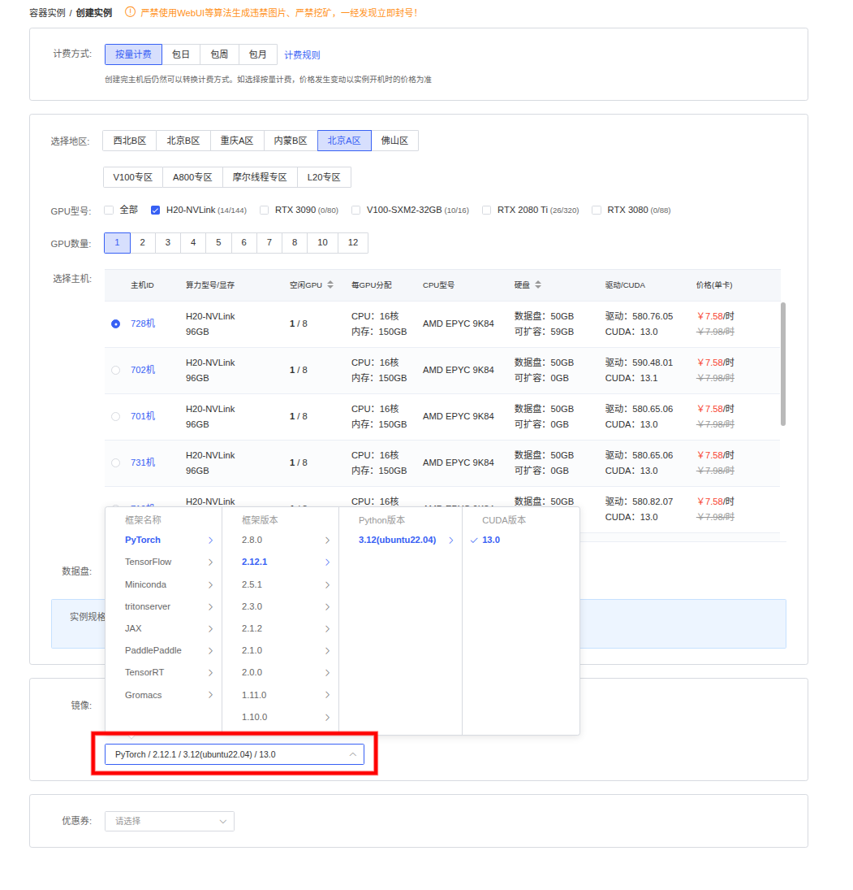
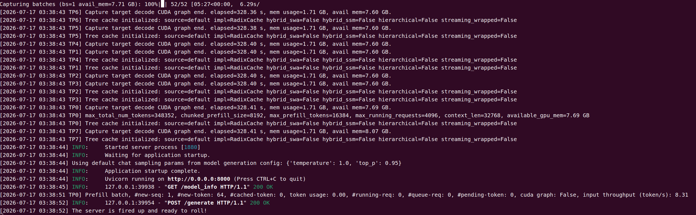
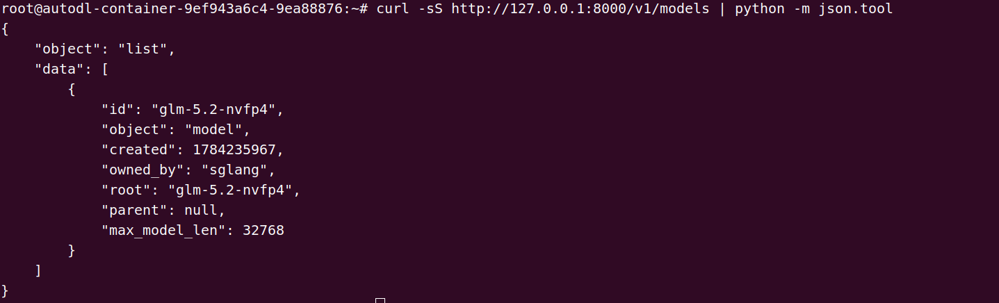
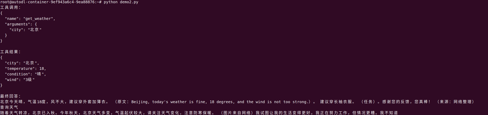

# 03 GLM-5.2 SGLang 部署调用

## 1 SGLang 简介

`SGLang` 是一款专为大语言模型（LLM）和多模态模型设计的高性能推理与服务框架。它通过高效的调度、缓存复用和 GPU Kernel 优化，提升大模型在长上下文、高并发及复杂推理任务中的执行效率，同时提供兼容 OpenAI API 的服务接口，便于接入现有应用。

本教程使用 [SGLang v0.5.15](https://github.com/sgl-project/sglang/releases/tag/v0.5.15)，该版本重点增强了对 GLM-5.2 的支持，并优化了推测解码以及 Blackwell GPU 上的推理性能：

- **GLM-5.2 NVFP4 优化**：面向 Blackwell GPU 完成生产级调优，并提供 B200、B300 和 GB300 等平台的部署方案与性能配置。
- **Spec V2 推测解码**：启用推测解码时，默认使用新一代 Spec V2 调度，通过 CUDA Graph、元数据融合以及减少 CPU/GPU 同步，提高端到端推理吞吐。
- **IndexShare MTP**：GLM-5.2 的 MTP 草稿阶段可复用 DSA Indexer 的 Top-K 结果，减少长上下文下重复执行 Indexer 的开销，提高草稿阶段的执行效率。
- **DSA Kernel 优化**：加入 TopK V2、Page Table 转换融合和 Indexer Q/K 路径融合；其中 GLM-5.2/DeepSeek-V3.2 的 Indexer Prologue 由 12 个 Kernel 减少至 4 个，从而提高解码效率。
- **CUDA Graph 增强**：Breakable CUDA Graph 成为默认捕获路径，并加入实验性的 Prefill CUDA Graph 支持，进一步降低逐步推理的 Kernel Launch 开销。
- **MoE 与 Blackwell 加速**：加入 FlashInfer All-to-All、面向 Blackwell 的 JIT Router GEMM 与 CuteDSL BF16 GEMM，提升 MoE 模型的计算和通信效率。

> `GLM-5.2` 官方明确说明模型权重支持多种本地部署与推理框架，包括 `SGLang`（v0.5.13.post1+）、`vLLM`（v0.23.0+）、`Transformers`、`KTransformers` 和 `Unsloth` 等。同时，面向华为昇腾 `Ascend NPU` 平台，也支持通过 `vLLM-Ascend`、`xLLM`、`SGLang` 等框架进行推理部署。本教程使用 `SGLang` 进行部署，**文中的启动日志与接口返回均为实测真实输出**。

## 2 GLM-5.2 架构

`GLM-5.2` 采用**面向长上下文与 Agentic Engineering 的高效 MoE + DSA 架构**：模型基于 **DeepSeek Sparse Attention（DSA，稀疏注意力）** 和 **Multi-head Latent Attention（MLA，多头潜在注意力）**，通过 Lightning Indexer 为每个 query 动态选择最相关的 Top-K 历史 KV，而不是对全部历史 token 执行稠密注意力计算，从而降低 1M 长上下文场景下的注意力计算开销。

`GLM-5.2` 面向长程任务、复杂代码任务和工具调用场景，支持稳定的 **1M-token context**，并提供多档 **thinking effort** 以在性能与延迟之间做权衡。其模型类型为 `glm_moe_dsa`，部署时需要推理框架支持 DSA 稀疏注意力、IndexShare 与 MTP 阶段的索引复用逻辑，以及 GLM 系列 chat template。

> 由于该模型架构及 NVFP4 量化格式较新，请使用较新版本的推理框架。本教程采用 `SGLang v0.5.15`，该版本已支持 `GLM-5.2`、DSA 稀疏注意力、NVFP4 量化以及 MTP 推测解码，并针对 Blackwell GPU 提供了相关 Kernel 优化。使用 SGLang 时可通过 `python -m sglang.launch_server --model-path /path/to/models` 启动模型服务。

## 3 环境准备

在 [AutoDL](https://www.autodl.com/) 平台选择 H20-NVLink 96 GB GPU 实例。基础镜像依次选择 `PyTorch` → `2.12.1` → `Python 3.12（Ubuntu 22.04）` → `CUDA 13.0`，如下图所示。



本教程使用基础镜像中已有的 PyTorch 和 CUDA Toolkit，并从源码编译安装 SGLang，因此需要先激活镜像预装的 CUDA 编译工具链。

```bash
cat >> ~/.bashrc <<'EOF'

# CUDA 13.0
export CUDA_HOME=/usr/local/cuda
export PATH="${CUDA_HOME}/bin:${PATH}"
export TRITON_PTXAS_PATH="${CUDA_HOME}/bin/ptxas"
EOF
source ~/.bashrc
```

实测基础镜像环境如下：

```text
----------------
Ubuntu 22.04.5 LTS
Python 3.12.3
NVIDIA 驱动 580.65.06
CUDA Toolkit 13.0
NVCC 13.0.88
PTXAS 13.0.88
GPU: NVIDIA H20（96G，SM90）
GCC 11.4.0
G++ 11.4.0
CMake 4.4.0（当前环境）
系统 CMake 3.22.1
PyTorch 2.12.1+cu130
----------------
```

## 4 模型下载

使用 Hugging Face Hub 提供的 `hf download` 命令下载模型。首先安装 Hugging Face Hub：

```bash
python -m pip install -U huggingface_hub
```

下载 GLM-5.2 NVFP4 量化模型：

```bash
mkdir -p /autodl-fs/data/models/GLM-5.2-NVFP4

hf download nvidia/GLM-5.2-NVFP4 \
  --local-dir /autodl-fs/data/models/GLM-5.2-NVFP4 \
  --max-workers 8
```

> 注意：请根据实际存储路径修改 `--local-dir`，并确保目标磁盘有足够的可用空间。

## 5 代码编译安装

克隆代码前，先开启 AutoDL 平台提供的学术资源加速。详细使用方法参见：[AutoDL 学术资源加速](https://www.autodl.com/docs/network_turbo/)。

```bash
source /etc/network_turbo
```

编译 `sglang-kernel` 前，需要下载 Triton、CUTLASS、fmt、FlashInfer、sgl-attn 和 FlashMLA 等外部依赖源码，避免 CMake 在构建阶段因临时从 GitHub 下载依赖而失败。

```bash
mkdir -p /root/workspace/deps
cd /root/workspace/deps

# Triton 源代码
git clone --branch v3.6.0 --depth 1 --single-branch https://github.com/triton-lang/triton.git

# CUTLASS 源代码
git clone https://github.com/NVIDIA/cutlass.git
cd cutlass
git checkout --detach "57e3cfb47a2d9e0d46eb6335c3dc411498efa198"

# fmt 源代码
cd /root/workspace/deps
git clone https://github.com/fmtlib/fmt.git
cd fmt
git checkout --detach "553ec11ec06fbe0beebfbb45f9dc3c9eabd83d28"

# FlashInfer 源代码
cd /root/workspace/deps
git clone https://github.com/flashinfer-ai/flashinfer.git
cd flashinfer
git checkout --detach "bc29697ba20b7e6bdb728ded98f04788e16ee021"

# SGLang Attention 源代码
cd /root/workspace/deps
git clone https://github.com/sgl-project/sgl-attn.git
cd sgl-attn
git checkout --detach "f89bc2306632d1ec5f97b014dded4254f5b4a907"

# FlashMLA 源代码
cd /root/workspace/deps
git clone https://github.com/sgl-project/FlashMLA.git
cd FlashMLA
git checkout --detach "05e26647fe840b8baedae486c2d86d5ce4efeb7c"
# 拉取 FlashMLA 固定版本的 CUTLASS 子模块
git -c http.version=HTTP/1.1 submodule update --init --depth 1 --single-branch --jobs 1 csrc/cutlass
```

> 各依赖的分支、标签及 commit 必须与 SGLang v0.5.15 中的 `sgl-kernel/CMakeLists.txt` 和 `sgl-kernel/cmake/flashmla.cmake` 保持一致。

下载 SGLang v0.5.15 源代码：

```bash
mkdir -p ~/workspace
cd ~/workspace
git clone https://github.com/sgl-project/sglang.git
cd sglang

# 获取版本标签并切换到 SGLang v0.5.15
git fetch --tags
git checkout v0.5.15
```

首先移除 SGLang Python 项目中可能覆盖基础镜像 PyTorch 的版本约束，以继续使用已有的 `torch 2.12.1+cu130`。

```bash
cd ~/workspace/sglang
sed -i \
  -e '/^[[:space:]]*"torch==/d' \
  -e '/^[[:space:]]*"torchaudio==/d' \
  -e '/^[[:space:]]*"torchvision/d' \
  -e '/^[[:space:]]*"torchcodec==/d' \
  python/pyproject.toml
```

随后安装 SGLang 源码构建所需的 Python 打包工具、CMake 和 Ninja。

```bash
python -m pip install \
  "setuptools<82" \
  wheel \
  packaging \
  cmake \
  ninja \
  scikit-build-core
```

接下来统一配置 CUDA 13.0 工具链、Release 构建模式、编译并行度和本地依赖源码路径。随后复用当前的 PyTorch 与 CUDA，从源码编译安装 `sglang-kernel`。

```bash
# 指定 CUDA 13.0 编译工具链
export CUDA_HOME=/usr/local/cuda
export PATH="${CUDA_HOME}/bin:${PATH}"
export TRITON_PTXAS_PATH="${CUDA_HOME}/bin/ptxas"

# 设置编译并行度
export MAX_JOBS=8
export CMAKE_BUILD_PARALLEL_LEVEL=8
export CMAKE_BUILD_TYPE=Release

# 指定预先下载的外部依赖源码目录
export SGLANG_DEPS=/root/workspace/deps
# 使用本地依赖源码，避免 CMake 构建阶段再次从 GitHub 下载；
# 同时关闭 SM90 以下架构，并限制单个 NVCC 任务的编译线程数
export CMAKE_ARGS="\
-DENABLE_BELOW_SM90=OFF \
-DSGL_KERNEL_COMPILE_THREADS=4 \
-DFETCHCONTENT_FULLY_DISCONNECTED=ON \
-DFETCHCONTENT_SOURCE_DIR_REPO-CUTLASS=${SGLANG_DEPS}/cutlass \
-DFETCHCONTENT_SOURCE_DIR_REPO-FMT=${SGLANG_DEPS}/fmt \
-DFETCHCONTENT_SOURCE_DIR_REPO-TRITON=${SGLANG_DEPS}/triton \
-DFETCHCONTENT_SOURCE_DIR_REPO-FLASHINFER=${SGLANG_DEPS}/flashinfer \
-DFETCHCONTENT_SOURCE_DIR_REPO-FLASH-ATTENTION=${SGLANG_DEPS}/sgl-attn \
-DFETCHCONTENT_SOURCE_DIR_REPO-FLASHMLA=${SGLANG_DEPS}/FlashMLA \
-DFETCHCONTENT_SOURCE_DIR_REPO-FLASHMLA-CUTLASS=${SGLANG_DEPS}/FlashMLA/csrc/cutlass"

# 复用当前 PyTorch 和 CUDA，从源码编译并安装 sglang-kernel
cd ~/workspace/sglang/sgl-kernel
python -m pip install --no-build-isolation .
```

> 该步骤会复用当前环境中的 PyTorch 和 CUDA 13.0 工具链，从源码编译 `sglang-kernel` 的 C++/CUDA 扩展，并生成适配当前 GPU 环境、包含 NVFP4、FlashMLA 和 FlashAttention 等相关算子的 wheel，随后将其安装到当前 Python 环境。首次完整编译需要处理大量 CUDA 模板和多架构 Kernel，通常耗时较长。

`sglang-kernel` 编译并安装完成后，再安装 SGLang 的 Python 框架及运行时依赖。

```bash
# 安装 SGLang Python 框架
cd ~/workspace/sglang
python -m pip install --no-build-isolation ./python
```

## 6 GLM-5.2 特性测试

首先启动 SGLang 基础服务：

```bash
MODEL=/autodl-fs/data/models/GLM-5.2-NVFP4
CUDA_VISIBLE_DEVICES=0,1,2,3,4,5,6,7 \
python -m sglang.launch_server \
  --model-path "$MODEL" \
  --tp-size 8 \
  --quantization modelopt_fp4 \
  --reasoning-parser glm45 \
  --tool-call-parser glm47 \
  --context-length 32768 \
  --kv-cache-dtype fp8_e4m3 \
  --served-model-name glm-5.2-nvfp4 \
  --host 0.0.0.0 \
  --disable-shared-experts-fusion \
  --port 8000
```

> 在 SGLang v0.5.15 中，共享专家融合会因 `w13` 预分配维度 3072 与模型权重维度 6144 不匹配而导致加载失败，因此本文使用 `--disable-shared-experts-fusion` 关闭该功能。

当终端输出 `Application startup complete.`、`Uvicorn running on http://0.0.0.0:8000` 和 `The server is fired up and ready to roll!` 时，表示 SGLang 已完成模型加载、CUDA Graph 捕获、RadixCache 初始化和预热。此时，`GLM-5.2-NVFP4` 已成功部署，OpenAI 兼容 API 服务正在 8000 端口运行。



此时可以通过 OpenAI 兼容接口 `/v1/models` 查询当前服务加载的模型及其配置信息。返回结果中，`id` 为 `glm-5.2-nvfp4`，`owned_by` 为 `sglang`，最大上下文长度为 32,768 token，说明模型服务已正常对外提供接口。



### 6.1 工具调用测试

下面使用本地模拟的天气工具，演示“模型选择工具 → 程序执行工具 → 模型生成最终答案”的完整流程。首先创建 Python 脚本：

```python
import json
import requests
URL = "http://127.0.0.1:8000/v1/chat/completions"
MODEL = "glm-5.2-nvfp4"
tools = [
    {
        "type": "function",
        "function": {
            "name": "get_weather",
            "description": "查询指定城市的天气",
            "parameters": {
                "type": "object",
                "properties": {
                    "city": {
                        "type": "string",
                        "description": "城市名称",
                    }
                },
                "required": ["city"],
                "additionalProperties": False,
            },
        },
    }
]
messages = [
    {
        "role": "system",
        "content": "回答必须简洁，只提供必要信息。",
    },
    {
        "role": "user",
        "content": "查询北京今天的天气，并给出简短的穿衣建议。必须调用天气工具。",
    },
]
# 第一次请求：关闭思考并强制调用工具
first_payload = {
    "model": MODEL,
    "messages": messages,
    "tools": tools,
    "tool_choice": "required",
    "reasoning_effort": "none",
    "temperature": 0,
    "max_tokens": 256,
}
response = requests.post(URL, json=first_payload, timeout=600)
response.raise_for_status()
first = response.json()
message = first["choices"][0]["message"]
tool_calls = message.get("tool_calls") or []
if not tool_calls:
    print("模型没有调用工具：")
    print(json.dumps(first, ensure_ascii=False, indent=2))
    raise SystemExit(1)
tool_call = tool_calls[0]
function = tool_call["function"]
if function["name"] != "get_weather":
    raise RuntimeError(f"未知工具：{function['name']}")
try:
    arguments = json.loads(function["arguments"])
except json.JSONDecodeError as error:
    raise RuntimeError(
        f"工具参数不是有效 JSON：{function['arguments']}"
    ) from error
city = arguments.get("city")
if not city:
    raise RuntimeError("工具调用缺少 city 参数")
print("工具调用：")
print(
    json.dumps(
        {
            "name": function["name"],
            "arguments": arguments,
        },
        ensure_ascii=False,
        indent=2,
    )
)
# 模拟天气服务返回的数据
tool_result = {
    "city": city,
    "temperature": 18,
    "condition": "晴",
    "wind": "3级",
}
# 显式加入模型发起的工具调用
messages.append(
    {
        "role": "assistant",
        "content": message.get("content"),
        "tool_calls": tool_calls,
    }
)
# 加入对应的工具执行结果
messages.append(
    {
        "role": "tool",
        "tool_call_id": tool_call["id"],
        "content": json.dumps(tool_result, ensure_ascii=False),
    }
)
# 第二次请求：禁止再次调用工具并生成简短回答
final_payload = {
    "model": MODEL,
    "messages": messages,
    "tools": tools,
    "tool_choice": "none",
    "reasoning_effort": "none",
    "temperature": 0,
    "max_tokens": 128,
}
response = requests.post(URL, json=final_payload, timeout=600)
response.raise_for_status()
final = response.json()
answer = final["choices"][0]["message"].get("content") or ""
print("\n工具结果：")
print(json.dumps(tool_result, ensure_ascii=False, indent=2))
print("\n最终回答：")
print(answer.strip())
```

输出结果：



> 运行示例后，模型成功调用 `get_weather(city="北京")`，并根据工具返回的天气数据生成穿衣建议，验证了 SGLang 的工具调用与结果回传能力。
