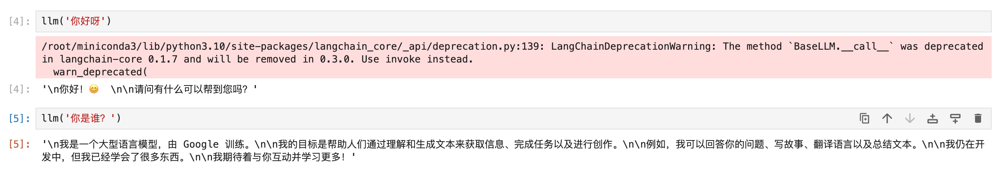

# 02-Gemma-2-9b-it langchain 接入 

## 环境准备

在 Autodl 平台中租赁一个 RTX 3090/24G 显存的显卡机器。如下图所示，镜像选择 PyTorch-->2.1.0-->3.10(ubuntu22.04)-->12.1。


然后打开其中的终端，开始环境配置、模型下载和运行演示。  

## 环境配置

pip 换源加速下载并安装依赖包

```shell
# 升级pip
python -m pip install --upgrade pip

# 更换 pypi 源加速库的安装
pip config set global.index-url https://pypi.tuna.tsinghua.edu.cn/simple

# 安装 langchain modelscope
pip install langchain==0.2.6
pip install modelscope
```  

> 考虑到部分同学配置环境可能会遇到一些问题，我们在AutoDL平台准备了Gemma2 的环境镜像，该镜像适用于该仓库的 Gemma2 教程所有部署环境。点击下方链接并直接创建Autodl示例即可。
> ***https://www.codewithgpu.com/i/datawhalechina/self-llm/self-llm-gemma2***


## 模型下载  

使用 modelscope 中的 snapshot_download 函数下载模型，第一个参数为模型名称，参数 cache_dir 为模型的下载路径。

然后运行下面代码，执行模型下载。模型大小为 18GB左右，下载大概需要 5 分钟。

```python
from modelscope import snapshot_download
model_dir = snapshot_download('LLM-Research/gemma-2-9b-it', cache_dir='/root/autodl-tmp')
```

## 代码准备

为便捷构建 LLM 应用，我们需要基于本地部署的 Gemma2，自定义一个 LLM 类，将 Gemma2 接入到 LangChain 框架中。

完成自定义 LLM 类之后，可以以完全一致的方式调用 LangChain 的接口，而无需考虑底层模型调用的不一致。

基于本地部署的 Gemma2 自定义 LLM 类并不复杂，我们只需从 LangChain.llms.base.LLM 类继承一个子类，并重写构造函数与 _call 函数即可：

```python
from langchain.llms.base import LLM
from typing import Any, List, Optional
from langchain.callbacks.manager import CallbackManagerForLLMRun
from transformers import AutoTokenizer, AutoModelForCausalLM
import torch

class Gemma2_LLM(LLM):
    # 基于本地 Gemma2 自定义 LLM 类
    tokenizer: AutoTokenizer = None
    model: AutoModelForCausalLM = None

    def __init__(self, mode_name_or_path :str):
        super().__init__()

        # 加载预训练的分词器和模型
        print("Creat tokenizer...")
        self.tokenizer = AutoTokenizer.from_pretrained(mode_name_or_path)

        print("Creat model...")
        self.model = AutoModelForCausalLM.from_pretrained(mode_name_or_path, device_map="cuda",torch_dtype=torch.bfloat16,)

    def _call(self, prompt : str, stop: Optional[List[str]] = None,
                run_manager: Optional[CallbackManagerForLLMRun] = None,
                **kwargs: Any):

        # 调用模型进行对话生成
        chat = [
            { "role": "user", "content": prompt },
        ]
        prompt = self.tokenizer.apply_chat_template(chat, tokenize=False, add_generation_prompt=True)
        inputs = self.tokenizer.encode(prompt, add_special_tokens=False, return_tensors="pt")
        outputs = self.model.generate(input_ids=inputs.to(self.model.device), max_new_tokens=150)
        outputs = self.tokenizer.decode(outputs[0])
        response = outputs.split('model')[-1].replace('<end_of_turn>\n<eos>', '')

        return response

    @property
    def _llm_type(self) -> str:
        return "Gemma2_LLM"
```

在上述类定义中，我们分别重写了构造函数和 _call 函数：对于构造函数，我们在对象实例化的一开始加载本地部署的 Gemma2 模型，从而避免每一次调用都需要重新加载模型带来的时间过长；_call 函数是 LLM 类的核心函数，LangChain 会调用该函数来调用 LLM，在该函数中，我们调用已实例化模型的 generate 方法，从而实现对模型的调用并返回调用结果。

在整体项目中，我们将上述代码封装为 LLM.py，后续将直接从该文件中引入自定义的 LLM 类。


## 调用

然后就可以像使用任何其他的langchain大模型功能一样使用了。

```python
from LLM import Gemma2_LLM
llm = Gemma2_LLM('/root/autodl-tmp/LLM-Research/gemma-2-9b-it')
print(llm("你是谁"))
```

