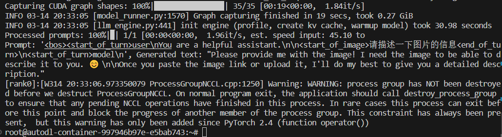
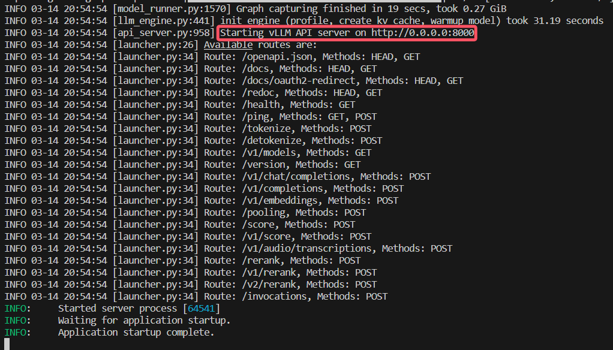
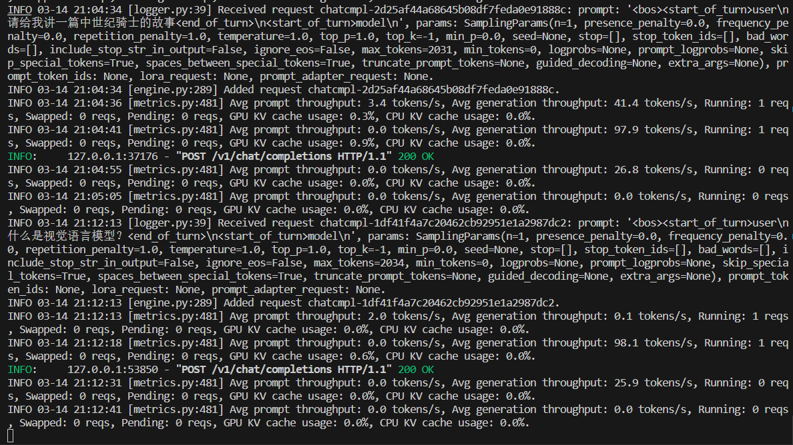

# 02-Gemma3-4b vLLM 部署调用

## **vLLM 简介**

`vLLM` 框架是一个高效的大语言模型**推理和部署服务系统**，具备以下特性：

- **高效的内存管理**：通过 `PagedAttention` 算法，`vLLM` 实现了对 `KV` 缓存的高效管理，减少了内存浪费，优化了模型的运行效率。
- **高吞吐量**：`vLLM` 支持异步处理和连续批处理请求，显著提高了模型推理的吞吐量，加速了文本生成和处理速度。
- **易用性**：`vLLM` 与 `HuggingFace` 模型无缝集成，支持多种流行的大型语言模型，简化了模型部署和推理的过程。兼容 `OpenAI` 的 `API` 服务器。
- **分布式推理**：框架支持在多 `GPU` 环境中进行分布式推理，通过模型并行策略和高效的数据通信，提升了处理大型模型的能力。
- **开源共享**：`vLLM` 由于其开源的属性，拥有活跃的社区支持，这也便于开发者贡献和改进，共同推动技术发展。


## 环境准备  

本文基础环境如下：

```
----------------
ubuntu 22.04
python 3.12
Cuda  12.4
PyTorch  2.5.1
----------------
```

> 本文默认学习者已配置好以上 `Pytorch (cuda)` 环境，如未配置请先自行安装。

首先 `pip` 换源加速下载并安装依赖包

```bash
python -m pip install --upgrade pip
pip config set global.index-url https://pypi.tuna.tsinghua.edu.cn/simple

pip install modelscope==1.23.2
pip install openai==1.66.3
pip install tqdm==4.66.2
pip install git+https://github.com/huggingface/transformers.git
pip install git+https://github.com/vllm-project/vllm.git
pip install ninja==1.11.1.3
MAX_JOBS=8 pip install flash-attn --no-build-isolation
```
> 注意：flash-attn 安装会比较慢，大概需要十几分钟。如果报错可以去flash-attn的官方github下载与torch版本对应的whl包，然后使用`pip install <whl包路径>`安装。
> flash-attn仅支持 Ampere, Ada, or Hopper GPUs (e.g., A100, RTX 3090, RTX 4090, H100)
> 考虑到部分同学配置环境可能会遇到一些问题，我们在 AutoDL 平台准备了 Gemma3-4b 的环境镜像，点击下方链接并直接创建 Autodl 示例即可。


## 模型下载

使用 modelscope 中的 snapshot_download 函数下载模型，第一个参数为模型名称，参数 cache_dir 为模型的下载路径。

新建 `model_download.py` 文件并在其中输入以下内容，粘贴代码后记得保存文件。

```python
from modelscope import snapshot_download

model_dir = snapshot_download('LLM-Research/gemma-3-4b-it', cache_dir='/root/autodl-tmp', revision='master')
```

然后在终端中输入 `python model_download.py` 执行下载，这里需要耐心等待一段时间直到模型下载完成。

> 注意：记得修改 `cache_dir` 为你的模型下载路径哦~


## **代码准备**

### **Python脚本**

新建 `vllm_model.py` 文件并在其中输入以下内容，粘贴代码后请及时保存文件。下面的代码有很详细的注释，如有不理解的地方，欢迎大家提 `issue`。

首先从 `vLLM` 库中导入 `LLM` 和 `SamplingParams` 类。`LLM` 类是使用 `vLLM` 引擎运行离线推理的主要类。`SamplingParams` 类指定采样过程的参数，用于控制和调整生成文本的随机性和多样性。

`vLLM` 提供了非常方便的封装，我们直接传入模型名称或模型路径即可，不必手动初始化模型和分词器。

我们可以通过这个代码示例熟悉下 ` vLLM` 引擎的使用方式。被注释的部分内容可以丰富模型的能力，但不是必要的，大家可以按需选择，自己多多动手尝试 ~

```python
# vllm_model.py
from vllm.entrypoints.llm import LLM
from vllm.sampling_params import SamplingParams
from transformers import AutoTokenizer,AutoProcessor
import os
import json

# 自动下载模型时，指定使用modelscope; 否则，会从HuggingFace下载
os.environ['VLLM_USE_MODELSCOPE']='True'

def get_completion(prompts, model, tokenizer=None, max_tokens=512, temperature=0.8, top_p=0.95, max_model_len=2048):
    stop_token_ids = [151329, 151336, 151338]
    # 创建采样参数。temperature 控制生成文本的多样性，top_p 控制核心采样的概率
    sampling_params = SamplingParams(temperature=temperature, top_p=top_p, max_tokens=max_tokens, stop_token_ids=stop_token_ids)
    # 初始化 vLLM 推理引擎
    llm = LLM(model=model, tokenizer=tokenizer, max_model_len=max_model_len,trust_remote_code=True)
    outputs = llm.generate(prompts, sampling_params)
    return outputs


if __name__ == "__main__":    
    # 初始化 vLLM 推理引擎
    model='/root/autodl-tmp/LLM-Research/gemma-3-4b-it' # 指定模型路径
    tokenizer = None
    # 加载分词器后传入vLLM 模型，但不是必要的。
    # tokenizer = AutoTokenizer.from_pretrained(model, use_fast=False) 
    processor = AutoProcessor.from_pretrained(model)
    
    messages = [
    	{"role": "system", "content": [{"type": "text", "text": "You are a helpful assistant."}]
      },
    	{"role": "user", "content": [
        {"type": "image", 
         "url": "https://help-static-aliyun-doc.aliyuncs.com/file-manage-files/zh-CN/20241022/emyrja/dog_and_girl.jpeg"
        },
        {"type": "text", "text": "请描述一下图片的信息"}
    	]
      }
    ]

    prompt = processor.apply_chat_template(
      messages,
      tokenize=False,
      add_generation_prompt=True,
		)

    outputs = get_completion(prompt, model, tokenizer=tokenizer, max_tokens=512, temperature=1, top_p=1, max_model_len=2048)

    # 输出是一个包含 prompt、生成文本和其他信息的 RequestOutput 对象列表。
    # 打印输出。
    for output in outputs:
        prompt = output.prompt
        generated_text = output.outputs[0].text
        print(f"Prompt: {prompt!r}, Generated text: {generated_text!r}")
```
运行代码

```bash
python vllm_model.py
```

结果如下：

```bash
Prompt: '<bos><start_of_turn>user\nYou are a helpful assistant.\n\n<start_of_image>请描述一下图片的信息<end_of_turn>\n<start_of_turn>model\n', Generated text: "Please provide me with the image! I need the image to be able to describe it to you. 😊 \n\nOnce you paste the image link or upload it, I'll do my best to give you a detailed description."
```



### 创建兼容 OpenAI API 接口的服务器

`Gemma3-4b` 兼容 `OpenAI API` 协议，所以我们可以直接使用 `vLLM` 创建 `OpenAI API` 服务器。`vLLM` 部署实现 `OpenAI API` 协议的服务器非常方便。默认会在 http://localhost:8000 启动服务器。服务器当前一次托管一个模型，并实现列表模型、`completions` 和 `chat completions` 端口。

- `completions`：是基本的文本生成任务，模型会在给定的提示后生成一段文本。这种类型的任务通常用于生成文章、故事、邮件等。
- `chat completions`：是面向对话的任务，模型需要理解和生成对话。这种类型的任务通常用于构建聊天机器人或者对话系统。

在创建服务器时，我们可以指定模型名称、模型路径、聊天模板等参数。

- `--host` 和 `--port` 参数指定地址。
- `--model` 参数指定模型名称。
- `--chat-template` 参数指定聊天模板。
- `--served-model-name` 指定服务模型的名称。
- `--max-model-len` 指定模型的最大长度。

```bash
python -m vllm.entrypoints.openai.api_server \
  --model /root/autodl-tmp/LLM-Research/gemma-3-4b-it \
  --served-model-name Gemma3-4b \
  --max-model-len=2048
```

加载完毕后出现如下信息说明服务成功启动


- 通过 `curl` 命令查看当前的模型列表

```bash
curl http://localhost:8000/v1/models
```

​	得到的返回值如下所示

```json
{
  "object": "list",
  "data": [
    {
      "id": "Gemma3-4b",
      "object": "model",
      "created": 1741957023,
      "owned_by": "vllm",
      "root": "/root/autodl-tmp/LLM-Research/gemma-3-4b-it",
      "parent": null,
      "max_model_len": 2048,
      "permission": [
        {
          "id": "modelperm-ef591a5bea2a4b3e895c73e5854519fb",
          "object": "model_permission",
          "created": 1741957023,
          "allow_create_engine": false,
          "allow_sampling": true,
          "allow_logprobs": true,
          "allow_search_indices": false,
          "allow_view": true,
          "allow_fine_tuning": false,
          "organization": "*",
          "group": null,
          "is_blocking": false
        }
      ]
    }
  ]
}
```

- 使用 `curl` 命令测试 `OpenAI Completions API` 


```bash
curl http://localhost:8000/v1/completions \
    -H "Content-Type: application/json" \
    -d '{
        "model": "Gemma3-4b",
        "prompt": "你可以做什么，可以给我讲个童话故事吗？",
        "max_tokens": 1024,
        "temperature": 0
    }'
```

​	得到的返回值如下所示

```json
{
  "id": "cmpl-0059f10623ab43ae87c33d95f642f64c",
  "object": "text_completion",
  "created": 1741957169,
  "model": "Gemma3-4b",
  "choices": [
    {
      "index": 0,
      "text": "\n\n当然可以！你想听什么类型的童话故事呢？\n\n*   **经典童话？** 比如《灰姑娘》、《白雪公主》？\n*   **现代童话？** 比如关于友谊、勇气、或者梦想的故事？\n*   **特别的童话？** 比如关于动物、魔法、或者冒险的故事？\n\n或者，如果你没有特别的想法，我可以随机讲一个。 你想让我怎么做呢？\n",
      "logprobs": null,
      "finish_reason": "stop",
      "stop_reason": 106,
      "prompt_logprobs": null
    }
  ],
  "usage": {
    "prompt_tokens": 13,
    "total_tokens": 110,
    "completion_tokens": 97,
    "prompt_tokens_details": null
  }
}
```

- 用 `Python` 脚本请求 `OpenAI Completions API` 


```python
# vllm_openai_completions.py
from openai import OpenAI
client = OpenAI(
    base_url="http://localhost:8000/v1",
    api_key="sk-xxx", # 随便填写，只是为了通过接口参数校验
)

completion = client.chat.completions.create(
  model="Gemma3-4b",
  messages=[
    {"role": "user", "content": "随机给我讲一篇安徒生童话"}
  ]
)

print(completion.choices[0].message)
```

```shell
python vllm_openai_completions.py
```

​	得到的返回值如下所示

```
ChatCompletionMessage(content='好，为你讲一个安徒生的《豌豆公主》。\n\n很久很久以前，在一座繁华的城市里，住着一位富有的国王。他有一个漂亮的王后，王后怀着五阿哥的孩子，生下了一个小公主，她皮肤像雪，眼睛像天空，长发如瀑布，美丽极了。国王和王后为了这小公主，倾尽所有，给她穿上最华丽的衣服，给她养育得高贵无比。\n\n公主长大了，年纪也大了，王后决定为她找个丈夫。于是，她把公主的容貌描绘得像一颗美丽的豌豆一样，然后把这颗豌豆放在一个漂亮的匣子里，派人四处寻找一位能爱上这颗豌豆的人。\n\n一位年轻的王子，在一次旅行中，听说有这样一颗神奇的豌豆，他迫不及待地赶回家，请求王后把豌豆给他。王后很高兴，把豌豆交给了王子。\n\n王子把豌豆带回了自己家里，他每天都看着那颗豌豆，细心呵护，想象着它的美丽。起初他只是觉得这颗豌豆很漂亮，但随着时间的推移，他开始爱上了这颗豌豆。他为它唱诗歌，为它浇水，为它编故事，并且坚信这颗豌豆爱着他。\n\n几个月过去了，王子终于决定去王宫拜访王后，向她求婚。王后很高兴，她知道王子爱上了她的公主。她将匣子打开，展示了那颗美丽的豌豆。\n\n王子看着豌豆，突然大哭起来：“我爱上这颗豌豆，我愿意娶它为我的妻子！”\n\n王后高兴极了，立刻答应了王子。\n\n婚后，王子和豌豆公主生活在一起。豌豆公主虽然美丽，却沉默寡言，并且非常冷酷。她只有在王子爱她的时候才会露出笑容。\n\n一天，王后提议让豌豆公主去城里走走，体验生活。豌豆公主答应了，她穿着华丽的衣服，被卫兵珍重地护送着。\n\n她来到一间面包店，想买些面包吃。面包师娘向她热情地招呼，准备给她做些美味的糕点。但豌豆公主却冷冷地拒绝了，她说：“我不需要面包，我只想要坐下来休息一下。”\n\n这时，一位年轻的农夫走进了面包店。他穿着朴素的衣服，却有着善良和友善的笑容。他看到豌豆公主被拒绝，便走了过去，问她是否需要帮助。\n\n豌豆公主被农夫的真诚所打动，她和农夫聊了起来，一起采摘野花，一起看夕阳。她第一次感受到了真正的快乐和温暖。\n\n然而，当王后得知这些事情后，非常生气。她立刻派卫兵把豌豆公主抓回了王宫。\n\n当豌豆公主回到王宫后，她发现自己失去了所有的美丽。她的皮肤变成了灰色的石头，她的眼睛变得呆滞无神，她的头发变成了枯萎的树枝。她变成了一颗普通的豌豆，静静地躺在地上。\n\n王子悲痛欲绝，他每天都来到豌豆公主的面前，轻轻地抚摸着她，等着她恢复原状。\n\n终于，经过漫长的等待，他发现，每当他用真诚的爱去呵护这颗豌豆时，它都会微微地闪耀着光芒。\n\n王子意识到，原来豌豆公主是被他的虚荣心所迷惑，她本性不足，只是上天赐予的容颜美丽而已。他开始用真诚和爱去呵护这颗真正的豌豆，终于，豌豆公主重新恢复了原貌，美丽得更加耀眼了。\n\n王子和豌豆公主幸福地生活在一起，他们明白了，真正的美丽是心灵的闪耀，而真爱是能够融化一切困难的强大力量。\n\n故事讲完了，你喜欢吗？希望你喜欢这个充满温情和哲理的童话故事。\n', refusal=None, role='assistant', annotations=None, audio=None, function_call=None, tool_calls=[], reasoning_content=None)
```

- 用 `curl` 命令测试 `OpenAI Chat Completions API` 


```bash
curl http://localhost:8000/v1/chat/completions \
    -H "Content-Type: application/json" \
    -d '{
        "model": "Gemma3-4b",
        "messages": [
            {"role": "user", "content": "请给我讲一篇中世纪骑士的故事"}
        ]
    }'
```

得到的返回值如下所示

```json
{
  "id": "chatcmpl-2d25af44a68645b08df7feda0e91888c",
  "object": "chat.completion",
  "created": 1741957474,
  "model": "Gemma3-4b",
  "choices": [
    {
      "index": 0,
      "message": {
        "role": "assistant",
        "reasoning_content": null,
        "content": "好的，这里有一个关于中世纪骑士的故事，希望能让你沉浸其中：\n\n**雪之誓**\n\n故事发生在鲁西恩王国，一个被永恒的白雪覆盖的山脉环绕的国度。这里骑士们以忠诚和勇气闻名，但也很少有骑士真正能体现这些品质。塞谬尔，一个年轻的骑士，正是一名典型的骑士。他身材高大，武艺精湛，却总是带着一丝冷漠，仿佛早已被世事磨砺殆尽。\n\n塞谬尔受命前往黑森林，务必将一头被怪物掳走的少女，莉拉，带回王都。黑森林狼藉且危险，那里居住着古老的恶灵和饥饿的野兽。塞谬尔带着他的战马星尘，以及一把名为“霜刃”的长剑，踏入了这片幽暗之地。\n\n在森林的深处，他遇到了一个佝偻的老巫女，她住在一个由苔藓和树根堆砌的小屋里。老巫女名叫玛格丽特，她的眼睛闪烁着古老的智慧。她告诉塞谬尔，莉拉是被一个名为“灰爪”的恶龙掳走的，它居住在森林深处的冰峰上，那里积雪永远不会融化。\n\n“灰爪并非单纯的残暴，”玛格丽特说，“它是被诅咒的。它曾经是一个纯洁的龙，但被一位嫉妒它的巫师施下了黑暗的诅咒，变得邪恶而孤独。”\n\n她还告诉塞谬尔，莉拉并非毫无用处。她拥有着一个古老的圣徽，能够解除灰爪的诅咒，但只有在真爱之下，才能发挥出它的力量。\n\n塞谬尔心怀怀疑。他曾经见过太多残酷的战争和背叛，对爱情和神话故事嗤之以鼻。但他明白，任务的成功取决于他，所以他决定按照玛格丽特的指示行动。\n\n星尘拖着他穿梭在冰雪之中，森林的寒风刺骨。他与野兽搏斗，躲避陷阱，逐渐接近冰峰。终于，他站在灰爪的巢穴前。\n\n灰爪庞大而恐怖，它的鳞片闪烁着冰冷的银色，它的眼睛燃烧着贪婪的火焰。莉拉被囚禁在一个冰雪雕塑中，她脸色苍白，但眼神中却闪烁着坚毅的光芒。\n\n塞谬尔毫不犹豫地冲了上去，他挥舞着霜刃，与灰爪展开了激烈的战斗。灰爪的力量强大无比，每一次撞击都足以摧毁石墙。塞谬尔凭借着自己的剑术和敏捷，与它周旋，却难以得逞。\n\n就在他即将败下阵来的时候，他看到莉拉朝他大声呼唤：“塞谬尔！用圣徽！”\n\n他突然明白，玛格丽特所说的“真爱”并非指浪漫的爱情，而是指对对方的坚定守护和怜悯。他意识到，他并非只是为了完成任务而战，而是为了拯救莉拉，拯救一个被诅咒的生物。\n\n他用尽全力，将灰爪的注意力吸引到自己身上，然后飞快地从腰间拔出圣徽，对准了灰爪的眼睛。圣徽的光芒闪烁着，笼罩着整个巢穴。\n\n灰爪发出一声痛苦的嚎叫，它那冰冷的鳞片开始融化，黑暗的诅咒逐渐消散。它缓缓地低下头，凝视着莉拉，眼中充满了悔恨和悲伤。\n\n莉拉毫不犹豫地走到灰爪面前，将圣徽贴在了它的额头上。灰爪的身体开始颤抖，随后化作一缕蓝色的烟雾，消失在空中。\n\n塞谬尔和莉拉被星尘带回了王都。国王对塞谬尔的勇敢和智慧赞赏有加，莉拉也因为她的善良和勇气而受到尊敬。\n\n但塞谬尔并没有因此而沾沾自喜。他望着莉拉，心中涌起一种前所未有的感觉。他意识到，他已经不再是那个冷漠的骑士，他开始相信爱情和希望，相信即使是最黑暗的灵魂，也能被救赎。\n\n在王都的宴会上，塞谬尔向莉拉求婚。莉拉欣然答应。他们的爱情，就像雪山上的冰雪，纯洁而坚韧，注定能够经受住时间的考验。\n\n**故事的寓意：**\n\n这个故事强调了勇气、忠诚和善良的重要性。它也告诉我们，真正的力量并非来自于武力，而是来自于内心的坚定和对他人真挚的关爱。即使面对黑暗和绝望，只要怀着一颗纯洁的心，就能找到救赎的希望。\n\n希望这个故事能让你满意！ 如果你想听其他类型的骑士故事，或者想让我对这个故事进行修改，请告诉我。",
        "tool_calls": []
      },
      "logprobs": null,
      "finish_reason": "stop",
      "stop_reason": 106
    }
  ],
  "usage": {
    "prompt_tokens": 17,
    "total_tokens": 1085,
    "completion_tokens": 1068,
    "prompt_tokens_details": null
  },
  "prompt_logprobs": null
}
```

- 用 `Python` 脚本请求 `OpenAI Chat Completions API` 


```python
# vllm_openai_chat_completions.py
from openai import OpenAI
openai_api_key = "sk-xxx" # 随便填写，只是为了通过接口参数校验
openai_api_base = "http://localhost:8000/v1"

client = OpenAI(
    api_key=openai_api_key,
    base_url=openai_api_base,
)

chat_outputs = client.chat.completions.create(
    model="Gemma3-4b",
    messages=[
        {"role": "user", "content": "什么是视觉语言模型？"},
    ]
)
print(chat_outputs)
```

```shell
python vllm_openai_chat_completions.py
```

得到的返回值如下所示

```
ChatCompletion(id='chatcmpl-1df41f4a7c20462cb92951e1a2987dc2', choices=[Choice(finish_reason='stop', index=0, logprobs=None, message=ChatCompletionMessage(content='视觉语言模型 (Visual Language Models, VLMs) 是一种人工智能模型，它们可以理解和处理图像和文本之间的关系，并利用两者来生成或回答问题。 简单来说，它们就像能够“看懂”图像并理解其含义的模型，同时还能理解和生成自然语言描述。\n\n以下是对视觉语言模型的更详细解释：\n\n**1. 核心思想：**\n\n* **跨模态学习:** VLMs 的关键在于“跨模态学习”，也就是让模型学习图像和文本之间的联系。传统模型通常专注于单一模态（例如，只处理图像或只处理文本）。\n* **整合视觉和语言知识:** VLM 能够将图像提供的视觉信息 (颜色、形状、物体等) 与文本提供的语言信息 (概念、描述、事实等) 结合起来。\n\n**2. 如何工作：**\n\n* **编码器（Encoder）:** VLMs 通常由两个主要部分组成：\n    * **视觉编码器 (Visual Encoder):** 负责将图像编码成一个向量表示，捕捉图像中的视觉特征。常见的视觉编码器包括：\n        * **Vision Transformer (ViT):** 将图像分成小块，然后像处理文本一样处理这些块。\n        * **CNN (卷积神经网络):** 传统的图像处理模型。\n    * **语言编码器 (Language Encoder):** 负责将文本编码成一个向量表示，捕捉文本的语义信息。例如，BERT、GPT-3等预训练语言模型。\n* **桥梁 (Bridge):**  这是 VLM 的关键组成部分，它负责连接视觉编码器和语言编码器，描述视觉信息和语言信息之间的关系。 常见的桥梁方法包括：\n    * **Cross-Attention:** 允许视觉编码器的输出“关注”语言编码器的输出，反之亦然，从而建立联系。\n    * **Fusion Layers:**  将视觉和语言特征融合在一起。\n* **解码器（Decoder）：**  用于基于整合后的信息生成输出，例如文本描述、答案或图像。\n\n**3. 常见的 VLM 任务：**\n\n* **图像描述生成 (Image Captioning):**  根据图像生成自然语言描述。\n* **视觉问答 (Visual Question Answering, VQA):**  在给定图像和问题的情况下，回答关于图像的问题。\n* **图像字幕生成 (Text-to-Image Captioning):** 根据文本描述生成图像。\n* **视觉常识推理 (Visual Commonsense Reasoning):**  利用图像内容和常识知识来完成推理任务。\n* **视觉逻辑推理 (Visual Logical Reasoning):**  理解图像中的关系，并进行逻辑推理。\n* **视觉对话 (Visual Dialogue):**  与用户进行关于图像内容的多轮对话。\n\n**4. 热门的 VLM 模型：**\n\n* **CLIP (Contrastive Language-Image Pre-Training):** OpenAI 开发的，学习图像和文本之间的对齐。\n* **BLIP (Bootstrapping Language-Image Pre-training):** 通过自监督学习来提高图像-文本对齐效果。\n* **Flamingo:** DeepMind 开发的，能够短时间内学习新的视觉-语言任务。\n* **Stable Diffusion:**  在图像生成领域非常流行，也逐渐具备了理解语言的特征。\n\n**5. 优势：**\n\n* **更强的理解能力:**  能够更好、更全面地理解图像和文本之间的关系。\n* **更自然的交互:** 能够通过自然语言与用户进行交互，例如进行视觉问答或图像描述。\n* **更广泛的应用:**  可以应用到各种领域，例如图像搜索、机器人、内容创作等。\n\n**总而言之，视觉语言模型是人工智能领域的一个重要发展，它代表着图像和文本领域的融合，并为我们理解和与世界交互提供了新的方法。**\n\n希望以上解释能够帮助你理解什么是视觉语言模型。  如果你有任何其他问题，可以随时提问！\n', refusal=None, role='assistant', annotations=None, audio=None, function_call=None, tool_calls=[], reasoning_content=None), stop_reason=106)], created=1741957933, model='Gemma3-4b', object='chat.completion', service_tier=None, system_fingerprint=None, usage=CompletionUsage(completion_tokens=845, prompt_tokens=14, total_tokens=859, completion_tokens_details=None, prompt_tokens_details=None), prompt_logprobs=None)
```

另外，在以上所有的在请求处理过程中， `API` 后端都会打印相对应的日志和统计信息😊
