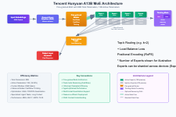

# 01-Hunyuan-A13B-Instruct 模型架构解析 Blog 
## 🚀 **混元 MoE 架构的技术动因**

随着大模型参数规模持续增长，如何在保证计算成本可控的情况下，进一步提升模型容量与表达能力，成为行业关键课题。传统 Transformer 在增加参数的同时，计算量也呈线性增长，训练与推理开销巨大，难以大幅扩展。

为了解决这一问题，**MoE（Mixture of Experts）架构应运而生**。其核心理念是：

* 为每个输入 token 配备多个可选的专家网络（Experts）
* 通过 **Gate（路由器）机制**，仅激活其中少数 Top-k 专家进行计算
* 在保持计算量相对稳定的前提下，实现模型容量的成倍提升

腾讯混元大模型进一步在此基础上提出了 **混合路由策略**，将 **共享专家** 与 **Top-k 专业专家** 结合，以增强模型的泛化能力与稳定性。

> 🔗 参考：[混元大模型混合路由策略详解（CSDN）](https://blog.csdn.net/sherlockMa/article/details/143982668)

---

## 🎯 **应用价值**

✅ **计算效率高**：稀疏激活机制显著降低计算成本，使得训练和推理更加经济可行
✅ **模型容量大**：通过增加 Experts 数量，模型容量可近乎线性扩展，提升表达能力
✅ **泛化能力强**：共享专家捕捉通用知识，专业专家学习领域特化语义，兼顾通用性与多样性
✅ **工程部署灵活**：Experts 可跨设备并行部署（Expert Parallel），突破单机算力限制

---
---
## 🌟 **模型架构解析**

上图展示了一个典型的 **大规模稀疏专家模型（MoE）架构**。整体而言，它继承了标准 Transformer 的 Encoder/Decoder 堆叠设计，并在此基础上引入 MoE Layer，实现了 **“计算稀疏 + 参数容量爆炸”** 的完美结合。

### **核心模块解析**

1. **Embedding + Positional Encoding**
   输入 token 首先通过嵌入层转化为固定维度的向量表示，并结合位置编码，确保模型具备对序列顺序的感知能力。

2. **Transformer Blocks 堆叠**
   由多层 Self-Attention 和 FFN 结构堆叠而成，逐层抽取和整合更高阶的语义特征。

3. **MoE Layer**

   * 包含一个 Gate（路由器），根据输入 token 的语义表示动态选择 **Top-k 个 Experts** 参与计算，而非让所有 Experts 同时激活，从而显著降低计算成本。
   * 这种稀疏激活的设计，使模型在计算资源几乎不增加的情况下，拥有数倍乃至数十倍于普通 Transformer 的参数容量。

4. **模型输出**
   最终输出 token 预测的 logits 或 embeddings，供下游任务使用。

---

## 🔍 **与 Switch Transformer MoE 架构的对比**

| 特性         | **Switch Transformer MoE** | **Hunyuan A13B MoE**                     |
| ---------- | -------------------------- | ---------------------------------------- |
| **路由策略**   | Top-1 路由，每个 token 激活 1 个专家 | **混合路由策略**：所有 token 均使用共享专家 + Top-1 专业专家 |
| **共享专家**   | 无，完全依赖 Gate 分配到单个专家        | 设计了 1 个共享专家，所有 token 均经过共享专家计算[^1]       |
| **专业专家数量** | 通常 64 或 128，单 token 激活 1   | 混元模型配置 16 个专业专家，单 token 激活 1             |
| **计算效率**   | 极致稀疏（Top-1 激活）             | 稀疏激活 + 共享计算，略增加计算换取稳定性                   |
| **负载均衡**   | Importance Loss            | 类似 Importance Loss + 腾讯特有平衡机制            |

[^1]: 来源 [CSDN SherlockMa](https://blog.csdn.net/sherlockMa/article/details/143982668)

---

### 💡 **总结**

混元大模型通过 **共享专家 + Top-1 专业专家** 的混合路由架构，既继承了 MoE 架构的计算稀疏优势，又强化了模型对通用知识的捕捉能力，在多任务与复杂语义理解场景下表现出更好的稳定性与泛化能力。这一创新性的架构设计，成为国内外 MoE 大模型研究的重要参考方案。

