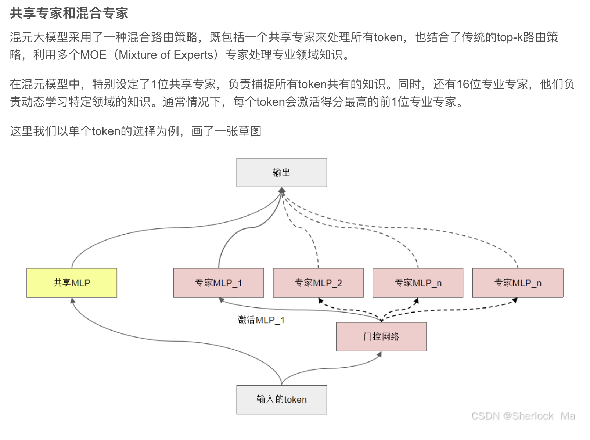

# 01-Hunyuan-A13B-Instruct 模型架构解析 Blog 
## 🚀 **混元 MoE 架构的技术动因**

随着大模型参数规模持续增长，如何在保证计算成本可控的情况下，进一步提升模型容量与表达能力，成为行业关键课题。传统 Transformer 在增加参数的同时，计算量也呈线性增长，训练与推理开销巨大，难以大幅扩展。

为了解决这一问题，**MoE（Mixture of Experts）架构应运而生**。其核心理念是：

* 为每个输入 token 配备多个可选的专家网络（Experts）
* 通过 **Gate（路由器）机制**，仅激活其中少数 Top-k 专家进行计算
* 在保持计算量相对稳定的前提下，实现模型容量的成倍提升

腾讯混元大模型进一步在此基础上提出了 **混合路由策略**，将 **共享专家** 与 **Top-k 专业专家** 结合，以增强模型的泛化能力与稳定性。

> 🔗 参考：[混元大模型混合路由策略详解（CSDN）](https://blog.csdn.net/sherlockMa/article/details/143982668)

---

## 🎯 **应用价值**

✅ **计算效率高**：稀疏激活机制显著降低计算成本，使得训练和推理更加经济可行
✅ **模型容量大**：通过增加 Experts 数量，模型容量可近乎线性扩展，提升表达能力
✅ **泛化能力强**：共享专家捕捉通用知识，专业专家学习领域特化语义，兼顾通用性与多样性
✅ **工程部署灵活**：Experts 可跨设备并行部署（Expert Parallel），突破单机算力限制

---

## 🌟 **模型架构解析**

上图展示了一个典型的 **大规模稀疏专家模型（MoE）架构**。整体而言，它继承了标准 Transformer 的 Encoder/Decoder 堆叠设计，并在此基础上引入 MoE Layer，实现了 **“计算稀疏 + 参数容量爆炸”** 的完美结合。

---

## **腾讯混元大模型 A13B 架构解析**

腾讯混元大模型 A13B 采用了**大规模稀疏专家模型（MoE）架构**，在标准 Transformer 基础上进行多项创新，兼顾模型容量、计算效率与推理能力。

---

## **整体架构概览**

### **1. 专家组成（Mixture of Experts, MoE）**

* **1 个共享专家**

  * 提供所有 token 通用知识支持，确保基础语义一致性。
* **64 个细粒度非共享专家**

  * 处理不同 token 的特定领域任务，实现更强的专用能力。
  * **训练阶段：8 个同时激活**

    * 通过稀疏激活，每次前向传播只激活 8 个专家，显著降低计算资源消耗，同时提升模型表达能力。

---

### **2. 激活函数**

* **SwiGLU（Swish + Gated Linear Unit）**

  * 相较于传统 ReLU 或 GELU，SwiGLU 提供更强的非线性表达能力和计算稳定性，是当前大模型中的主流选择。

---

### **3. 注意力机制**

* **Grouped-Query Attention**

  * 对 Query 进行分组处理，减少计算复杂度，提升推理速度和可扩展性，尤其适用于长上下文处理。

---

### **4. 推理框架**

* **双模式推理链框架**

  * **快思考模式（Fast Thinking）**

    * 模拟人类直觉推理，快速生成结果，适用于常规任务。
  * **慢思考模式（Slow Thinking）**

    * 模拟人类深度推理，进行复杂计算和逻辑推断，适用于需要多步推理的任务。

---

## **核心模块解析**

1. **Embedding + Positional Encoding**

   * 输入 token 通过嵌入层转化为固定维度向量，并结合位置编码，使模型感知序列顺序信息。

2. **Transformer Blocks 堆叠**

   * 多层 Self-Attention 与 Feed Forward Network（FFN）堆叠，逐层抽取与整合更高阶的语义特征。

3. **MoE Layer**

   * 包含路由器（Gate），根据输入 token 表示动态选择 **Top-k 个 Experts** 参与计算，而非全部激活，实现：

     * **计算稀疏化**
     * **参数容量扩展**
   * 在几乎不增加计算成本的情况下，模型容量可达到普通 Transformer 的数倍甚至数十倍。

4. **模型输出**

   * 最终输出 token 的预测 logits 或 embeddings，供下游任务使用，如生成、分类、理解等。

---

## **整体解释**

腾讯混元 A13B 架构结合：

✅ **MoE 稀疏专家路由**：提升模型参数规模与计算效率
✅ **高效注意力机制**：Grouped-Query Attention 提升长序列处理能力
✅ **SwiGLU 激活函数**：增强非线性表达
✅ **双模式推理链**：模拟人类快思考与慢思考，兼顾推理速度与深度

整体上，该架构实现了\*\*“计算稀疏 + 参数容量爆炸 + 复杂推理能力”\*\* 的完美平衡，是面向复杂多任务场景的大模型先进设计。

---

## 🔍 **与 Switch Transformer MoE 架构的对比**

| 特性         | **Switch Transformer MoE** | **Hunyuan A13B MoE**                     |
| ---------- | -------------------------- | ---------------------------------------- |
| **路由策略**   | Top-1 路由，每个 token 激活 1 个专家 | **混合路由策略**：所有 token 均使用共享专家 + Top-1 专业专家 |
| **共享专家**   | 无，完全依赖 Gate 分配到单个专家        | 设计了 1 个共享专家，所有 token 均经过共享专家计算[^1]       |
| **专业专家数量** | 通常 64 或 128，单 token 激活 1   | 混元模型配置 16 个专业专家，单 token 激活 1             |
| **计算效率**   | 极致稀疏（Top-1 激活）             | 稀疏激活 + 共享计算，略增加计算换取稳定性                   |
| **负载均衡**   | Importance Loss            | 类似 Importance Loss + 腾讯特有平衡机制            |

[^1]: 来源 [CSDN SherlockMa](https://blog.csdn.net/sherlockMa/article/details/143982668)

---

### 💡 **总结**

混元大模型通过 **共享专家 + Top-1 专业专家** 的混合路由架构，既继承了 MoE 架构的计算稀疏优势，又强化了模型对通用知识的捕捉能力，在多任务与复杂语义理解场景下表现出更好的稳定性与泛化能力。这一创新性的架构设计，成为国内外 MoE 大模型研究的重要参考方案。

