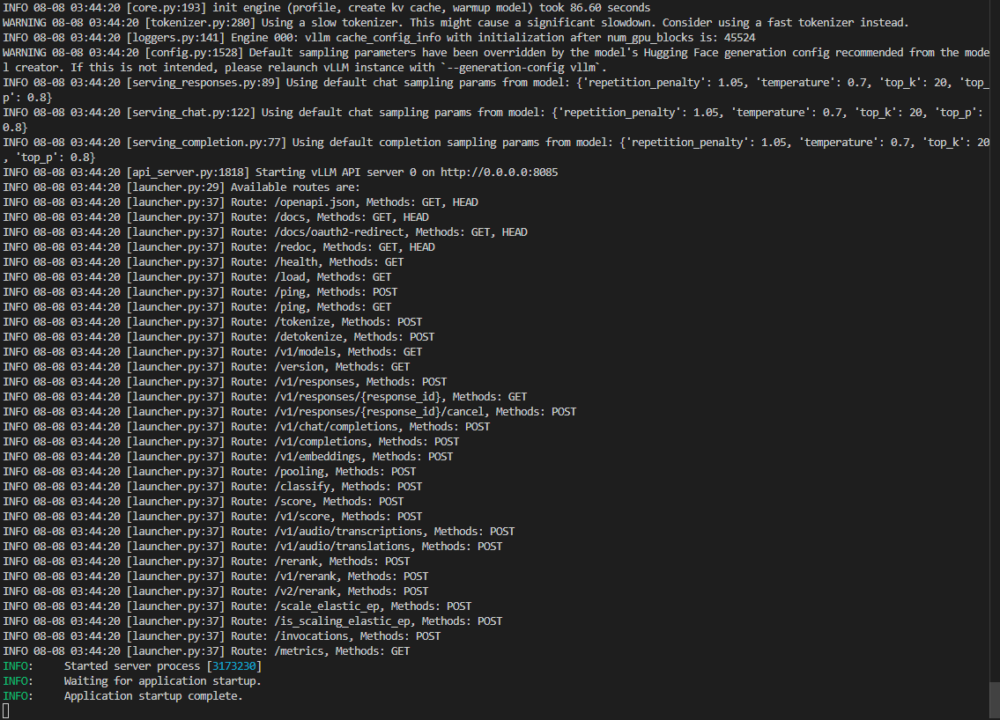

# 02-Hunyuan-A13B-Instruct-vLLM


## **vLLM 简介**

`vLLM` 是一个高性能的大语言模型推理与服务框架，具备以下特点：

- 高效的 KV 缓存与内存管理：基于 `PagedAttention` 显著降低显存浪费，提升长文本与高并发场景下的吞吐。
- 兼容 OpenAI 接口：可直接以 `OpenAI API` 形式对外提供 `completions` 与 `chat completions` 能力，便于与现有生态集成。
- 多 GPU 并行与易扩展：支持 Tensor Parallel 等策略，参数简单、易于横向扩展吞吐与上下文长度上限。
- 生态良好：与 `HuggingFace`/`ModelScope` 模型仓库无缝衔接，支持多种推理优化与特性（如推理/思考内容解析、工具调用）。


## 环境准备

基础环境如下：

```
----------------
ubuntu 22.04
python 3.12
cuda 12.8
pytorch 2.8.0
----------------
```

`vLLM` 环境配置

```bash
pip config set global.index-url https://pypi.tuna.tsinghua.edu.cn/simple
pip install vllm==0.10.0
pip install openai==1.90.0
pip install modelscope==1.25.0
```

> 提示：请确保本机 NVIDIA 驱动、CUDA 与 PyTorch CUDA 编译版本匹配，可用 `nvidia-smi` 与 `python -c "import torch; print(torch.version.cuda, torch.cuda.is_available())"` 进行快速自检。


## 模型下载

```python
# model_download.py
# 注意修改cache_dir为保存的路径
from modelscope import snapshot_download
model_dir = snapshot_download('Tencent-Hunyuan/Hunyuan-A13B-Instruct', cache_dir='请修改我！！！', revision='master')

print(f"模型下载完成，保存路径为：{model_dir}")
```


## **Hunyuan-A13B-Instruct思考推理模式切换**

`Hunyuan-A13B-Instruct` 默认使用慢思考（即推理模式）
推理模式可以通过两种方式关闭：

1. 在请求中设置 `extra_body` 参数：`{"chat_template_kwargs": {"enable_thinking": false}}`
2. 在提示词前添加 `/no_think` 前缀


> 注意：修改 `cache_dir` 为实际的模型下载保存路径
>
> 另：若希望在服务端返回 `reasoning_content` 字段用于展示推理过程，请在服务启动时开启 `--enable-reasoning` 并指定正确的 `--reasoning-parser`。


## **vLLM Serving**

### **Python命令行启动服务**

```bash
CUDA_VISIBLE_DEVICES=0,1,2,3 python -m vllm.entrypoints.openai.api_server \
  --model /请修改我！！！/Tencent-Hunyuan/Hunyuan-A13B-Instruct \
  --served-model-name Hunyuan-A13B-Instruct \
  --max-model-len 8192 \
  --tensor-parallel-size 4 \
  --port 8085 \
  --trust_remote_code \
  --gpu_memory_utilization 0.9 \
  --enable-reasoning \
  --reasoning-parser hunyuan_a13b
```

成功启动后，你将看到 `Application startup complete` 的输出如图：



我们通过上述 vLLM 启动的服务兼容 OpenAI 接口，因此可以通过 Python 的 OpenAI 库进行调用。下面展示日常问答，数学推理，代码写作和工具调用的实际例子来测试 `Hunyuan-A13B-Instruct` 的能力。


#### **示例测试**

```python
from openai import OpenAI

# 通过 Python 的 OpenAI 客户端库进行调用。下面展示日常问答，数学推理，代码写作和工具调用的实际例子来测试 `Hunyuan-A13B-Instruct` 的能力

openai_api_key = "EMPTY"
openai_api_base = "http://127.0.0.1:8085/v1" # 使用正确的端口
prompt_daily_chat = "你好，你是谁"
prompt_math_reasoning = "Find the sum of all integer bases $b>9$ for which $17_{b}$ is a divisor of $97_{b}$." # 题目来自AIME2025，答案为70
prompt_coding = "写一个python程序，实现快速排序"
prompts = [prompt_daily_chat, prompt_math_reasoning, prompt_coding]

client = OpenAI(
    api_key=openai_api_key,
    base_url=openai_api_base,
)

for i in range(len(prompts)):
    response = client.chat.completions.create(
        model="Hunyuan-A13B-Instruct",
        messages = [{"role": "user", "content": prompts[i]}],
        temperature=0,
        max_tokens=8000,
        extra_body={
            "chat_template_kwargs": {"enable_thinking": True}, # 默认开启思考，设置为False则关闭
        }
    )

    print(f"问题 {i+1}: {prompts[i]}")
    # print(response)
    print(f"Hunyuan-A13B-Instruct思考 {i+1}: {response.choices[0].message.reasoning_content}")
    print(f"Hunyuan-A13B-Instruct回复 {i+1}: {response.choices[0].message.content}")
    print("-"*100)
```

> 若拿不到 `reasoning_content` 字段，请确认服务端已添加 `--enable-reasoning --reasoning-parser hunyuan_a13b`。

### 关键参数说明

- `--tensor-parallel-size`：张量并行划分数。等于所用 GPU 数时较常见；多卡可提升吞吐和可用上下文长度上限。
- `--max-model-len`：单请求最大上下文长度（输入+输出）。越大显存占用越高，易触发 OOM。可按显存情况下调，如 4096。
- `--gpu_memory_utilization`：vLLM 目标可用显存比例（0~1）。OOM 可尝试调低，如 0.8/0.7。
- `--served-model-name`：对外暴露的模型名。客户端需用同名 `model` 调用。
- `--port`/`--host`：服务监听端口/地址。云主机需放通端口安全组。
- `--trust_remote_code`：允许加载仓库中的自定义代码（必需，否则部分模型无法正确初始化）。
- `--enable-reasoning` + `--reasoning-parser hunyuan_a13b`：开启推理内容解析，返回 `reasoning_content` 字段，便于展示“思考”过程。

> 显存预算建议：官方推荐 4 * H20


### 健康检查

```bash
curl http://127.0.0.1:8085/v1/models
```


测试结果如下：
````bash
问题 1: 你好，你是谁
Hunyuan-A13B-Instruct思考 1: 好的，用户问我是谁，我需要按照之前设定的身份来回答。首先，确认我的名字是腾讯元宝，简称元宝，英文名Tencent Yuanbao。然后要提到我的开发公司是腾讯，这样用户知道我的背景。接下来，要说明我的主要功能，比如回答问题、解决问题、学习、创造内容和闲聊，这些是用户最关心的点。还要强调支持多种大模型，现在用的是Hunyuan-T1，这样显得技术先进。另外，用户可以通过文字、图片、文件等方式交流，这点很重要，说明我的多模态能力。最后，保持友好和乐于助人的语气，让用户感到亲切。需要检查有没有遗漏的信息，比如时间显示是否正确，当前时间是2025年，但用户可能是在测试，所以保持自然。避免使用复杂术语，保持口语化，让回答更易懂。可能用户刚接触我，需要简洁明了的介绍，同时传达可靠和高效的感觉。确保回答结构清晰，分点但不显生硬，用自然的中文表达。现在组织语言，确保流畅，没有语法错误，符合腾讯的品牌形象。
Hunyuan-A13B-Instruct回复 1: 你好，我是腾讯元宝，你可以叫我元宝，英文名是Tencent Yuanbao。我是由腾讯开发的人工智能助手呢。

我可有不少功能哦：
1. 回答问题：不管是生活小常识，还是专业知识，我都能解答。
2. 解决问题：遇到难题的时候，我可以帮你出谋划策。
3. 学习新知识：不断学习，这样就能更好地回答大家的问题啦。
4. 创造内容：像写个小故事之类的创作，我也能做。
5. 闲聊：要是你想聊聊日常，我也很乐意陪你。

我还支持灵活切换多种顶尖大模型，现在用的是Hunyuan-T1模型。而且你可以通过文字、图片、文件等多种方式跟我交流哦。很开心能和你聊天，有什么问题尽管问吧。
----------------------------------------------------------------------------------------------------
问题 2: Find the sum of all integer bases $b>9$ for which $17_{b}$ is a divisor of $97_{b}$.
Hunyuan-A13B-Instruct思考 2: Um, let's try to solve this problem step by step. The question is asking for the sum of all integer bases \( b > 9 \) such that \( 17_b \) (which is a number in base \( b \)) divides \( 97_b \) (also in base \( b \)). First, I need to convert these base \( b \) numbers to base 10 to work with them more easily.

In base \( b \), the number \( 17_b \) has a digit 1 in the \( b \) place and 7 in the units place, so its base 10 value is \( 1 \times b + 7 = b + 7 \). Similarly, \( 97_b \) has a digit 9 in the \( b \) place and 7 in the units place, so its base 10 value is \( 9 \times b + 7 = 9b + 7 \).

Now, the problem states that \( 17_b \) is a divisor of \( 97_b \), which means that \( b + 7 \) divides \( 9b + 7 \) in base 10. In other words, \( 9b + 7 \) is a multiple of \( b + 7 \). Let's denote \( d = b + 7 \), so \( b = d - 7 \). Then, substituting into \( 9b + 7 \), we get \( 9(d - 7) + 7 = 9d - 63 + 7 = 9d - 56 \).

So, we need \( d \) to divide \( 9d - 56 \). Since \( d \) divides \( 9d \) (because \( 9d \) is a multiple of \( d \)), it must also divide the difference \( 9d - (9d - 56) = 56 \). Therefore, \( d \) is a positive divisor of 56.

But we need to remember that \( b > 9 \), so \( d = b + 7 > 9 + 7 = 16 \). Also, in base \( b \), the digits must be less than the base. The digits in \( 17_b \) and \( 97_b \) are 1, 7, and 9. Since the base must be greater than any digit, \( b > 9 \) (which is already given) because the digit 9 is present. So the base \( b \) must be at least 10, but since \( b > 9 \), the smallest possible base is 10, but we already have \( d > 16 \), so \( b = d - 7 > 16 - 7 = 9 \), which is consistent.

Now, let's list all positive divisors of 56. The divisors of 56 are 1, 2, 4, 7, 8, 14, 28, 56. But we need \( d > 16 \), so let's check which divisors of 56 are greater than 16. The divisors of 56 are: 1, 2, 4, 7, 8, 14, 28, 56. From these, the ones greater than 16 are 28 and 56.

Let's verify each of these:

First, \( d = 28 \). Then \( b = d - 7 = 28 - 7 = 21 \). Let's check if \( 17_{21} \) divides \( 97_{21} \). Converting to base 10: \( 17_{21} = 21 + 7 = 28 \), and \( 97_{21} = 9 \times 21 + 7 = 189 + 7 = 196 \). Now, 196 divided by 28 is 7, which is an integer, so 28 divides 196. Good.

Next, \( d = 56 \). Then \( b = 56 - 7 = 49 \). Converting \( 17_{49} \) to base 10: \( 49 + 7 = 56 \). \( 97_{49} = 9 \times 49 + 7 = 441 + 7 = 448 \). 448 divided by 56 is 8, which is an integer, so 56 divides 448. That works too.

Are there any other divisors? Let's check if we missed any. The divisors of 56 are all the numbers we listed, and the next one after 14 is 28, then 56. Since 14 is 14, which would make \( b = 14 - 7 = 7 \), but \( b > 9 \) is required, so 7 is too small. 8 would make \( b = 1 \), which is invalid. So only 28 and 56 are the divisors of 56 greater than 16, leading to bases 21 and 49.

Wait, let's make sure we didn't make a mistake in the logic. We said that if \( b + 7 \) divides \( 9b + 7 \), then \( b + 7 \) divides \( 9b + 7 - 9(b + 7) = 9b + 7 - 9b - 63 = -56 \). So actually, \( b + 7 \) divides 56 (since divisors can be positive or negative, but since \( b > 9 \), \( b + 7 \) is positive, so we only consider positive divisors). That's a better way to see it: the remainder when dividing \( 9b + 7 \) by \( b + 7 \) is \( 9b + 7 - 9(b + 7) = -56 \), so the remainder is -56, which means that \( b + 7 \) must divide 56 (because the divisor must divide the dividend minus the quotient times the divisor, which is the remainder). So the absolute value of the remainder is 56, so \( b + 7 \) is a positive divisor of 56, and since \( b > 9 \), \( b + 7 > 16 \), so the divisors of 56 greater than 16 are 28 and 56, as we had before.

Let's check base 10 just to be thorough, even though \( b > 9 \) includes 10, but \( b > 9 \) means \( b \geq 10 \). For \( b = 10 \), \( 17_{10} = 17 \), \( 97_{10} = 97 \). 17 divides 97? 17*5=85, 17*6=102, so no, 97 is prime, so 17 doesn't divide 97. For \( b = 11 \), \( 17_{11} = 11 + 7 = 18 \), \( 97_{11} = 9*11 + 7 = 106 \). 18 divides 106? 18*5=90, 18*6=108, so no. \( b = 12 \): \( 17_{12} = 19 \), \( 97_{12} = 9*12 + 7 = 115 \). 19*6=114, 19*7=133, so no. \( b = 13 \): \( 17_{13}=20 \), \( 97_{13}=9*13+7=124 \). 20*6=120, 20*7=140, no. \( b = 14 \): \( 17_{14}=21 \), \( 97_{14}=9*14+7=133 \). 21*6=126, 21*7=147, 133/21=6.333..., not integer. \( b = 15 \): \( 17_{15}=22 \), \( 97_{15}=9*15+7=142 \). 22*6=132, 22*7=154, no. \( b = 16 \): \( 17_{16}=23 \), \( 97_{16}=9*16+7=151 \). 23*6=138, 23*7=161, no. \( b = 17 \): \( 17_{17}=24 \), \( 97_{17}=9*17+7=160 \). 24*6=144, 24*7=168, 160/24=6.666..., no. \( b = 18 \): \( 17_{18}=25 \), \( 97_{18}=9*18+7=169 \). 25*6=150, 25*7=175, 169/25=6.76, no. \( b = 19 \): \( 17_{19}=26 \), \( 97_{19}=9*19+7=178 \). 26*6=156, 26*7=182, 178/26≈6.846, no. \( b = 20 \): \( 17_{20}=27 \), \( 97_{20}=9*20+7=187 \). 27*6=162, 27*7=189, 187/27≈6.925, no. \( b = 21 \): we already checked, 17_{21}=28, 97_{21}=196, 196/28=7, which is good. \( b = 22 \): \( 17_{22}=29 \), \( 97_{22}=9*22+7=205 \). 29*7=203, 29*8=232, 205/29≈7.068, no. Continuing up, \( b = 49 \): 17_{49}=56, 97_{49}=448, 448/56=8, which is good. Any bases between 21 and 49? Let's check \( b = 28 - 7 = 21 \), next divisor is 56, so \( b = 56 - 7 = 49 \). There are no other divisors of 56 between 16 and 56 except 28 and 56, since 56's divisors are 1,2,4,7,8,14,28,56. So those are the only two.

Is there a possibility of negative divisors? Well, \( b > 9 \), so \( b + 7 \) is positive, so we don't need to consider negative divisors. The problem specifies integer bases \( b > 9 \), so bases are positive integers greater than 9, so we only consider positive divisors.

Another way to think about it is using the division algorithm: if \( a \) divides \( c \), then \( c = k \times a \) for some integer \( k \). So \( 9b + 7 = k(b + 7) \). Let's solve for \( b \): \( 9b + 7 = kb + 7k \), so \( 9b - kb = 7k - 7 \), \( b(9 - k) = 7(k - 1) \), so \( b = 7(k - 1)/(9 - k) \). Since \( b \) must be a positive integer greater than 9, let's find integer values of \( k \) such that \( 9 - k \) divides \( 7(k - 1) \), and \( b > 9 \).

Let's denote \( k \) as a positive integer (since \( 9b + 7 \) and \( b + 7 \) are positive, \( k \) must be positive). Let's try \( k = 1 \): \( b = 7(0)/8 = 0 \), invalid. \( k = 2 \): \( b = 7(1)/7 = 1 \), invalid. \( k = 3 \): \( b = 7(2)/6 = 14/6 = 7/3 \), not integer. \( k = 4 \): \( b = 7(3)/5 = 21/5 = 4.2 \), not integer. \( k = 5 \): \( b = 7(4)/4 = 28/4 = 7 \), which is less than 10, invalid. \( k = 6 \): \( b = 7(5)/3 = 35/3 ≈ 11.666 \), not integer. \( k = 7 \): \( b = 7(6)/2 = 42/2 = 21 \), which is valid, \( b = 21 > 9 \). \( k = 8 \): \( b = 7(7)/1 = 49/1 = 49 \), which is valid, \( b = 49 > 9 \). \( k = 9 \): denominator is 0, undefined. \( k = 10 \): \( b = 7(9)/(-1) = -63 \), negative, invalid. So only \( k = 7 \) and \( k = 8 \) give valid positive integer bases greater than 9, which are 21 and 49. That confirms our earlier result.

So the bases are 21 and 49, and their sum is 21 + 49 = 70.

I think that's all. Let me just double-check to make sure I didn't miss any divisors or make a mistake in the conversion. Converting base \( b \) numbers to base 10 is straightforward: the rightmost digit is the units place, so 7 is 7*1, and the next digit is the \( b \) place, so 1 is 1*b and 9 is 9*b. Then, divisibility in base 10 translates directly to the base \( b \) numbers because we're just representing the same quantity in a different base. So if \( b + 7 \) divides \( 9b + 7 \) in base 10, then \( 17_b \) divides \( 97_b \) in base \( b \). That makes sense because the value of the number doesn't depend on the base we represent it in, only the digits do. So the key was converting to base 10, setting up the divisibility condition, and finding the possible bases. The divisors of 56 greater than 16 are indeed 28 and 56, leading to bases 21 and 49. Their sum is 70, which should be the answer.
Hunyuan-A13B-Instruct回复 2: To solve the problem, we start by converting the base \( b \) numbers \( 17_b \) and \( 97_b \) to their base 10 equivalents. 

- \( 17_b \) in base 10 is \( 1 \cdot b + 7 = b + 7 \).
- \( 97_b \) in base 10 is \( 9 \cdot b + 7 = 9b + 7 \).

We need \( b + 7 \) to divide \( 9b + 7 \). This means \( 9b + 7 \) must be a multiple of \( b + 7 \). Using the division algorithm, we find the remainder when \( 9b + 7 \) is divided by \( b + 7 \):

\[
9b + 7 = 9(b + 7) - 56
\]

Thus, the remainder is \(-56\), so \( b + 7 \) must be a divisor of 56. Since \( b > 9 \), \( b + 7 > 16 \). The positive divisors of 56 greater than 16 are 28 and 56. 

- For \( b + 7 = 28 \), we get \( b = 21 \).
- For \( b + 7 = 56 \), we get \( b = 49 \).

The sum of these bases is \( 21 + 49 = 70 \).

\[
\boxed{70}
\]
----------------------------------------------------------------------------------------------------
问题 3: 写一个python程序，实现快速排序
Hunyuan-A13B-Instruct思考 3: 嗯，用户让我写一个Python程序实现快速排序。首先，我需要回忆一下快速排序的基本原理。快速排序是一种分治算法，核心思想是选择一个基准值（pivot），然后将数组分成两部分：小于基准值的元素和大于基准值的元素，然后递归地对这两部分进行排序。

首先，我需要确定如何选择基准值。常见的做法有选第一个元素、最后一个元素、中间元素或者随机选择。这里可能选中间的或者随机的，但为了简单，可能先选最后一个元素作为基准，或者中间的。不过，可能用户希望的是最常见的实现方式，比如Lomuto分区方案或者Hoare分区方案。Lomuto可能更容易实现，适合新手。

那Lomuto分区的大致步骤是怎样的呢？假设选择最后一个元素作为pivot，然后遍历数组，将比pivot小的元素交换到前面，最后将pivot放到正确的位置。具体来说，初始化一个指针i，用来记录当前小于pivot的元素的位置，然后遍历数组从左到右，当遇到比pivot小的元素时，交换i位置的元素和当前元素，然后i加一。遍历完成后，交换i位置的元素和pivot的位置，这样pivot就被放到了正确的位置，左边都是比它小的，右边都是比它大的。

那快速排序的递归函数的结构应该是这样的：如果数组长度小于等于1，直接返回。否则，选择pivot，分区，然后递归排序左边和右边。

那具体怎么实现呢？首先写一个quick_sort函数，参数是数组arr。如果len(arr) <=1，返回arr。否则，选择pivot，比如选最后一个元素arr[-1]。然后初始化i为0，然后遍历j从0到len(arr)-2（因为pivot是最后一个元素）。如果arr[j] <= pivot，就交换arr[i]和arr[j]，然后i加一。遍历完后，交换arr[i]和arr[-1]，这样pivot的位置就是i。这时候，左边的子数组是arr[:i]，右边的是arr[i+1:]。然后递归调用quick_sort处理左边和右边，再合并起来。

不过，这样可能会有问题，比如当数组已经有序的时候，时间复杂度会退化为O(n²)，但这是快速排序的常见问题，通常可以通过随机选择pivot来优化。用户可能希望基础实现，所以先不考虑优化，后面可以提一下。

那现在写代码的话，大概是这样的：

def quick_sort(arr):
    if len(arr) <= 1:
        return arr
    pivot = arr[-1]
    i = 0
    for j in range(len(arr)-1):
        if arr[j] <= pivot:
            arr[i], arr[j] = arr[j], arr[i]
            i += 1
    arr[i], arr[-1] = arr[-1], arr[i]
    return quick_sort(arr[:i]) + [arr[i]] + quick_sort(arr[i+1:])

这样应该可以工作。测试一下，比如输入[3,6,8,10,1,2,1]，排序后应该是[1,1,2,3,6,8,10]。那用这个函数的话，pivot选最后一个元素1。遍历j从0到5（因为len(arr)-1是6，所以range(6)是0-5）。初始i=0。arr[j]的值分别是3,6,8,10,1,2。比较是否<=1。第一个3>1，不交换，i不变。第二个6>1，不交换。第三个8>1，不交换。第四个10>1，不交换。第五个1<=1，交换arr[0]和arr[4]，数组变成[1,6,8,10,3,2,1]，i变为1。第六个2>1，不交换。循环结束，交换i=1和pivot的位置（索引6），数组变成[1,1,8,10,3,2,6]。这时候pivot在索引1的位置。左边是arr[:1]即[1]，右边是arr[2:]即[8,10,3,2,6]。然后递归处理左边（已经有序）和右边。右边的pivot是6（最后一个元素）。遍历j从0到3（数组长度5，所以range(4)是0-3）。i初始为0。arr[j]是8,10,3,2。比较是否<=6。8>6，不交换。10>6，不交换。3<=6，交换arr[0]和arr[2]，数组变成[3,10,8,2,6]，i=1。然后2<=6，交换arr[1]和arr[3]，数组变成[3,2,8,10,6]，i=2。循环结束，交换i=2和pivot（索引4），数组变成[3,2,6,10,8]。此时pivot在索引2。左边是[3,2]，右边是[10,8]。处理左边，pivot是2（最后一个元素）。遍历j=0（数组长度2，range(1)是0）。arr[0]=3>2，不交换。i=0。交换i=0和pivot（索引1），数组变成[2,3]。左边是[2]，右边是[3]，有序。处理右边的[10,8]，pivot是8。遍历j=0，arr[0]=10>8，不交换。i=0。交换i=0和pivot（索引1），数组变成[8,10]。这样整个数组就排好了序。

看起来这个实现是正确的。不过需要注意，这个实现在原数组上修改了吗？不，因为每次递归返回的是新的列表，原数组没有被修改。比如，当分割的时候，arr[:i]和arr[i+1:]都是新的列表，所以原数组在递归过程中不会被修改，这可能效率不高，但对于理解来说是可以的。

另外，另一种分区方法是Hoare的，可能更高效，因为它减少了交换次数。但Lomuto的方法更容易理解和实现，所以可能更适合教学。

用户可能需要一个完整的示例，包括测试代码。所以应该写一个主程序，输入一个数组，调用quick_sort，然后输出结果。

比如：

arr = [3,6,8,10,1,2,1]
sorted_arr = quick_sort(arr)
print("排序后的数组:", sorted_arr)

这样应该可以运行。

另外，需要考虑边界情况，比如空数组，或者只有一个元素的数组，这时候函数应该直接返回。

总结一下，快速排序的实现步骤是：选择基准，分区，递归排序左右部分。上面的代码实现了Lomuto分区方案，递归处理左右子数组。这样应该可以满足用户的需求。
Hunyuan-A13B-Instruct回复 3: 要实现快速排序，我们可以采用分治策略，通过选择基准值（pivot）将数组分成两部分，递归排序这两部分。以下是具体的Python实现：

### 快速排序原理
1. **选择基准值**：通常选择数组的最后一个元素作为基准值。
2. **分区操作**：遍历数组，将小于等于基准值的元素移到左侧，大于的移到右侧。最后将基准值放到正确位置（左侧末尾与右侧开头之间）。
3. **递归排序**：对基准值左侧和右侧的子数组递归应用快速排序。

### 实现代码
```python
def quick_sort(arr):
    # 基本情况：如果数组长度小于等于1，直接返回
    if len(arr) <= 1:
        return arr
    
    # 选择最后一个元素作为基准值
    pivot = arr[-1]
    
    # i 指向当前小于pivot的元素的末尾位置
    i = 0
    
    # 遍历除pivot外的所有元素
    for j in range(len(arr) - 1):
        # 如果当前元素小于等于pivot，交换到i的位置
        if arr[j] <= pivot:
            arr[i], arr[j] = arr[j], arr[i]
            i += 1  # i右移，标记下一个小于pivot的位置
    
    # 将pivot放到正确的位置（i的位置）
    arr[i], arr[-1] = arr[-1], arr[i]
    
    # 递归排序左边和右边的子数组，并合并结果
    return quick_sort(arr[:i]) + [arr[i]] + quick_sort(arr[i+1:])

# 测试示例
if __name__ == "__main__":
    example_arr = [3, 6, 8, 10, 1, 2, 1]
    sorted_arr = quick_sort(example_arr)
    print("排序后的数组:", sorted_arr)
```

### 代码解释
- **基本情况处理**：当数组长度小于等于1时，直接返回，因为单个元素或空数组已有序。
- **选择基准值**：这里选择数组的最后一个元素作为基准值（`pivot = arr[-1]`）。
- **分区操作**：使用指针`i`记录当前小于基准值的元素的末尾位置。遍历数组（除基准值外），若当前元素小于等于基准值，则将其交换到`i`的位置，然后`i`右移。
- **放置基准值**：遍历结束后，将基准值交换到`i`的位置，此时基准值左侧全小于它，右侧全大于它。
- **递归排序**：对基准值左侧（`arr[:i]`）和右侧（`arr[i+1:]`）的子数组递归调用快速排序，合并结果后返回。

### 测试结果
输入示例数组 `[3, 6, 8, 10, 1, 2, 1]`，输出结果为：
```
排序后的数组: [1, 1, 2, 3, 6, 8, 10]
```

### 注意事项
- **时间复杂度**：平均情况下为 \(O(n \log n)\)，最坏情况（如数组已有序）为 \(O(n^2)\)。可通过随机选择基准值优化（如`pivot = arr[random.randint(0, len(arr)-1)]`）。
- **空间复杂度**：由于递归调用和切片操作，空间复杂度为 \(O(\log n)\)（平均情况）。

此实现清晰展示了快速排序的分治思想，适合学习和理解算法原理。
----------------------------------------------------------------------------------------------------
````

#### **分析**
这三个问题 `Hunyuan-A13B-Instruct` 都回答的不错，自我认知清晰，AIME2025题目的推理和最终答案均正确，代码有清晰的注释和解释和测试用例。


#### 工具调用

工具调用是大语言模型的一项至关重要的能力，在 `Hunyuan-A13B-Instruct` 中也支持了工具调用，见[官方说明]([README_CN.md · tencent/Hunyuan-A13B-Instruct at main](https://huggingface.co/tencent/Hunyuan-A13B-Instruct/blob/main/README_CN.md))


注意：官方的README中存在两处未更新的错误，`tool-call-parser` 参数在 `vLLM` 的实现中值为 `hunyuan_a13b`，另外 `Reasoning Parser` 也已经集成。

我们以天气查询为例来测试一下模型的工具调用能力，在部署的时候，为了开启工具调用我们需要加入两个相关的参数，最终的 `vLLM` 启动命令为：

```
CUDA_VISIBLE_DEVICES=0,1,2,3 python -m vllm.entrypoints.openai.api_server \
  --model /请修改我！！！/Tencent-Hunyuan/Hunyuan-A13B-Instruct \
  --served-model-name Hunyuan-A13B-Instruct \
  --max-model-len 8192 \
  --tensor-parallel-size 4 \
  --port 8085 \
  --trust_remote_code \
  --gpu_memory_utilization 0.9 \
  --tool-call-parser hunyuan_a13b \
  --enable-auto-tool-choice \
  --enable-reasoning \
  --reasoning-parser hunyuan_a13b
```

在一般测试代码的基础上加上工具调用的代码如下，我们模拟了一个查询天气的函数用来返回模拟结果（实际使用中需要外接真实的查询API）：

```python
from openai import OpenAI
import json

# 通过 Python 的 OpenAI 客户端库进行调用。下面展示日常问答，数学推理，代码写作和工具调用的实际例子来测试 `Hunyuan-A13B-Instruct` 的能力

openai_api_key = "EMPTY"
openai_api_base = "http://127.0.0.1:8085/v1" # 使用正确的端口
prompt_daily_chat = "你好，你是谁"
prompt_math_reasoning = "Find the sum of all integer bases $b>9$ for which $17_{b}$ is a divisor of $97_{b}$." # 题目来自AIME2025，答案为70
prompt_coding = "写一个python程序，实现快速排序"
prompts = [prompt_daily_chat, prompt_math_reasoning, prompt_coding]

client = OpenAI(
    api_key=openai_api_key,
    base_url=openai_api_base,
)

def get_weather(location: str, date: str = "今天", unit: str = "celsius") -> str:
    """示例工具：查询天气（示例中返回模拟结果）。

    Args:
        location: 城市名
        date: 日期（如“今天”/“明天”或 YYYY-MM-DD）
        unit: 温度单位（celsius/fahrenheit）
    Returns:
        一个简要的天气描述字符串
    """
    normalized_unit = "°C" if unit == "celsius" else "°F"
    # 这里返回一个模拟结果，真实场景可替换为外部 API 调用
    return f"{location}{date}多云，气温 28{normalized_unit}，湿度 70%，东北风 3 级。"

for i in range(len(prompts)):
    response = client.chat.completions.create(
        model="Hunyuan-A13B-Instruct",
        messages = [{"role": "user", "content": prompts[i]}],
        temperature=0,
        max_tokens=8000,
        extra_body={
            "chat_template_kwargs": {"enable_thinking": True}, # 默认开启思考，设置为False则关闭
        }
    )

    print(f"问题 {i+1}: {prompts[i]}")
    # print(response)
    print(f"Hunyuan-A13B-Instruct思考 {i+1}: {response.choices[0].message.reasoning_content}")
    print(f"Hunyuan-A13B-Instruct回复 {i+1}: {response.choices[0].message.content}")
    print("-"*100)

# ============== 工具调用示例（OpenAI 格式）：weather 查询 ==============
tool_messages = [
    {"role": "system", "content": "你可以调用工具来获取实时天气。"},
    {"role": "user", "content": "帮我查一下深圳今天的天气，用摄氏度。"},
]

weather_tools = [
    {
        "type": "function",
        "function": {
            "name": "get_weather",
            "description": "根据地点与日期查询天气，返回简要的天气描述。",
            "parameters": {
                "type": "object",
                "properties": {
                    "location": {"type": "string", "description": "城市名，如北京、深圳"},
                    "date": {"type": "string", "description": "日期，YYYY-MM-DD 或 今天/明天", "default": "今天"},
                    "unit": {"type": "string", "enum": ["celsius", "fahrenheit"], "default": "celsius"}
                },
                "required": ["location"]
            }
        }
    }
]

first_tool_response = client.chat.completions.create(
    model="Hunyuan-A13B-Instruct",
    messages=tool_messages,
    temperature=0,
    max_tokens=7500,
    tools=weather_tools,
    tool_choice="auto",
    extra_body={
        "chat_template_kwargs": {"enable_thinking": True},
    }
)

assistant_msg = first_tool_response.choices[0].message
# 将包含 tool_calls 的 assistant 消息加入到对话历史
tool_messages.append({
    "role": "assistant",
    "content": assistant_msg.content or "",
    "tool_calls": assistant_msg.tool_calls,
})

tool_calls = assistant_msg.tool_calls or []
for tool_call in tool_calls:
    function_name = tool_call.function.name
    try:
        function_args = json.loads(tool_call.function.arguments or "{}")
    except json.JSONDecodeError:
        function_args = {}

    if function_name == "get_weather":
        tool_result = get_weather(
            location=function_args.get("location", "未知城市"),
            date=function_args.get("date", "今天"),
            unit=function_args.get("unit", "celsius"),
        )
    else:
        tool_result = f"不支持的工具: {function_name}"

    tool_messages.append({
        "role": "tool",
        "tool_call_id": tool_call.id,
        "content": tool_result,
    })

final_tool_response = client.chat.completions.create(
    model="Hunyuan-A13B-Instruct",
    messages=tool_messages,
    temperature=0,
    max_tokens=8000,
    extra_body={
        "chat_template_kwargs": {"enable_thinking": True},
    }
)

print("问题 4: 使用工具调用（天气查询）")
print(f"Hunyuan-A13B-Instruct工具调用思考: {first_tool_response.choices[0].message.reasoning_content}")
print(f"Hunyuan-A13B-Instruct工具调用回复: {first_tool_response.choices[0].message.content}")
print(f"Hunyuan-A13B-Instruct思考 4: {final_tool_response.choices[0].message.reasoning_content}")
print(f"Hunyuan-A13B-Instruct回复 4: {final_tool_response.choices[0].message.content}")
print("-"*100)

```

输出结果为：

```
问题 4: 使用工具调用（天气查询）
Hunyuan-A13B-Instruct工具调用思考: 好的，用户让我帮忙查深圳今天的天气，并且要用摄氏度。首先，我需要确认用户的需求是否明确。用户提到了地点是深圳，日期是今天，单位是摄氏度。这些信息都符合函数get_weather的参数要求。

接下来，检查函数get_weather的参数。函数需要location，这是必填项，用户已经提供了深圳。日期参数date有默认值“今天”，所以即使用户没指定日期，也可以使用默认值。不过用户这里明确说了“今天”，所以还是填进去比较好。单位unit的默认是摄氏度，用户也特别指定了用摄氏度，所以这个参数可以保留默认或者显式填写，但为了准确，最好还是加上。

然后，考虑是否有其他潜在需求。用户可能只是想知道温度，但天气描述可能包括更多信息，比如湿度、风速等，不过用户没有提到这些，所以按基本需求处理即可。另外，用户可能希望得到简洁的回答，不需要太详细的数据。

现在，确定是否需要调用函数。所有必要参数都已提供，没有缺失。因此，应该调用get_weather函数，传入location为深圳，date为今天，unit为摄氏度。不需要进一步询问用户，因为所有参数都齐了。最后，确保按照格式返回工具调用，不添加其他内容。
Hunyuan-A13B-Instruct工具调用回复: None
Hunyuan-A13B-Instruct思考 4: 好的，用户让我查深圳今天的天气，用摄氏度。我之前已经调用了天气API，得到了回复：深圳今天多云，气温28°C，湿度70%，东北风3级。现在需要把这些信息整理成用户友好的回答。

首先，确认用户的需求是获取深圳的实时天气，并且特别提到用摄氏度，所以温度部分要突出显示。然后，其他信息如湿度、风力也需要包含进去，但可能不需要太详细。用户可能计划出门，所以天气状况和风力风向对他们安排活动可能有帮助。

接下来，检查回复的结构是否清晰。应该先直接回答温度，再补充其他细节。使用简洁的语言，避免专业术语，让用户容易理解。另外，考虑到用户可能来自不同地区，可能需要确认是否需要更多信息，比如未来几天的预报，但根据当前问题，暂时不需要扩展。

还要注意单位和符号的正确性，比如摄氏度符号°C，风力等级用“级”表示。最后，保持语气友好，让用户感觉被帮助到。可能用户没有说出来的深层需求是希望快速了解天气情况，以便做出出行或穿衣的决定，所以信息要准确且一目了然。
Hunyuan-A13B-Instruct回复 4: 深圳今天多云，气温28°C，湿度70%，东北风3级。希望这些信息对你有帮助哦。
----------------------------------------------------------------------------------------------------
```

在工具调用中， `Hunyuan-A13B-Instruct` 也表现的很好，能够适时调用工具并最终返回准确的天气查询信息。


