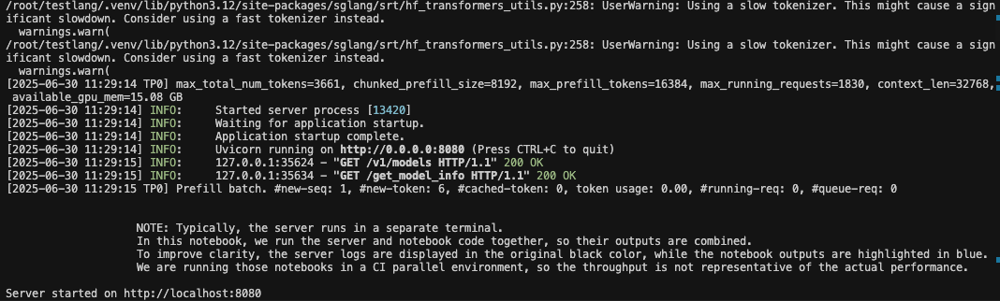
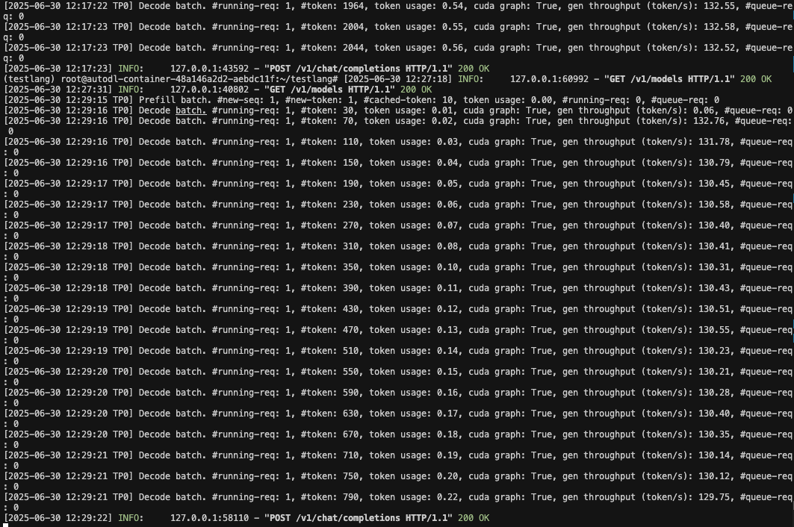

# 03-Hunyuan-A13B-Instruct-SGLang部署调用

## **SGLang 简介**

`SGLang` 是一个高性能的大语言模型**推理与编程框架**，具备以下特性：

- **快速后端运行时**：采用 `RadixAttention` 实现高效前缀缓存，支持零开销 CPU 调度器、推测解码、分页注意力、连续批处理、分块预填充、结构化输出、张量并行、管道并行、专家并行以及多种量化格式（FP8/INT4/AWQ/GPTQ），支持多 LoRA 批处理，提供高吞吐低延迟服务。
- **灵活的前端语言**：提供直观的编程接口，支持链式调用、高级提示设计、控制流、多模态输入、并行执行和外部交互，便于构建复杂应用。
- **广泛的模型支持**：兼容多种主流模型（如 LLaMA、Gemma、Mistral、Qwen、DeepSeek、LLaVA 等）、嵌入模型（如 e5-mistral、GTE、MCDSE）以及奖励模型（如 Skywork），支持扩展接入新模型。
- **开源与社区**：`SGLang` 是开源项目，拥有活跃的开发社区，并被多个组织和项目采用。

## 环境准备

本文基础环境如下：

```
----------------
ubuntu 22.04
python 3.12
cuda 12.4
pytorch 2.5.1
----------------
```

> 本文默认学习者已配置好以上 `Pytorch (cuda)` 环境，如未配置请先自行安装。

首先 `pip` 换源加速下载并安装依赖包

```bash
python -m pip install --upgrade pip
pip config set global.index-url https://pypi.tuna.tsinghua.edu.cn/simple

pip install --upgrade pip
pip install "sglang[all]>=0.4.6.post4"
pip install modelscope
pip install openai
```

## 模型下载

使用 modelscope 中的 snapshot_download 函数下载模型，第一个参数为模型名称，参数 cache_dir 为模型的下载路径。

新建 `model_download.py` 文件并在其中输入以下内容，粘贴代码后记得保存文件。

```python
from modelscope import snapshot_download

model_dir = snapshot_download('Tencent-Hunyuan/Hunyuan-A13B-Instruct', cache_dir='/root/autodl-tmp', revision='master')
```

然后在终端中输入 `python model_download.py` 执行下载，这里需要耐心等待一段时间直到模型下载完成。

> 注意：记得修改 `cache_dir` 为你的模型下载路径哦~

## **代码准备**

### **启动服务器**

SGLang 框架提供了简单的方法来启动服务器。下面的代码展示了如何启动一个 SGLang 服务器，该服务器将加载 Hunyuan-A13B-Instruct 模型并在指定端口上提供服务。

新建 `start_server.py` 文件并在其中输入以下内容：

```python
from sglang.test.test_utils import is_in_ci
from sglang.utils import launch_server_cmd, wait_for_server, print_highlight, terminate_process

server_process, port = launch_server_cmd(
    "python3 -m sglang.launch_server --model-path /root/autodl-tmp/Tencent-Hunyuan/Hunyuan-A13B-Instruct --host 0.0.0.0 --port 8080 --tp-size 2 --mem-fraction-static 0.8 --trust-remote-code --reasoning-parser qwen3", port = 8080
)

wait_for_server(f"http://localhost:{port}")
print(f"Server started on http://localhost:{port}")
```

> 注意：请将 `--model-path` 参数修改为你的模型实际下载路径。

在终端中执行以下命令启动服务器：

```bash
python start_server.py
```

成功启动后，你将看到类似以下的输出：



### **基本调用示例**

SGLang 提供了与 OpenAI API 兼容的接口，可以通过 Python 的 OpenAI 客户端库进行调用。以下是几个基本的调用示例。

#### **文本补全示例**

新建 `test_completion.py` 文件并在其中输入以下内容：

```python
from openai import OpenAI
# 补全 API 与聊天补全 API 类似，但没有 messages 参数或聊天模板。
# 补全 API 接受 OpenAI Completions API 的参数。有关更多详细信息，请查阅OpenAI Completions API。

openai_api_key = "EMPTY"
openai_api_base = "http://127.0.0.1:8080/v1" # 使用正确的端口

client = OpenAI(
    api_key=openai_api_key,
    base_url=openai_api_base,
)
response = client.completions.create(
    model="/root/autodl-tmp/Tencent-Hunyuan/Hunyuan-A13B-Instruct",
    prompt="给我一个关于大模型的简短介绍。",
    temperature=0,
    max_tokens=600,
    n=1,
    stop=None,
)

print(f"Response: {response}")
```

结果如下：
```bash
Response: Completion(id='092771d863de45d8bd40fd60b954c9a5', choices=[CompletionChoice(finish_reason='length', index=0, logprobs=None, text='<think>\n好的，用户需要一个关于大模型的简短介绍。首先，我需要明确大模型的核心定义，可能包括参数规模、训练数据、能力特点。然后，要提到关键技术，比如Transformer架构，因为这是大模型的基础。接下来，应用场景也很重要，用户可能想知道大模型能做什么，比如对话、生成、分析等。还要区分大模型和传统模型的不同，比如参数规模、泛化能力。另外，可能需要提到发展现状，比如从GPT-3到GPT-4，LLaMA系列，说明技术进步。还要注意语言简洁，避免太技术化，保持易懂。需要结构清晰，先定义，再技术基础，然后能力，应用，最后现状。检查有没有遗漏的关键点，比如自监督学习、海量数据、上下文学习能力。确保信息准确，比如Transformer是2017年提出的，大模型参数通常在十亿到万亿级别。可能用户是普通读者，所以需要通俗解释，避免术语堆砌。最后总结大模型的影响，比如推动AI发展，改变应用模式。现在组织这些点，形成一个连贯的简短介绍。\n</think>\n<answer>\n### 大模型（Large Language Model, LLM）简短介绍  \n\n**核心定义**：大模型是一类基于深度学习的人工智能系统，通过海量文本、代码等数据训练，具备超大规模参数（通常达十亿至万亿级别）', matched_stop=None)], created=1751258302, model='/root/autodl-fs/Hunyuan-A13B-Instruct', object='text_completion', system_fingerprint=None, usage=CompletionUsage(completion_tokens=300, prompt_tokens=9, total_tokens=309, completion_tokens_details=None, prompt_tokens_details=None))
```

> 注意：请将 `model` 参数修改为你的模型实际下载路径。

#### **聊天补全示例（带思考功能）**

新建 `test_chat_with_think.py` 文件并在其中输入以下内容：

```python
from openai import OpenAI

# 修改 OpenAI 的 API 密钥和 API 基础地址以使用 SGLang 的 API 服务器。
def chatcompletionwiththink(messages):
    openai_api_key = "EMPTY"
    openai_api_base = "http://127.0.0.1:8080/v1" # 使用正确的端口

    client = OpenAI(
        api_key=openai_api_key,
        base_url=openai_api_base,
    )

    model = "/root/autodl-tmp/Tencent-Hunyuan/Hunyuan-A13B-Instruct" # 使用服务器加载的模型
    messages = [{"role": "user", "content": messages}]

    response = client.chat.completions.create(
        model=model,
        messages=messages,
    )
    print("======================")
    print(response)
    print("模型思考: \n", response.choices[0].message.reasoning_content)
    print("模型回答: \n", response.choices[0].message.content)
    print("======================")


def chatcompletionwiththinkbyargs(messages, enable_thinking=True):
    openai_api_key = "EMPTY"
    openai_api_base = "http://127.0.0.1:8080/v1" # 使用正确的端口

    client = OpenAI(
        api_key=openai_api_key,
        base_url=openai_api_base,
    )
    
    model = "/root/autodl-tmp/Tencent-Hunyuan/Hunyuan-A13B-Instruct" # 使用服务器加载的模型
    messages = [{"role": "user", "content": messages}]

    response = client.chat.completions.create(
        model=model,
        messages=messages,
        extra_body={
            "chat_template_kwargs": {"enable_thinking": enable_thinking},
            "separate_reasoning": True
        }
    )
    print("======================")
    print(response)
    print("模型思考: \n", response.choices[0].message.reasoning_content)
    print("模型回答: \n", response.choices[0].message.content)
    print("======================")

if __name__ == "__main__":
    print("参数方式不启用思考")
    chatcompletionwiththinkbyargs("给我一个关于大模型的简短介绍。", enable_thinking=False)
    print("参数方式启用思考")
    chatcompletionwiththinkbyargs("给我一个关于大模型的简短介绍。", enable_thinking=True)
    print("提示词方式不启用思考")
    chatcompletionwiththink("/no_think 给我一个关于大模型的简短介绍。")
    print("提示词方式启用思考")
    chatcompletionwiththink("/think 给我一个关于大模型的简短介绍。")
```

> 注意：请将 `model` 参数修改为你的模型实际下载路径。

结果大概如下：
```bash
参数方式不启用思考
======================
ChatCompletion(id='08aa899ef5ac40a7a0e4f386fc1a99f2', choices=[Choice(finish_reason='stop', index=0, logprobs=None, message=ChatCompletionMessage(content='<answer>\n大模型指的是大规模语言模型，英文一般称为Large Language Model，简称LLM。下面从基本定义、技术原理、特点、应用场景几个方面介绍：\n- **基本定义**：它是一种基于深度学习的人工智能算法，通过海量文本数据进行预训练，学习语言的模式、结构和语义信息。\n- **技术原理**：以Transformer架构为基础，使用自注意力机制捕捉文本中词语间的关联，通过大规模无监督学习，让模型学习语言规律和知识。\n- **特点**：具备强大语言理解和生成能力，能处理多种自然语言处理任务；知识储备丰富，可回答不同领域问题；可扩展性强，通过增加参数和数据提升性能。\n- **应用场景**：在智能客服领域，能快速准确响应用户咨询；在内容创作上，可生成文章、诗歌等；还能辅助代码编写、翻译、绘画提示生成等。\n</answer>', refusal=None, role='assistant', annotations=None, audio=None, function_call=None, tool_calls=None, reasoning_content=None), matched_stop=127960)], created=1751258348, model='/root/autodl-fs/Hunyuan-A13B-Instruct', object='chat.completion', service_tier=None, system_fingerprint=None, usage=CompletionUsage(completion_tokens=190, prompt_tokens=17, total_tokens=207, completion_tokens_details=None, prompt_tokens_details=None))
模型思考: 
 None
模型回答: 
 <answer>
大模型指的是大规模语言模型，英文一般称为Large Language Model，简称LLM。下面从基本定义、技术原理、特点、应用场景几个方面介绍：
- **基本定义**：它是一种基于深度学习的人工智能算法，通过海量文本数据进行预训练，学习语言的模式、结构和语义信息。
- **技术原理**：以Transformer架构为基础，使用自注意力机制捕捉文本中词语间的关联，通过大规模无监督学习，让模型学习语言规律和知识。
- **特点**：具备强大语言理解和生成能力，能处理多种自然语言处理任务；知识储备丰富，可回答不同领域问题；可扩展性强，通过增加参数和数据提升性能。
- **应用场景**：在智能客服领域，能快速准确响应用户咨询；在内容创作上，可生成文章、诗歌等；还能辅助代码编写、翻译、绘画提示生成等。
</answer>
======================
参数方式启用思考
======================
ChatCompletion(id='29f1d349b6cc4aa1a63df628d16e5cd7', choices=[Choice(finish_reason='stop', index=0, logprobs=None, message=ChatCompletionMessage(content='<answer>\n### 大模型：重新定义人工智能的“通用引擎”  \n\n**大模型（Large Language Model, LLM）** 是近年来人工智能领域的突破性技术，核心是通过海量参数（通常达百亿至万亿级）和大规模数据训练，构建具备强泛化能力的通用型智能模型。其技术基础以2017年提出的 **Transformer架构** 为核心，通过“自注意力机制（Self-Attention）”高效处理长序列数据（如文本），突破了传统模型对固定任务或短序列的依赖。  \n\n**关键特点**：  \n- **参数与数据“规模制胜”**：参数规模从早期的亿级（如BERT-base）跃升至千亿级（如GPT-3、PaLM）甚至万亿级（如GPT-4），需TB级文本、图像等多模态数据训练；  \n- **跨任务泛化**：无需为每个任务单独设计模型，通过“指令微调”即可适配对话、翻译、写作、代码生成等数百种场景；  \n- **多模态融合**：从单一文本扩展至文本+图像（如GPT-4V）、语音、视频等，理解与生成能力更接近人类。  \n\n**应用与影响**：  \n大模型已渗透至智能助手（ChatGPT、文心一言）、内容创作（AIGC）、代码开发（GitHub Copilot）、科研辅助（蛋白质结构预测）等领域，推动AI从“专用工具”向“通用智能体”演进。同时，其也引发对信息准确性、隐私安全、伦理风险（如深度伪造）的关注，成为技术发展与治理平衡的关键议题。  \n\n简言之，大模型是当前人工智能的“基础设施”，正重塑人机交互方式，并为通用人工智能（AGI）的探索提供核心支撑。\n</answer>', refusal=None, role='assistant', annotations=None, audio=None, function_call=None, tool_calls=None, reasoning_content='好的，用户让我写一个关于大模型的简短介绍。首先，我需要明确大模型的核心是什么。大模型通常指参数规模极大的机器学习模型，尤其是自然语言处理领域的，比如GPT、BERT这些。用户可能想了解基本概念、特点、应用和影响。\n\n首先，定义部分要简洁，说明大模型是基于深度学习，参数规模大，通常千亿级以上。然后，技术基础可能需要提到Transformer架构，因为这是当前大模型的基础，比如自注意力机制，处理长序列的能力。\n\n接下来是关键特点，参数规模大、数据需求大、计算资源需求高，这些是大模型区别于传统模型的地方。然后是能力表现，比如多模态处理（文本、图像、语音）、复杂推理、泛化能力，这些能力让它们在各种任务上表现好。\n\n应用场景需要举几个例子，比如对话交互、内容生成（写文章、代码）、智能助手、医疗诊断辅助，这样用户更容易理解。然后是影响部分，推动AI发展，改变人机交互，但也带来伦理问题，比如信息准确、隐私、就业影响，这样介绍更全面。\n\n用户可能的深层需求是快速了解大模型的全貌，不需要太技术化的细节，所以要保持简短易懂。需要避免专业术语过多，用通俗的语言。还要注意结构清晰，逻辑连贯，从定义到技术基础，再到特点、应用和影响，这样用户能一步步理解。\n\n可能需要检查是否有遗漏的重要点，比如大模型的发展历程？但用户要简短，可能不需要。重点突出核心要素。另外，确保信息准确，比如Transformer是2017年提出的，大模型参数确实从亿级到千亿级甚至万亿级，比如GPT-3是1750亿，GPT-4可能更大。\n\n最后，总结大模型的意义，强调其作为通用人工智能（AGI）的探索，既是技术突破，也带来挑战。这样介绍会比较完整，满足用户的需求。\n'), matched_stop=127960)], created=1751258354, model='/root/autodl-fs/Hunyuan-A13B-Instruct', object='chat.completion', service_tier=None, system_fingerprint=None, usage=CompletionUsage(completion_tokens=802, prompt_tokens=11, total_tokens=813, completion_tokens_details=None, prompt_tokens_details=None))
模型思考: 
 好的，用户让我写一个关于大模型的简短介绍。首先，我需要明确大模型的核心是什么。大模型通常指参数规模极大的机器学习模型，尤其是自然语言处理领域的，比如GPT、BERT这些。用户可能想了解基本概念、特点、应用和影响。

首先，定义部分要简洁，说明大模型是基于深度学习，参数规模大，通常千亿级以上。然后，技术基础可能需要提到Transformer架构，因为这是当前大模型的基础，比如自注意力机制，处理长序列的能力。

接下来是关键特点，参数规模大、数据需求大、计算资源需求高，这些是大模型区别于传统模型的地方。然后是能力表现，比如多模态处理（文本、图像、语音）、复杂推理、泛化能力，这些能力让它们在各种任务上表现好。

应用场景需要举几个例子，比如对话交互、内容生成（写文章、代码）、智能助手、医疗诊断辅助，这样用户更容易理解。然后是影响部分，推动AI发展，改变人机交互，但也带来伦理问题，比如信息准确、隐私、就业影响，这样介绍更全面。

用户可能的深层需求是快速了解大模型的全貌，不需要太技术化的细节，所以要保持简短易懂。需要避免专业术语过多，用通俗的语言。还要注意结构清晰，逻辑连贯，从定义到技术基础，再到特点、应用和影响，这样用户能一步步理解。

可能需要检查是否有遗漏的重要点，比如大模型的发展历程？但用户要简短，可能不需要。重点突出核心要素。另外，确保信息准确，比如Transformer是2017年提出的，大模型参数确实从亿级到千亿级甚至万亿级，比如GPT-3是1750亿，GPT-4可能更大。

最后，总结大模型的意义，强调其作为通用人工智能（AGI）的探索，既是技术突破，也带来挑战。这样介绍会比较完整，满足用户的需求。

模型回答: 
 <answer>
### 大模型：重新定义人工智能的“通用引擎”  

**大模型（Large Language Model, LLM）** 是近年来人工智能领域的突破性技术，核心是通过海量参数（通常达百亿至万亿级）和大规模数据训练，构建具备强泛化能力的通用型智能模型。其技术基础以2017年提出的 **Transformer架构** 为核心，通过“自注意力机制（Self-Attention）”高效处理长序列数据（如文本），突破了传统模型对固定任务或短序列的依赖。  

**关键特点**：  
- **参数与数据“规模制胜”**：参数规模从早期的亿级（如BERT-base）跃升至千亿级（如GPT-3、PaLM）甚至万亿级（如GPT-4），需TB级文本、图像等多模态数据训练；  
- **跨任务泛化**：无需为每个任务单独设计模型，通过“指令微调”即可适配对话、翻译、写作、代码生成等数百种场景；  
- **多模态融合**：从单一文本扩展至文本+图像（如GPT-4V）、语音、视频等，理解与生成能力更接近人类。  

**应用与影响**：  
大模型已渗透至智能助手（ChatGPT、文心一言）、内容创作（AIGC）、代码开发（GitHub Copilot）、科研辅助（蛋白质结构预测）等领域，推动AI从“专用工具”向“通用智能体”演进。同时，其也引发对信息准确性、隐私安全、伦理风险（如深度伪造）的关注，成为技术发展与治理平衡的关键议题。  

简言之，大模型是当前人工智能的“基础设施”，正重塑人机交互方式，并为通用人工智能（AGI）的探索提供核心支撑。
</answer>
======================
提示词方式不启用思考
======================
```

#### **流式输出示例**

新建 `test_streaming.py` 文件并在其中输入以下内容：

```python
from openai import OpenAI

# 修改 OpenAI 的 API 密钥和 API 基础地址以使用 SGLang 的 API 服务器。
openai_api_key = "EMPTY"
openai_api_base = "http://127.0.0.1:8080/v1"  # 默认端口，可能会有所不同

client = OpenAI(
    api_key=openai_api_key,
    base_url=openai_api_base,
)

stream = client.chat.completions.create(
    model="/root/autodl-tmp/Tencent-Hunyuan/Hunyuan-A13B-Instruct",
    messages=[{"role": "user", "content": "给我一个关于大模型的简短介绍。"}],
    stream=True,
    # 可选择是否启用思考，默认启用
    # extra_body={
    #     "chat_template_kwargs": {"enable_thinking": True},
    #     "separate_reasoning": True
    # }
)
# 流式输出不论是否开启思考，所有token都会放在content中
for chunk in stream:
    if chunk.choices[0].delta.content is not None:
        print(chunk.choices[0].delta.content, end="")
```

> 注意：请将 `model` 参数修改为你的模型实际下载路径。

### **命令行方式启动服务器**

除了通过 Python 脚本启动服务器外，你还可以直接在命令行中启动 SGLang 服务器。以下是命令行启动服务器的示例：

```bash
python -m sglang.launch_server \
    --model-path /root/autodl-tmp/Tencent-Hunyuan/Hunyuan-A13B-Instruct \
    --host 0.0.0.0 \
    --port 8080 \
    --tp-size 2 \
    --mem-fraction-static 0.8 \
    --trust-remote-code \
    --reasoning-parser qwen3
```

参数说明：
- `--model-path`：模型路径
- `--host`：服务器主机地址，0.0.0.0 表示允许所有 IP 访问
- `--port`：服务器端口
- `--tp-size`：张量并行大小，根据你的 GPU 数量调整
- `--mem-fraction-static`：静态内存分配比例
- `--trust-remote-code`：信任远程代码
- `--reasoning-parser`：推理解析器，这里使用 qwen3，适用于解析 <think>...</think> 格式的思考内容

### **使用 curl 测试 API**

服务器启动后，你可以使用 curl 命令测试 API。以下是一些示例：

- 查看模型列表：

```bash
curl http://localhost:8080/v1/models
```

```json
{
    "object": "list",
    "data": [
        {
            "id": "/root/autodl-fs/Hunyuan-A13B-Instruct",
            "object": "model",
            "created": 1751257651,
            "owned_by": "sglang",
            "root": "/root/autodl-fs/Hunyuan-A13B-Instruct",
            "max_model_len": 32768
        }
    ]
}
```

- 测试补全 API：

```bash
curl http://localhost:8080/v1/completions \
    -H "Content-Type: application/json" \
    -d '{
        "model": "/root/autodl-tmp/Tencent-Hunyuan/Hunyuan-A13B-Instruct",
        "prompt": "给我一个关于大模型的简短介绍。",
        "max_tokens":3000,
        "temperature": 0
    }'
```

```json
{
    "id": "416c69caef134e16aaadc2dafcef2c27",
    "object": "text_completion",
    "created": 1751258615,
    "model": "/root/autodl-tmp/Tencent-Hunyuan/Hunyuan-A13B-Instruct",
    "choices": [
        {
            "index": 0,
            "text": "<think>\n好的，用户需要一个关于大模型的简短介绍。首先，我需要明确大模型的核心定义，可能包括参数规模、训练数据、能力特点。然后，要提到关键技术，比如Transformer架构，因为这是大模型的基础。接下来，应用场景也很重要，用户可能想知道大模型能做什么，比如对话、生成、分析等。还要区分大模型和传统模型的不同，比如参数规模、泛化能力。另外，可能需要提到发展现状，比如从GPT-3到GPT-4，LLaMA系列，说明技术进步。还要注意语言简洁，避免太技术化，保持易懂。需要结构清晰，先定义，再技术基础，然后能力，应用，最后现状。检查有没有遗漏的关键点，比如自监督学习、海量数据、上下文学习能力。确保信息准确，比如Transformer是2017年提出的，大模型参数通常在十亿到万亿级别。可能用户是普通读者，所以需要通俗解释，避免术语堆砌。最后总结大模型的影响，比如推动AI发展，改变应用模式。现在组织这些点，形成一个连贯的简短介绍。\n</think>\n<answer>\n### 大模型（Large Language Model, LLM）简短介绍  \n\n**核心定义**：大模型是一类基于深度学习的人工智能系统，通过海量文本、代码等数据训练，具备超大规模参数（通常达十亿至万亿级别）和强大泛化能力，能理解、生成自然语言，并完成复杂任务。  \n\n**技术基础**：以Transformer架构（2017年提出）为核心，通过自注意力机制（Self-Attention）捕捉长距离语义关联，突破了传统循环神经网络（RNN）的局限，使模型能并行处理海量信息，显著提升学习效率。  \n\n**核心能力**：  \n- **上下文学习（In-Context Learning）**：仅需少量示例（甚至零样本），即可理解新任务并生成符合要求的输出（如“写一首关于春天的诗”）；  \n- **多模态扩展**：从纯文本扩展到文本+图像（如GPT-4、DALL·E）、文本+语音等，覆盖更复杂场景；  \n- **逻辑与推理**：通过训练数据中的隐含逻辑，支持简单数学计算、代码生成、常识问答等。  \n\n**典型应用**：智能对话（如ChatGPT）、内容生成（文案/代码/绘画）、信息分析（总结/翻译/问答）、行业垂直场景（医疗/教育/金融的智能助手）等。  \n\n**发展现状**：自2020年GPT-3（1750亿参数）起，大模型进入“万亿参数”时代（如GPT-4、LLaMA 2、PaLM 2），技术迭代加速，同时推动AI从“专用”向“通用”探索，成为当前人工智能领域的核心方向。  \n\n**意义**：大模型通过“数据-参数-算力”的规模效应，重新定义了AI的能力边界，正在重塑人机交互、内容生产、科学研究等领域的效率与模式。\n</answer>",
            "logprobs": null,
            "finish_reason": "stop",
            "matched_stop": 127960
        }
    ],
    "usage": {
        "prompt_tokens": 9,
        "total_tokens": 669,
        "completion_tokens": 660,
        "prompt_tokens_details": null
    }
}
```

- 测试聊天补全 API：

```bash
curl http://localhost:8080/v1/chat/completions \
    -H "Content-Type: application/json" \
    -d '{
        "model": "/root/autodl-tmp/Tencent-Hunyuan/Hunyuan-A13B-Instruct",
        "messages": [
            {"role": "user", "content": "给我一个关于大模型的简短介绍。"}
        ],
        "extra_body": {
            "chat_template_kwargs": {"enable_thinking": true},
            "separate_reasoning": true
        }
    }'
```

```json
{
    "id": "dbc0af7e71c14d40959008c3e92caaa3",
    "object": "chat.completion",
    "created": 1751257762,
    "model": "/root/autodl-fs/Tencent-Hunyuan/Hunyuan-A13B-Instruct",
    "choices": [
        {
            "index": 0,
            "message": {
                "role": "assistant",
                "content": "<answer>\n大模型（通常指**大语言模型，LLM**）是近年来人工智能领域的突破性技术，核心是通过海量数据训练、参数规模极大的深度学习模型，展现出接近人类的复杂语言理解与生成能力。  \n\n### 技术基础  \n其底层多基于**Transformer架构**（2017年提出的革命性神经网络模型），通过“自注意力机制”捕捉文本中长距离的语义关联，突破了传统循环神经网络的局限。训练模式通常为“预训练+微调”：先在万亿级文本（如书籍、网页、对话等）上通用预训练，学习语言规律；再针对具体任务（如问答、翻译）微调，快速适配不同场景。  \n\n### 核心特点  \n- **涌现能力**：参数超过一定阈值（如千亿级）后，模型会突然具备小模型不具备的“推理”“创作”“逻辑总结”等能力，仿佛“跨越式”进化。  \n- **强泛化性**：无需为每个任务单独设计模型，预训练的知识可跨领域迁移（如用同一模型写代码、写文案、回答问题）。  \n- **自然交互**：支持多轮对话、上下文理解，输出符合人类表达习惯的文本（如对话、故事、代码、学术摘要等）。  \n\n### 应用与影响  \n大模型已渗透至智能对话（如ChatGPT）、内容创作（文案/代码生成）、办公辅助（会议纪要总结）、多模态交互（结合图像/视频理解）等场景，推动AI从“工具”向“协作伙伴”升级。同时，其发展也引发对伦理的关注（如虚假信息、算法偏见），成为全球AI研究的核心方向之一。\n</answer>",
                "reasoning_content": "好的，用户让我写一个关于大模型的简短介绍。首先，我需要明确大模型的核心是什么。大模型通常指的是参数规模极大的机器学习模型，尤其是基于深度学习的。现在最火的是Transformer架构，比如GPT和BERT这些。\n\n用户可能想要的是简洁但涵盖关键点的介绍。需要包括定义、技术基础、特点、应用场景，可能还要提到影响。要注意不要太技术化，保持易懂。\n\n首先，定义部分：大语言模型（LLM）是深度学习模型，参数规模大，比如千亿甚至万亿级，通过海量数据训练，具备强大的语言理解和生成能力。\n\n然后技术基础：Transformer架构是关键，自注意力机制让模型能捕捉长距离依赖，预训练+微调的模式，预训练在通用数据上，微调适应具体任务。\n\n特点：涌现能力（小模型没有的，比如推理、创作）、泛化性强（跨任务处理）、交互自然（对话、文本生成）。\n\n应用场景：智能对话（ChatGPT）、内容创作（写文章、代码）、辅助办公（总结、翻译）、多模态扩展（结合图像、视频）。\n\n影响：推动AI发展，改变人机交互，促进各行业效率提升，同时带来伦理挑战（虚假信息、偏见）。\n\n需要检查是否简短，有没有冗余。可能用户是普通读者，不是专业人士，所以术语要解释，比如Transformer可以简单说“革命性架构”。还要注意逻辑连贯，从定义到技术，再到特点和应用，最后影响。\n\n可能用户的需求是快速了解大模型是什么，所以结构要清晰，重点突出。避免太深入的技术细节，保持概述。需要确认信息准确，比如参数规模，现在主流是大语言模型，参数从百亿到万亿，比如GPT-3是1750亿，GPT-4可能更大。预训练数据量也是关键，比如万亿token。\n\n总结下来，结构大概是：定义→技术基础（Transformer、预训练）→特点（涌现、泛化、自然交互）→应用→影响。这样应该能满足用户的需求。\n",
                "tool_calls": null
            },
            "logprobs": null,
            "finish_reason": "stop",
            "matched_stop": 127960
        }
    ],
    "usage": {
        "prompt_tokens": 11,
        "total_tokens": 815,
        "completion_tokens": 804,
        "prompt_tokens_details": null
    }
}
```

## **SGLang 特性**

### **思考能力**

Hunyuan-A13B-Instruct 模型通过 SGLang 框架可以启用思考能力，类似于 Qwen3 系列模型。当启用思考模式时，模型会在生成最终回答前先进行推理过程，这有助于提升生成回答的质量。

思考模式可以通过两种方式启用：
1. 在 API 请求中设置 `extra_body` 参数：`{"chat_template_kwargs": {"enable_thinking": true}, "separate_reasoning": true}`
2. 在提示词前添加 `/think` 前缀

另外，在以上所有的在请求处理过程中， API 后端都会打印相对应的日志和统计信息:



