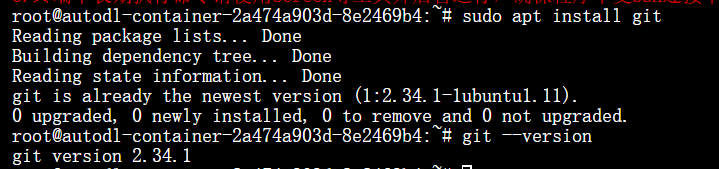

# Hunyuan3D-2.0系列模型部署

# 环境准备

---

基础配置环境如下：

```bash
PyTorch  2.5.1
Python  3.12
Cuda  12.4
ubuntu 22.04
```

### 拉取项目仓库

安装**git**并验证版本信息

```bash
sudo apt install git
git --version
```



使用**git clone**拉取Hunyuan3D-2仓库

```bash
git clone https://github.com/Tencent/Hunyuan3D-2.git
```

**git clone**拉取**GitHub**项目失败/太慢可以使用提供下载缓存的代码下载网站gitclone.com加速

```bash
git clone https://gitclone.com/github.com/Tencent/Hunyuan3D-2.git
```


### 安装环境依赖

pip换源加速，进入项目目录，下载、安装依赖包

```bash
# 升级pip
python -m pip install --upgrade pip
# 更换 pypi 源加速库
pip config set global.index-url https://pypi.tuna.tsinghua.edu.cn/simple

cd ./Hunyuan3D-2
pip install -r requirements.txt

# for texture
cd hy3dgen/texgen/custom_rasterizer
python3 setup.py install

cd ../../..
cd hy3dgen/texgen/differentiable_renderer
python3 setup.py install
```

# 模型下载

---

执行官方代码会自动拉取huggingface模型，并存储至根目录缓存

也可以选择配置镜像网址"https://hf-mirror.com"加速，并将模型下载至指定数据盘目录

```bash
export HF_ENDPOINT="https://hf-mirror.com"
source ~/.bashrc
# Hunyuan3D-2
huggingface-cli download --resume-download tencent/Hunyuan3D-2 --local-dir /root/autodl-tmp/weights/Hunyuan3D-2
# Hunyuan3D-2mv
huggingface-cli download --resume-download tencent/Hunyuan3D-2mv --local-dir /root/autodl-tmp/weights/Hunyuan3D-2mv
#Hunyuan3D-2mini
huggingface-cli download --resume-download tencent/Hunyuan3D-2mini --local-dir /root/autodl-tmp/weights/Hunyuan3D-2mini
```

Hunyuan3D-2的仓库较大，约为56GB，可以使用魔搭社区的’AI-ModelScope/Hunyuan3D-2‘模型仓库进行下载拉取

```bash
import torch
from modelscope import snapshot_download, AutoModel, AutoTokenizer
import os
model_dir = snapshot_download('AI-ModelScope/Hunyuan3D-2', cache_dir='/root/autodl-tmp/weights', revision='master')
```

记得将‘—local-dir’后或’cache_dir‘的路径替换为自己存放的本地数据盘路径

截至2025.3.20，Hunyuan3D-2模型仓库大小约为56GB，Hunyuan3D-2mv为28GB，Hunyuan3D-2mini为23GB，请参考官方运行硬件要求以及显存消耗拉取所需模型仓库，完整拉取供需106GB硬盘空间

