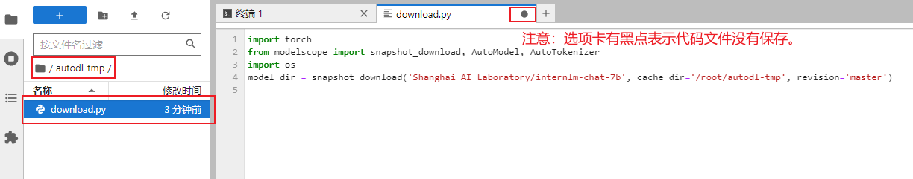
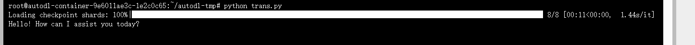
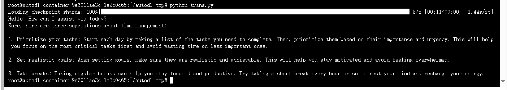

## InternLM-Chat-7B Transformers 部署调用

### 环境准备

在[autoal](https://www.autodl.com/home)平台中租一个3090等24G显存的显卡机器，如下图所示镜像选择`pytorch`-->`1.11.0`-->`3.8(ubuntu20.04)`-->`11.3`


接下来打开自己刚刚租用服务器的`JupyterLab`，并且打开其中的终端开始环境配置、模型下载和运行`demo`.


pip换源和安装依赖包

```
# 升级pip
python -m pip install --upgrade pip
# 更换 pypi 源加速库的安装
pip config set global.index-url https://pypi.tuna.tsinghua.edu.cn/simple

pip install modelscope==1.9.5
pip install transformers==4.35.2
pip install streamlit==1.24.0
pip install sentencepiece==0.1.99
pip install accelerate==0.24.1
```

### 模型下载

使用`modelscope`（魔塔社区）中的snapshot_download函数下载模型，第一个参数为模型名称，参数`cache_dir`为模型的下载路径。

在`/root/autodl-tmp`路径下新建`download.py`文件

```
#将当前工作目录切换到/root/autodl-tmp目录下
cd /root/autodl-tmp
#创建一个名为download.py的空文件
touch download.py
```

并在其中输入以下内容：

```
import torch
from modelscope import snapshot_download, AutoModel, AutoTokenizer
import os
model_dir = snapshot_download('Shanghai_AI_Laboratory/internlm-chat-7b', cache_dir='/root/autodl-tmp', revision='master')
```

粘贴代码后记得保存文件(Ctrl+S)，如下图所示。

保存后返回终端界面，运行`Python /root/autodl-tmp/download.py`执行下载，模型大小为14GB,下载模型大概需要10~20分钟。

### 代码准备

在`/root/autodl-tmp`路径下新建`trans.py`文件并在其中输入以下内容

```
# 导入所需的库
import torch
from transformers import AutoTokenizer, AutoModelForCausalLM

# 从预训练模型加载 tokenizer 和 model
# AutoTokenizer 用于处理文本输入并准备模型输入
# AutoModelForCausalLM 是一个生成式语言模型，支持生成对话
# trust_remote_code=True 表示信任从远程加载的代码
#通过AutoTokenizer.from_pretrained()函数加载预训练模型的tokenizer
tokenizer = AutoTokenizer.from_pretrained("/root/autodl-tmp/Shanghai_AI_Laboratory/internlm-chat-7b", trust_remote_code=True)

model = AutoModelForCausalLM.from_pretrained("/root/autodl-tmp/Shanghai_AI_Laboratory/internlm-chat-7b",trust_remote_code=True).to(torch.bfloat16).cuda()
# 将模型加载到 GPU（如果可用）并设置为评估模式
model = model.eval().cuda()

# 准备对话的历史记录
# 在开始对话之前，历史记录为空列表
#调用model.chat(tokenizer, "hello", history=[])来生成对话，将使用模型和tokenizer来根据给定的历史记录生成回复。生成的回复存储在response变量中
response, history = model.chat(tokenizer, "hello", history=[])

# 打印模型生成的响应文本
print(response)
```

粘贴代码后记得保存文件，上面的代码有比较详细的注释，大家如有不理解的地方，欢迎提出issue。


### 部署

在终端输入以下命令启动`transformers`服务

```
cd /root/autodl-tmp
python trans.py
```

耐心等待一下它加载，得到返回值如下所示：

Hello!How can I assist you today?


然后可以在以上`trans.py`代码的基础上加一个对话，代码如下所示：

```
response,history = model.chat(tokenizer,"please provide three suggestions about time management",history=history)

print(response)
```

耐心等待加载，首先会出来第一个对话内容模型生成的响应文本如下图所示,然后再等待一会它会接着出现第二个对话模型生成的响应文本如下所示：



