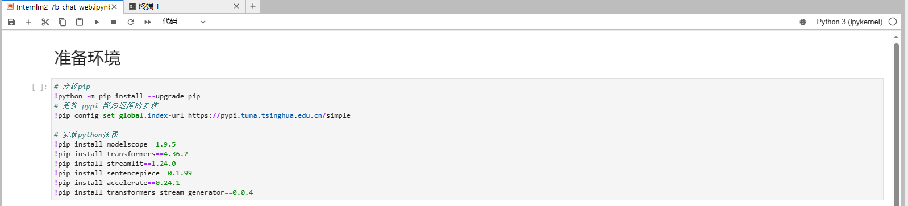
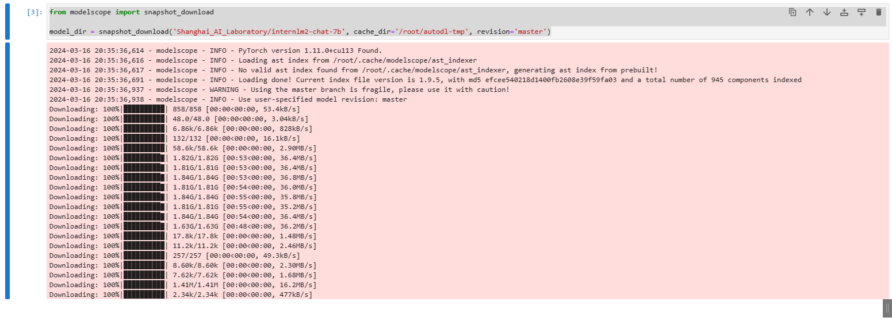
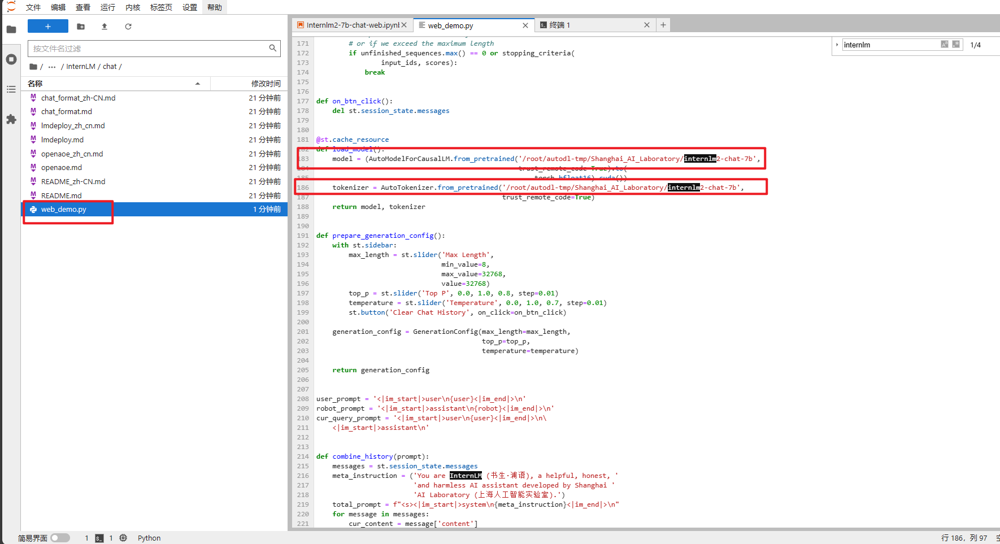
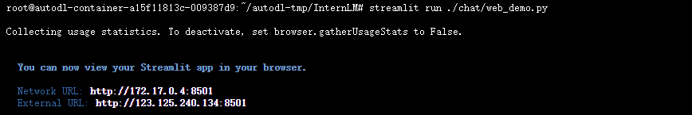
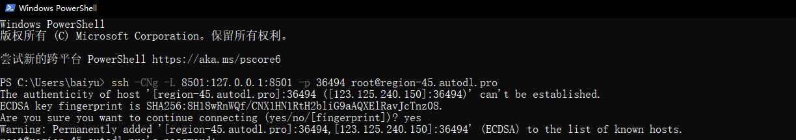

# InternLM2-7B-chat WebDemo 部署

InternLM2 ，即书生·浦语大模型第二代，开源了面向实用场景的70亿参数基础模型与对话模型 （InternLM2-Chat-7B）。模型具有以下特点：

- 有效支持20万字超长上下文：模型在20万字长输入中几乎完美地实现长文“大海捞针”，而且在 LongBench 和 L-Eval 等长文任务中的表现也达到开源模型中的领先水平。 可以通过 LMDeploy 尝试20万字超长上下文推理。
- 综合性能全面提升：各能力维度相比上一代模型全面进步，在推理、数学、代码、对话体验、指令遵循和创意写作等方面的能力提升尤为显著，综合性能达到同量级开源模型的领先水平，在重点能力评测上 InternLM2-Chat-20B 能比肩甚至超越 ChatGPT （GPT-3.5）。
- 代码解释器与数据分析：在配合代码解释器（code-interpreter）的条件下，InternLM2-Chat-20B 在 GSM8K 和 MATH 上可以达到和 GPT-4 相仿的水平。基于在数理和工具方面强大的基础能力，InternLM2-Chat 提供了实用的数据分析能力。
- 工具调用能力整体升级：基于更强和更具有泛化性的指令理解、工具筛选与结果反思等能力，新版模型可以更可靠地支持复杂智能体的搭建，支持对工具进行有效的多轮调用，完成较复杂的任务。

## 环境准备  

在 Autodl 平台中租赁一个 3090 等 24G 显存的显卡机器，如下图所示镜像选择 PyTorch-->2.0.0-->3.8(ubuntu20.04)-->11.8。


接下来打开刚刚租用服务器的 JupyterLab，新建一个`Internlm2-7b-chat-web.ipynb`文件



pip换源和安装依赖包，在ipynb文件里写入下面代码，点击运行

```
# 升级pip
!python -m pip install --upgrade pip
# 更换 pypi 源加速库的安装
!pip config set global.index-url https://pypi.tuna.tsinghua.edu.cn/simple

# 安装python依赖
!pip install modelscope==1.9.5
!pip install transformers==4.36.2
!pip install streamlit==1.24.0
!pip install sentencepiece==0.1.99
!pip install accelerate==0.24.1
!pip install transformers_stream_generator==0.0.4
pip install protobuf
```

如果你是在终端命令运行直接就按下面的命令运行

```bash
# 升级pip
python -m pip install --upgrade pip
# 更换 pypi 源加速库的安装
pip config set global.index-url https://pypi.tuna.tsinghua.edu.cn/simple

# 安装python依赖
pip install modelscope==1.9.5
pip install transformers==4.36.2
pip install streamlit==1.24.0
pip install sentencepiece==0.1.99
pip install accelerate==0.24.1
pip install transformers_stream_generator==0.0.4
```

## 模型下载

InternLM2-chat-7b 模型：

* [huggingface](https://huggingface.co/internlm/internlm2-chat-7b)
* [modelscope](https://modelscope.cn/models/Shanghai_AI_Laboratory/internlm2-chat-7b/summary)

### 使用modelscope下载

使用 modelscope 中的 snapshot_download 函数下载模型，第一个参数为模型名称，参数 cache_dir 为模型的下载路径。

在`Internlm2-7b-chat-web.ipynb`文件中新建一个代码块，运行下载`internlm2-chat-7b`模型。模型下载需要时间，我们直接往下看[代码准备](#代码准备)

```
from modelscope import snapshot_download

model_dir = snapshot_download('Shanghai_AI_Laboratory/internlm2-chat-7b', cache_dir='/root/autodl-tmp', revision='master')
```



## 代码准备

### 源码拉取

以下操作，可以在jupyter运行下载模型的过程中，你新开一个命令行终端进行操作

```
# 启动镜像加速
source /etc/network_turbo

cd /root/autodl-tmp
# 下载 Internlm 代码
git clone https://github.com/InternLM/InternLM.git
# 取消代理
unset http_proxy && unset https_proxy
```


### 安装依赖

```
# 进入源码目录
cd /root/autodl-tmp/InternLM/
# 安装internlm依赖
pip install -r requirements.txt
```

### 使用**InternLM**的web_demo运行

将 `/root/autodl-tmp/InternLM/chat/web_demo.py`中 183 行和 186 行的模型更换为本地的`/root/autodl-tmp/Shanghai_AI_Laboratory/internlm2-chat-7b`。



修改完成之后，启动`web_demo.py`文件

```
# 进入源码目录
cd /root/autodl-tmp/InternLM/
streamlit run ./chat/web_demo.py
```



此时，我们通过ssh端口转发，把`autodl`上启动的服务映射到本地端口上来，使用下面的命令。在本地打开`powershell`

```
ssh -CNg -L 8501:127.0.0.1:8501 -p 【你的autodl机器的ssh端口】 root@[你的autodl机器地址]
ssh -CNg -L 8501:127.0.0.1:8501 -p 36494 root@region-45.autodl.pro
```



在加载完模型之后，就可以既可与InternLM2-Chat-7B进行对话了，如下图所示：

