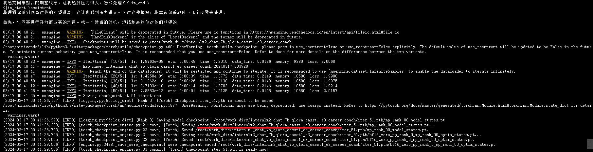
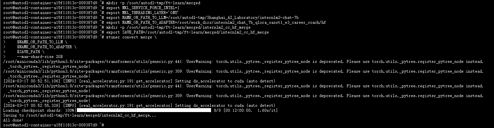

# InternLM2-7B-chat Xtuner Qlora 微调

## Xtuner介绍
<div align="center">
  
  <br /><br />
</div>

XTuner是上海人工智能实验室开发的低成本大模型训练工具箱，XTuner 是一个高效、灵活、全能的轻量化大模型微调工具库。只要**8G**。最低只需 **8GB** 显存，就可以微调InternLM2-7B模型，打造专属于你的 AI 助手。

仓库地址：https://github.com/InternLM/xtuner

### Xtuner特点

**高效**

- 支持大语言模型 LLM、多模态图文模型 VLM 的预训练及轻量级微调。XTuner 支持在 8GB 显存下微调 7B 模型，同时也支持多节点跨设备微调更大尺度模型（70B+）。
- 自动分发高性能算子（如 FlashAttention、Triton kernels 等）以加速训练吞吐。
- 兼容 [DeepSpeed](https://github.com/microsoft/DeepSpeed) 🚀，轻松应用各种 ZeRO 训练优化策略。

**灵活**

- 支持多种大语言模型，包括但不限于 [InternLM](https://huggingface.co/internlm)、[Mixtral-8x7B](https://huggingface.co/mistralai)、[Llama2](https://huggingface.co/meta-llama)、[ChatGLM](https://huggingface.co/THUDM)、[Qwen](https://huggingface.co/Qwen)、[Baichuan](https://huggingface.co/baichuan-inc)。
- 支持多模态图文模型 LLaVA 的预训练与微调。利用 XTuner 训得模型 [LLaVA-InternLM2-20B](https://huggingface.co/xtuner/llava-internlm2-20b) 表现优异。
- 精心设计的数据管道，兼容任意数据格式，开源数据或自定义数据皆可快速上手。
- 支持 [QLoRA](http://arxiv.org/abs/2305.14314)、[LoRA](http://arxiv.org/abs/2106.09685)、全量参数微调等多种微调算法，支撑用户根据具体需求作出最优选择。

**全能**

- 支持增量预训练、指令微调与 Agent 微调。
- 预定义众多开源对话模版，支持与开源或训练所得模型进行对话。
- 训练所得模型可无缝接入部署工具库 [LMDeploy](https://github.com/InternLM/lmdeploy)、大规模评测工具库 [OpenCompass](https://github.com/open-compass/opencompass) 及 [VLMEvalKit](https://github.com/open-compass/VLMEvalKit)。

## 环境准备

在 autodl 平台中租赁一个 3090 等 24G 显存的显卡机器，如下图所示镜像选择 PyTorch-->2.0.0-->3.8(ubuntu20.04)-->11.8 。

接下来打开刚刚租用服务器的 JupyterLab，并且打开其中的终端开始环境配置、模型下载和运行演示。  


### 创建工作目录

创建本次微调实践的工作目录`/root/autodl-tmp/ft-learn`

```
# 创建微调工作目录
mkdir -p /root/autodl-tmp/ft-learn

# 创建微调数据集存放目录
mkdir -p /root/autodl-tmp/ft-learn/dataset

# 创建微调配置文件存放目录
mkdir -p /root/autodl-tmp/ft-learn/config

```

### 安装依赖

```bash
# 升级pip
python -m pip install --upgrade pip
# 安装python依赖
pip install modelscope==1.9.5
pip install transformers==4.36.2
pip install streamlit==1.24.0
pip install sentencepiece==0.1.99
pip install accelerate==0.24.1
pip install transformers_stream_generator==0.0.4
pip install einops ujson
pip install protobuf
```

### 使用modelscope下载模型

使用 modelscope 中的 snapshot_download 函数下载模型，第一个参数为模型名称，参数 cache_dir 为模型的下载路径。

在`Internlm2-7b-chat-web.ipynb`文件中新建一个代码块，运行下载`internlm2-chat-7b`模型。模型下载需要时间，我们直接往下看

```
from modelscope import snapshot_download

model_dir = snapshot_download('Shanghai_AI_Laboratory/internlm2-chat-7b', cache_dir='/root/autodl-tmp', revision='master')
```


### 安装Xtuner

```bash
git clone -b v0.1.14 https://github.com/InternLM/xtuner
cd xtuner
# 从源码安装 XTuner
pip install -e '.[all]'
# 安装完成之后就可以在命令行使用xtuner了
# 查看xtuner使用帮助
xtuner help
# 查看xtuner版本
xtuner version
```


## 数据集处理

我自己整理的`心理大模型-职场焦虑语料.xlsx`,通过`gen_qa_json.py`文件生成一个`career_coach.jsonl`文件

运行`python /root/autodl-tmp/ft-learn/dataset/gen_qa_json.py`生成文件，你们也可以按照我的数据语料格式，自定义你们自己的数据集。`gen_qa_json.py`文件代码如下：

```
import pandas as pd
import json

# 读取Excel文件
excel_file = './心理大模型-职场焦虑语料.xlsx'  # 替换成实际的Excel文件路径
df = pd.read_excel(excel_file)

# 设置system的值
system_value = "你是一个专业的，经验丰富的有心理学背景的职场教练。你总是根据有职场焦虑的病人的问题提供准确、全面和详细的答案。"

# 将数据整理成jsonL格式
json_data = []
for index, row in df.iterrows():
    conversation = [
        {
            "system": system_value,
            "input": str(row['q']),
            "output": str(row['a'])
        }
    ]
    json_data.append({"conversation": conversation})

# 将json数据写入文件
output_json_file = 'career_coach.jsonl'  # 替换成实际的输出文件路径
with open(output_json_file, 'w', encoding='utf-8') as f:
    json.dump(json_data, f, ensure_ascii=False)

print("JSONL文件生成成功！")


```

## 配置文件准备

Xtuner已经内置了许多的配置文件。可以通过Xtuner查看可配置文件

```bash
xtuner list-cfg
```

由于我们本次的基座微调模型为internLM2-chat-7b，所以我们可以查看Xtuner现在在InternLM2下已经支持了哪些配置文件

```bash
xtuner list-cfg |grep internlm2
```


```bash
# 复制配置文件
xtuner copy-cfg internlm2_chat_7b_qlora_oasst1_e3 /root/autodl-tmp/ft-learn/config
# 修改配置文件名
mv /root/autodl-tmp/ft-learn/config/internlm2_chat_7b_qlora_oasst1_e3_copy.py  /root/autodl-tmp/ft-learn/config/internlm2_chat_7b_qlora_oasst1_e3_career_coach.py
```

复制完成之后要修改配置文件的几处参数

```bash
# PART 1 中
# 预训练模型存放的位置
pretrained_model_name_or_path = '/root/autodl-tmp/Shanghai_AI_Laboratory/internlm2-chat-7b'

# 微调数据存放的位置
data_path = '/root/autodl-tmp/ft-learn/dataset/career_coach.jsonl'

# 训练中最大的文本长度
max_length = 512

# 每一批训练样本的大小
batch_size = 2

# 最大训练轮数
max_epochs = 3

# 验证的频率
evaluation_freq = 500

# 用于评估输出内容的问题（用于评估的问题尽量与数据集的question保持一致）
evaluation_inputs = [
'我感到在职场中压力很大，总是焦虑不安，怎么办？',
'我在工作中总是害怕失败，怎样克服这种恐惧？',
'我感觉同事对我的期望很高，让我感到压力很大，怎么处理？'
]


# PART 3 中
# 如果这里的如果没有修改的话，无法直接读取json文件
dataset=dict(type=load_dataset, path='json', data_files=dict(train=data_path))
# 这里也得改成None，否则会报错KeyError
dataset_map_fn=None

```

## 模型微调

### 微调启动

```bash
xtuner train /root/autodl-tmp/ft-learn/config/internlm2_chat_7b_qlora_oasst1_e3_career_coach.py  --deepspeed deepspeed_zero2
```



训练完成之后，参数模型存放在`/root/work_dirs/internlm2_chat_7b_qlora_oasst1_e3_career_coach/`目录下

### 模型转换成HF

```
# 新建模型存放的文件夹
mkdir -p /root/work_dirs/internlm2_chat_7b_qlora_oasst1_e3_career_coach/hf
# 添加环境变量
export MKL_SERVICE_FORCE_INTEL=1
# 模型转换
xtuner convert pth_to_hf /root/autodl-tmp/ft-learn/config/internlm2_chat_7b_qlora_oasst1_e3_career_coach.py /root/work_dirs/internlm2_chat_7b_qlora_oasst1_e3_career_coach/iter_51.pth/ /root/work_dirs/internlm2_chat_7b_qlora_oasst1_e3_career_coach/hf
```

### 合并HF adapter 到LLM

```bash
mkdir -p /root/autodl-tmp/ft-learn/merged

export MKL_SERVICE_FORCE_INTEL=1
export MKL_THREADING_LAYER='GNU'

# 原始模型参数存放的位置
export NAME_OR_PATH_TO_LLM=/root/autodl-tmp/Shanghai_AI_Laboratory/internlm2-chat-7b

# Hugging Face格式参数存放的位置
export NAME_OR_PATH_TO_ADAPTER=/root/work_dirs/internlm2_chat_7b_qlora_oasst1_e3_career_coach/hf

# 最终Merge后的参数存放的位置
mkdir -p /root/autodl-tmp/ft-learn/merged/internlm2_cc_hf_merge
export SAVE_PATH=/root/autodl-tmp/ft-learn/merged/internlm2_cc_hf_merge


# 执行参数Merge
xtuner convert merge \
    $NAME_OR_PATH_TO_LLM \
    $NAME_OR_PATH_TO_ADAPTER \
    $SAVE_PATH \
    --max-shard-size 2GB
```



## Xtuner多轮对话介绍

XTuner 训练多轮对话模型时，采取了一种更加充分高效的方法，如下图所示。

<div align="center">

</div>

我们将多轮对话进行拼接，之后输入模型，并行计算每个位置的 loss，而只有 Output 部分的 loss 参与回传。

XTuner 中多轮对话数据集格式如下所示：

```json
[{
    "conversation":[
        {
            "system": "You are an AI asssistant."
            "input": "Hello?",
            "output": "Hello! How can I help you?"
        },
        {
            "input": "What's the date today?",
            "output": "Today is Monday, August 14, 2023."
        },
        {
            "input": "Thank you!",
            "output": "You are welcome."
        }
    ]
},
{
    "conversation":[
        {
            "system": "You are an AI asssistant."
            "input": "Hello?",
            "output": "Hello! How can I help you?"
        },
        {
            "input": "How's the weather today in Rosso?",
            "output": "The weather in Rosso on Wednesday, August 16th, is going to be cloudy for most of the day, together with moderate rain around noon."
        },
        {
            "input": "Thank you!",
            "output": "You are welcome."
        }
    ]
}]
```

数据集中的 "conversation" 键对应的值是一个列表，用于保存每一轮对话的指令和实际回答（GroundTruth）。为了保持格式统一，增量预训练数据集和单轮对话数据集中的 "conversation" 键也对应一个列表，只不过该列表的长度为 1。而在多轮对话数据集中，"conversation" 列表的长度为 n，以容纳 n 轮的对话内容。

对多轮对话微调感兴趣的同学，也可以按照上面的数据格式进行数据微调。

## 写在最后

本节关于Xtuner的微调步骤中提到的职场焦虑数据语料，是我用于开源项目职场教练大模型微调时所使用的语料，感兴趣的同学也可看一看我的这个开源项目[career_coach](https://github.com/BaiYu96/career_coach)，欢迎点个star。项目的data部分有介绍到多轮对话数据的整理与生成，其实与本教程是一样的。